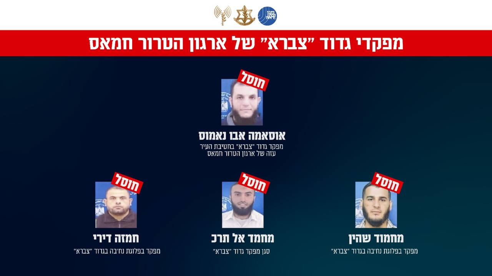

## Message 14877

הודעה משותפת לדובר צה״ל ודוברות שב״כ:

צה״ל ושב״כ חיסלו את מפקד גדוד ״צברא״ בארגון הטרור חמאס, סגנו ומחבלים נוספים שלקחו חלק בהובלת מתווי טרור נגד כוחותינו

במהלך השבוע האחרון, כלי טיס של חיל האוויר תקף וחיסל באופן ממוקד ובהכוונה מודיעינית מדויקת של אמ"ן, שב"כ ופיקוד הדרום, את המחבל אוסאמה אבו נאמוס, מפקד גדוד "צברא" בחטיבת העיר עזה של ארגון הטרור חמאס.

המחבל אבו נאמוס פיקד על פעילות הטרור של מחבלי החמאס נגד אזרחי מדינת ישראל וכוחות צה"ל במרחב ציר נצרים והיווה מוקד ידע משמעותי בארגון.

בתקיפה אווירית נוספת, חוסל סגן מפקד גדוד ״צברא״, המחבל מחמד אל תרכ, אשר שימש קודם לכן כמפקד פלוגת נח'בה בגדוד.
המחבל קידם והוציא לפועל מתווי טרור נגד כוחות צה"ל במרחב ציר נצרים, היה אחראי על הכוונת המחבלים ומתחמי טרור במרחב. 

כמו כן, חוסלו המחבלים חמזה דירי ומחמוד שהין, מפקדים בפלוגת נחב׳ה בגדוד ״צברא״. חמזה היה אחראי על העברת אמצעי לחימה למחבלי החמאס בגדוד ויחד עם שהין קידמו מתווי טרור נגד כוחות צה"ל במרחב.

צה"ל ושב"כ ימשיכו לפעול בנחישות ובעוצמה נגד מחבלי ארגון הטרור חמאס.

