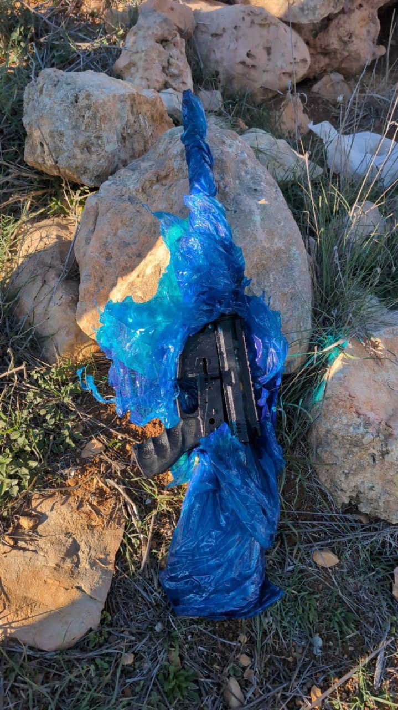

## Message 14886

דובר צה"ל: 

73 מבוקשים נעצרו ומספר מחבלים חוסלו בשבוע האחרון בפיקוד המרכז, הסתיים מבצע חטיבתי שארך כ-48 שעות בחטיבת הבקעה והעמקים

במהלך השבוע האחרון, כוחות הביטחון פעלו לסיכול טרור במספר יעדים בפיקוד המרכז.

במהלך מבצע חטיבתי בחטיבת הבקעה והעמקים, כוחות הביטחון חיסלו שני מחבלים באמצעות כלי טיס של חיל האוויר ביומו הראשון של המבצע (7 בינואר), עצרו תשעה מבוקשים, חלקם על ידי צוותים מסוערבים של יחידת דובדבן, והחרימו כלי נשק, מטענים, ציוד צבאי ואמצעי לחימה נוספים.

במהלך השבוע ברחבי אוגדת יהודה ושומרון הכוחות עצרו עשרות מבוקשים, חיסלו שני מחבלים בקרבות פנים אל פנים, החרימו שבעה נשקים ומאות אלפי כספי טרור. 

בנוסף, כוחות הביטחון ממשיכים במצוד אחר המחבלים שביצעו את פיגוע הירי בפונדוק שבחטיבת אפרים ב-6 בינואר.

