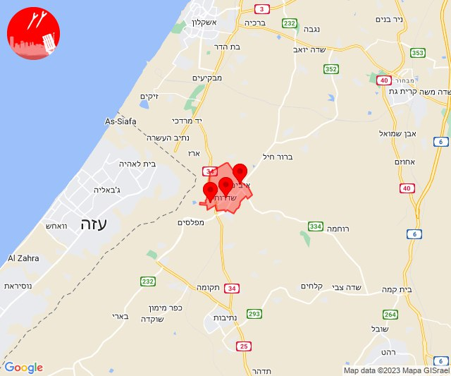
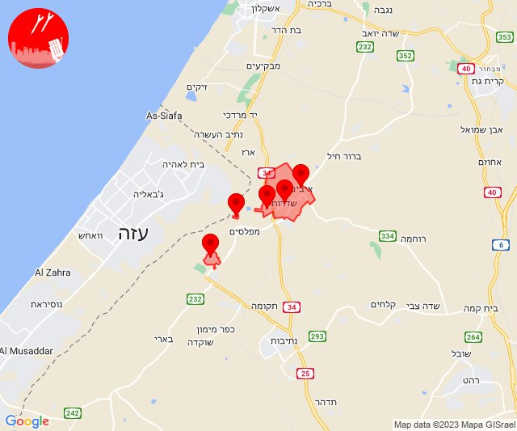
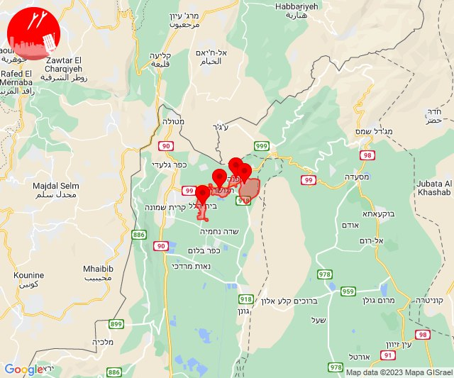

# Alerts for 2023-12-01

## 03:42

🔴 צבע אדום (01/12/2023):

05:42:
• עוטף עזה: שדרות, איבים, ניר עם, גבים, מכללת ספיר (15 שניות)

צופר - צבע אדום

## 03:42

## 04:52

🔴 צבע אדום (01/12/2023):

06:52:
• עוטף עזה: חולית (15 שניות)

צופר - צבע אדום

## 04:52

## 05:43

🔴 צבע אדום (01/12/2023):

07:43:
• עוטף עזה: חולית (15 שניות)

צופר - צבע אדום

## 05:43

## 05:47

🔴 צבע אדום (01/12/2023):

07:47:
• עוטף עזה: סופה, ניר יצחק (15 שניות)

צופר - צבע אדום

## 05:47

## 05:58

🔴 צבע אדום (01/12/2023):

07:58:
• עוטף עזה: שדרות, איבים, ניר עם (15 שניות)

צופר - צבע אדום

## 05:58

## 06:27

🔴 צבע אדום (01/12/2023):

08:27:
• עוטף עזה: נחל עוז (15 שניות)

צופר - צבע אדום

## 06:27

## 06:50

🔴 צבע אדום (01/12/2023):

08:50:
• עוטף עזה: עין השלושה, נירים (15 שניות)

צופר - צבע אדום

## 06:50

## 07:12

🔴 צבע אדום (01/12/2023):

09:11:
• מערב לכיש: גיאה, אזור תעשייה הדרומי אשקלון, אשקלון - דרום (30 שניות)
• עוטף עזה: ארז, יד מרדכי, נתיב העשרה (15 שניות)

09:12:
• עוטף עזה: זיקים, כרמיה (15 שניות)
• מערב לכיש: בית שקמה, מבקיעים (30 שניות)

צופר - צבע אדום

## 07:12

## 07:59

🔴 צבע אדום (01/12/2023):

09:59:
• עוטף עזה: כיסופים (15 שניות)

צופר - צבע אדום

## 07:59

## 08:02

🔴 צבע אדום (01/12/2023):

10:02:
• עוטף עזה: סעד, מפלסים, מטווח ניר עם, נירים (15 שניות)

צופר - צבע אדום

## 08:03

## 08:10

🔴 צבע אדום (01/12/2023):

10:10:
• עוטף עזה: כפר עזה, מטווח ניר עם, שדרות, איבים, ניר עם (15 שניות)

צופר - צבע אדום

## 08:10

## 09:00

🔴 צבע אדום (01/12/2023):

11:00:
• עוטף עזה: יד מרדכי, נתיב העשרה (15 שניות)

צופר - צבע אדום

## 09:01

## 09:34

🔴 צבע אדום (01/12/2023):

11:34:
• עוטף עזה: כיסופים (15 שניות)

צופר - צבע אדום

## 09:34

## 09:37

🔴 צבע אדום (01/12/2023):

11:37:
• עוטף עזה: ניר עוז, נירים, עין השלושה (15 שניות)

צופר - צבע אדום

## 09:37

## 09:57

🔴 צבע אדום (01/12/2023):

11:57:
• עוטף עזה: כפר עזה, סעד (15 שניות)

צופר - צבע אדום

## 09:57

## 12:00

🔴 צבע אדום (01/12/2023):

13:59:
• עוטף עזה: מטווח ניר עם (15 שניות)

14:00:
• עוטף עזה: כיסופים (15 שניות)

צופר - צבע אדום

## 12:00

## 12:15

🔴 צבע אדום (01/12/2023):

14:15:
• עוטף עזה: נירים, עין השלושה, רעים (15 שניות)

צופר - צבע אדום

## 12:15

## 12:30

🔴 צבע אדום (01/12/2023):

14:30:
• מערב הנגב: נתיבות, אזור תעשייה נ.ע.מ, בית הגדי, שיבולים, שרשרת (30 שניות)
• עוטף עזה: כפר עזה, שדרות, איבים, ניר עם, גבים, מכללת ספיר, זמרת, שובה, תקומה, חוות יזרעם (15 שניות)

צופר - צבע אדום

## 12:30

## 12:44

🔴 צבע אדום (01/12/2023):

14:44:
• קו העימות: בית הלל, דפנה, הגושרים, שאר ישוב (מיידי)

צופר - צבע אדום

## 12:44

## 14:16

🔴 צבע אדום (01/12/2023):

16:15:
• לכיש: גן יבנה, באר טוביה, שדה עוזיהו, שתולים, אשדוד - א,ב,ד,ה, אשדוד - אזור תעשייה צפוני ונמל, אשדוד - יא,יב,טו,יז,מרינה,סיטי, עזריקם (45 שניות)

16:16:
• לכיש: אמונים, בית עזרא, גבעתי, עזר, אזור תעשייה עד הלום (45 שניות)

צופר - צבע אדום

## 14:16

## 14:19

🔴 צבע אדום (01/12/2023):

16:19:
• לכיש: אשדוד - יא,יב,טו,יז,מרינה,סיטי, גן יבנה, אשדוד - א,ב,ד,ה, בני דרום, אשדוד - אזור תעשייה צפוני ונמל, גן הדרום, מתחם בני דרום, שתולים, אשדוד - ח,ט,י,יג,יד,טז, אזור תעשייה עד הלום, אמונים, בית עזרא, גבעתי, עזר, עזריקם, שדה עוזיהו (45 שניות, דקה)

צופר - צבע אדום

## 14:19

## 14:35

🔴 צבע אדום (01/12/2023):

16:35:
• קו העימות: קריית שמונה (מיידי)

צופר - צבע אדום

## 14:35

## 14:41

🔴 צבע אדום (01/12/2023):

16:41:
• קו העימות: מרגליות (מיידי)

צופר - צבע אדום

## 14:41

## 14:53

🔴 צבע אדום (01/12/2023):

16:53:
• קו העימות: מרגליות (מיידי)

צופר - צבע אדום

## 14:53

## 15:03

🔴 צבע אדום (01/12/2023):

17:01:
• השפלה: ראשון לציון - מזרח, באר יעקב, נס ציונה, תעשיון צריפין, אזור תעשייה נשר - רמלה, אחיסמך, ישרש, לוד, מצליח, רמלה, בית דגן, חמד, משמר השבעה, גנות, פארק תעשיות פלמחים, אירוס, בית חנן, בית עובד, נטעים, עיינות, ראשון לציון - מערב, נצר סרני, ניר צבי (דקה וחצי)
• דן: אור יהודה, אזור, חולון (דקה וחצי)
• לכיש: אשדוד - א,ב,ד,ה, אשדוד - אזור תעשייה צפוני ונמל, אשדוד - ג,ו,ז, אשדוד - ח,ט,י,יג,יד,טז, אשדוד - יא,יב,טו,יז,מרינה,סיטי, בני דרום, ניר גלים, שתולים (45 שניות)

17:02:
• השפלה: רחובות, בן שמן, גינתון, כפר נוער בן שמן, פתחיה, גני הדר, נען, סתריה, רמות מאיר, גאליה, כפר חב''ד (דקה וחצי, דקה)
• לכיש: יבנה, כפר הנגיד (דקה)

17:03:
• השפלה: גיבתון, גן שלמה, יד רמב''ם, עזריה (דקה וחצי)
• לכיש: גבעת ברנר (דקה וחצי)

צופר - צבע אדום

## 15:03

## 17:23

✈️ חדירת כלי טיס עוין (01/12/2023):

19:23:
• קו העימות: הילה, חוסן, כפר ורדים, מעונה, מעיליא, מעלות תרשיחא 

צופר - צבע אדום

## 17:24

## 17:32

🔴 צבע אדום (01/12/2023):

19:32:
• עוטף עזה: חולית, סופה, יתד, שדה אברהם (15 שניות)

צופר - צבע אדום

## 17:32

## 17:33

🔴 צבע אדום (01/12/2023):

19:33:
• עוטף עזה: פרי גן (15 שניות)

צופר - צבע אדום

## 17:33

## 18:02

🔴 צבע אדום (01/12/2023):

20:01:
• לכיש: ביצרון, גן יבנה, חצור, יבנה, כפר הנגיד, בן זכאי, אשדוד - א,ב,ד,ה, אשדוד - אזור תעשייה צפוני ונמל, אשדוד - ג,ו,ז, בני דרום, ניר גלים, מתחם בני דרום (דקה, 45 שניות)
• השפלה: פארק תעשיות פלמחים, ראשון לציון - מזרח, ראשון לציון - מערב, בית חנן, נטעים, נס ציונה, בית עובד, רחובות, עיינות, גאליה (דקה וחצי, דקה)

20:02:
• לכיש: בניה, גבעת וושינגטון, כפר אביב, כפר מרדכי, כרם ביבנה, משגב דב, עשרת, קבוצת יבנה, שדמה, מעון צופיה (דקה)
• השפלה: אירוס, גן שורק (דקה וחצי)

צופר - צבע אדום

## 18:02

## 19:02

🔴 צבע אדום (01/12/2023):

21:02:
• לכיש: ביצרון, גן יבנה, חצור, עזריקם (דקה, 45 שניות)

צופר - צבע אדום

## 19:02

## 19:08

🔴 צבע אדום (01/12/2023):

21:04:
• עוטף עזה: מטווח ניר עם, מפלסים, שדרות, איבים, ניר עם (15 שניות)

21:06:
• יהודה: אליאב, תקוע (דקה, דקה וחצי)

21:07:
• עוטף עזה: גבים, מכללת ספיר (15 שניות)

21:08:
• עוטף עזה: מטווח ניר עם (15 שניות)

צופר - צבע אדום

## 19:08

## 19:14

🔴 צבע אדום (01/12/2023):

21:13:
• עוטף עזה: שדרות, איבים, ניר עם, ארז (15 שניות)

21:14:
• עוטף עזה: נתיב העשרה (15 שניות)

צופר - צבע אדום

## 19:14

## 21:00

🔴 צבע אדום (01/12/2023):

23:00:
• עוטף עזה: שדרות, איבים, ניר עם, מטווח ניר עם (15 שניות)

צופר - צבע אדום

## 21:00

## 21:14

🔴 צבע אדום (01/12/2023):

23:14:
• קו העימות: דישון (מיידי)

צופר - צבע אדום

## 21:14

