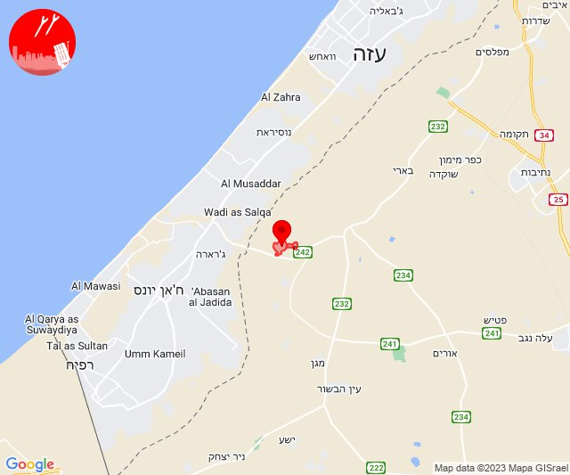

# Alerts for 2023-12-02

## 05:49

🔴 צבע אדום (02/12/2023):

07:49:
• עוטף עזה: חולית, סופה (15 שניות)

צופר - צבע אדום

## 05:49

## 08:54

🔴 צבע אדום (02/12/2023):

10:54:
• עוטף עזה: כיסופים (15 שניות)

צופר - צבע אדום

## 08:54

## 10:30

🔴 צבע אדום (02/12/2023):

12:30:
• עוטף עזה: מגן, ניר עוז, עין הבשור (15 שניות)

צופר - צבע אדום

## 10:30

## 10:46

🔴 צבע אדום (02/12/2023):

12:45:
• עוטף עזה: עין השלושה, ניר עוז (15 שניות)

12:46:
• עוטף עזה: כיסופים (15 שניות)

צופר - צבע אדום

## 10:46

## 11:30

🔴 צבע אדום (02/12/2023):

13:30:
• עוטף עזה: מגן (15 שניות)

צופר - צבע אדום

## 11:30

## 11:58

🔴 צבע אדום (02/12/2023):

13:58:
• עוטף עזה: מבטחים, עמיעוז, ישע, צוחר, אוהד, שדה ניצן (15 שניות)

צופר - צבע אדום

## 11:58

## 12:31

🔴 צבע אדום (02/12/2023):

14:31:
• עוטף עזה: שדרות, איבים, ניר עם (15 שניות)

צופר - צבע אדום

## 12:31

## 13:00

🔴 צבע אדום (02/12/2023):

14:59:
• מערב לכיש: אזור תעשייה הדרומי אשקלון, מבקיעים, אשקלון - דרום (30 שניות)
• עוטף עזה: זיקים, כרמיה (15 שניות)

15:00:
• מערב לכיש: אשקלון - צפון (30 שניות)

צופר - צבע אדום

## 13:00

## 13:10

🔴 צבע אדום (02/12/2023):

15:10:
• עוטף עזה: ניר עוז (15 שניות)

צופר - צבע אדום

## 13:10

## 13:45

🔴 צבע אדום (02/12/2023):

15:45:
• עוטף עזה: כיסופים (15 שניות)

צופר - צבע אדום

## 13:45

## 13:50

🔴 צבע אדום (02/12/2023):

15:50:
• עוטף עזה: כיסופים (15 שניות)

צופר - צבע אדום

## 13:50

## 14:02

🔴 צבע אדום (02/12/2023):

16:00:
• השפלה: גן שלמה, רחובות, כפר ביל''ו (דקה וחצי)
• לכיש: גבעת ברנר (דקה וחצי)

16:01:
• לכיש: אשדוד - אזור תעשייה צפוני ונמל, אשדוד - א,ב,ד,ה, בני דרום, ניר גלים, מתחם בני דרום (45 שניות, דקה)

16:02:
• לכיש: בית אלעזרי, גדרה, קדרון, בית גמליאל, בניה, כפר מרדכי, מישר, עשרת, שדמה (דקה)

צופר - צבע אדום

## 14:02

## 14:18

🔴 צבע אדום (02/12/2023):

16:18:
• עוטף עזה: כיסופים (15 שניות)

צופר - צבע אדום

## 14:18

## 14:35

🔴 צבע אדום (02/12/2023):

16:35:
• עוטף עזה: זיקים, נתיב העשרה (15 שניות)
• מערב לכיש: אזור תעשייה הדרומי אשקלון (30 שניות)

צופר - צבע אדום

## 14:35

## 14:56

🔴 צבע אדום (02/12/2023):

16:56:
• עוטף עזה: כיסופים (15 שניות)

צופר - צבע אדום

## 14:56

## 15:27

🔴 צבע אדום (02/12/2023):

17:27:
• העמקים: אכסאל, בלפוריה, גניגר, יפיע, כפר גדעון, מגדל העמק, מזרע, נוף הגליל, נצרת, שריד, תל עדשים, אזור תעשייה אלון התבור, אחוזת ברק, דברת, דחי, מרחביה מושב, מרחביה קיבוץ, נין, נעורה, סולם, עפולה, היוגב, גדעונה, יזרעאל, ישובי אומן, ישובי יעל, כפר יחזקאל, מרכז חבר, קבוצת גבע, אזור תעשייה מבואות הגלבוע (דקה)

צופר - צבע אדום

## 15:27

## 20:02

🔴 צבע אדום (02/12/2023):

22:01:
• דן: תל אביב - דרום העיר ויפו, תל אביב - מזרח, תל אביב - מרכז העיר, אזור, גבעתיים, חולון, מקווה ישראל, בני ברק, רמת גן - מערב, אור יהודה, יהוד-מונוסון, סביון, קריית אונו, רמת גן - מזרח, גני תקווה (דקה וחצי)
• ירקון: גבעת כ''ח, בית עריף, ברקת, טירת יהודה, כפר טרומן, שהם, אזור תעשייה חבל מודיעין, חשמונאים, מבוא מודיעים, מודיעין - ליגד סנטר, מודיעין, כפר רות, לפיד, מודיעין עילית, מתתיהו, שילת, כפר האורנים (דקה וחצי)
• השפלה: חמד, גנות (דקה וחצי)

22:02:
• דן: בת-ים, מגשימים (דקה וחצי)
• השפלה: ראשון לציון - מערב, אזור תעשייה נשר - רמלה, באר יעקב, לוד, ניר צבי, רמלה, תעשיון צריפין, אחיעזר, זיתן, יגל, משמר השבעה, ראשון לציון - מזרח, בית דגן, כפר חב''ד, צפריה, בן שמן, גינתון, כפר נוער בן שמן, גיבתון, נצר סרני, רחובות, אחיסמך, ישרש, מצליח, נס ציונה, בית חשמונאי, בית עוזיאל, גזר, גני הדר, גני יוחנן, יד רמב''ם, יציץ, כפר ביל''ו, כפר בן נון, כפר שמואל, כרמי יוסף, מזכרת בתיה, משמר איילון, נען, סתריה, עזריה, פדיה, פתחיה, קריית עקרון, רמות מאיר (דקה וחצי)
• שפלת יהודה: גפן, תירוש (דקה)
• ירקון: בית נחמיה, חדיד, גמזו, כפר דניאל, בארות יצחק, בני עטרות, מזור, נופך, נחלים, רינתיה, מודיעין - ישפרו סנטר (דקה וחצי)

צופר - צבע אדום

## 20:02

