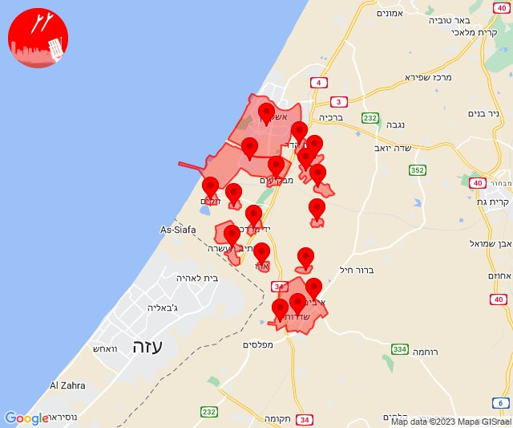
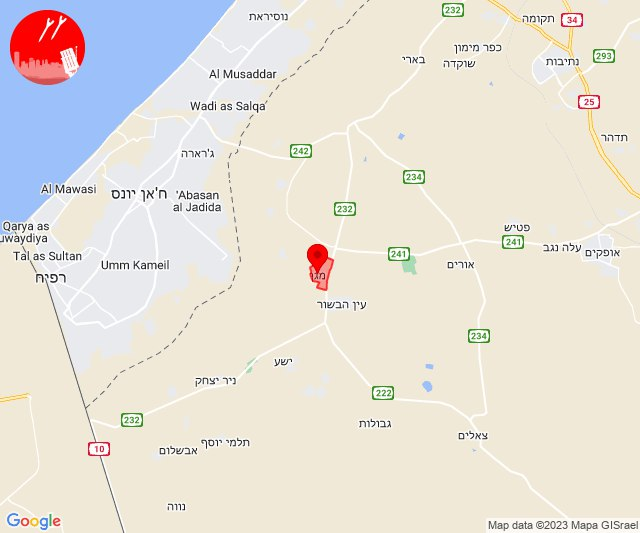
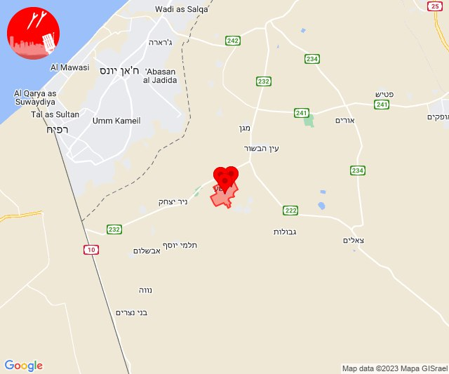

# Alerts for 2023-12-03

## 01:47

🔴 צבע אדום (03/12/2023):

03:46:
• עוטף עזה: גברעם (15 שניות)
• מערב לכיש: מבקיעים, בת הדר, אשקלון - דרום, אזור תעשייה הדרומי אשקלון, בית שקמה, גיאה, תלמי יפה (30 שניות)

03:47:
• עוטף עזה: יד מרדכי, ארז, שדרות, איבים, ניר עם, זיקים, כרמיה, אור הנר, נתיב העשרה (15 שניות)

צופר - צבע אדום

## 01:47

## 07:26

🔴 צבע אדום (03/12/2023):

09:26:
• עוטף עזה: כיסופים (15 שניות)

צופר - צבע אדום

## 07:26

## 07:59

🔴 צבע אדום (03/12/2023):

09:59:
• עוטף עזה: מגן (15 שניות)

צופר - צבע אדום

## 07:59

## 08:20

🔴 צבע אדום (03/12/2023):

10:20:
• עוטף עזה: ניר עוז (15 שניות)

צופר - צבע אדום

## 08:20

## 09:01

🔴 צבע אדום (03/12/2023):

11:00:
• עוטף עזה: כיסופים (15 שניות)

11:01:
• עוטף עזה: מטווח ניר עם, שדרות, איבים, ניר עם (15 שניות)

צופר - צבע אדום

## 09:01

## 10:38

🔴 צבע אדום (03/12/2023):

12:38:
• עוטף עזה: רעים (15 שניות)

צופר - צבע אדום

## 10:38

## 11:02

🔴 צבע אדום (03/12/2023):

13:02:
• עוטף עזה: סופה (15 שניות)

צופר - צבע אדום

## 11:02

## 11:05

🔴 צבע אדום (03/12/2023):

13:05:
• קו העימות: דפנה, קיבוץ דן (מיידי)

צופר - צבע אדום

## 11:05

## 11:15

🔴 צבע אדום (03/12/2023):

13:15:
• עוטף עזה: שדרות, איבים, ניר עם (15 שניות)

צופר - צבע אדום

## 11:15

## 11:28

🔴 צבע אדום (03/12/2023):

13:28:
• עוטף עזה: מבטחים, עמיעוז, ישע (15 שניות)

צופר - צבע אדום

## 11:28

## 11:34

🔴 צבע אדום (03/12/2023):

13:34:
• עוטף עזה: ניר יצחק, סופה (15 שניות)

צופר - צבע אדום

## 11:34

## 13:02

🔴 צבע אדום (03/12/2023):

15:00:
• עוטף עזה: אבשלום, יתד, שדה אברהם, כרם שלום, חולית, דקל, תלמי יוסף (15 שניות)

15:01:
• קו העימות: זרעית (מיידי)

15:02:
• מערב לכיש: אשקלון - דרום, אזור תעשייה הדרומי אשקלון, אשקלון - צפון (30 שניות)
• עוטף עזה: כרמיה, זיקים (15 שניות)

צופר - צבע אדום

## 13:02

## 13:30

🔴 צבע אדום (03/12/2023):

15:30:
• עוטף עזה: ניר יצחק, סופה, שדה אברהם (15 שניות)

צופר - צבע אדום

## 13:30

## 14:10

🔴 צבע אדום (03/12/2023):

16:10:
• עוטף עזה: נירים, עין השלושה (15 שניות)

צופר - צבע אדום

## 14:10

## 15:19

🔴 צבע אדום (03/12/2023):

17:19:
• עוטף עזה: כיסופים, נירים, עין השלושה (15 שניות)

צופר - צבע אדום

## 15:19

## 15:42

🔴 צבע אדום (03/12/2023):

17:42:
• עוטף עזה: כיסופים (15 שניות)

צופר - צבע אדום

## 15:42

## 18:00

🔴 צבע אדום (03/12/2023):

20:00:
• דרום הגולן: קשת (מיידי)

צופר - צבע אדום

## 18:00

## 19:04

🔴 צבע אדום (03/12/2023):

21:03:
• עוטף עזה: כפר עזה (15 שניות)

21:04:
• עוטף עזה: סעד (15 שניות)

צופר - צבע אדום

## 19:04

