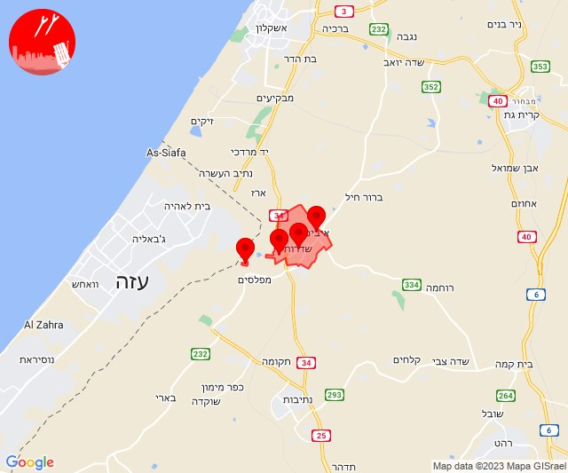
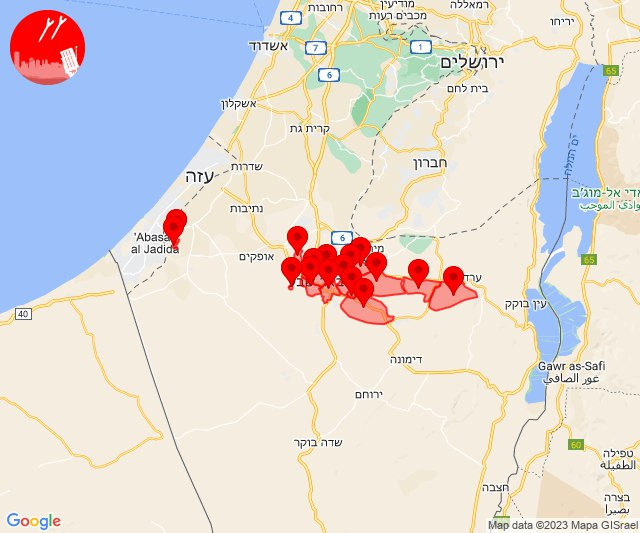

# Alerts for 2023-12-04

## 06:26

🔴 צבע אדום (04/12/2023):

08:26:
• עוטף עזה: נירים (15 שניות)

צופר - צבע אדום

## 06:26

## 08:01

🔴 צבע אדום (04/12/2023):

10:00:
• עוטף עזה: מגן, ניר עוז (15 שניות)

10:01:
• עוטף עזה: מבטחים, עמיעוז, ישע (15 שניות)

צופר - צבע אדום

## 08:01

## 09:00

🔴 צבע אדום (04/12/2023):

11:00:
• עוטף עזה: נירים, עין השלושה (15 שניות)

צופר - צבע אדום

## 09:00

## 10:42

🔴 צבע אדום (04/12/2023):

12:41:
• עוטף עזה: סופה (15 שניות)

12:42:
• עוטף עזה: ניר יצחק (15 שניות)

צופר - צבע אדום

## 10:42

## 10:59

🔴 צבע אדום (04/12/2023):

12:59:
• מערב לכיש: אשקלון - דרום, אשקלון - צפון, אזור תעשייה הדרומי אשקלון, מבקיעים (30 שניות)
• עוטף עזה: כרמיה (15 שניות)

צופר - צבע אדום

## 10:59

## 11:12

🔴 צבע אדום (04/12/2023):

13:12:
• עוטף עזה: מגן (15 שניות)

צופר - צבע אדום

## 11:12

## 12:02

🔴 צבע אדום (04/12/2023):

13:59:
• קו העימות: מתת (מיידי)

14:00:
• קו העימות: שתולה (מיידי)

14:01:
• דן: גבעת השלושה, גת רימון, מעש, פתח תקווה, גני תקווה (דקה וחצי)
• עוטף עזה: ניר יצחק, סופה, פרי גן (15 שניות)

14:02:
• דן: אור יהודה, יהוד-מונוסון, סביון, קריית אונו, רמת גן - מזרח, רמת גן - מערב, מגשימים (דקה וחצי)
• השפלה: חמד (דקה וחצי)

צופר - צבע אדום

## 12:02

## 12:38

🔴 צבע אדום (04/12/2023):

14:37:
• עוטף עזה: נירים, עין השלושה (15 שניות)

14:38:
• עוטף עזה: ניר עוז (15 שניות)

צופר - צבע אדום

## 12:38

## 12:42

🔴 צבע אדום (04/12/2023):

14:42:
• מערב הנגב: בית הגדי, נתיבות, יושיביה (30 שניות, 15 שניות)
• עוטף עזה: חוות יזרעם, תקומה (15 שניות)

צופר - צבע אדום

## 12:43

## 13:00

🔴 צבע אדום (04/12/2023):

15:00:
• עוטף עזה: שדרות, איבים, ניר עם, מטווח ניר עם (15 שניות)

צופר - צבע אדום

## 13:00

## 13:36

🔴 צבע אדום (04/12/2023):

15:36:
• עוטף עזה: כרם שלום (15 שניות)

צופר - צבע אדום

## 13:36

## 14:59

🔴 צבע אדום (04/12/2023):

16:59:
• עוטף עזה: נירים, עין השלושה (15 שניות)
• דרום הנגב: אל פורעה והפזורה, כסייפה והפזורה, סעייה-מולדה והפזורה, אבו-תלול והפזורה (דקה וחצי)
• מרכז הנגב: אל סייד והפזורה, נבטים, תל שבע, אום בטין והפזורה, באר שבע - דרום, באר שבע - מזרח, באר שבע - מערב, חצרים, באר שבע - צפון, אתר דודאים (דקה וחצי, דקה, 45 שניות)

צופר - צבע אדום

## 14:59

## 15:10

🔴 צבע אדום (04/12/2023):

17:10:
• קו העימות: קריית שמונה, תל חי (מיידי)

צופר - צבע אדום

## 15:10

