# Alerts for 2023-12-05

## 04:52

🔴 צבע אדום (05/12/2023):

06:52:
• מרכז הנגב: באר שבע - דרום, באר שבע - מערב, חצרים (דקה)

צופר - צבע אדום

## 04:52

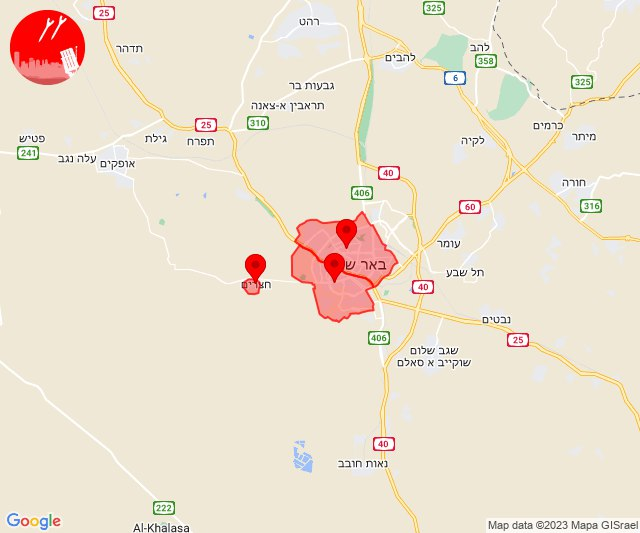

## 05:02

🔴 צבע אדום (05/12/2023):

07:02:
• עוטף עזה: ניר עוז, נירים (15 שניות)

צופר - צבע אדום

## 05:02

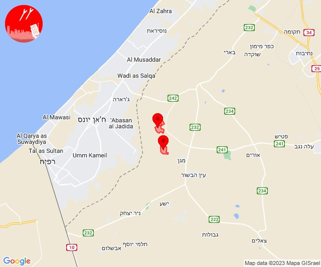

## 05:59

🔴 צבע אדום (05/12/2023):

07:59:
• עוטף עזה: מבטחים, עמיעוז, ישע (15 שניות)

צופר - צבע אדום

## 05:59

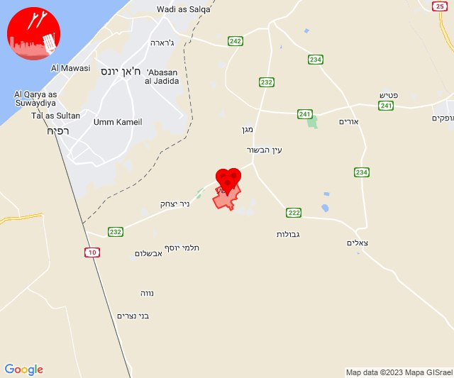

## 07:51

🔴 צבע אדום (05/12/2023):

09:51:
• עוטף עזה: עין השלושה (15 שניות)

צופר - צבע אדום

## 07:51

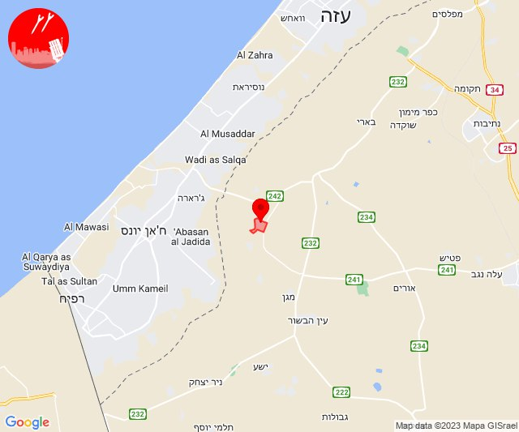

## 09:22

🔴 צבע אדום (05/12/2023):

11:22:
• עוטף עזה: ניר עוז, מגן (15 שניות)

צופר - צבע אדום

## 09:22

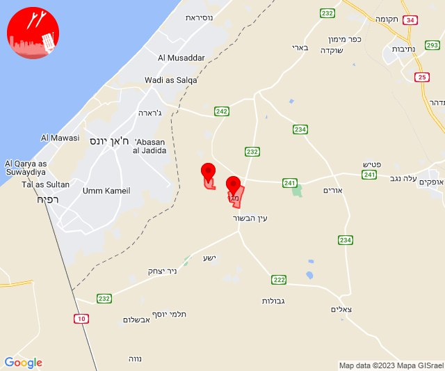

## 10:22

🔴 צבע אדום (05/12/2023):

12:22:
• עוטף עזה: כיסופים (15 שניות)

צופר - צבע אדום

## 10:22

## 11:49

🔴 צבע אדום (05/12/2023):

13:49:
• עוטף עזה: עין השלושה, נירים (15 שניות)

צופר - צבע אדום

## 11:49

## 11:53

🔴 צבע אדום (05/12/2023):

13:53:
• מערב הנגב: תדהר (30 שניות)

צופר - צבע אדום

## 11:53

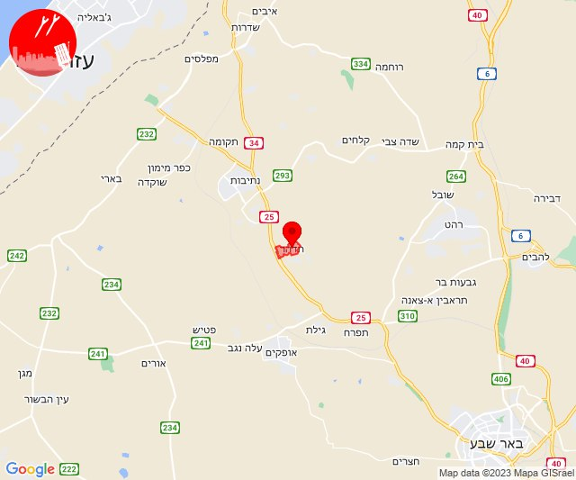

## 12:00

🔴 צבע אדום (05/12/2023):

13:59:
• מערב לכיש: אשקלון - דרום, אזור תעשייה הדרומי אשקלון, אשקלון - צפון, מבקיעים (30 שניות)
• עוטף עזה: כרמיה, יד מרדכי, זיקים, נתיב העשרה (15 שניות)

14:00:
• מערב לכיש: אזור תעשייה צפוני אשקלון, בת הדר (30 שניות)

צופר - צבע אדום

## 12:00

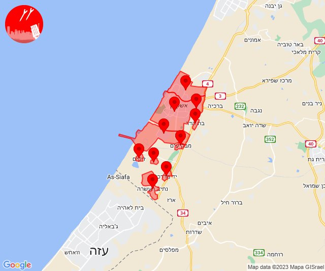

## 12:14

🔴 צבע אדום (05/12/2023):

14:14:
• עוטף עזה: עין השלושה, נירים (15 שניות)

צופר - צבע אדום

## 12:14

## 12:52

🔴 צבע אדום (05/12/2023):

14:52:
• עוטף עזה: נחל עוז (15 שניות)

צופר - צבע אדום

## 12:52

## 13:21

🔴 צבע אדום (05/12/2023):

15:20:
• דן: אור יהודה, גבעת שמואל, קריית אונו, רמת גן - מזרח, רמת גן - מערב, תל אביב - מזרח, תל אביב - מרכז העיר, תל אביב - עבר הירקון, גבעתיים, תל אביב - דרום העיר ויפו, חולון, יהוד-מונוסון, סביון, מגשימים, בני ברק, פתח תקווה, מתחם פי גלילות (דקה וחצי)
• השפלה: חמד, גנות, צפריה (דקה וחצי)
• ירקון: בארות יצחק, נחלים (דקה וחצי)

15:21:
• ירקון: בני עטרות (דקה וחצי)
• השפלה: אחיעזר, יגל, כפר חב''ד, ראשון לציון - מזרח, ראשון לציון - מערב, בית דגן, משמר השבעה, תעשיון צריפין, ניר צבי (דקה וחצי)
• לכיש: יבנה, כפר הנגיד (דקה)
• דן: אזור, מקווה ישראל, בת-ים (דקה וחצי)

צופר - צבע אדום

## 13:21

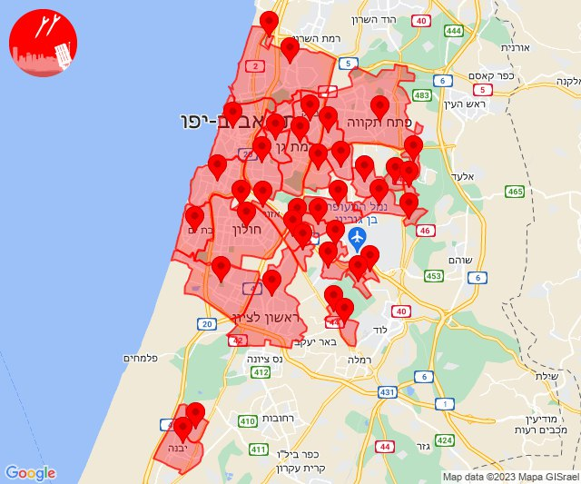

## 13:29

🔴 צבע אדום (05/12/2023):

15:29:
• קו העימות: אדמית, ערב אל עראמשה (מיידי)

צופר - צבע אדום

## 13:29

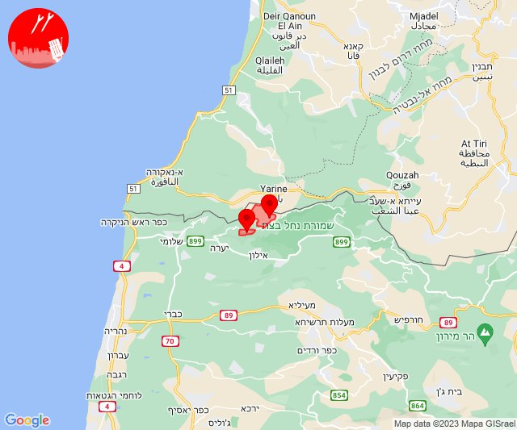

## 15:12

🔴 צבע אדום (05/12/2023):

17:11:
• קו העימות: קריית שמונה, כפר גלעדי, תל חי, מנרה (מיידי)

17:12:
• קו העימות: מרגליות (מיידי)

צופר - צבע אדום

## 15:12

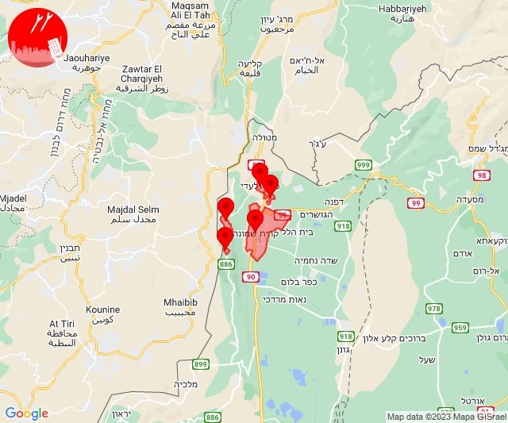

## 15:17

🔴 צבע אדום (05/12/2023):

17:17:
• קו העימות: קריית שמונה, בית הלל (מיידי)

צופר - צבע אדום

## 15:17

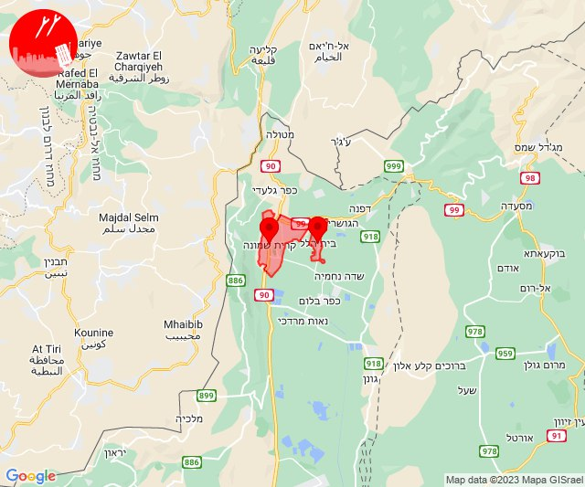

## 15:52

🔴 צבע אדום (05/12/2023):

17:52:
• קו העימות: כפר גלעדי, תל חי, קריית שמונה, משגב עם (מיידי)

צופר - צבע אדום

## 15:52

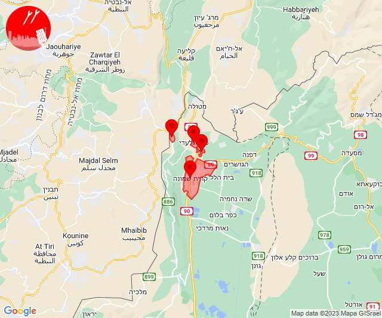

## 16:03

🔴 צבע אדום (05/12/2023):

18:03:
• עוטף עזה: זיקים, כרמיה, נתיב העשרה (15 שניות)
• מערב לכיש: ניצן, ניצנים, אזור תעשייה צפוני אשקלון, אשקלון - דרום, אשקלון - צפון, אזור תעשייה הדרומי אשקלון, בת הדר, באר גנים, כפר סילבר (45 שניות, 30 שניות)
• לכיש: אשדוד - א,ב,ד,ה, אשדוד - ג,ו,ז, אשדוד - ח,ט,י,יג,יד,טז, אשדוד - יא,יב,טו,יז,מרינה,סיטי, אשדוד - אזור תעשייה צפוני ונמל, ניר גלים, אזור תעשייה עד הלום, בית עזרא (45 שניות)

צופר - צבע אדום

## 16:03

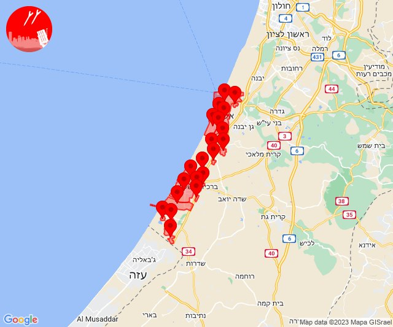

