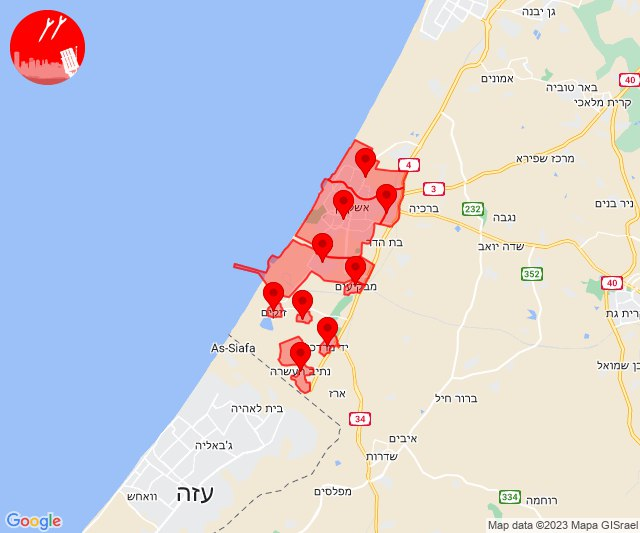

# Alerts for 2023-12-06

## 06:56

🔴 צבע אדום (06/12/2023):

08:56:
• עוטף עזה: רעים (15 שניות)

צופר - צבע אדום

## 06:56

## 08:07

🔴 צבע אדום (06/12/2023):

10:07:
• עוטף עזה: כיסופים (15 שניות)

צופר - צבע אדום

## 08:07

## 10:18

🔴 צבע אדום (06/12/2023):

12:18:
• עוטף עזה: ניר יצחק (15 שניות)

צופר - צבע אדום

## 10:18

## 10:33

🔴 צבע אדום (06/12/2023):

12:33:
• עוטף עזה: סופה, ניר יצחק (15 שניות)

צופר - צבע אדום

## 10:33

## 10:59

🔴 צבע אדום (06/12/2023):

12:59:
• מערב לכיש: אזור תעשייה הדרומי אשקלון, אזור תעשייה צפוני אשקלון, אשקלון - דרום, מבקיעים, אשקלון - צפון (30 שניות)
• עוטף עזה: זיקים, כרמיה, יד מרדכי, נתיב העשרה (15 שניות)

צופר - צבע אדום

## 10:59

## 11:11

🔴 צבע אדום (06/12/2023):

13:11:
• אילת: אילות, אילת (30 שניות)

צופר - צבע אדום

## 11:11

## 12:31

🔴 צבע אדום (06/12/2023):

14:31:
• עוטף עזה: מגן, ניר עוז (15 שניות)

צופר - צבע אדום

## 12:31

## 14:00

🔴 צבע אדום (06/12/2023):

15:59:
• מרכז הנגב: שגב שלום והפזורה, תל שבע (דקה וחצי)
• דרום הנגב: אבו-תלול והפזורה (דקה וחצי)
• קו העימות: שתולה (מיידי)

16:00:
• מרכז הנגב: באר שבע - דרום, לקיה והפזורה, באר שבע - מערב, באר שבע - צפון, באר שבע - מזרח, עומר, חצרים, אתר דודאים (דקה, 45 שניות)
• עוטף עזה: מגן, ניר עוז, עין הבשור (15 שניות)
• דרום הנגב: ואדי אל נעם דרום (דקה וחצי)

צופר - צבע אדום

## 14:00

## 14:04

🔴 צבע אדום (06/12/2023):

16:04:
• קו העימות: מלכיה (מיידי)

צופר - צבע אדום

## 14:04

## 14:06

🔴 צבע אדום (06/12/2023):

16:06:
• קו העימות: מתת (מיידי)

צופר - צבע אדום

## 14:06

## 14:15

🔴 צבע אדום (06/12/2023):

16:15:
• קו העימות: מרגליות (מיידי)

צופר - צבע אדום

## 14:15

## 15:40

🔴 צבע אדום (06/12/2023):

17:40:
• עוטף עזה: כרם שלום (15 שניות)

צופר - צבע אדום

## 15:40

