# Alerts for 2023-12-08

## 08:22

🔴 צבע אדום (08/12/2023):

10:22:
• עוטף עזה: מטווח ניר עם, שדרות, איבים, ניר עם (15 שניות)

צופר - צבע אדום

## 08:22

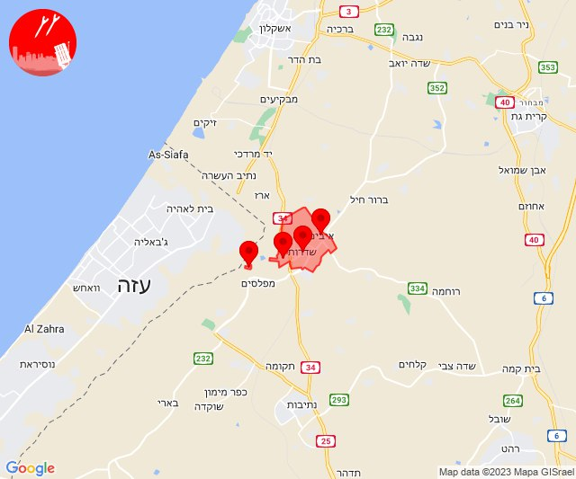

## 10:00

🔴 צבע אדום (08/12/2023):

12:00:
• עוטף עזה: שדרות, איבים, ניר עם (15 שניות)

צופר - צבע אדום

## 10:00

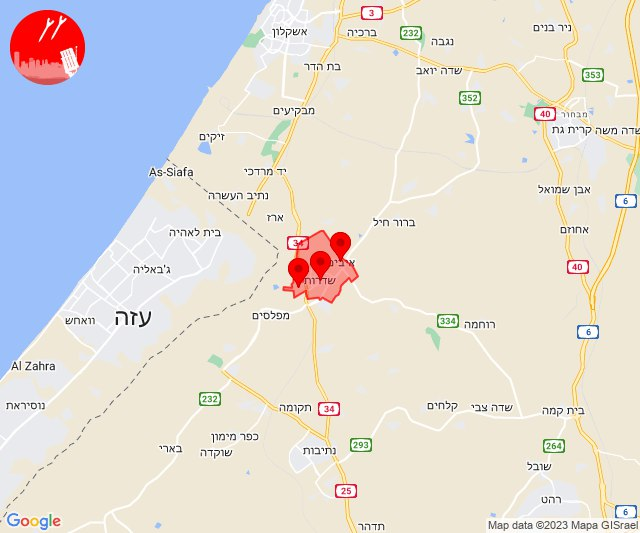

## 10:30

🔴 צבע אדום (08/12/2023):

12:30:
• מערב לכיש: ניצנים (30 שניות)

צופר - צבע אדום

## 10:30

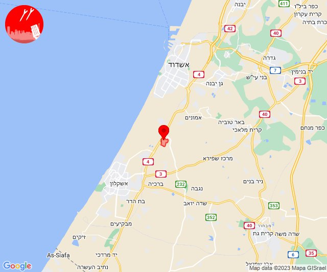

## 12:28

🔴 צבע אדום (08/12/2023):

14:27:
• קו העימות: כפר בלום, נאות מרדכי (מיידי)

14:28:
• עוטף עזה: כרם שלום (15 שניות)

צופר - צבע אדום

## 12:28

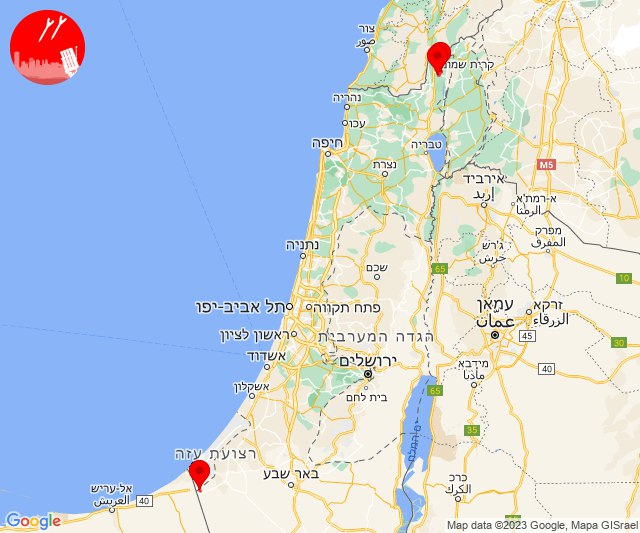

## 12:30

✈️ חדירת כלי טיס עוין (08/12/2023):

14:30:
• קו העימות: בית הלל, כפר גלעדי, כפר יובל, מטולה, מנרה, מעיין ברוך, מרגליות, משגב עם, קריית שמונה, תל חי, גונן, כפר בלום, כפר סאלד, להבות הבשן, נאות מרדכי, עמיר, שדה נחמיה, שמיר 

צופר - צבע אדום

## 12:30

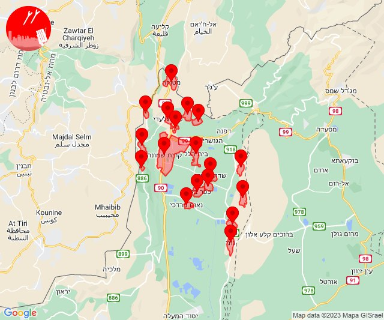

## 12:31

🔴 צבע אדום (08/12/2023):

14:31:
• דן: תל אביב - מזרח, תל אביב - מרכז העיר, תל אביב - עבר הירקון, גבעתיים, רמת גן - מערב (דקה וחצי)

צופר - צבע אדום

## 12:31

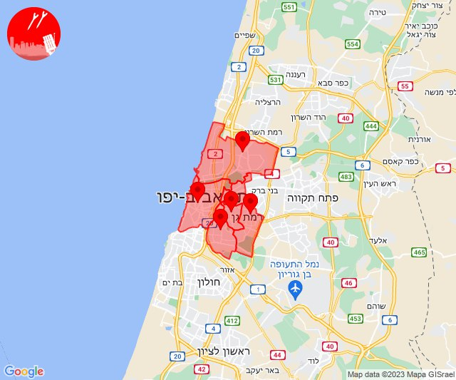

## 12:39

🔴 צבע אדום (08/12/2023):

14:39:
• קו העימות: כפר בלום, עמיר, שדה נחמיה (מיידי, 15 שניות)

צופר - צבע אדום

## 12:39

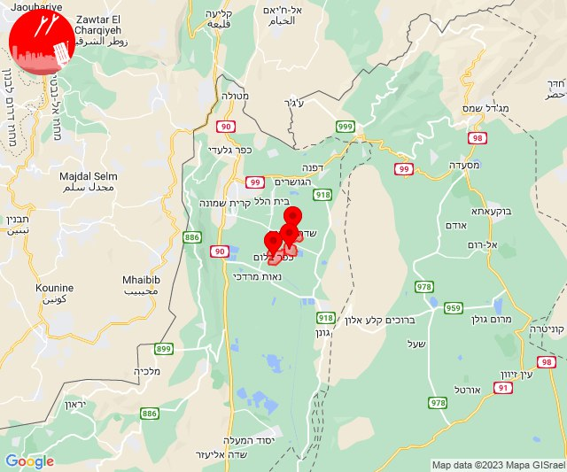

## 12:45

🔴 צבע אדום (08/12/2023):

14:45:
• עוטף עזה: סופה, חולית (15 שניות)

צופר - צבע אדום

## 12:45

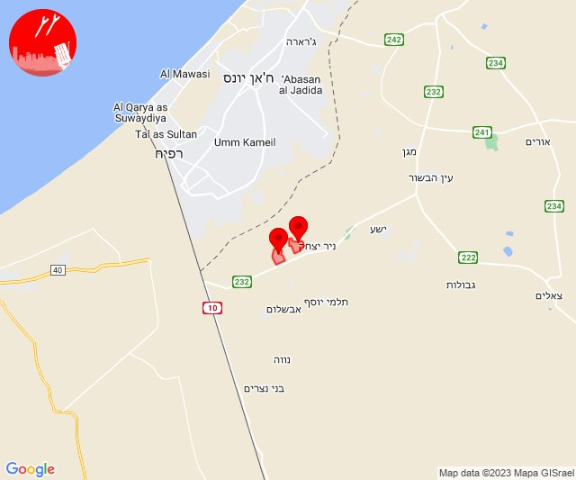

## 12:47

🔴 צבע אדום (08/12/2023):

14:47:
• עוטף עזה: כרם שלום (15 שניות)

צופר - צבע אדום

## 12:47

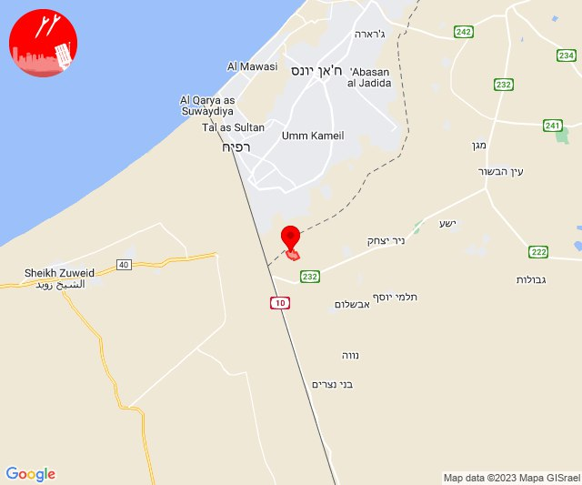

## 13:21

🔴 צבע אדום (08/12/2023):

15:21:
• עוטף עזה: עין השלושה, נירים (15 שניות)

צופר - צבע אדום

## 13:21

## 14:00

🔴 צבע אדום (08/12/2023):

15:59:
• עוטף עזה: מבטחים, עמיעוז, ישע, צוחר, אוהד (15 שניות)

16:00:
• מערב לכיש: אשקלון - דרום, אזור תעשייה הדרומי אשקלון, אשקלון - צפון (30 שניות)

צופר - צבע אדום

## 14:00

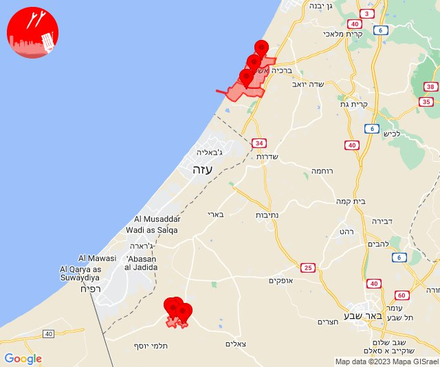

## 14:05

🔴 צבע אדום (08/12/2023):

16:05:
• עוטף עזה: כיסופים (15 שניות)

צופר - צבע אדום

## 14:05

## 14:20

🔴 צבע אדום (08/12/2023):

16:20:
• עוטף עזה: נחל עוז (15 שניות)

צופר - צבע אדום

## 14:20

## 15:59

🔴 צבע אדום (08/12/2023):

17:58:
• השפלה: ראשון לציון - מזרח, באר יעקב, נס ציונה, בית עובד, אירוס, חמד, רחובות (דקה וחצי)
• דן: גבעת שמואל, גת רימון, פתח תקווה, קריית אונו, רמת גן - מזרח, גני תקווה, אור יהודה, מעש, סביון, בני ברק, גבעתיים, רמת גן - מערב, תל אביב - מרכז העיר, תל אביב - עבר הירקון (דקה וחצי)

17:59:
• השפלה: גאליה, בית דגן, כפר חב''ד, משמר השבעה, צפריה, גנות (דקה, דקה וחצי)
• לכיש: יבנה, כפר הנגיד, בית גמליאל, בן זכאי, בניה, מעון צופיה (דקה)
• דן: תל אביב - מזרח, אזור, חולון, מקווה ישראל, תל אביב - דרום העיר ויפו, יהוד-מונוסון, בת-ים (דקה וחצי)

צופר - צבע אדום

## 15:59

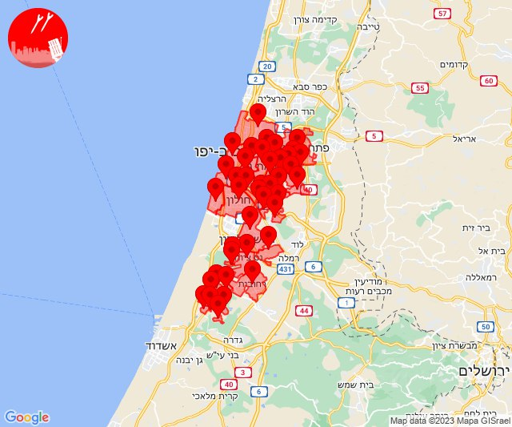

## 16:14

🔴 צבע אדום (08/12/2023):

18:14:
• קו העימות: מעיליא, מעלות תרשיחא, אבירים, כפר ורדים (מיידי, 15 שניות)
• גליל עליון: ינוח-ג'ת (30 שניות)

צופר - צבע אדום

## 16:14

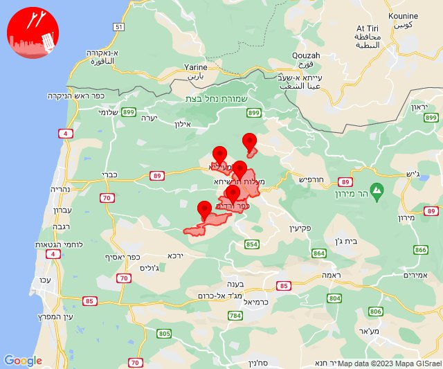

## 16:17

🔴 צבע אדום (08/12/2023):

18:17:
• קו העימות: הילה, עין יעקב, מעונה, גורן (מיידי, 15 שניות)

צופר - צבע אדום

## 16:17

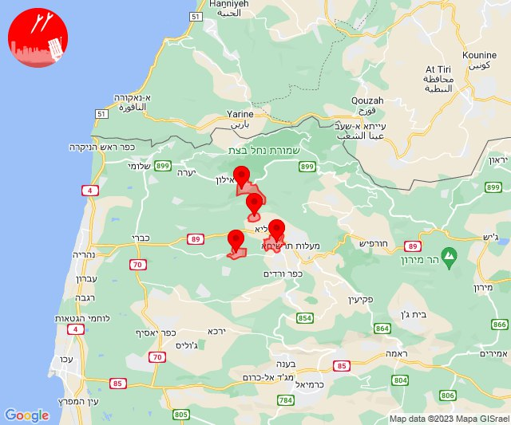

## 19:04

🔴 צבע אדום (08/12/2023):

21:04:
• מערב לכיש: תלמי יפה (30 שניות)

צופר - צבע אדום

## 19:04

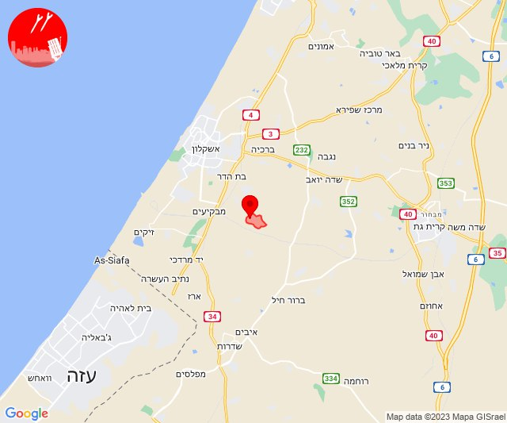

## 23:28

🔴 צבע אדום (09/12/2023):

01:28:
• קו העימות: מלכיה (מיידי)

צופר - צבע אדום

## 23:28

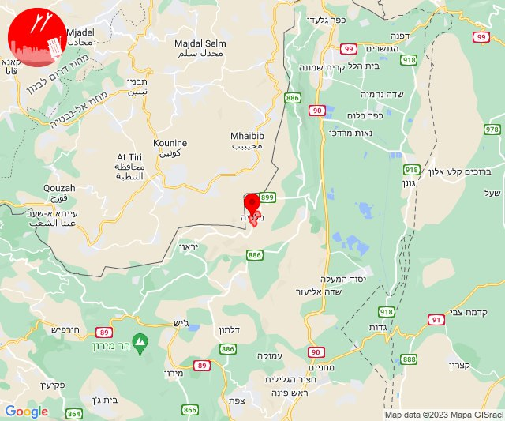

