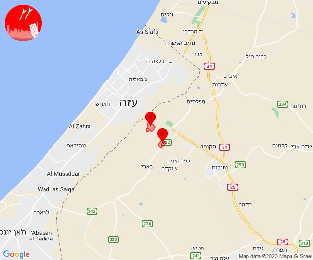
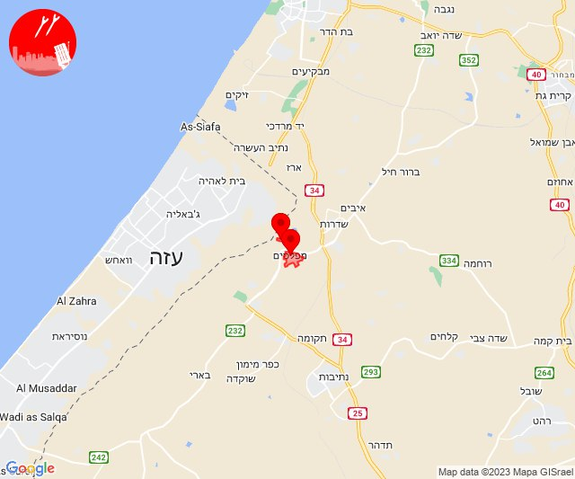
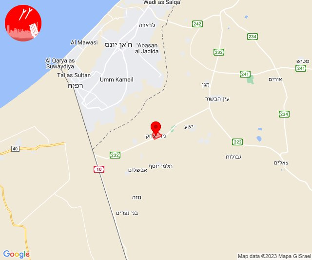
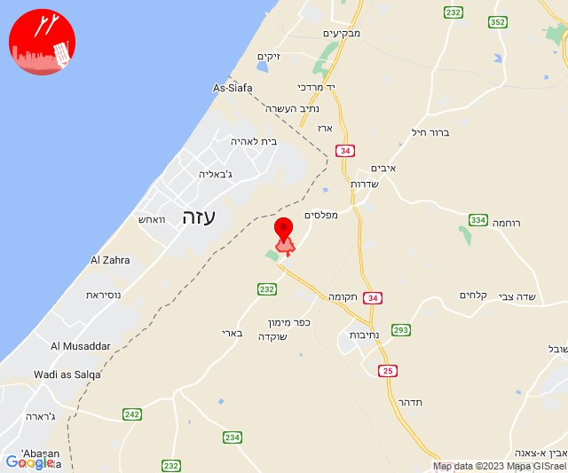
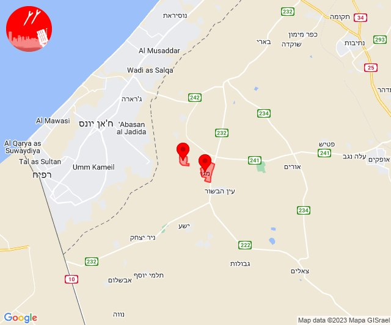
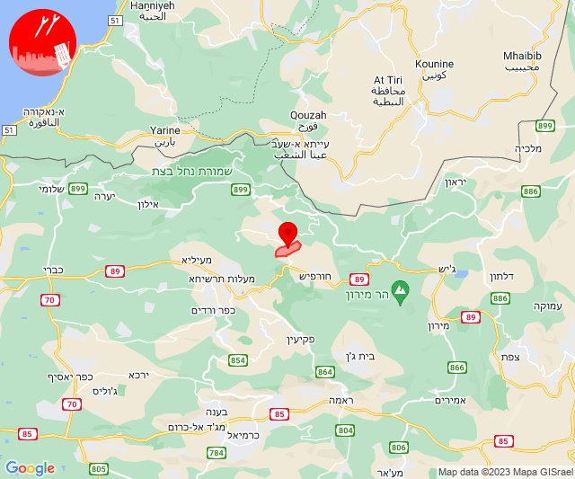
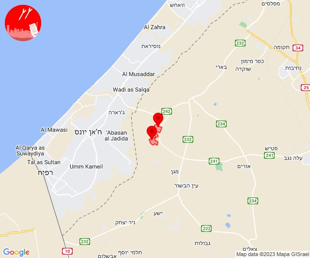

# Alerts for 2023-12-09

## 01:21

🔴 צבע אדום (09/12/2023):

03:21:
• עוטף עזה: נחל עוז, עלומים (15 שניות)

צופר - צבע אדום

## 01:21

## 02:02

🔴 צבע אדום (09/12/2023):

04:02:
• עוטף עזה: מפלסים, מטווח ניר עם (15 שניות)

צופר - צבע אדום

## 02:02

## 08:03

🔴 צבע אדום (09/12/2023):

10:03:
• עוטף עזה: מגן (15 שניות)

צופר - צבע אדום

## 08:03

## 09:14

🔴 צבע אדום (09/12/2023):

11:14:
• עוטף עזה: ניר יצחק (15 שניות)

צופר - צבע אדום

## 09:14

## 09:59

🔴 צבע אדום (09/12/2023):

11:59:
• עוטף עזה: כפר עזה (15 שניות)

צופר - צבע אדום

## 09:59

## 10:03

🔴 צבע אדום (09/12/2023):

12:03:
• קו העימות: משגב עם (מיידי)

צופר - צבע אדום

## 10:03

## 12:00

🔴 צבע אדום (09/12/2023):

14:00:
• עוטף עזה: מגן, ניר עוז (15 שניות)

צופר - צבע אדום

## 12:00

## 13:28

🔴 צבע אדום (09/12/2023):

15:28:
• קו העימות: אלקוש (מיידי)

צופר - צבע אדום

## 13:28

## 14:00

🔴 צבע אדום (09/12/2023):

16:00:
• עוטף עזה: נירים, עין השלושה (15 שניות)

צופר - צבע אדום

## 14:00

