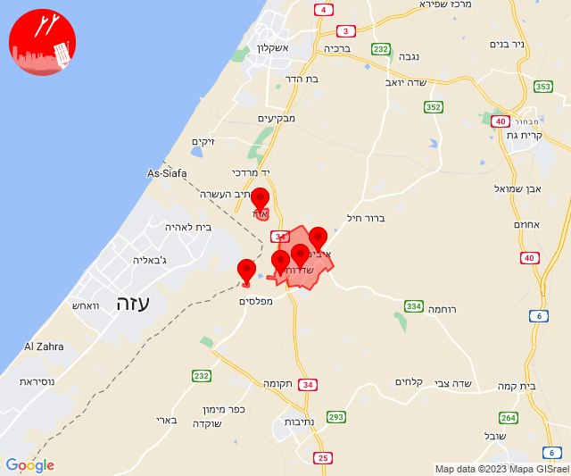

# Alerts for 2023-12-10

## 08:01

✈️ חדירת כלי טיס עוין (10/12/2023):

10:01:
• קו העימות: אבן מנחם, אדמית, אילון, גורן, גורנות הגליל, זרעית, חניתה, יערה, ערב אל עראמשה, שומרה, שתולה 

צופר - צבע אדום

## 08:01

## 08:04

🔴 צבע אדום (10/12/2023):

10:02:
• קו העימות: אילון, גורן (מיידי)

10:03:
• קו העימות: יערה, עבדון (מיידי)

צופר - צבע אדום

## 08:04

## 08:10

🔴 צבע אדום (10/12/2023):

10:10:
• קו העימות: שלומי (מיידי)

צופר - צבע אדום

## 08:10

## 09:56

🔴 צבע אדום (10/12/2023):

11:56:
• עוטף עזה: יד מרדכי, נתיב העשרה (15 שניות)

צופר - צבע אדום

## 09:56

## 10:45

🔴 צבע אדום (10/12/2023):

12:45:
• עוטף עזה: נחל עוז (15 שניות)

צופר - צבע אדום

## 10:45

## 11:15

🔴 צבע אדום (10/12/2023):

13:15:
• עוטף עזה: נתיב העשרה (15 שניות)

צופר - צבע אדום

## 11:15

## 11:59

🔴 צבע אדום (10/12/2023):

13:59:
• עוטף עזה: ניר יצחק, סופה, פרי גן (15 שניות)

צופר - צבע אדום

## 11:59

## 12:16

🔴 צבע אדום (10/12/2023):

14:16:
• עוטף עזה: כיסופים (15 שניות)

צופר - צבע אדום

## 12:16

## 13:29

🔴 צבע אדום (10/12/2023):

15:29:
• עוטף עזה: שדרות, איבים, ניר עם, ארז, מטווח ניר עם (15 שניות)

צופר - צבע אדום

## 13:29

## 13:56

🔴 צבע אדום (10/12/2023):

15:56:
• קו העימות: בצת, לימן, אזור תעשייה אכזיב מילואות (מיידי)

צופר - צבע אדום

## 13:56

## 14:08

🔴 צבע אדום (10/12/2023):

16:08:
• קו העימות: בצת (מיידי)

צופר - צבע אדום

## 14:08

## 18:27

🔴 צבע אדום (10/12/2023):

20:27:
• גליל עליון: כליל (30 שניות)

צופר - צבע אדום

## 18:27

