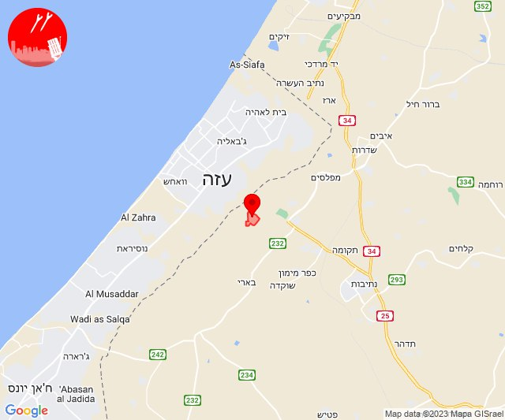
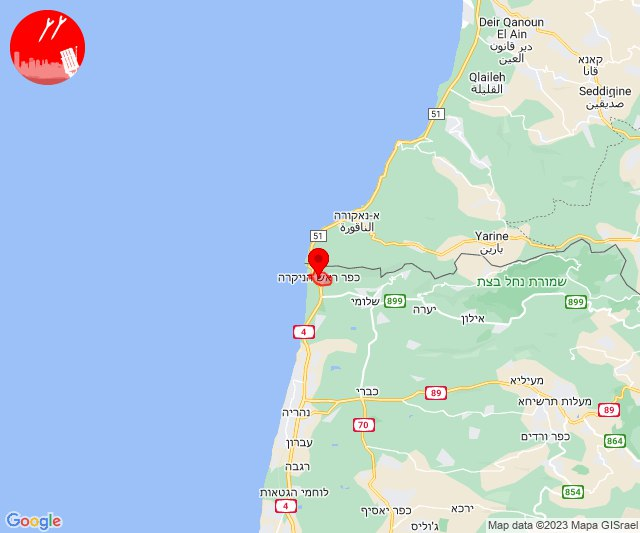

# Alerts for 2023-12-13

## 04:36

🔴 צבע אדום (13/12/2023):

06:36:
• עוטף עזה: כיסופים (15 שניות)

צופר - צבע אדום

## 04:36

## 06:11

🔴 צבע אדום (13/12/2023):

08:11:
• עוטף עזה: נירים, עין השלושה (15 שניות)

צופר - צבע אדום

## 06:11

## 06:43

🔴 צבע אדום (13/12/2023):

08:43:
• עוטף עזה: שדרות, איבים, ניר עם (15 שניות)

צופר - צבע אדום

## 06:43

## 06:54

🔴 צבע אדום (13/12/2023):

08:54:
• עוטף עזה: נירים, עין השלושה (15 שניות)

צופר - צבע אדום

## 06:54

## 08:20

🔴 צבע אדום (13/12/2023):

10:20:
• עוטף עזה: ניר עוז (15 שניות)

צופר - צבע אדום

## 08:20

## 09:21

🔴 צבע אדום (13/12/2023):

11:21:
• עוטף עזה: זמרת, שובה, סעד, תקומה (15 שניות)

צופר - צבע אדום

## 09:21

## 10:13

🔴 צבע אדום (13/12/2023):

12:13:
• עוטף עזה: נחל עוז (15 שניות)

צופר - צבע אדום

## 10:13

## 10:22

🔴 צבע אדום (13/12/2023):

12:22:
• עוטף עזה: כיסופים (15 שניות)

צופר - צבע אדום

## 10:22

## 12:03

🔴 צבע אדום (13/12/2023):

14:03:
• קו העימות: ראש הנקרה (מיידי)

צופר - צבע אדום

## 12:03

## 15:03

🔴 צבע אדום (13/12/2023):

17:02:
• לכיש: אשדוד - יא,יב,טו,יז,מרינה,סיטי, אשדוד - א,ב,ד,ה, אשדוד - אזור תעשייה צפוני ונמל, אשדוד - ג,ו,ז, אשדוד - ח,ט,י,יג,יד,טז (45 שניות)

17:03:
• לכיש: גן הדרום, כפר אביב, מתחם בני דרום, בני דרום, אזור תעשייה עד הלום, גן יבנה, שדה עוזיהו, שתולים (דקה, 45 שניות)
• מערב לכיש: ניצן (45 שניות)

צופר - צבע אדום

## 15:03

