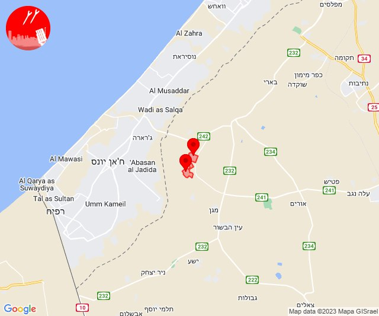

# Alerts for 2023-12-14

## 04:04

🔴 צבע אדום (14/12/2023):

06:04:
• עוטף עזה: סופה (15 שניות)

צופר - צבע אדום

## 04:04

## 08:23

🔴 צבע אדום (14/12/2023):

10:23:
• עוטף עזה: נירים, עין השלושה (15 שניות)

צופר - צבע אדום

## 08:23

## 11:50

🔴 צבע אדום (14/12/2023):

13:50:
• עוטף עזה: ניר יצחק, סופה (15 שניות)

צופר - צבע אדום

## 11:50

## 12:07

🔴 צבע אדום (14/12/2023):

14:07:
• קו העימות: כפר גלעדי, מנרה, מרגליות, משגב עם, קריית שמונה, תל חי (מיידי)

צופר - צבע אדום

## 12:07

## 12:26

🔴 צבע אדום (14/12/2023):

14:25:
• קו העימות: יפתח (מיידי)

צופר - צבע אדום

## 12:26

## 19:02

🔴 צבע אדום (14/12/2023):

21:01:
• מערב הנגב: אופקים, פדויים, בטחה, גילת, מסלול, קריית חינוך מרחבים (45 שניות, 30 שניות)

21:02:
• מערב הנגב: דניאל, אורים, פטיש (45 שניות, 30 שניות)

צופר - צבע אדום

## 19:02

