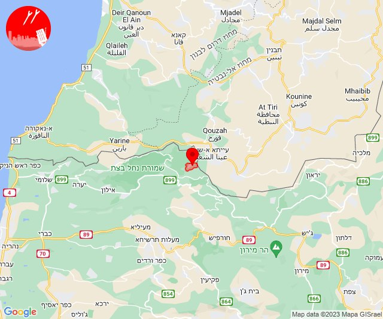

# Alerts for 2023-12-15

## 12:05

🔴 צבע אדום (15/12/2023):

14:05:
• קו העימות: ערב אל עראמשה (מיידי)

צופר - צבע אדום

## 12:05

## 12:13

🔴 צבע אדום (15/12/2023):

14:13:
• קו העימות: ערב אל עראמשה (מיידי)

צופר - צבע אדום

## 12:13

## 12:57

🔴 צבע אדום (15/12/2023):

14:57:
• קו העימות: חניתה (מיידי)

צופר - צבע אדום

## 12:57

## 13:01

🔴 צבע אדום (15/12/2023):

15:00:
• קו העימות: מרגליות, קריית שמונה, חניתה, משגב עם (מיידי)

15:01:
• קו העימות: תל חי (מיידי)

צופר - צבע אדום

## 13:01

## 13:09

🔴 צבע אדום (15/12/2023):

15:09:
• קו העימות: מרגליות, משגב עם (מיידי)

צופר - צבע אדום

## 13:09

## 13:22

🔴 צבע אדום (15/12/2023):

15:22:
• עוטף עזה: נירים (15 שניות)

צופר - צבע אדום

## 13:22

## 14:15

🔴 צבע אדום (15/12/2023):

16:15:
• קו העימות: שתולה (מיידי)

צופר - צבע אדום

## 14:15

## 14:23

🔴 צבע אדום (15/12/2023):

16:23:
• עוטף עזה: סופה (15 שניות)

צופר - צבע אדום

## 14:23

## 15:02

🔴 צבע אדום (15/12/2023):

17:01:
• ירושלים: ירושלים - מזרח, ירושלים - מרכז, ירושלים - צפון (דקה וחצי)
• יהודה: עלמון (דקה וחצי)
• שפלת יהודה: בית שמש, נחשון, מעלה החמישה, אבו-גוש, יד השמונה, נווה אילן, קריית יערים, שואבה, שורש, זנוח (דקה וחצי)

17:02:
• ירושלים: בית זית, מוצא עילית, ירושלים - מערב, מבשרת ציון, פנימיית עין כרם (דקה וחצי)
• שפלת יהודה: בקוע, טל שחר, צלפון, אזור תעשייה הר טוב - צרעה, אשתאול, ישעי, מחסיה, נחם, צרעה, תרום, בית מאיר, כסלון (דקה וחצי)

צופר - צבע אדום

## 15:02

