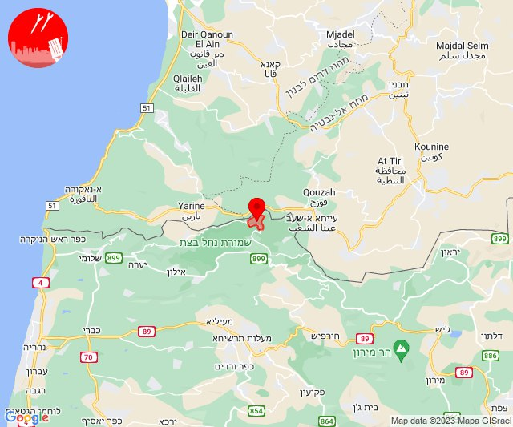
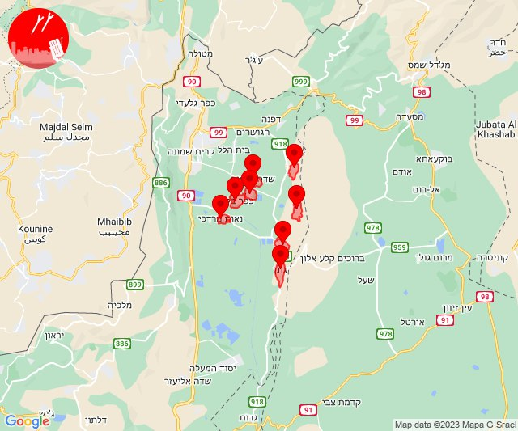
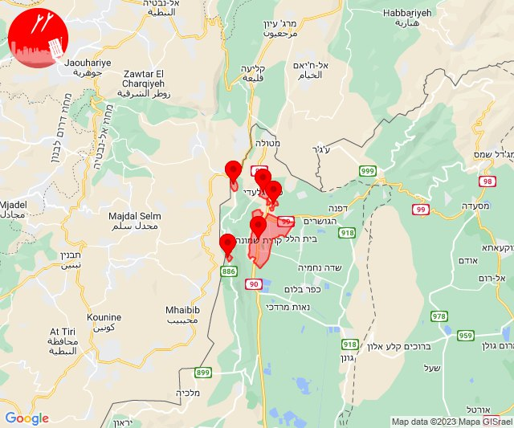
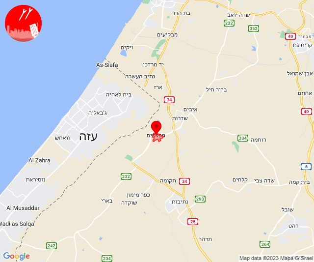

# Alerts for 2023-12-16

## 05:03

🔴 צבע אדום (16/12/2023):

07:03:
• עוטף עזה: נתיב העשרה (15 שניות)

צופר - צבע אדום

## 05:03

## 06:01

🔴 צבע אדום (16/12/2023):

08:01:
• קו העימות: זרעית (מיידי)

צופר - צבע אדום

## 06:01

## 07:31

🔴 צבע אדום (16/12/2023):

09:31:
• עוטף עזה: שדרות, איבים, ניר עם (15 שניות)

צופר - צבע אדום

## 07:31

## 09:03

✈️ חדירת כלי טיס עוין (16/12/2023):

11:03:
• קו העימות: גונן, דישון, יפתח, כפר בלום, כפר סאלד, להבות הבשן, מלכיה, מרכז אזורי מבואות חרמון, נאות מרדכי, עמיר, רמות נפתלי, שדה נחמיה, שמיר 

צופר - צבע אדום

## 09:03

## 09:04

✈️ חדירת כלי טיס עוין (16/12/2023):

11:04:
• קו העימות: גונן, כפר בלום, כפר סאלד, להבות הבשן, נאות מרדכי, עמיר, שדה נחמיה, שמיר 

צופר - צבע אדום

## 09:04

## 11:17

🔴 צבע אדום (16/12/2023):

13:17:
• עוטף עזה: נירים, עין השלושה (15 שניות)

צופר - צבע אדום

## 11:17

## 13:28

🔴 צבע אדום (16/12/2023):

15:28:
• קו העימות: אילון, גורן (מיידי)

צופר - צבע אדום

## 13:28

## 13:57

🔴 צבע אדום (16/12/2023):

15:57:
• קו העימות: מרגליות (מיידי)

צופר - צבע אדום

## 13:57

## 13:59

🔴 צבע אדום (16/12/2023):

15:59:
• קו העימות: כפר גלעדי, מנרה, משגב עם, קריית שמונה, תל חי (מיידי)

צופר - צבע אדום

## 13:59

## 20:14

🔴 צבע אדום (16/12/2023):

22:14:
• עוטף עזה: מפלסים (15 שניות)

צופר - צבע אדום

## 20:14

