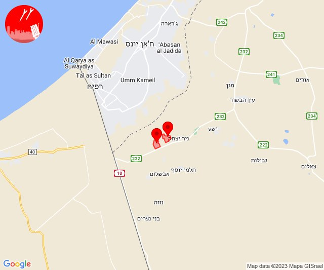
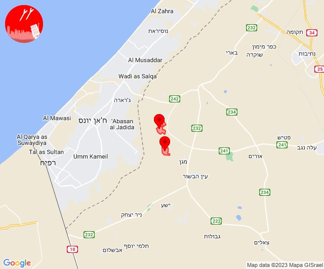
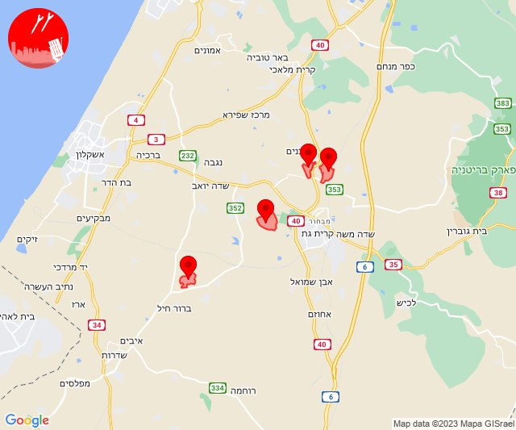

# Alerts for 2023-12-17

## 09:00

🔴 צבע אדום (17/12/2023):

11:00:
• עוטף עזה: סופה, חולית (15 שניות)

צופר - צבע אדום

## 09:00

## 10:47

🔴 צבע אדום (17/12/2023):

12:47:
• עוטף עזה: נירים, ניר עוז (15 שניות)

צופר - צבע אדום

## 10:47

## 13:30

🔴 צבע אדום (17/12/2023):

15:30:
• קו העימות: מרגליות (מיידי)

צופר - צבע אדום

## 13:30

## 14:45

🔴 צבע אדום (17/12/2023):

16:45:
• עוטף עזה: ניר יצחק, סופה (15 שניות)

צופר - צבע אדום

## 14:45

## 15:41

🔴 צבע אדום (17/12/2023):

17:41:
• מערב לכיש: חלץ (30 שניות)
• לכיש: זבדיאל, מנוחה, שחר (45 שניות, 30 שניות)

צופר - צבע אדום

## 15:41

