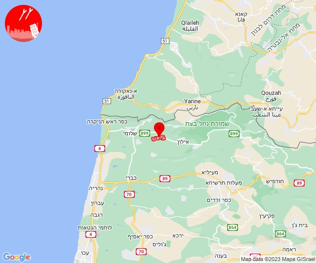
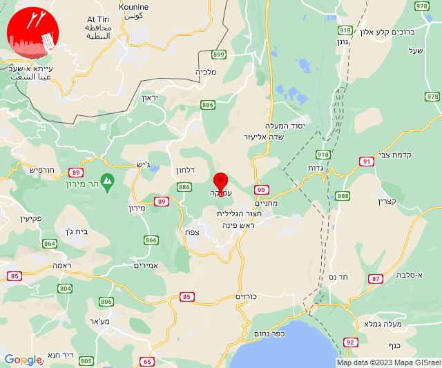
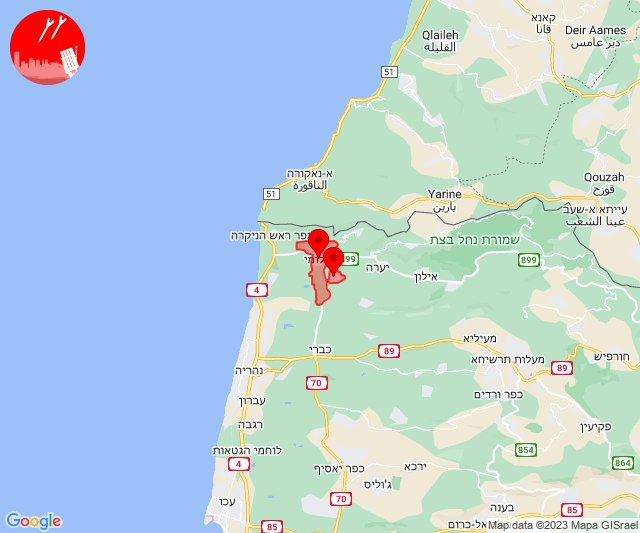
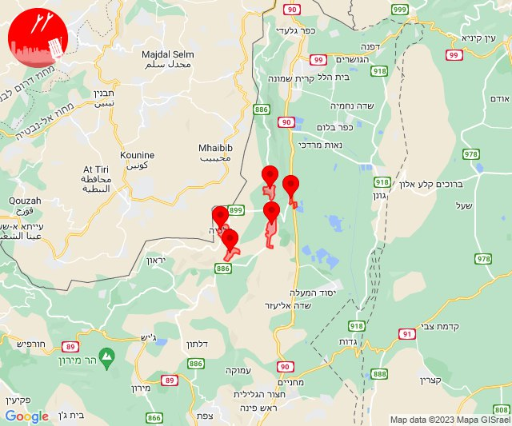
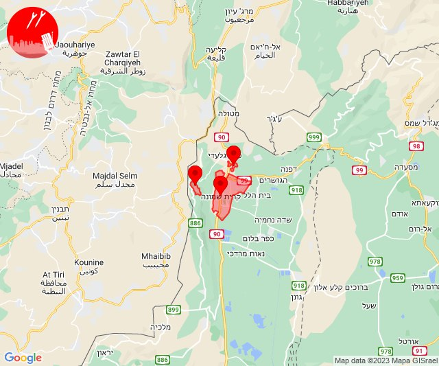

# Alerts for 2023-12-18

## 07:01

🔴 צבע אדום (18/12/2023):

09:01:
• קו העימות: יערה (מיידי)

צופר - צבע אדום

## 07:01

## 09:38

✈️ חדירת כלי טיס עוין (18/12/2023):

11:38:
• קו העימות: דישון, יפתח, מלכיה, מרכז אזורי מבואות חרמון, רמות נפתלי 

צופר - צבע אדום

## 09:38

## 09:38

🔴 צבע אדום (18/12/2023):

11:38:
• גליל עליון: עמוקה (30 שניות)

צופר - צבע אדום

## 09:38

## 11:10

🔴 צבע אדום (18/12/2023):

13:10:
• עוטף עזה: כיסופים (15 שניות)

צופר - צבע אדום

## 11:10

## 12:37

🔴 צבע אדום (18/12/2023):

14:37:
• קו העימות: שלומי, מצובה (מיידי)

צופר - צבע אדום

## 12:37

## 12:57

🔴 צבע אדום (18/12/2023):

14:57:
• קו העימות: יפתח (מיידי)

צופר - צבע אדום

## 12:57

## 12:58

✈️ חדירת כלי טיס עוין (18/12/2023):

14:58:
• קו העימות: דישון, יפתח, מלכיה, מרכז אזורי מבואות חרמון, רמות נפתלי 

צופר - צבע אדום

## 12:58

## 13:56

✈️ חדירת כלי טיס עוין (18/12/2023):

15:56:
• קו העימות: דישון, יפתח, מלכיה, מרכז אזורי מבואות חרמון, רמות נפתלי 

צופר - צבע אדום

## 13:56

## 17:42

🔴 צבע אדום (18/12/2023):

19:42:
• קו העימות: קריית שמונה, תל חי, מרגליות (מיידי)

צופר - צבע אדום

## 17:42

