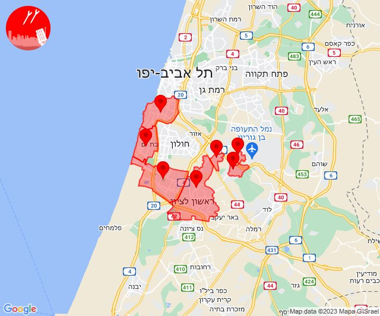
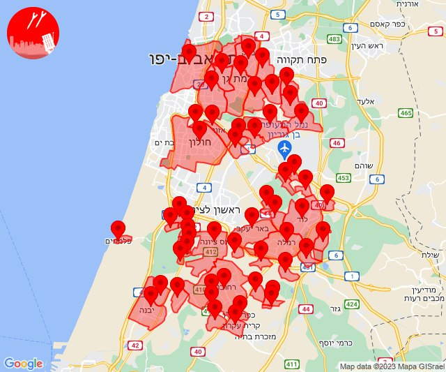
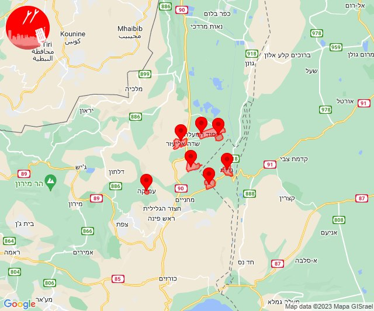
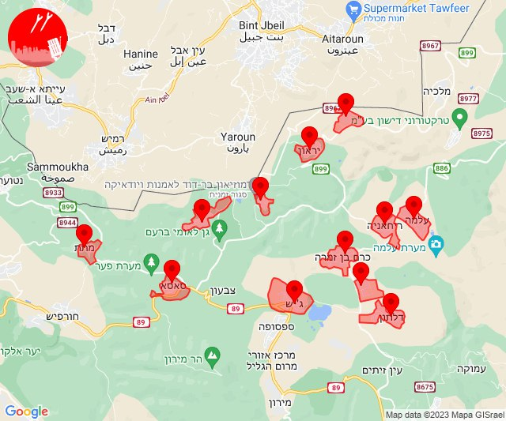
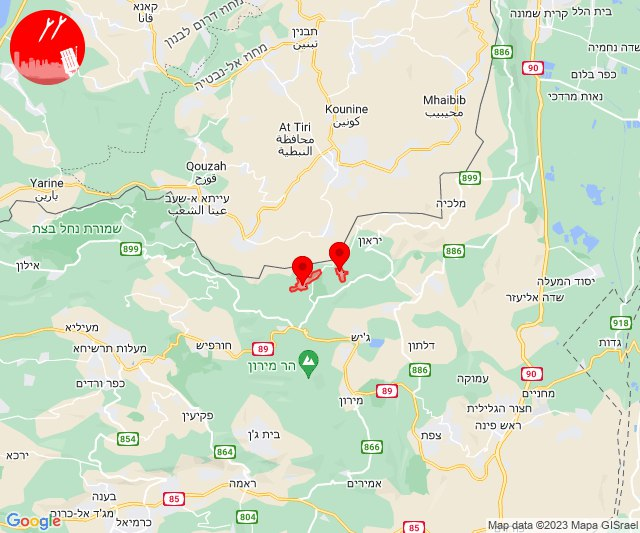
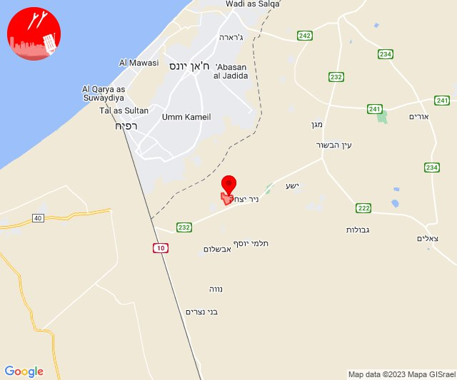
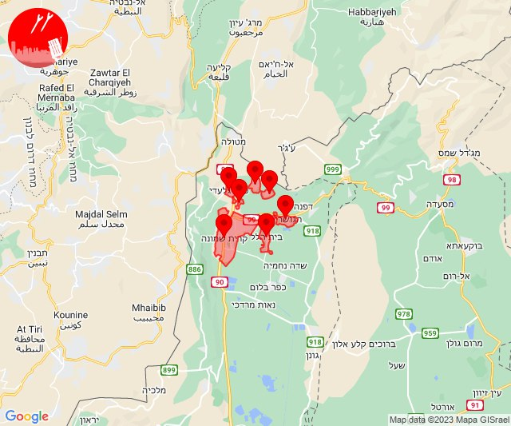
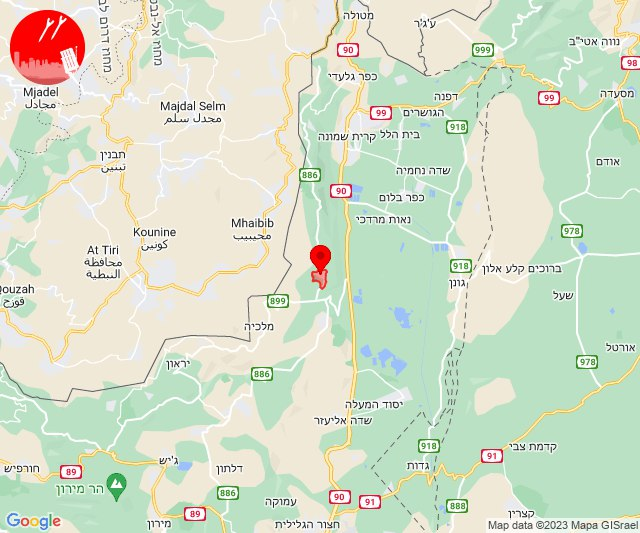

# Alerts for 2023-12-19

## 11:01

🔴 צבע אדום (19/12/2023):

13:01:
• דן: תל אביב - דרום העיר ויפו, בת-ים (דקה וחצי)
• השפלה: ראשון לציון - מערב, ראשון לציון - מזרח, בית דגן, כפר חב''ד, צפריה (דקה וחצי)

צופר - צבע אדום

## 11:01

## 11:02

🔴 צבע אדום (19/12/2023):

13:02:
• השפלה: גאליה, גיבתון, גן שלמה, נצר סרני, פארק תעשיות פלמחים, רחובות, אזור תעשייה נשר - רמלה, אחיסמך, אירוס, באר יעקב, בית חנן, בית עובד, גינתון, גן שורק, ישרש, לוד, מצליח, נטעים, ניר צבי, נס ציונה, עיינות, רמלה, תעשיון צריפין, אחיעזר, גני הדר, זיתן, חמד, יגל, כפר ביל''ו, משמר השבעה, נען, סתריה, קריית עקרון, גנות (דקה, דקה וחצי)
• לכיש: יבנה, כפר הנגיד, פלמחים, גבעת ברנר (דקה, דקה וחצי)
• דן: תל אביב - מזרח, תל אביב - מרכז העיר, אור יהודה, אזור, בני ברק, גבעת שמואל, גבעתיים, חולון, יהוד-מונוסון, מקווה ישראל, סביון, קריית אונו, רמת גן - מזרח, רמת גן - מערב, גני תקווה (דקה וחצי)

צופר - צבע אדום

## 11:02

## 11:34

✈️ חדירת כלי טיס עוין (19/12/2023):

13:34:
• גליל עליון: איילת השחר, גדות, חולתה, יסוד המעלה, משמר הירדן, עמוקה, שדה אליעזר 

צופר - צבע אדום

## 11:34

## 12:29

🔴 צבע אדום (19/12/2023):

14:29:
• קו העימות: בצת, שלומי (מיידי)

צופר - צבע אדום

## 12:29

## 12:35

✈️ חדירת כלי טיס עוין (19/12/2023):

14:34:
• קו העימות: דוב''ב, מתת, סאסא, אביבים, ברעם, יראון 

14:35:
• קו העימות: אזור תעשייה רמת דלתון, ג'ש - גוש חלב, דלתון, כרם בן זמרה, עלמה, ריחאנייה 

צופר - צבע אדום

## 12:35

## 12:35

🔴 צבע אדום (19/12/2023):

14:35:
• קו העימות: ברעם, דוב''ב (מיידי)

צופר - צבע אדום

## 12:35

## 13:23

🔴 צבע אדום (19/12/2023):

15:23:
• עוטף עזה: סופה (15 שניות)

צופר - צבע אדום

## 13:23

## 13:31

✈️ חדירת כלי טיס עוין (19/12/2023):

15:31:
• קו העימות: דישון, יפתח, מלכיה, מרכז אזורי מבואות חרמון, רמות נפתלי 

צופר - צבע אדום

## 13:31

## 13:58

🔴 צבע אדום (19/12/2023):

15:58:
• עוטף עזה: סופה (15 שניות)

צופר - צבע אדום

## 13:58

## 15:17

🔴 צבע אדום (19/12/2023):

17:17:
• קו העימות: קריית שמונה, בית הלל, כפר גלעדי, כפר יובל, תל חי, מעיין ברוך, הגושרים (מיידי)

צופר - צבע אדום

## 15:17

## 19:55

🔴 צבע אדום (19/12/2023):

21:55:
• קו העימות: יפתח (מיידי)

צופר - צבע אדום

## 19:55

