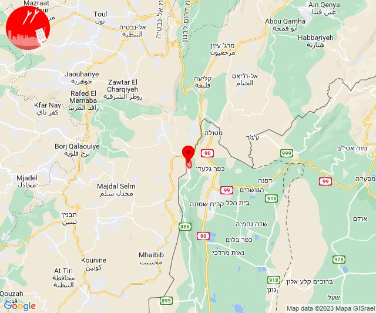
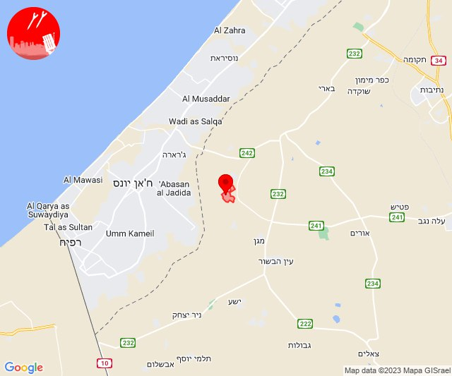
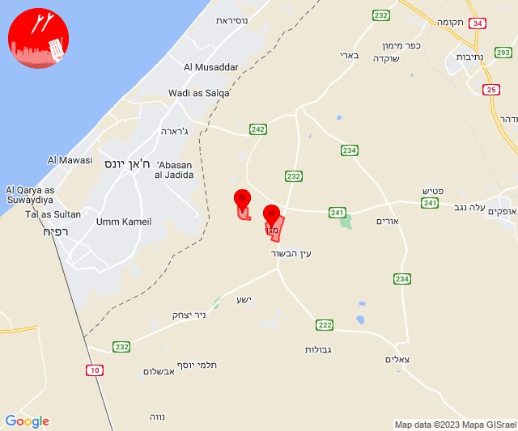
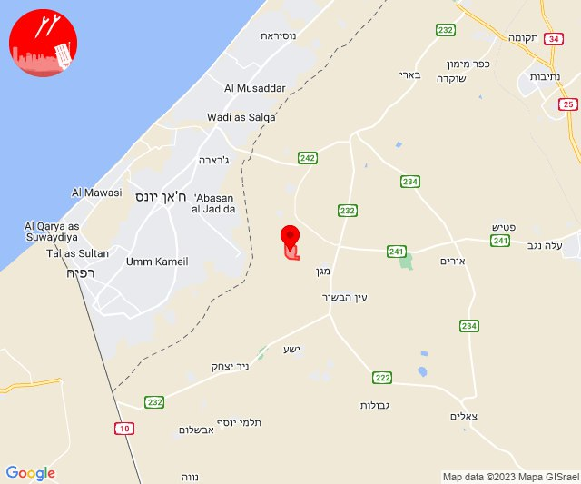
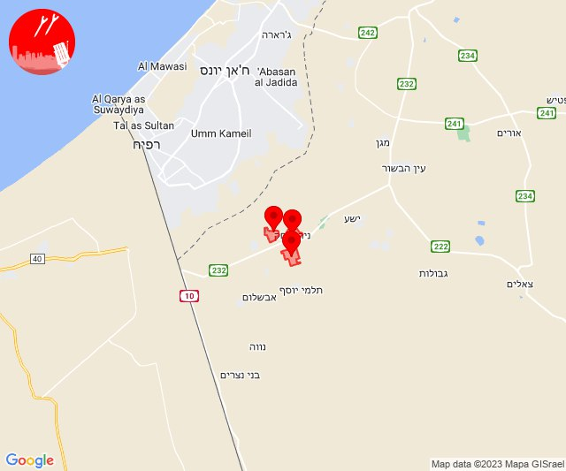
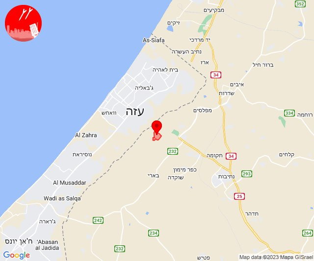
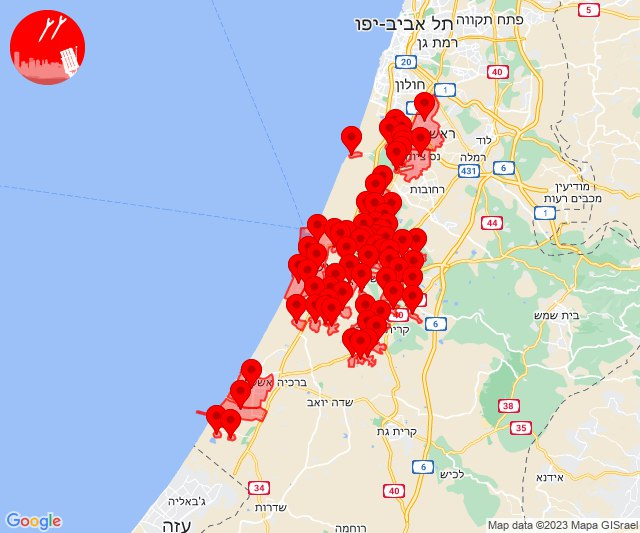
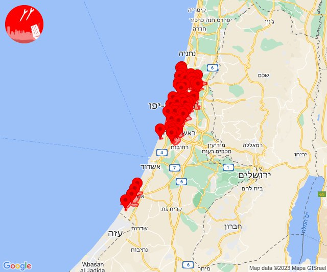
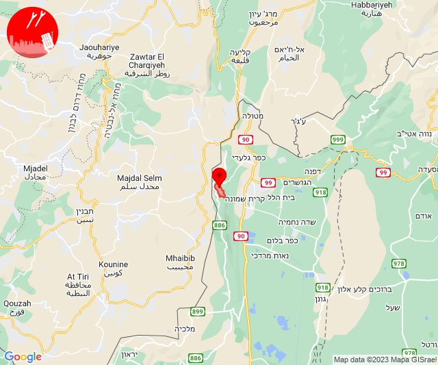
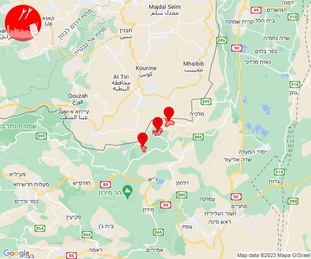

# Alerts for 2023-12-21

## 04:36

🔴 צבע אדום (21/12/2023):

06:36:
• קו העימות: משגב עם (מיידי)

צופר - צבע אדום

## 04:36

## 06:45

🔴 צבע אדום (21/12/2023):

08:45:
• עוטף עזה: נירים (15 שניות)

צופר - צבע אדום

## 06:45

## 08:16

🔴 צבע אדום (21/12/2023):

10:16:
• עוטף עזה: מגן, ניר עוז (15 שניות)

צופר - צבע אדום

## 08:16

## 09:36

🔴 צבע אדום (21/12/2023):

11:36:
• עוטף עזה: ניר עוז (15 שניות)

צופר - צבע אדום

## 09:37

## 09:56

🔴 צבע אדום (21/12/2023):

11:56:
• עוטף עזה: ניר יצחק, סופה, פרי גן (15 שניות)

צופר - צבע אדום

## 09:56

## 10:13

✈️ חדירת כלי טיס עוין (21/12/2023):

12:13:
• קו העימות: דפנה, הגושרים, ע'ג'ר, קיבוץ דן, שאר ישוב, שניר 

צופר - צבע אדום

## 10:13

## 10:58

🔴 צבע אדום (21/12/2023):

12:58:
• קו העימות: ערב אל עראמשה (מיידי)

צופר - צבע אדום

## 10:58

## 11:17

🔴 צבע אדום (21/12/2023):

13:17:
• עוטף עזה: נחל עוז (15 שניות)

צופר - צבע אדום

## 11:17

## 11:27

🔴 צבע אדום (21/12/2023):

13:26:
• מערב לכיש: אזור תעשייה הדרומי אשקלון, אשקלון - דרום (30 שניות)
• לכיש: גבעת וושינגטון, משגב דב, שדמה, גדרה, קדרון, אשדוד - יא,יב,טו,יז,מרינה,סיטי, אזור תעשייה עד הלום, שדה עוזיהו, שתולים, נווה מבטח, ניר גלים, בית גמליאל, בניה, כפר מרדכי, מישר, עשרת, אשדוד - א,ב,ד,ה, אשדוד - אזור תעשייה צפוני ונמל, אשדוד - ג,ו,ז, אשדוד - ח,ט,י,יג,יד,טז, יבנה, בן זכאי, מעון צופיה, בני דרום, ביצרון, גן הדרום, גן יבנה, כפר אביב, כרם ביבנה, מתחם בני דרום, קבוצת יבנה, כפר הנגיד, פלמחים (דקה, 45 שניות, דקה וחצי)
• עוטף עזה: זיקים, כרמיה (15 שניות)
• השפלה: פארק תעשיות פלמחים, ראשון לציון - מזרח, אירוס, בית חנן, בית עובד, גן שורק, נטעים, נס ציונה, עיינות (דקה וחצי)

13:27:
• לכיש: אמונים, בית עזרא, גבעתי, עזר, עזריקם, חצור, בני ראם, גני טל, כפר הרי''ף וצומת ראם, תלמי יחיאל, אזור תעשייה כנות, בני עי''ש, חצב, כנות, פארק תעשייה ראם, אביגדור, באר טוביה, כפר ורבורג, קריית מלאכי, מרכז שפירא, עין צורים, שפיר (45 שניות, דקה)
• מערב לכיש: ניצן (45 שניות)

צופר - צבע אדום

## 11:27

## 11:31

🔴 צבע אדום (21/12/2023):

13:30:
• דן: תל אביב - דרום העיר ויפו, בת-ים, בני ברק, גבעת שמואל, פתח תקווה, קריית אונו, רמת גן - מזרח, רמת גן - מערב, תל אביב - מרכז העיר, חולון, אזור, תל אביב - מזרח, אור יהודה, גבעתיים, גני תקווה, תל אביב - עבר הירקון, הרצליה - מערב, רמת השרון, הרצליה - מרכז וגליל ים, כפר שמריהו (דקה וחצי)
• מערב לכיש: אזור תעשייה הדרומי אשקלון, אשקלון - דרום, אשקלון - צפון (30 שניות)
• השפלה: פארק תעשיות פלמחים, ראשון לציון - מערב, ראשון לציון - מזרח, בית דגן, חמד, משמר השבעה, גנות (דקה וחצי)
• שרון: גבעת חן, הוד השרון, ירקונה, רעננה, גני עם, כפר מל''ל, כפר סבא, עדנים, רמות השבים, ארסוף, רשפון, שפיים (דקה וחצי)

13:31:
• עוטף עזה: זיקים (15 שניות)
• לכיש: פלמחים (דקה וחצי)
• השפלה: אירוס, בית חנן, בית עובד, גן שורק, נטעים, עיינות, נס ציונה (דקה וחצי)
• דן: מקווה ישראל, סינמה סיטי גלילות, מתחם פי גלילות (דקה וחצי)

צופר - צבע אדום

## 11:31

## 13:30

🔴 צבע אדום (21/12/2023):

15:30:
• קו העימות: מרגליות (מיידי)

צופר - צבע אדום

## 13:30

## 18:38

✈️ חדירת כלי טיס עוין (21/12/2023):

20:38:
• קו העימות: אביבים, ברעם, יראון 

צופר - צבע אדום

## 18:38

