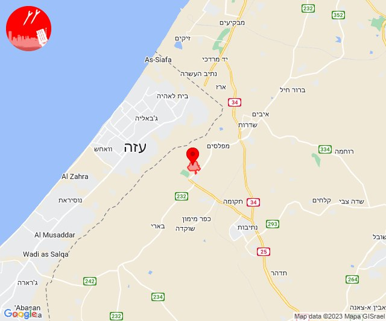
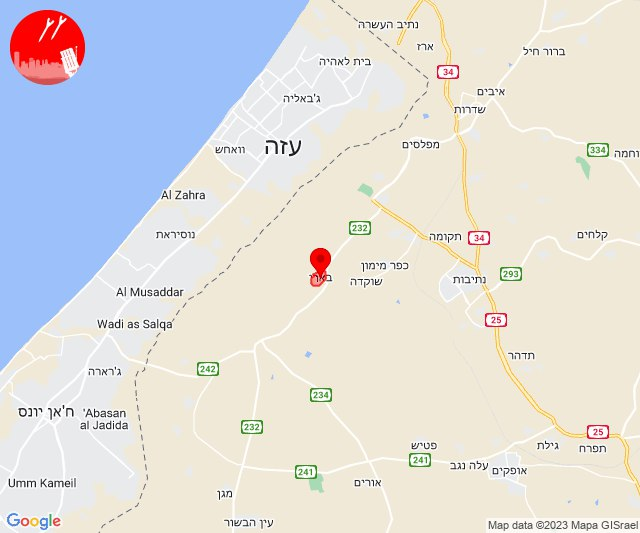
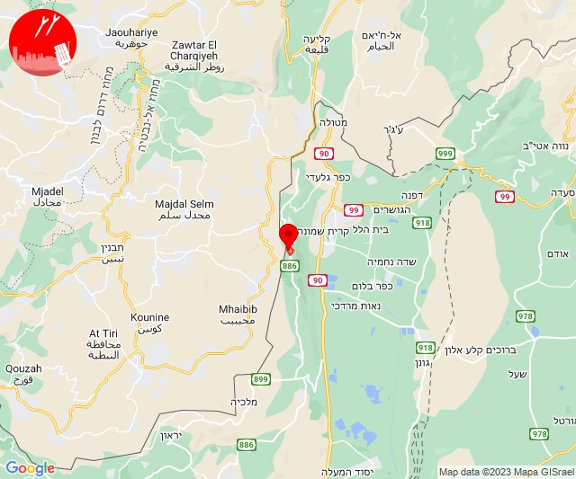
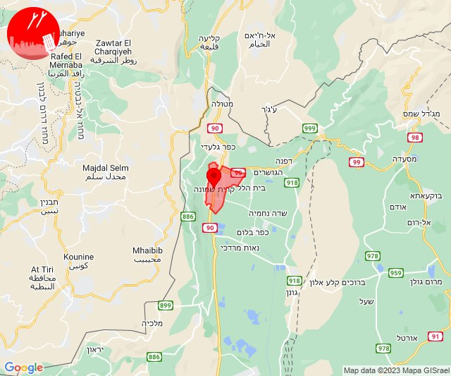
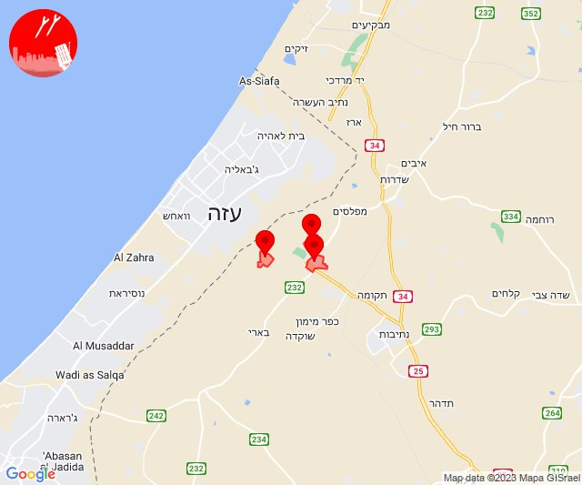
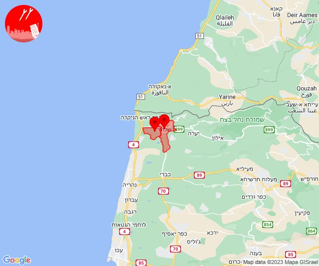
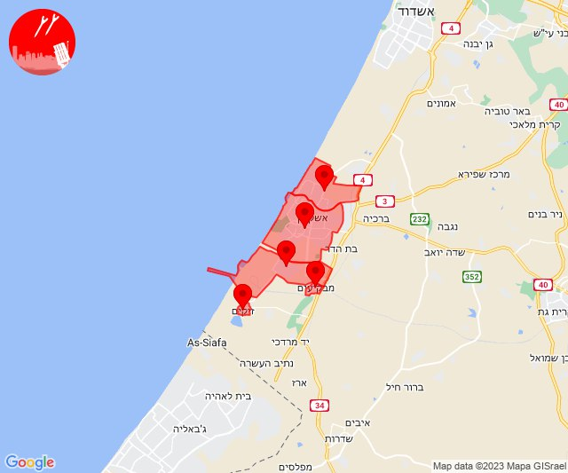

# Alerts for 2023-12-23

## 10:48

🔴 צבע אדום (23/12/2023):

12:48:
• עוטף עזה: כפר עזה (15 שניות)

צופר - צבע אדום

## 10:48

## 11:15

🔴 צבע אדום (23/12/2023):

13:15:
• עוטף עזה: בארי (15 שניות)

צופר - צבע אדום

## 11:15

## 12:39

✈️ חדירת כלי טיס עוין (23/12/2023):

14:39:
• קו העימות: יפתח, רמות נפתלי, מרכז אזורי מבואות חרמון, מלכיה, דישון 

צופר - צבע אדום

## 12:39

## 13:25

🔴 צבע אדום (23/12/2023):

15:25:
• קו העימות: מנרה (מיידי)

צופר - צבע אדום

## 13:25

## 13:30

🔴 צבע אדום (23/12/2023):

15:30:
• קו העימות: קריית שמונה (מיידי)

צופר - צבע אדום

## 13:30

## 14:21

🔴 צבע אדום (23/12/2023):

16:21:
• עוטף עזה: נחל עוז, כפר עזה, סעד (15 שניות)

צופר - צבע אדום

## 14:21

## 14:37

🔴 צבע אדום (23/12/2023):

16:37:
• קו העימות: בצת, שלומי (מיידי)

צופר - צבע אדום

## 14:37

## 16:01

🔴 צבע אדום (23/12/2023):

18:01:
• עוטף עזה: זיקים (15 שניות)
• מערב לכיש: אשקלון - דרום, אזור תעשייה הדרומי אשקלון, מבקיעים, אשקלון - צפון (30 שניות)

צופר - צבע אדום

## 16:01

