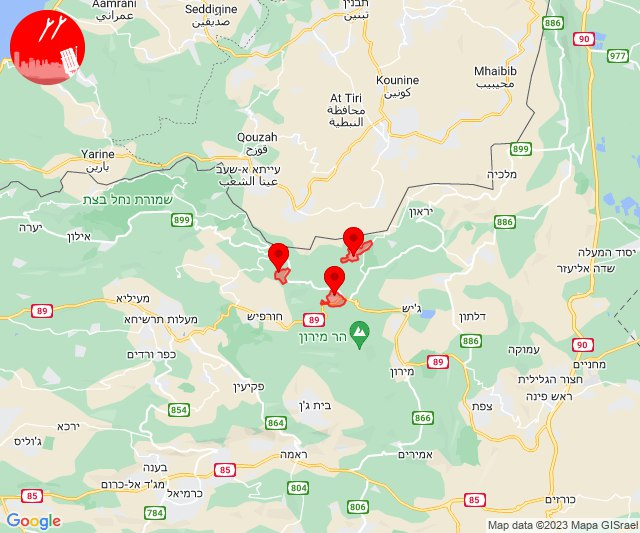
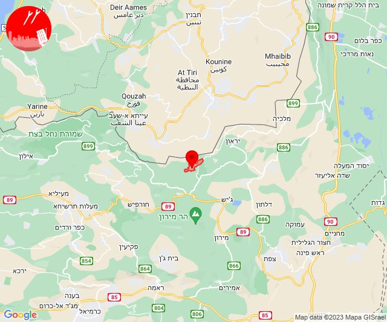
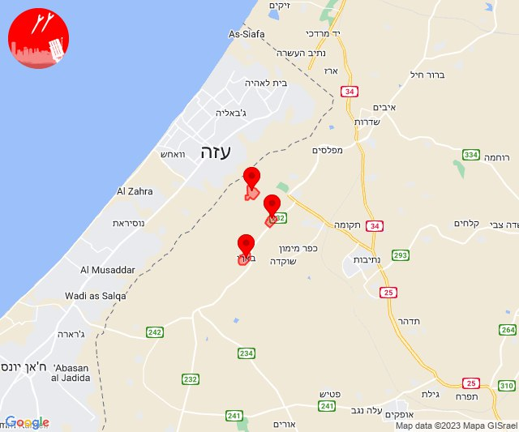
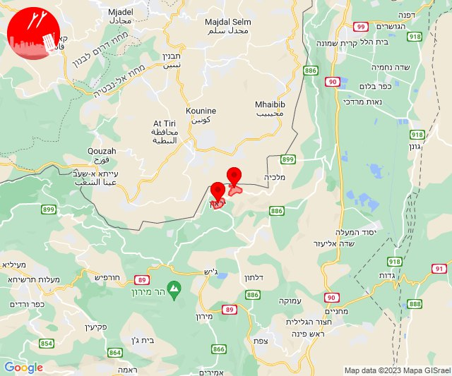
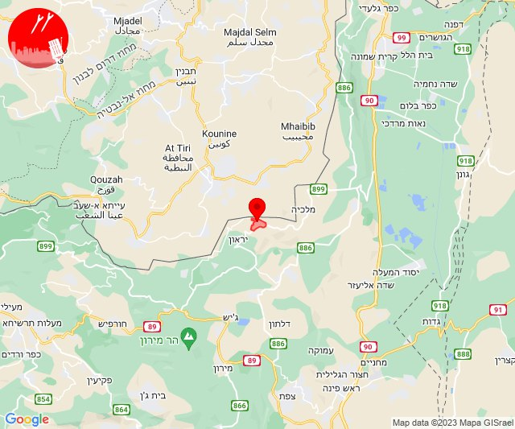
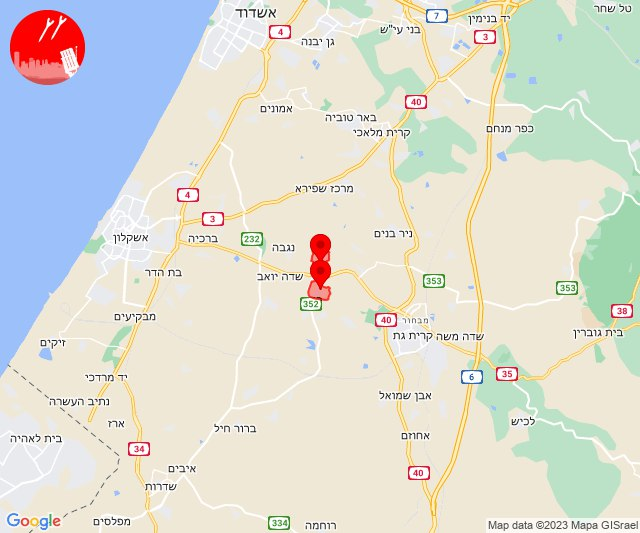
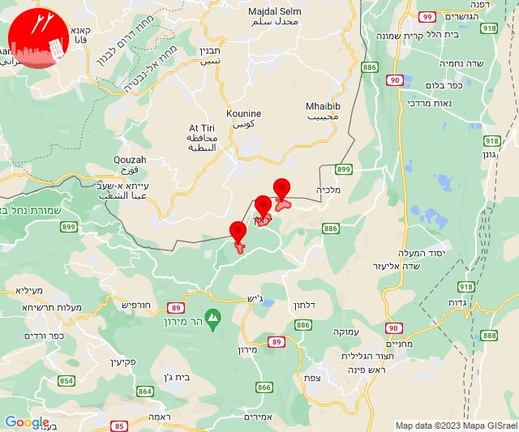
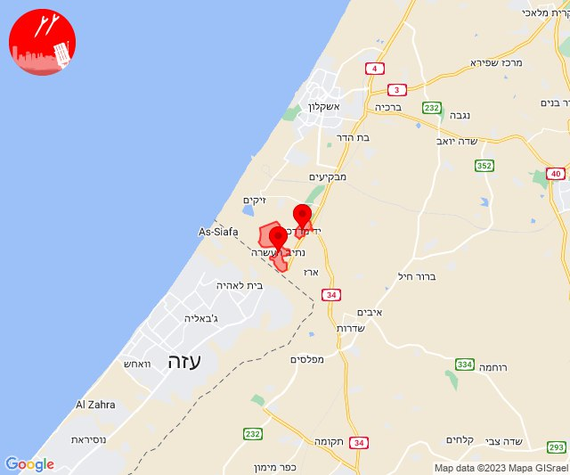

# Alerts for 2023-12-24

## 00:44

✈️ חדירת כלי טיס עוין (24/12/2023):

02:44:
• קו העימות: דוב''ב, מתת, סאסא 

צופר - צבע אדום

## 00:44

## 00:45

🔴 צבע אדום (24/12/2023):

02:45:
• קו העימות: דוב''ב (מיידי)

צופר - צבע אדום

## 00:45

## 08:20

🔴 צבע אדום (24/12/2023):

10:20:
• קו העימות: שלומי (מיידי)

צופר - צבע אדום

## 08:20

## 08:47

🔴 צבע אדום (24/12/2023):

10:46:
• עוטף עזה: בארי (15 שניות)

10:47:
• עוטף עזה: עלומים, נחל עוז (15 שניות)

צופר - צבע אדום

## 08:47

## 10:34

🔴 צבע אדום (24/12/2023):

12:34:
• קו העימות: אביבים, יראון (מיידי)

צופר - צבע אדום

## 10:34

## 10:38

🔴 צבע אדום (24/12/2023):

12:38:
• קו העימות: אביבים, יראון (מיידי)

צופר - צבע אדום

## 10:38

## 11:00

🔴 צבע אדום (24/12/2023):

13:00:
• קו העימות: אביבים (מיידי)

צופר - צבע אדום

## 11:00

## 13:12

🔴 צבע אדום (24/12/2023):

15:12:
• קו העימות: ערב אל עראמשה (מיידי)

צופר - צבע אדום

## 13:12

## 13:28

🔴 צבע אדום (24/12/2023):

15:28:
• קו העימות: מרגליות (מיידי)

צופר - צבע אדום

## 13:28

## 13:39

🔴 צבע אדום (24/12/2023):

15:39:
• לכיש: יד נתן, עוצם (30 שניות)

צופר - צבע אדום

## 13:39

## 14:56

🔴 צבע אדום (24/12/2023):

16:56:
• קו העימות: אביבים, ברעם, יראון (מיידי)

צופר - צבע אדום

## 14:56

## 16:17

🔴 צבע אדום (24/12/2023):

18:16:
• עוטף עזה: נתיב העשרה (15 שניות)

18:17:
• עוטף עזה: יד מרדכי (15 שניות)

צופר - צבע אדום

## 16:17

