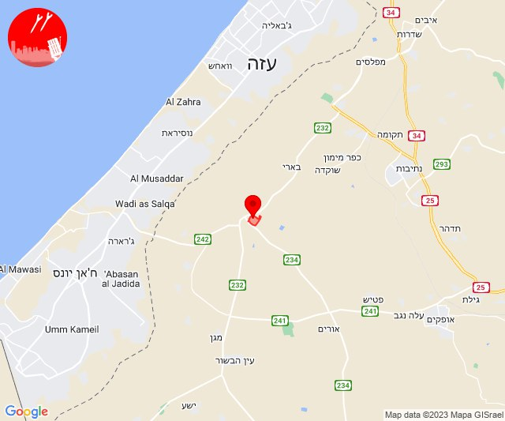
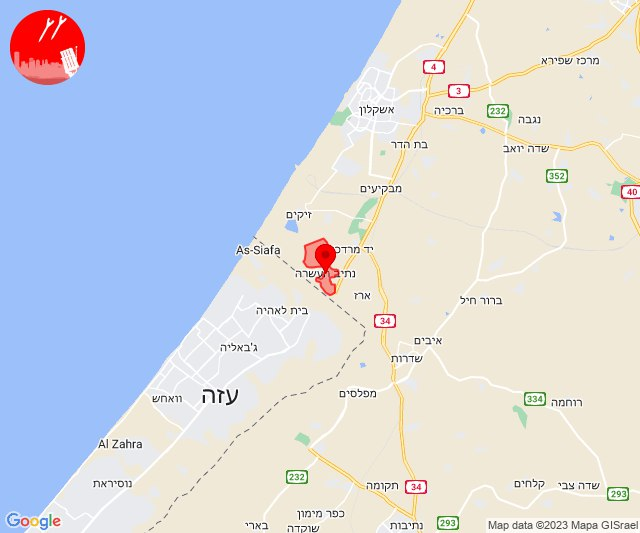
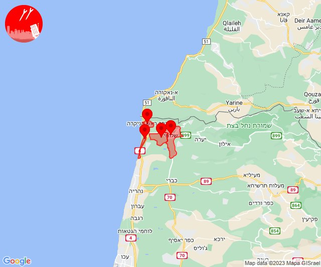
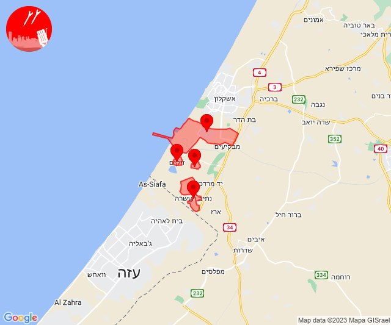
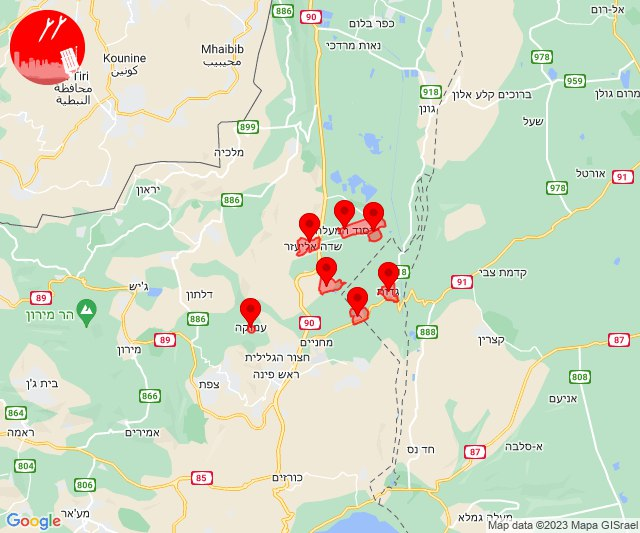
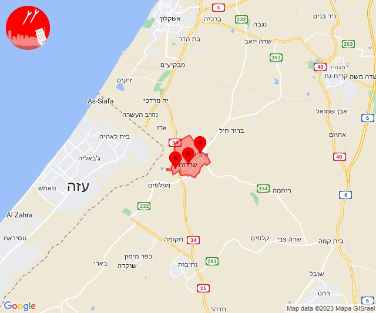
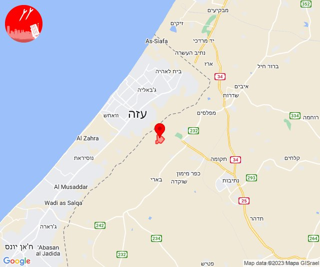

# Alerts for 2023-12-25

## 09:08

🔴 צבע אדום (25/12/2023):

11:08:
• עוטף עזה: רעים (15 שניות)

צופר - צבע אדום

## 09:08

## 09:17

🔴 צבע אדום (25/12/2023):

11:17:
• עוטף עזה: נתיב העשרה (15 שניות)

צופר - צבע אדום

## 09:17

## 09:32

🔴 צבע אדום (25/12/2023):

11:32:
• עוטף עזה: נתיב העשרה (15 שניות)

צופר - צבע אדום

## 09:32

## 14:11

🔴 צבע אדום (25/12/2023):

16:10:
• קו העימות: ראש הנקרה (מיידי)

16:11:
• קו העימות: אזור תעשייה אכזיב מילואות, בצת, שלומי (מיידי)

צופר - צבע אדום

## 14:11

## 19:02

🔴 צבע אדום (25/12/2023):

21:02:
• מערב לכיש: אזור תעשייה הדרומי אשקלון (30 שניות)
• עוטף עזה: נתיב העשרה, זיקים, כרמיה (15 שניות)

צופר - צבע אדום

## 19:02

## 19:45

✈️ חדירת כלי טיס עוין (25/12/2023):

21:45:
• גליל עליון: איילת השחר, גדות, חולתה, יסוד המעלה, משמר הירדן, עמוקה, שדה אליעזר 

צופר - צבע אדום

## 19:45

## 23:04

🔴 צבע אדום (26/12/2023):

01:04:
• עוטף עזה: שדרות, איבים, ניר עם (15 שניות)

צופר - צבע אדום

## 23:04

## 23:33

🔴 צבע אדום (26/12/2023):

01:33:
• עוטף עזה: נחל עוז (15 שניות)

צופר - צבע אדום

## 23:33

