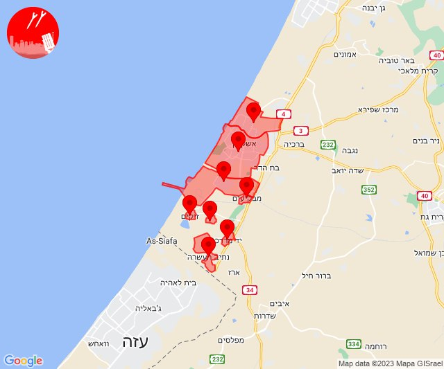
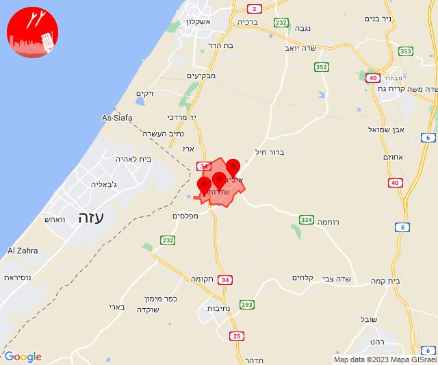
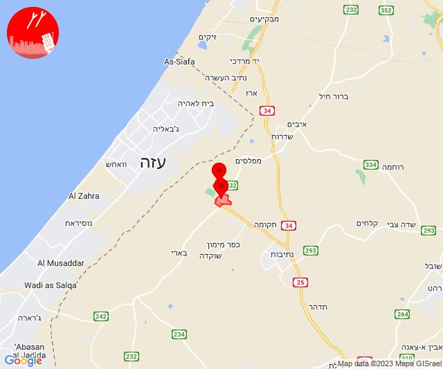

# Alerts for 2023-12-26

## 12:11

🔴 צבע אדום (26/12/2023):

14:10:
• מערב לכיש: אשקלון - דרום, אזור תעשייה הדרומי אשקלון, מבקיעים (30 שניות)

14:11:
• עוטף עזה: יד מרדכי, זיקים, כרמיה, נתיב העשרה (15 שניות)
• מערב לכיש: אשקלון - צפון (30 שניות)

צופר - צבע אדום

## 12:11

## 12:24

🔴 צבע אדום (26/12/2023):

14:24:
• עוטף עזה: שדרות, איבים, ניר עם (15 שניות)

צופר - צבע אדום

## 12:24

## 13:53

🔴 צבע אדום (26/12/2023):

15:52:
• עוטף עזה: כפר עזה (15 שניות)

15:53:
• עוטף עזה: סעד (15 שניות)

צופר - צבע אדום

## 13:53

