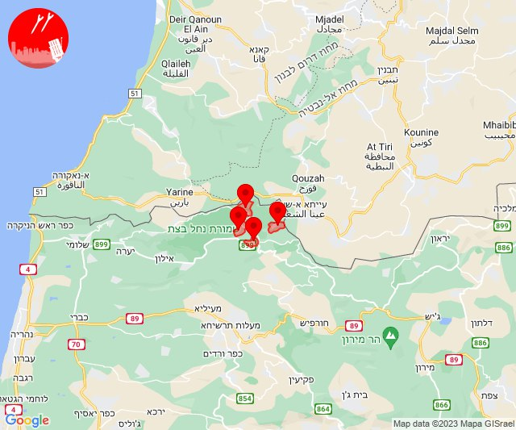
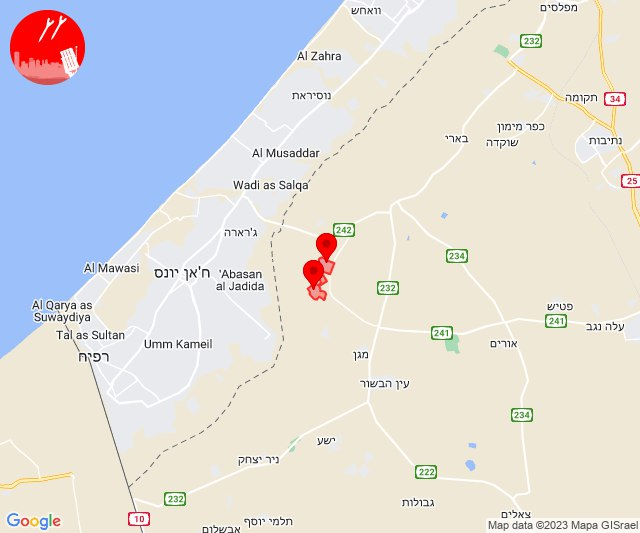
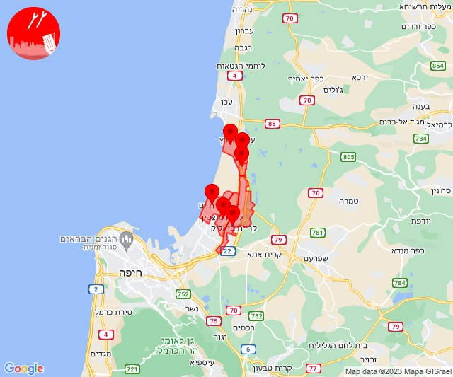
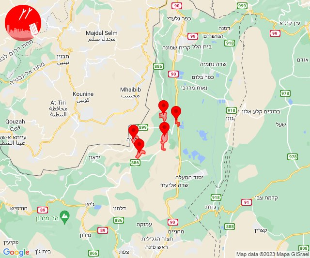
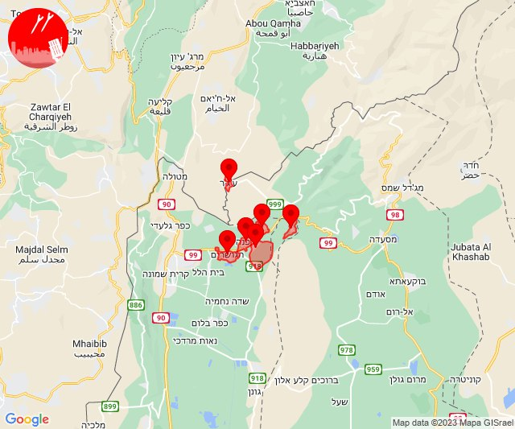
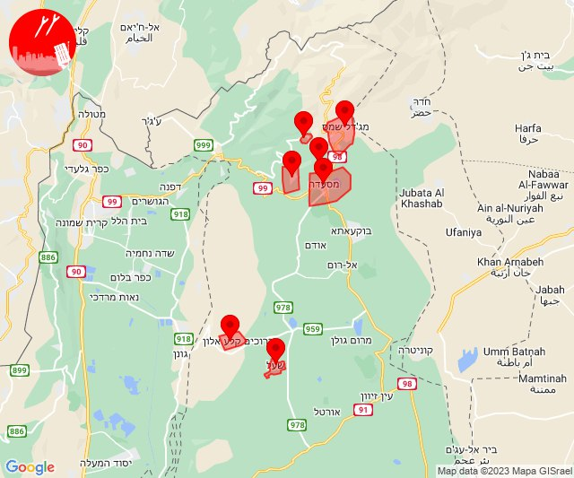
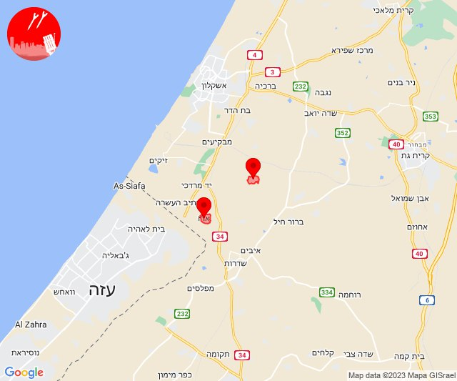
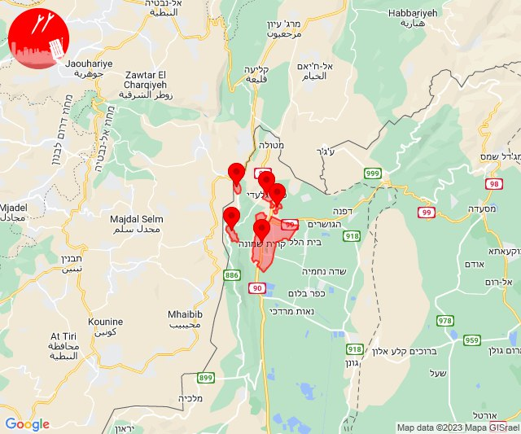
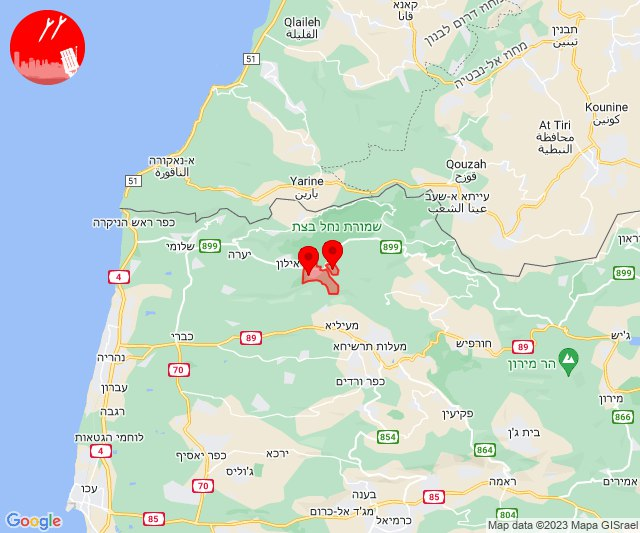

# Alerts for 2023-12-28

## 07:17

✈️ חדירת כלי טיס עוין (28/12/2023):

09:17:
• קו העימות: אבן מנחם, זרעית, שומרה, שתולה 

צופר - צבע אדום

## 07:17

## 10:18

🔴 צבע אדום (28/12/2023):

12:18:
• עוטף עזה: נירים, עין השלושה (15 שניות)

צופר - צבע אדום

## 10:18

## 11:30

🔴 צבע אדום (28/12/2023):

13:30:
• גליל עליון: אזור תעשייה שער נעמן, כפר מסריק, עכו - אזור תעשייה (דקה, 30 שניות)
• המפרץ: קריית ביאליק, קריית מוצקין, קריית ים (דקה)

צופר - צבע אדום

## 11:30

## 12:05

✈️ חדירת כלי טיס עוין (28/12/2023):

14:05:
• קו העימות: דישון, יפתח, מלכיה, מרכז אזורי מבואות חרמון, רמות נפתלי 

צופר - צבע אדום

## 12:05

## 12:08

✈️ חדירת כלי טיס עוין (28/12/2023):

14:08:
• קו העימות: הגושרים, ע'ג'ר, דפנה, קיבוץ דן, שניר, שאר ישוב 

צופר - צבע אדום

## 12:08

## 13:32

✈️ חדירת כלי טיס עוין (28/12/2023):

15:32:
• צפון הגולן: מג'דל שמס, מסעדה, נווה אטי''ב, נמרוד, עין קנייא, קלע, שעל 

צופר - צבע אדום

## 13:32

## 13:38

🔴 צבע אדום (28/12/2023):

15:37:
• עוטף עזה: ארז (15 שניות)

15:38:
• עוטף עזה: גברעם (15 שניות)

צופר - צבע אדום

## 13:38

## 14:00

🔴 צבע אדום (28/12/2023):

16:00:
• קו העימות: כפר גלעדי, מרגליות, תל חי, קריית שמונה, משגב עם (מיידי)

צופר - צבע אדום

## 14:00

## 14:14

🔴 צבע אדום (28/12/2023):

16:14:
• קו העימות: ערב אל עראמשה (מיידי)

צופר - צבע אדום

## 14:14

## 14:29

🔴 צבע אדום (28/12/2023):

16:29:
• קו העימות: גורנות הגליל, גורן (מיידי)

צופר - צבע אדום

## 14:29

## 15:24

🔴 צבע אדום (28/12/2023):

17:24:
• מערב לכיש: אזור תעשייה הדרומי אשקלון (30 שניות)

צופר - צבע אדום

## 15:24

