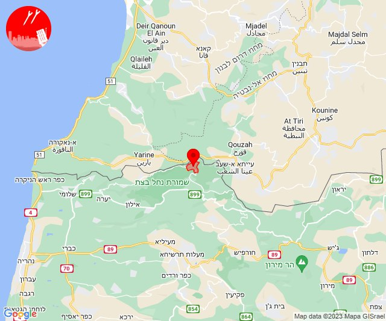
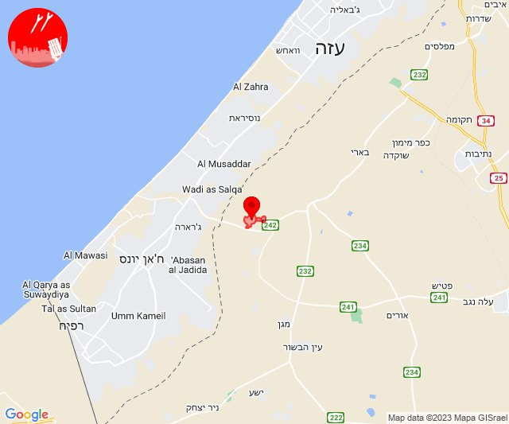
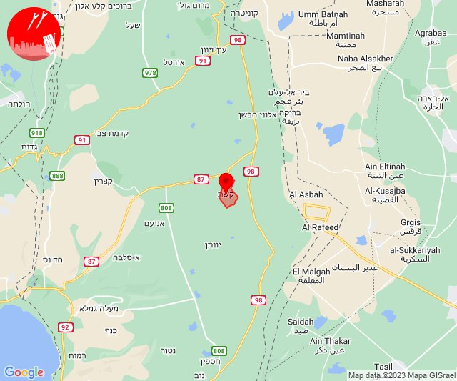
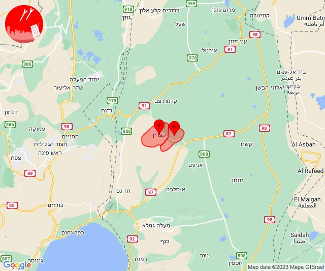
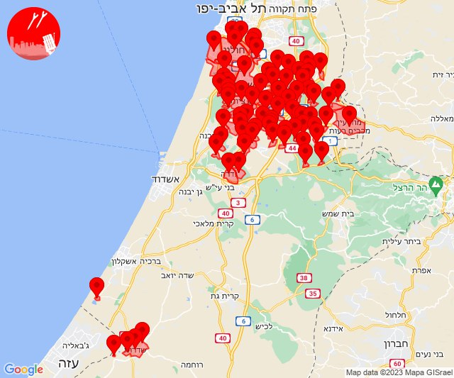

# Alerts for 2023-12-31

## 09:27

🔴 צבע אדום (31/12/2023):

11:27:
• קו העימות: זרעית (מיידי)

צופר - צבע אדום

## 09:27

## 10:27

🔴 צבע אדום (31/12/2023):

12:27:
• עוטף עזה: כיסופים (15 שניות)

צופר - צבע אדום

## 10:27

## 18:05

✈️ חדירת כלי טיס עוין (31/12/2023):

20:05:
• דרום הגולן: קשת 

צופר - צבע אדום

## 18:05

## 18:14

✈️ חדירת כלי טיס עוין (31/12/2023):

20:14:
• דרום הגולן: קצרין - אזור תעשייה, קצרין 

צופר - צבע אדום

## 18:14

## 22:02

🔴 צבע אדום (31/12/2023-01/01/2024):

23:59:
• עוטף עזה: שדרות, איבים, ניר עם (15 שניות)

00:00:
• עוטף עזה: מטווח ניר עם (15 שניות)
• השפלה: גיבתון, נצר סרני, רחובות, באר יעקב, ישרש, נס ציונה (דקה וחצי)

00:01:
• השפלה: מצליח, גני הדר, יציץ, נען, פתחיה, רמות מאיר, ראשון לציון - מזרח, תעשיון צריפין, כפר ביל''ו, סתריה, קריית עקרון, רמלה, לוד, ניר צבי, פארק תעשיות פלמחים, ראשון לציון - מערב, גן שורק, נטעים, בית דגן, משמר השבעה, גנות, כפר בן נון, אזור תעשייה נשר - רמלה, אחיסמך, בן שמן, גינתון, כפר נוער בן שמן, אחיעזר, בית חשמונאי, בית עוזיאל, גזר, זיתן, יד רמב''ם, כפר שמואל, משמר איילון, עזריה, פדיה, כרמי יוסף (דקה וחצי)
• לכיש: גבעת ברנר (דקה וחצי)
• דן: חולון, אזור, בת-ים, מקווה ישראל (דקה וחצי)
• שפלת יהודה: נחשון, בקוע (דקה וחצי)
• ירקון: גמזו, כפר דניאל, מבוא מודיעים, מודיעין - ליגד סנטר, מודיעין, בית נחמיה, חדיד, כפר טרומן, מודיעין - ישפרו סנטר (דקה וחצי)
• עוטף עזה: זיקים (15 שניות)

00:02:
• השפלה: אירוס, בית חנן, בית עובד, גן שלמה, גאליה (דקה וחצי, דקה)
• לכיש: בית אלעזרי, בית גמליאל, בניה, גדרה, קדרון (דקה)

צופר - צבע אדום

## 22:02

