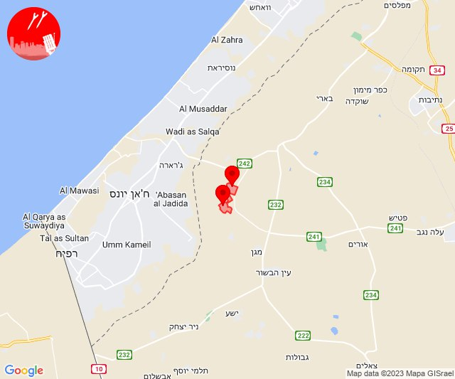
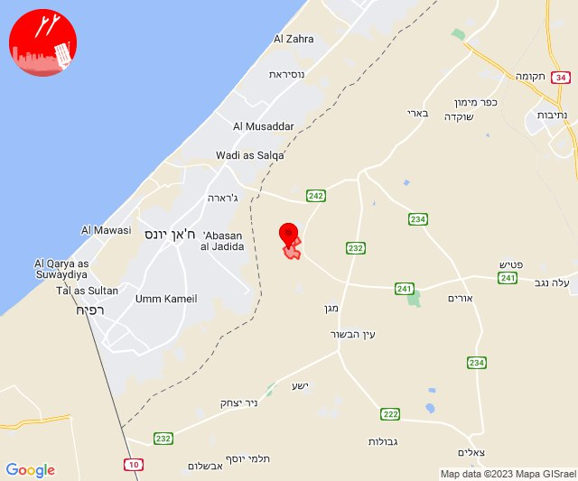

# Alerts for 2023-11-01

## 09:01

🔴 צבע אדום (01/11/2023):

11:00:
• מערב לכיש: אזור תעשייה הדרומי אשקלון, אשקלון - דרום, אשקלון - צפון, ניצן (30 שניות, 45 שניות)
• לכיש: אשדוד - א,ב,ד,ה, אשדוד - אזור תעשייה צפוני ונמל, אשדוד - יא,יב,טו,יז,מרינה,סיטי, אשדוד - ג,ו,ז, אשדוד - ח,ט,י,יג,יד,טז, שתולים, ביצרון, מישר, משגב דב, נווה מבטח (45 שניות, דקה)
• עוטף עזה: זיקים (15 שניות)

11:01:
• לכיש: גן יבנה, בני דרום, ניר גלים, יבנה, בן זכאי, כפר אביב, מעון צופיה, אזור תעשייה עד הלום, בית עזרא, חצור, אמונים, גבעתי, עזריקם, שדה עוזיהו, עזר, גן הדרום, מתחם בני דרום (45 שניות, דקה)

צופר - צבע אדום

## 09:01

## 09:36

🔴 צבע אדום (01/11/2023):

11:36:
• עוטף עזה: חולית, סופה (15 שניות)

צופר - צבע אדום

## 09:36

## 12:01

🔴 צבע אדום (01/11/2023):

14:01:
• עוטף עזה: נירים, עין השלושה (15 שניות)

צופר - צבע אדום

## 12:01

## 12:16

🔴 צבע אדום (01/11/2023):

14:16:
• עוטף עזה: נירים (15 שניות)

צופר - צבע אדום

## 12:16

## 12:24

🔴 צבע אדום (01/11/2023):

14:24:
• מערב לכיש: אזור תעשייה הדרומי אשקלון (30 שניות)
• עוטף עזה: זיקים, כרמיה, נתיב העשרה (15 שניות)

צופר - צבע אדום

## 12:24

## 13:31

🔴 צבע אדום (01/11/2023):

15:31:
• קו העימות: שתולה (מיידי)

צופר - צבע אדום

## 13:31

## 13:35

🔴 צבע אדום (01/11/2023):

15:35:
• עוטף עזה: נתיב העשרה (15 שניות)

צופר - צבע אדום

## 13:35

## 14:02

🔴 צבע אדום (01/11/2023):

16:01:
• לכיש: פלמחים, אשדוד - אזור תעשייה צפוני ונמל (דקה וחצי, 45 שניות)
• דן: בת-ים, חולון, תל אביב - דרום העיר ויפו, תל אביב - מזרח, תל אביב - מרכז העיר, תל אביב - עבר הירקון, גבעתיים, רמת גן - מערב (דקה וחצי)
• השפלה: ראשון לציון - מערב, ראשון לציון - מזרח, בית דגן (דקה וחצי)

16:02:
• השפלה: אירוס, בית חנן, בית עובד, נטעים, נס ציונה (דקה וחצי)
• דן: אזור, מקווה ישראל (דקה וחצי)

צופר - צבע אדום

## 14:02

## 14:29

🔴 צבע אדום (01/11/2023):

16:28:
• עוטף עזה: מבטחים, עמיעוז, ישע (15 שניות)

16:29:
• עוטף עזה: שדה ניצן (15 שניות)

צופר - צבע אדום

## 14:29

## 15:41

🔴 צבע אדום (01/11/2023):

17:41:
• עוטף עזה: נירים, עין השלושה (15 שניות)

צופר - צבע אדום

## 15:41

## 17:24

🔴 צבע אדום (01/11/2023):

19:24:
• מערב לכיש: אזור תעשייה הדרומי אשקלון (30 שניות)

צופר - צבע אדום

## 17:24

## 17:47

🔴 צבע אדום (01/11/2023):

19:47:
• עוטף עזה: ניר עוז, נירים (15 שניות)

צופר - צבע אדום

## 17:47

