# Alerts for 2023-11-02

## 04:09

🔴 צבע אדום (02/11/2023):

06:09:
• עוטף עזה: כיסופים (15 שניות)

צופר - צבע אדום

## 04:09

## 04:40

🔴 צבע אדום (02/11/2023):

06:40:
• עוטף עזה: מבטחים, עמיעוז, ישע (15 שניות)

צופר - צבע אדום

## 04:40

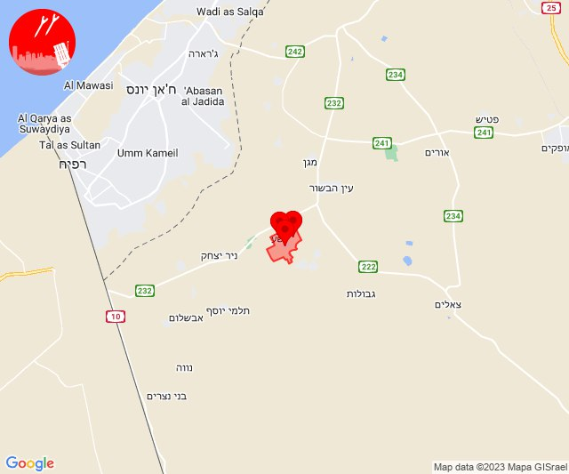

## 07:50

🔴 צבע אדום (02/11/2023):

09:50:
• לכיש: אשדוד - ח,ט,י,יג,יד,טז, אשדוד - יא,יב,טו,יז,מרינה,סיטי (45 שניות)
• מערב לכיש: ניצן (45 שניות)

צופר - צבע אדום

## 07:50

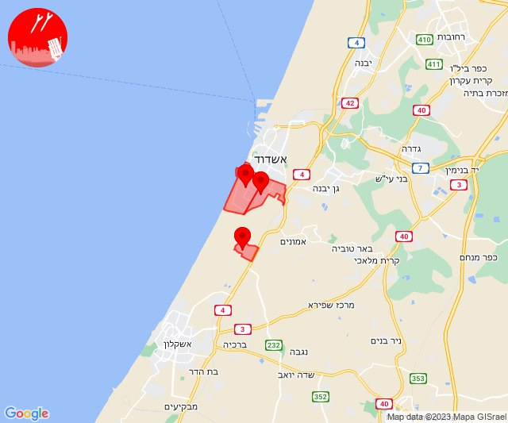

## 08:41

🔴 צבע אדום (02/11/2023):

10:41:
• עוטף עזה: נירים (15 שניות)

צופר - צבע אדום

## 08:41

## 09:00

🔴 צבע אדום (02/11/2023):

11:00:
• עוטף עזה: חולית (15 שניות)

צופר - צבע אדום

## 09:00

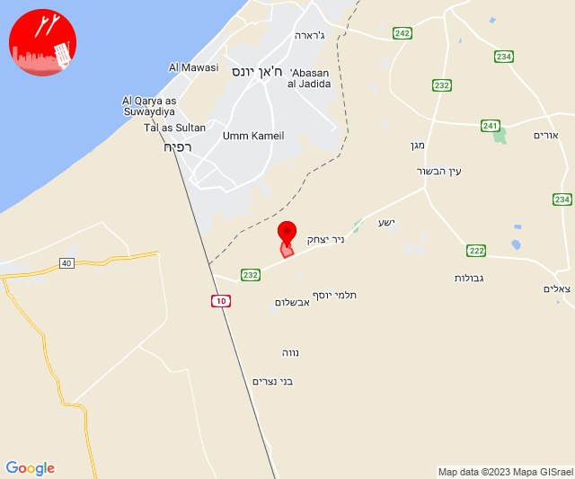

## 09:04

🔴 צבע אדום (02/11/2023):

11:04:
• עוטף עזה: מבטחים, עמיעוז, ישע (15 שניות)

צופר - צבע אדום

## 09:04

## 10:12

🔴 צבע אדום (02/11/2023):

12:12:
• עוטף עזה: סעד (15 שניות)
• מערב לכיש: גיאה, מבקיעים (30 שניות)

צופר - צבע אדום

## 10:12

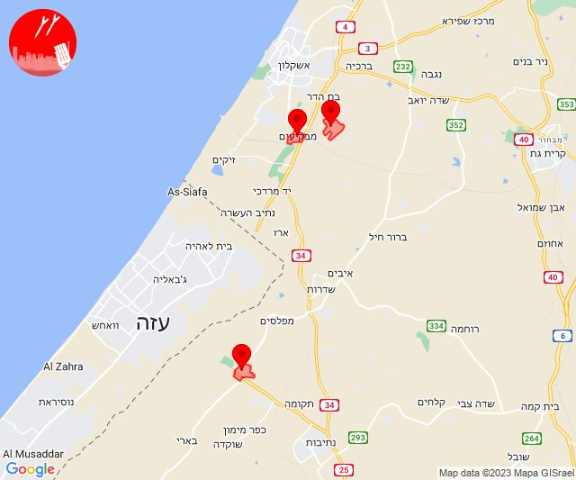

## 10:56

🔴 צבע אדום (02/11/2023):

12:56:
• עוטף עזה: נירים (15 שניות)

צופר - צבע אדום

## 10:56

## 13:01

🔴 צבע אדום (02/11/2023):

15:00:
• מרכז הנגב: באר שבע - דרום (דקה)

15:01:
• מרכז הנגב: באר שבע - מזרח, באר שבע - מערב, באר שבע - צפון, חצרים (דקה)

צופר - צבע אדום

## 13:01

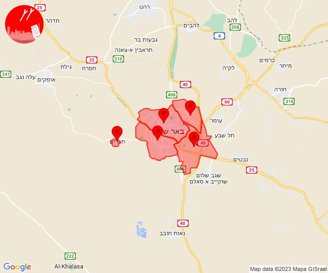

## 13:32

🔴 צבע אדום (02/11/2023):

15:30:
• קו העימות: ערב אל עראמשה (מיידי)

15:31:
• קו העימות: אדמית (מיידי)

15:32:
• קו העימות: משגב עם, אביבים (מיידי)

צופר - צבע אדום

## 13:32

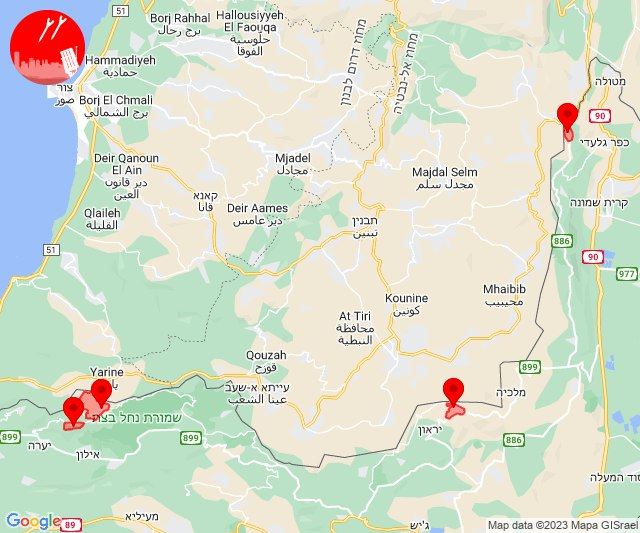

## 13:35

🔴 צבע אדום (02/11/2023):

15:35:
• קו העימות: ערב אל עראמשה, מרגליות (מיידי)

צופר - צבע אדום

## 13:35

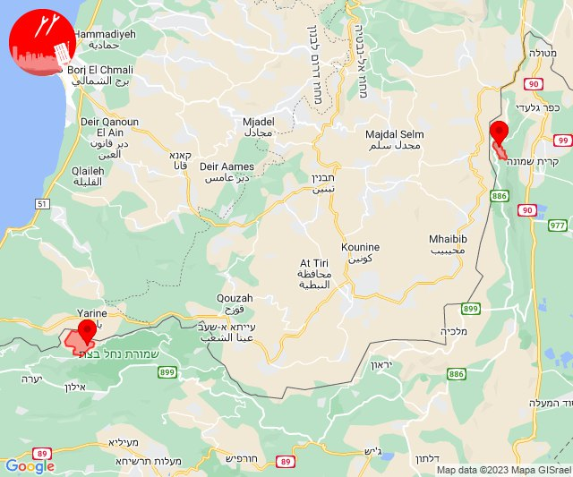

## 14:02

🔴 צבע אדום (02/11/2023):

16:00:
• מרכז הנגב: שגב שלום והפזורה (דקה וחצי)

16:01:
• מרכז הנגב: באר שבע - דרום, באר שבע - מערב, באר שבע - מזרח (דקה)

16:02:
• מרכז הנגב: חצרים (דקה)

צופר - צבע אדום

## 14:02

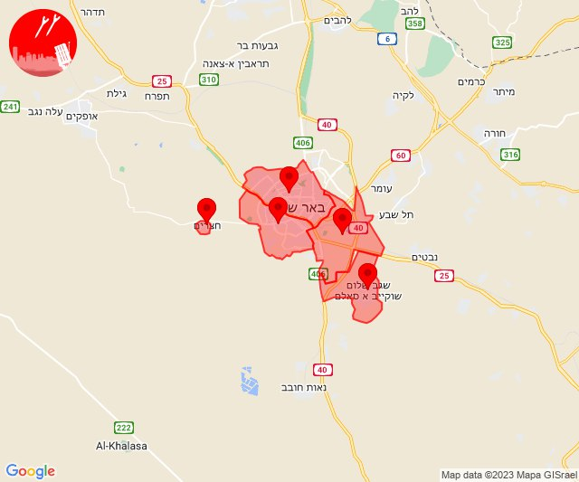

## 14:09

🔴 צבע אדום (02/11/2023):

16:09:
• קו העימות: אביבים (מיידי)

צופר - צבע אדום

## 14:09

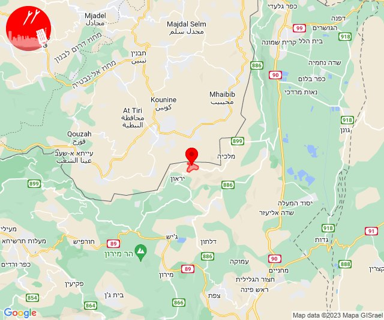

## 14:51

🔴 צבע אדום (02/11/2023):

16:51:
• גליל עליון: צפת, אור הגנוז, בר יוחאי, מרכז אזורי מרום גליל, ספסופה - כפר חושן, קדיתא, אמירים, מירון, ביריה (30 שניות)
• קו העימות: אזור תעשייה רמת דלתון, ג'ש - גוש חלב, דלתון, כרם בן זמרה (מיידי)

צופר - צבע אדום

## 14:51

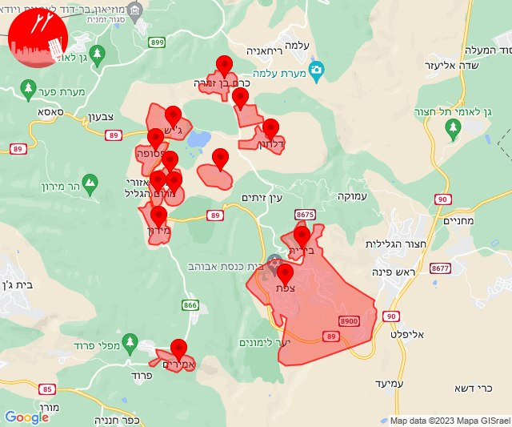

## 15:02

🔴 צבע אדום (02/11/2023):

17:00:
• ירקון: בני עטרות (דקה וחצי)
• השפלה: אחיעזר, זיתן, יגל (דקה וחצי)

17:01:
• דן: אור יהודה, יהוד-מונוסון, סביון (דקה וחצי)
• השפלה: בית דגן, חמד, כפר חב''ד, משמר השבעה, צפריה (דקה וחצי)
• שרון: כפר קאסם (דקה וחצי)
• ירקון: נחשונים, ראש העין, תעשיון חצב, בארות יצחק, גבעת כ''ח, מזור, נופך, נחלים, רינתיה, ברקת, טירת יהודה, אלעד (דקה וחצי)

17:02:
• השפלה: ראשון לציון - מזרח, באר יעקב, לוד, ניר צבי, רמלה, תעשיון צריפין (דקה וחצי)

צופר - צבע אדום

## 15:02

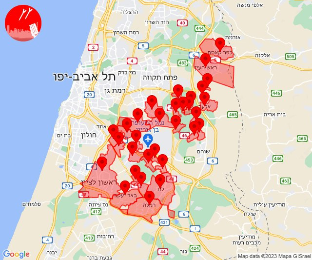

## 15:17

🔴 צבע אדום (02/11/2023):

17:17:
• קו העימות: מנרה, מרגליות, קריית שמונה (מיידי)

צופר - צבע אדום

## 15:17

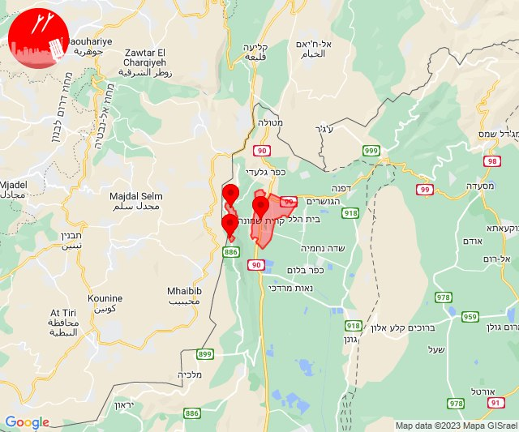

## 15:23

🔴 צבע אדום (02/11/2023):

17:23:
• קו העימות: מנרה, מרגליות, קריית שמונה, תל חי, בית הלל (מיידי)

צופר - צבע אדום

## 15:23

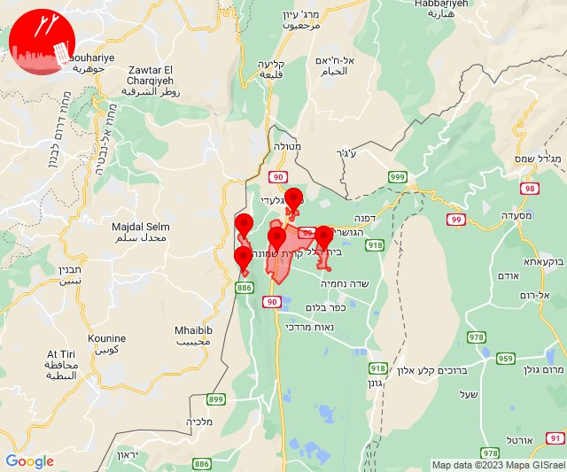

## 16:00

🔴 צבע אדום (02/11/2023):

18:00:
• עוטף עזה: כיסופים (15 שניות)

צופר - צבע אדום

## 16:00

## 19:03

🔴 צבע אדום (02/11/2023):

21:02:
• לכיש: אשדוד - ג,ו,ז, אשדוד - ח,ט,י,יג,יד,טז (45 שניות)

21:03:
• לכיש: אזור תעשייה עד הלום, אשדוד - יא,יב,טו,יז,מרינה,סיטי (45 שניות)

צופר - צבע אדום

## 19:03

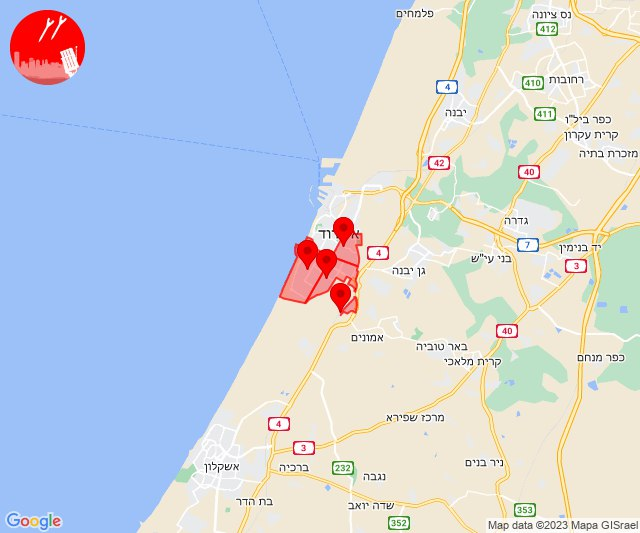

