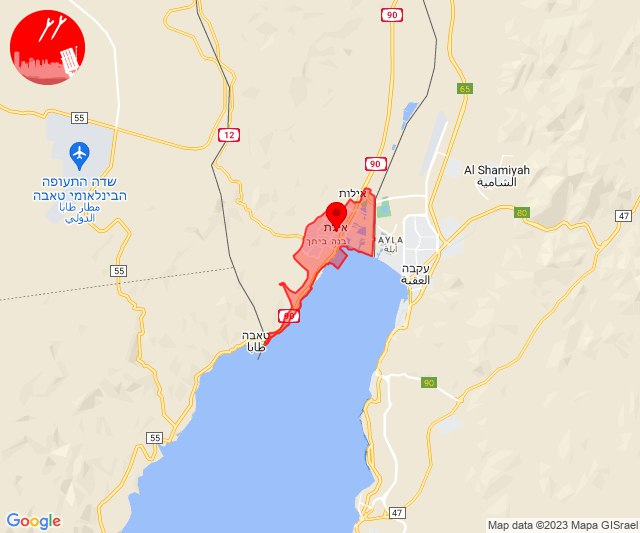
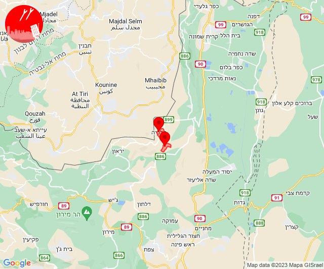
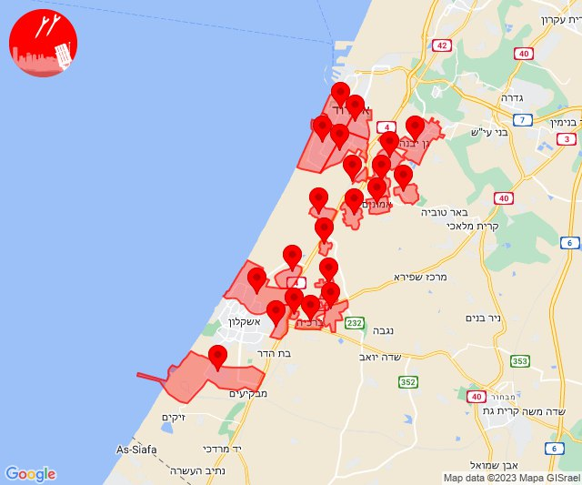
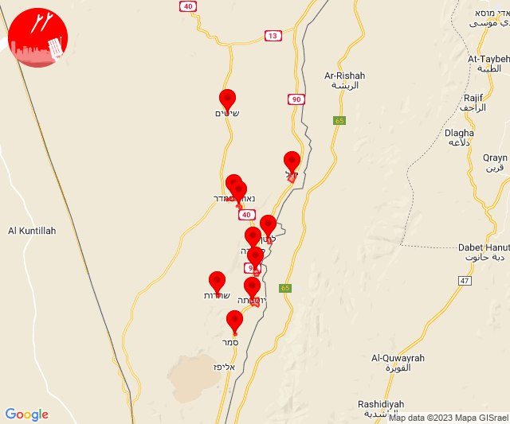
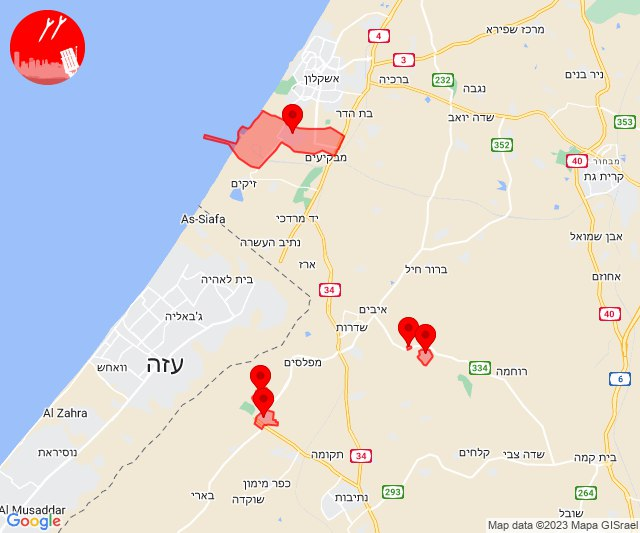
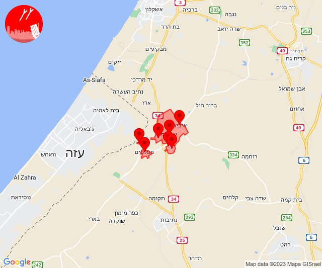
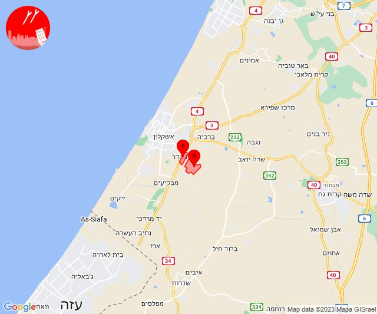
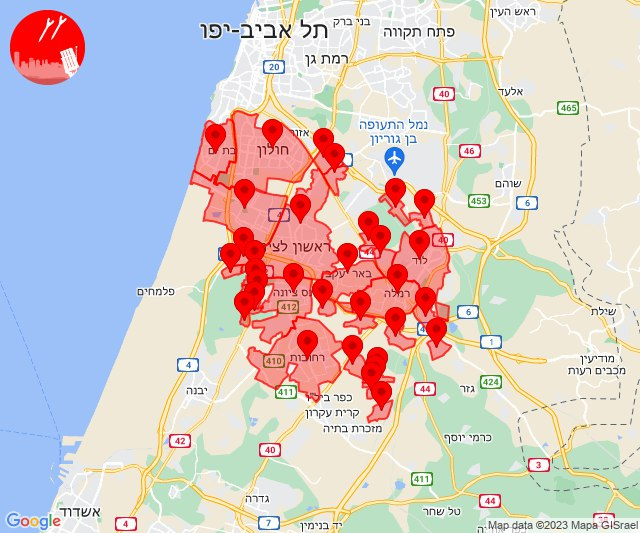

# Alerts for 2023-11-04

## 07:21

🔴 צבע אדום (04/11/2023):

09:21:
• אילת: אילת (30 שניות)

צופר - צבע אדום

## 07:21

## 08:49

🔴 צבע אדום (04/11/2023):

10:49:
• עוטף עזה: כיסופים (15 שניות)

צופר - צבע אדום

## 08:49

## 09:00

🔴 צבע אדום (04/11/2023):

11:00:
• קו העימות: דישון, מלכיה (מיידי)

צופר - צבע אדום

## 09:00

## 09:38

🔴 צבע אדום (04/11/2023):

11:38:
• עוטף עזה: כיסופים (15 שניות)

צופר - צבע אדום

## 09:38

## 11:53

🔴 צבע אדום (04/11/2023):

13:53:
• עוטף עזה: נירים (15 שניות)

צופר - צבע אדום

## 11:53

## 12:09

🔴 צבע אדום (04/11/2023):

14:09:
• עוטף עזה: נירים, עין השלושה (15 שניות)

צופר - צבע אדום

## 12:09

## 13:10

🔴 צבע אדום (04/11/2023):

15:10:
• עוטף עזה: כרם שלום (15 שניות)

צופר - צבע אדום

## 13:10

## 13:20

🔴 צבע אדום (04/11/2023):

15:20:
• עוטף עזה: כפר עזה, סעד (15 שניות)

צופר - צבע אדום

## 13:20

## 14:01

🔴 צבע אדום (04/11/2023):

15:59:
• מערב לכיש: אזור תעשייה הדרומי אשקלון (30 שניות)

16:00:
• לכיש: גן יבנה, אשדוד - ג,ו,ז, אשדוד - ח,ט,י,יג,יד,טז, אמונים, עזריקם, שדה עוזיהו, אשדוד - א,ב,ד,ה, אשדוד - יא,יב,טו,יז,מרינה,סיטי, שתולים (45 שניות)
• מערב לכיש: אזור תעשייה צפוני אשקלון, אשקלון - צפון, באר גנים, ברכיה, הודיה, כפר סילבר, ניצנים, ניר ישראל, ניצן (30 שניות, 45 שניות)

16:01:
• לכיש: אזור תעשייה עד הלום, בית עזרא (45 שניות)

צופר - צבע אדום

## 14:01

## 15:05

🔴 צבע אדום (04/11/2023):

17:05:
• ערבה: גרופית, יהל, יטבתה, לוטן, נאות סמדר, נווה חריף, קטורה, שחרות, שיטים, חי-בר יטבתה (3 דקות)

צופר - צבע אדום

## 15:05

## 16:01

🔴 צבע אדום (04/11/2023):

18:01:
• עוטף עזה: שדרות, איבים, ניר עם (15 שניות)

צופר - צבע אדום

## 16:01

## 18:53

🔴 צבע אדום (04/11/2023):

20:52:
• עוטף עזה: כפר עזה, סעד (15 שניות)

20:53:
• מערב לכיש: אזור תעשייה הדרומי אשקלון (30 שניות)
• מערב הנגב: דורות, חוות שיקמים (30 שניות, 15 שניות)

צופר - צבע אדום

## 18:53

## 19:02

🔴 צבע אדום (04/11/2023):

21:02:
• עוטף עזה: שדרות, איבים, ניר עם, גבים, מכללת ספיר, מטווח ניר עם, מפלסים (15 שניות)

צופר - צבע אדום

## 19:02

## 19:11

🔴 צבע אדום (04/11/2023):

21:11:
• מערב לכיש: בית שקמה, בת הדר (30 שניות)

צופר - צבע אדום

## 19:11

## 20:02

🔴 צבע אדום (04/11/2023):

22:00:
• השפלה: ראשון לציון - מזרח, אירוס, בית חנן, נטעים, נס ציונה, ראשון לציון - מערב, אזור תעשייה נשר - רמלה, מצליח, יד רמב''ם, באר יעקב, לוד, ניר צבי, רמלה, תעשיון צריפין, אחיעזר, זיתן, רחובות, ישרש, נצר סרני (דקה וחצי)
• דן: בת-ים, חולון (דקה וחצי)

22:01:
• השפלה: בית דגן, משמר השבעה, בית עובד (דקה וחצי)

22:02:
• השפלה: גני הדר, יציץ, נען, סתריה, רמות מאיר, גן שורק, פארק תעשיות פלמחים, עיינות (דקה וחצי)

צופר - צבע אדום

## 20:02

