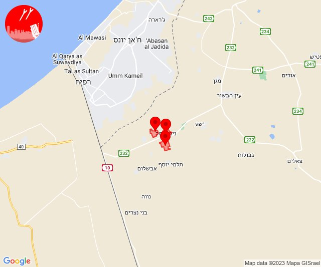

# Alerts for 2023-11-05

## 03:34

🔴 צבע אדום (05/11/2023):

05:34:
• קו העימות: משגב עם (מיידי)

צופר - צבע אדום

## 03:34

## 05:13

🔴 צבע אדום (05/11/2023):

07:13:
• עוטף עזה: מבטחים, עמיעוז, ישע (15 שניות)

צופר - צבע אדום

## 05:13

## 06:03

🔴 צבע אדום (05/11/2023):

08:03:
• עוטף עזה: מבטחים, עמיעוז, ישע (15 שניות)

צופר - צבע אדום

## 06:03

## 07:32

🔴 צבע אדום (05/11/2023):

09:32:
• קו העימות: מתת (מיידי)

צופר - צבע אדום

## 07:32

## 08:40

🔴 צבע אדום (05/11/2023):

10:40:
• עוטף עזה: רעים (15 שניות)

צופר - צבע אדום

## 08:40

## 09:48

🔴 צבע אדום (05/11/2023):

11:48:
• קו העימות: אביבים, יראון (מיידי)

צופר - צבע אדום

## 09:48

## 10:56

🔴 צבע אדום (05/11/2023):

12:56:
• מערב הנגב: נתיבות (30 שניות)

צופר - צבע אדום

## 10:56

## 11:57

🔴 צבע אדום (05/11/2023):

13:57:
• קו העימות: ערב אל עראמשה (מיידי)

צופר - צבע אדום

## 11:57

## 13:00

🔴 צבע אדום (05/11/2023):

15:00:
• עוטף עזה: מבטחים, עמיעוז, ישע (15 שניות)

צופר - צבע אדום

## 13:00

## 13:07

🔴 צבע אדום (05/11/2023):

15:07:
• עוטף עזה: כרם שלום (15 שניות)

צופר - צבע אדום

## 13:07

## 13:18

🔴 צבע אדום (05/11/2023):

15:18:
• עוטף עזה: כיסופים (15 שניות)

צופר - צבע אדום

## 13:18

## 14:01

🔴 צבע אדום (05/11/2023):

16:01:
• עוטף עזה: שדרות, איבים, ניר עם (15 שניות)

צופר - צבע אדום

## 14:01

## 14:51

🔴 צבע אדום (05/11/2023):

16:51:
• מרכז הנגב: באר שבע - מערב, באר שבע - דרום, חצרים (דקה)

צופר - צבע אדום

## 14:51

## 14:59

🔴 צבע אדום (05/11/2023):

16:58:
• עוטף עזה: חולית (15 שניות)

16:59:
• עוטף עזה: יתד, שדה אברהם, סופה, אבשלום, יבול (15 שניות)

צופר - צבע אדום

## 14:59

## 15:01

🔴 צבע אדום (05/11/2023):

17:01:
• עוטף עזה: רעים (15 שניות)

צופר - צבע אדום

## 15:01

## 15:03

🔴 צבע אדום (05/11/2023):

17:03:
• עוטף עזה: ניר יצחק, סופה, פרי גן (15 שניות)

צופר - צבע אדום

## 15:03

## 15:20

🔴 צבע אדום (05/11/2023):

17:20:
• עוטף עזה: נירים (15 שניות)

צופר - צבע אדום

## 15:20

## 16:48

🔴 צבע אדום (05/11/2023):

18:48:
• עוטף עזה: שדרות, איבים, ניר עם, מפלסים, מטווח ניר עם (15 שניות)

צופר - צבע אדום

## 16:48

## 17:13

🔴 צבע אדום (05/11/2023):

19:12:
• קו העימות: קריית שמונה, תל חי, כפר גלעדי, כפר יובל, מעיין ברוך, דפנה, מטולה (מיידי)

19:13:
• מערב הנגב: אזור תעשייה נ.ע.מ, בית הגדי, נתיבות (30 שניות)

צופר - צבע אדום

## 17:13

## 18:02

🔴 צבע אדום (05/11/2023):

20:01:
• השפלה: ראשון לציון - מזרח, ראשון לציון - מערב, בית דגן, משמר השבעה, פארק תעשיות פלמחים (דקה וחצי)
• דן: אזור, חולון, תל אביב - עבר הירקון, בני ברק, רמת גן - מערב, רמת השרון, פתח תקווה, גבעת השלושה (דקה וחצי)
• שרון: גני עם, הוד השרון, ירקונה, עדנים, ג'לג'וליה, חגור, נווה ירק, תחנת רכבת ראש העין, מרכז אזורי דרום השרון, אלישמע, כפר קאסם, חורשים, כפר ברא (דקה וחצי)
• ירקון: ראש העין, אזור תעשייה אפק ולב הארץ (דקה וחצי)

20:02:
• השפלה: בית עובד, עיינות, אירוס, בית חנן, גן שורק, נטעים, נס ציונה (דקה וחצי)
• דן: תל אביב - דרום העיר ויפו, תל אביב - מזרח, תל אביב - מרכז העיר, גבעתיים, מקווה ישראל, גבעת שמואל, רמת גן - מזרח (דקה וחצי)

צופר - צבע אדום

## 18:02

## 19:26

🔴 צבע אדום (05/11/2023):

21:26:
• קו העימות: קריית שמונה (מיידי)

צופר - צבע אדום

## 19:26

## 20:02

🔴 צבע אדום (05/11/2023):

22:01:
• דן: תל אביב - מזרח, אזור, חולון, מקווה ישראל, רמת גן - מערב, אור יהודה, יהוד-מונוסון, מעש, סביון, קריית אונו, רמת גן - מזרח, גני תקווה (דקה וחצי)
• השפלה: ראשון לציון - מזרח, באר יעקב, ניר צבי, תעשיון צריפין, חמד, אחיעזר, ראשון לציון - מערב (דקה וחצי)

22:02:
• לכיש: אשדוד - ג,ו,ז, אשדוד - ח,ט,י,יג,יד,טז (45 שניות)
• דן: מגשימים, בת-ים, תל אביב - דרום העיר ויפו, גבעתיים (דקה וחצי)
• השפלה: משמר השבעה, גנות, בית דגן, כפר חב''ד, צפריה, נצר סרני, רחובות, ישרש, נס ציונה, רמלה, פארק תעשיות פלמחים, בית חנן, גן שורק, נטעים (דקה וחצי)

צופר - צבע אדום

## 20:03

