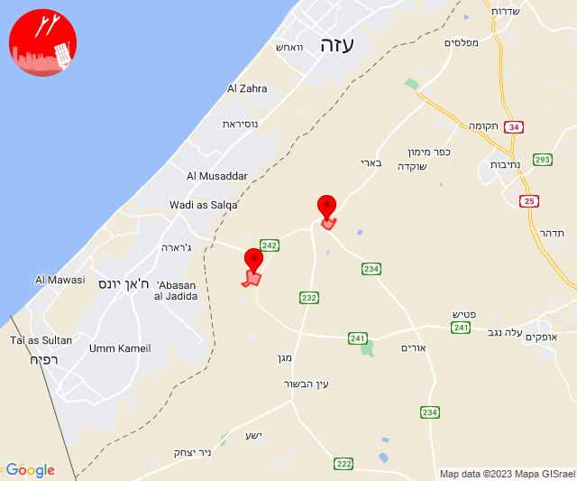
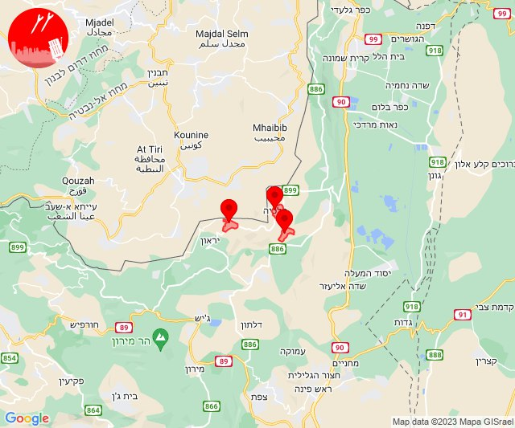

# Alerts for 2023-11-06

## 05:33

🔴 צבע אדום (06/11/2023):

07:33:
• עוטף עזה: כפר עזה, מטווח ניר עם, נחל עוז, נתיב העשרה (15 שניות)

צופר - צבע אדום

## 05:33

## 09:07

🔴 צבע אדום (06/11/2023):

11:07:
• עוטף עזה: ארז, יד מרדכי, נתיב העשרה (15 שניות)

צופר - צבע אדום

## 09:07

## 12:00

🔴 צבע אדום (06/11/2023):

14:00:
• עוטף עזה: רעים, עין השלושה (15 שניות)

צופר - צבע אדום

## 12:00

## 12:50

שלום לכולם

צופר היא מערכת המופעלת בהתנדבות מלאה, אשר פותחה למען תושבי מדינת ישראל.

בייחוד בשעות הקשות האלו מפתחי צופר עובדים ומתחזקים את המערכות במטרה להמשיך ולספק לכם שירות התרעות אמין, מהיר ומציל חיים.

עקב ריבוי המשתמשים אנו נאלצים להרחיב ולשדרג את השרתים מעת לעת

תרומות יסייעו לנו בהמשך הפעלת האפליקציה ותשלום על השרתים
paypal.me/tzevaadom

לתרומה באמצעות ״פייבוקס״:
https://payboxapp.page.link/D61pA1neQXyGhBui7

לתרומה באמצעות ״ביט״: @itaigu

בתקווה לימים שקטים יותר🇮🇱

איתכם בכל זמן,
מערכת צופר

## 14:01

🔴 צבע אדום (06/11/2023):

16:01:
• לכיש: אשדוד - ח,ט,י,יג,יד,טז, גן יבנה, אשדוד - ג,ו,ז, שדה עוזיהו, שתולים, אמונים, בית עזרא, גבעתי, עזר (45 שניות)
• מערב לכיש: ניצן (45 שניות)

צופר - צבע אדום

## 14:01

## 14:18

🔴 צבע אדום (06/11/2023):

16:17:
• קו העימות: מלכיה (מיידי)

16:18:
• קו העימות: אביבים, דישון (מיידי)

צופר - צבע אדום

## 14:18

## 14:32

🔴 צבע אדום (06/11/2023):

16:32:
• עוטף עזה: כיסופים (15 שניות)

צופר - צבע אדום

## 14:32

## 14:40

🔴 צבע אדום (06/11/2023):

16:39:
• קו העימות: נהריה, סער, אזור תעשייה אכזיב מילואות, בצת, לימן, ראש הנקרה, שלומי, גשר הזיו (15 שניות, מיידי)
• המפרץ: קריית ים (דקה)

16:40:
• גליל עליון: אזור תעשייה שער נעמן, כפר מסריק, עין המפרץ, עכו - אזור תעשייה, עכו (דקה, 30 שניות)
• המפרץ: קריית ביאליק (דקה)

צופר - צבע אדום

## 14:40

## 14:41

🔴 צבע אדום (06/11/2023):

16:41:
• קו העימות: כברי (מיידי)

צופר - צבע אדום

## 14:41

## 15:20

🔴 צבע אדום (06/11/2023):

17:20:
• עוטף עזה: סופה, חולית, ניר יצחק (15 שניות)

צופר - צבע אדום

## 15:20

## 17:10

🔴 צבע אדום (06/11/2023):

19:10:
• קו העימות: שתולה (מיידי)

צופר - צבע אדום

## 17:10

## 17:20

🔴 צבע אדום (06/11/2023):

19:20:
• קו העימות: שתולה (מיידי)

צופר - צבע אדום

## 17:20

## 17:37

🔴 צבע אדום (06/11/2023):

19:37:
• קו העימות: שתולה (מיידי)

צופר - צבע אדום

## 17:37

## 19:47

🔴 צבע אדום (06/11/2023):

21:47:
• קו העימות: דפנה, הגושרים, ע'ג'ר, קיבוץ דן, שאר ישוב, שניר (מיידי)

צופר - צבע אדום

## 19:47

