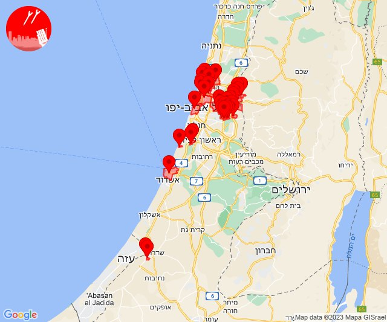

# Alerts for 2023-11-07

## 04:40

🔴 צבע אדום (07/11/2023):

06:40:
• עוטף עזה: ניר עוז, נירים (15 שניות)

צופר - צבע אדום

## 04:40

## 09:01

🔴 צבע אדום (07/11/2023):

11:01:
• מערב לכיש: אזור תעשייה הדרומי אשקלון (30 שניות)

צופר - צבע אדום

## 09:01

## 10:47

🔴 צבע אדום (07/11/2023):

12:47:
• עוטף עזה: מפלסים (15 שניות)

צופר - צבע אדום

## 10:47

## 11:05

🔴 צבע אדום (07/11/2023):

13:04:
• עוטף עזה: מבטחים, עמיעוז, ישע (15 שניות)

13:05:
• עוטף עזה: צוחר, אוהד, שדה ניצן, תלמי אליהו (15 שניות)

צופר - צבע אדום

## 11:05

## 11:26

🔴 צבע אדום (07/11/2023):

13:26:
• עוטף עזה: רעים (15 שניות)

צופר - צבע אדום

## 11:26

## 14:30

🔴 צבע אדום (07/11/2023):

16:29:
• צפון הגולן: עין קנייא, מסעדה (מיידי)

16:30:
• קו העימות: דפנה, קיבוץ דן, שאר ישוב, שניר (מיידי)

צופר - צבע אדום

## 14:30

## 15:01

🔴 צבע אדום (07/11/2023):

17:00:
• לכיש: אשדוד - ח,ט,י,יג,יד,טז, אשדוד - יא,יב,טו,יז,מרינה,סיטי, אשדוד - א,ב,ד,ה, אשדוד - אזור תעשייה צפוני ונמל, אשדוד - ג,ו,ז (45 שניות)

17:01:
• מערב לכיש: ניצן (45 שניות)

צופר - צבע אדום

## 15:01

## 19:01

🔴 צבע אדום (07/11/2023):

21:00:
• השפלה: גן שורק, פארק תעשיות פלמחים (דקה וחצי)
• לכיש: פלמחים, אשדוד - אזור תעשייה צפוני ונמל (דקה וחצי, 45 שניות)
• שרון: אורנית, כפר ברא, כפר קאסם, רעננה (דקה וחצי)
• ירקון: עינת, ראש העין, אזור תעשייה אפק ולב הארץ (דקה וחצי)
• דן: כפר סירקין, הרצליה - מערב, הרצליה - מרכז וגליל ים, כפר שמריהו, רמת השרון, תל אביב - עבר הירקון, סינמה סיטי גלילות, מתחם פי גלילות (דקה וחצי)
• עוטף עזה: מטווח ניר עם, מפלסים (15 שניות)

21:01:
• דן: מעש, פתח תקווה, מגשימים, תל אביב - מרכז העיר (דקה וחצי)
• ירקון: אלעד, בארות יצחק, מזור, נופך, נחלים, נחשונים, רינתיה (דקה וחצי)

צופר - צבע אדום

## 19:01

## 19:35

🔴 צבע אדום (07/11/2023):

21:34:
• דן: תל אביב - דרום העיר ויפו, בת-ים, אור יהודה, יהוד-מונוסון, כפר סירקין, מעש, סביון, פתח תקווה, מגשימים (דקה וחצי)
• השפלה: ראשון לציון - מערב, ראשון לציון - מזרח, בית דגן, חמד, כפר חב''ד, משמר השבעה, צפריה, גנות (דקה וחצי)
• ירקון: בארות יצחק, נחלים (דקה וחצי)

21:35:
• השפלה: תעשיון צריפין, אחיעזר, יגל, פארק תעשיות פלמחים, בית חנן, נטעים, נס ציונה (דקה וחצי)

צופר - צבע אדום

## 19:35

