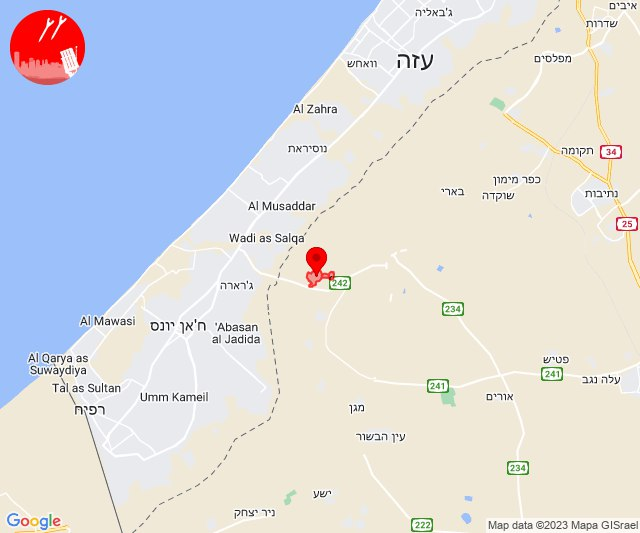
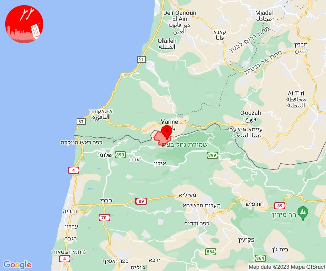
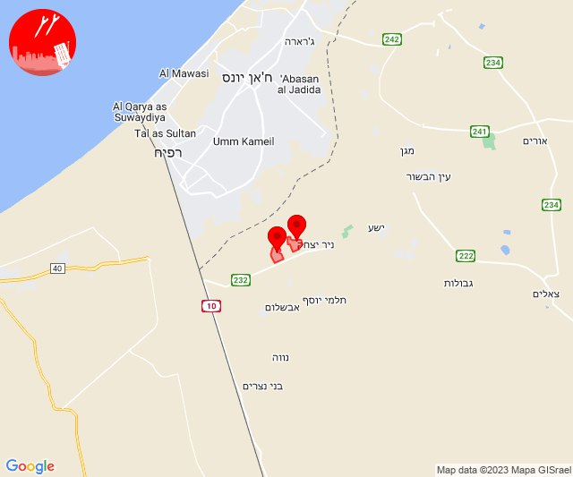
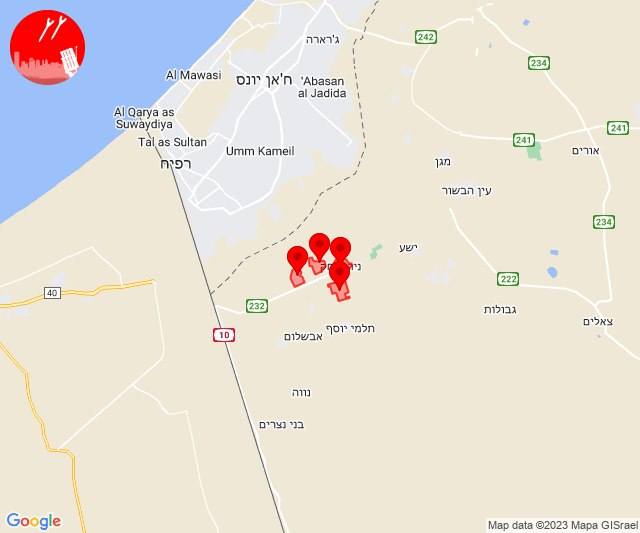
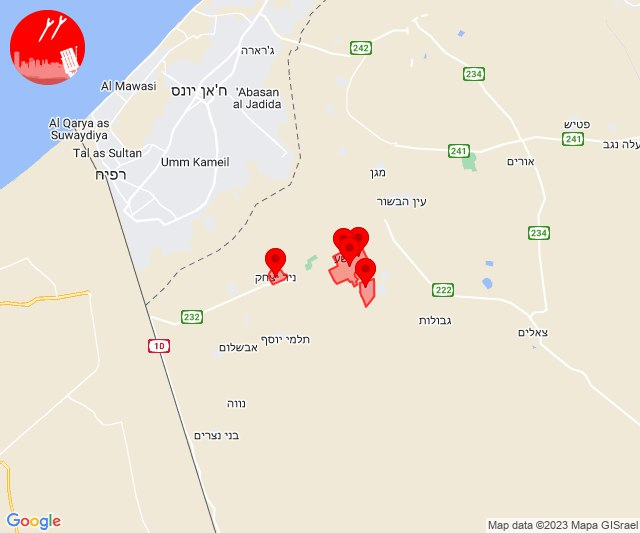
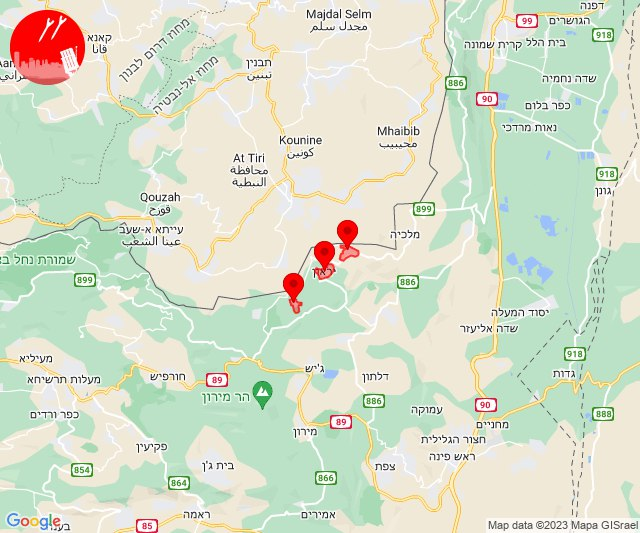

# Alerts for 2023-11-08

## 04:00

🔴 צבע אדום (08/11/2023):

06:00:
• עוטף עזה: כיסופים (15 שניות)

צופר - צבע אדום

## 04:00

## 07:12

🔴 צבע אדום (08/11/2023):

09:12:
• עוטף עזה: כיסופים (15 שניות)

צופר - צבע אדום

## 07:12

## 07:59

🔴 צבע אדום (08/11/2023):

09:59:
• קו העימות: ערב אל עראמשה (מיידי)

צופר - צבע אדום

## 07:59

## 10:08

🔴 צבע אדום (08/11/2023):

12:08:
• עוטף עזה: חולית, סופה (15 שניות)

צופר - צבע אדום

## 10:08

## 10:16

🔴 צבע אדום (08/11/2023):

12:16:
• עוטף עזה: כיסופים (15 שניות)

צופר - צבע אדום

## 10:16

## 12:09

🔴 צבע אדום (08/11/2023):

14:09:
• עוטף עזה: ניר יצחק, חולית, סופה, פרי גן (15 שניות)

צופר - צבע אדום

## 12:09

## 12:59

🔴 צבע אדום (08/11/2023):

14:59:
• עוטף עזה: ניר יצחק, מבטחים, עמיעוז, ישע, שדה ניצן (15 שניות)

צופר - צבע אדום

## 12:59

## 13:16

🔴 צבע אדום (08/11/2023):

15:16:
• עוטף עזה: כיסופים (15 שניות)

צופר - צבע אדום

## 13:16

## 13:28

🔴 צבע אדום (08/11/2023):

15:28:
• עוטף עזה: כיסופים (15 שניות)

צופר - צבע אדום

## 13:28

## 15:29

🔴 צבע אדום (08/11/2023):

17:29:
• עוטף עזה: כיסופים (15 שניות)

צופר - צבע אדום

## 15:29

## 17:23

✈️ חדירת כלי טיס עוין (08/11/2023):

19:23:
• קו העימות: אביבים, ברעם, יראון 

צופר - צבע אדום

## 17:23

## 18:00

🔴 צבע אדום (08/11/2023):

20:00:
• עוטף עזה: כיסופים (15 שניות)

צופר - צבע אדום

## 18:00

