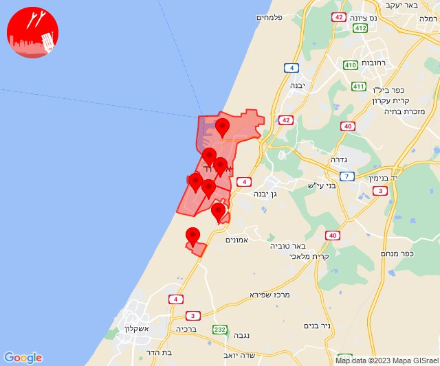
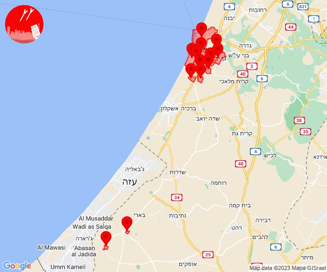
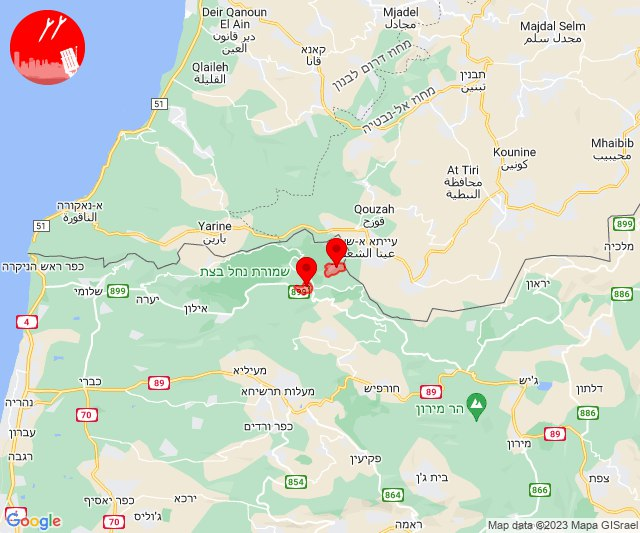
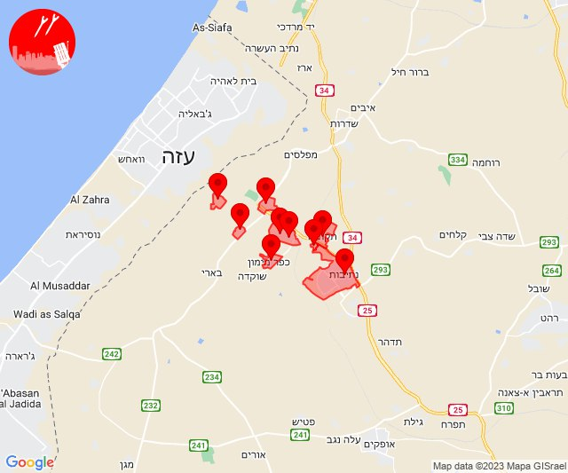
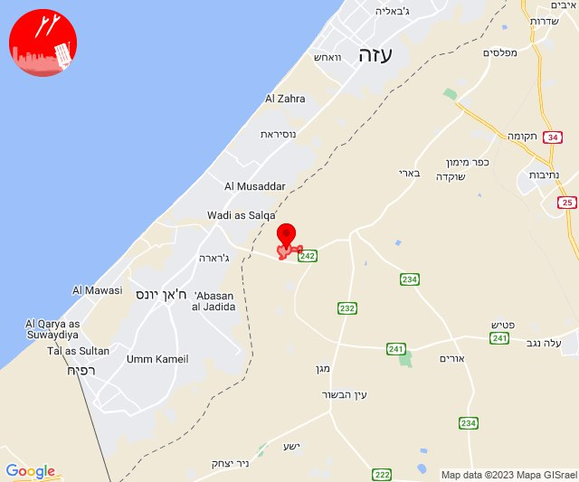
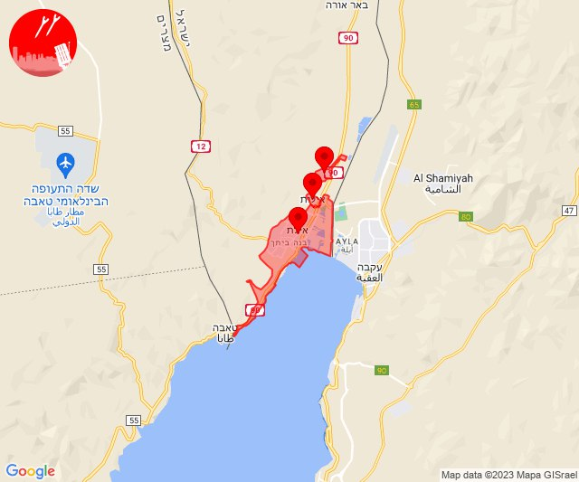
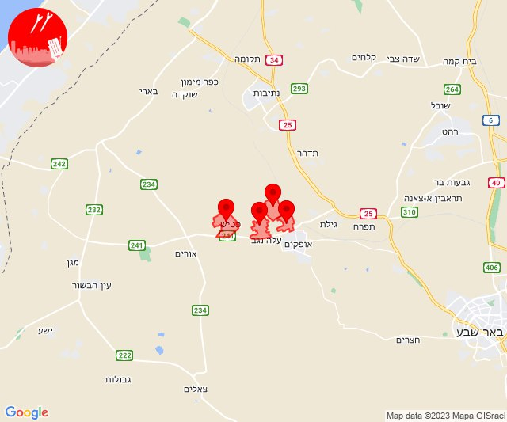

# Alerts for 2023-11-09

## 05:15

🔴 צבע אדום (09/11/2023):

07:15:
• עוטף עזה: כיסופים (15 שניות)

צופר - צבע אדום

## 05:15

## 05:34

🔴 צבע אדום (09/11/2023):

07:34:
• עוטף עזה: נחל עוז (15 שניות)

צופר - צבע אדום

## 05:34

## 07:56

🔴 צבע אדום (09/11/2023):

09:56:
• לכיש: אשדוד - א,ב,ד,ה, אשדוד - אזור תעשייה צפוני ונמל, אשדוד - ג,ו,ז, אזור תעשייה עד הלום, אשדוד - ח,ט,י,יג,יד,טז, אשדוד - יא,יב,טו,יז,מרינה,סיטי (45 שניות)
• מערב לכיש: ניצן (45 שניות)

צופר - צבע אדום

## 07:56

## 12:02

🔴 צבע אדום (09/11/2023):

14:00:
• עוטף עזה: עין השלושה, רעים (15 שניות)

14:01:
• לכיש: גן הדרום, גן יבנה, אזור תעשייה עד הלום, אשדוד - ח,ט,י,יג,יד,טז, שדה עוזיהו, שתולים, אשדוד - אזור תעשייה צפוני ונמל, אשדוד - ג,ו,ז (דקה, 45 שניות)

14:02:
• לכיש: בית עזרא, אשדוד - יא,יב,טו,יז,מרינה,סיטי (45 שניות)
• מערב לכיש: ניצן (45 שניות)

צופר - צבע אדום

## 12:02

## 13:36

🔴 צבע אדום (09/11/2023):

15:35:
• קו העימות: שתולה (מיידי)

15:36:
• קו העימות: אבן מנחם (מיידי)

צופר - צבע אדום

## 13:36

## 13:45

🔴 צבע אדום (09/11/2023):

15:45:
• עוטף עזה: תקומה, זמרת, שובה, כפר מימון ותושיה, נחל עוז, סעד, עלומים, חוות יזרעם (15 שניות)
• מערב הנגב: נתיבות (30 שניות)

צופר - צבע אדום

## 13:45

## 14:45

🔴 צבע אדום (09/11/2023):

16:45:
• עוטף עזה: כיסופים (15 שניות)

צופר - צבע אדום

## 14:45

## 14:55

🔴 צבע אדום (09/11/2023):

16:55:
• עוטף עזה: ניר עוז, נירים (15 שניות)

צופר - צבע אדום

## 14:55

## 17:30

🔴 צבע אדום (09/11/2023):

19:29:
• אילת: אילות, אילת, אזור תעשייה שחורת (30 שניות)

19:30:
• אילת: אילות, אילת (30 שניות)

צופר - צבע אדום

## 17:30

## 18:45

🔴 צבע אדום (09/11/2023):

20:44:
• מערב הנגב: מסלול, פדויים, רנן (30 שניות, 45 שניות)

20:45:
• מערב הנגב: פטיש (30 שניות)

צופר - צבע אדום

## 18:45

