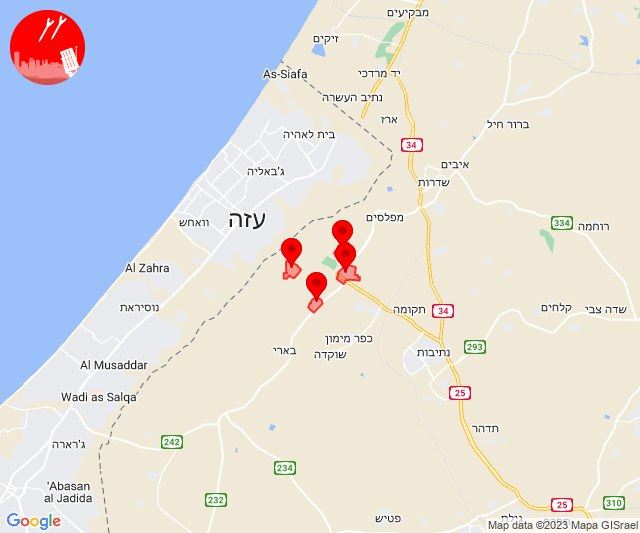
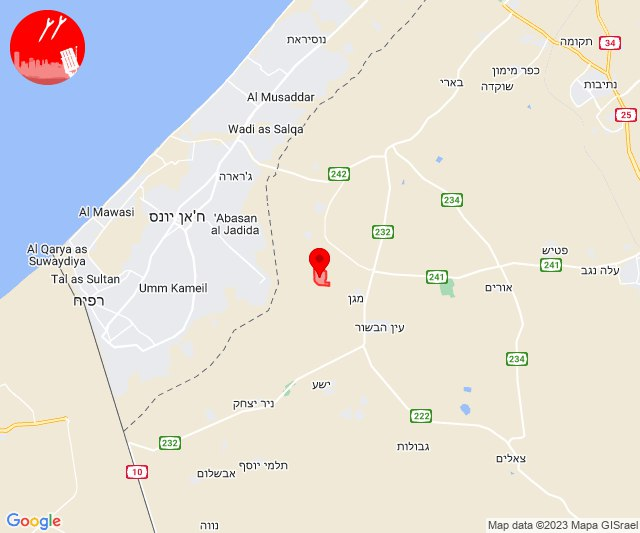
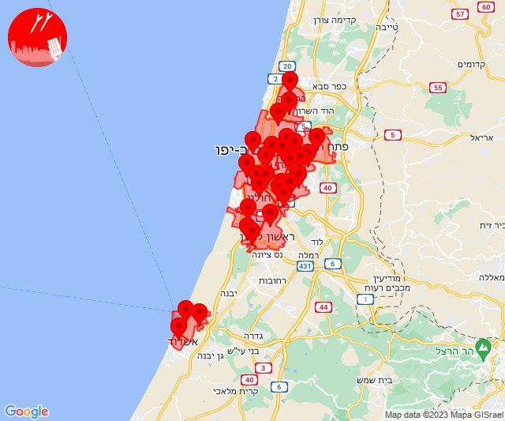
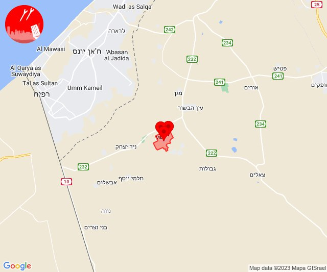
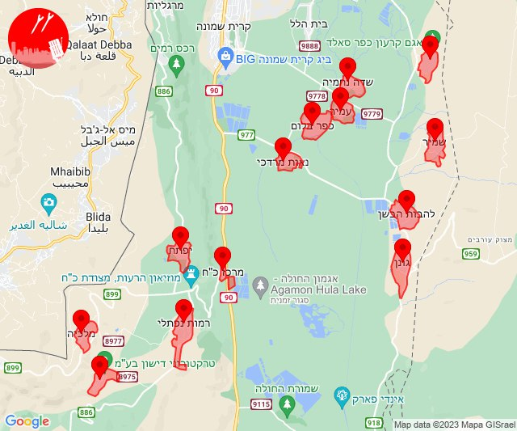

# Alerts for 2023-11-10

## 00:43

🔴 צבע אדום (10/11/2023):

02:43:
• עוטף עזה: כפר עזה, נחל עוז, סעד, עלומים (15 שניות)

צופר - צבע אדום

## 00:43

## 06:38

🔴 צבע אדום (10/11/2023):

08:38:
• עוטף עזה: נירים (15 שניות)

צופר - צבע אדום

## 06:38

## 09:00

🔴 צבע אדום (10/11/2023):

11:00:
• עוטף עזה: ניר עוז (15 שניות)

צופר - צבע אדום

## 09:00

## 10:48

🔴 צבע אדום (10/11/2023):

12:48:
• עוטף עזה: נירים (15 שניות)

צופר - צבע אדום

## 10:48

## 11:10

🔴 צבע אדום (10/11/2023):

13:10:
• עוטף עזה: כיסופים (15 שניות)

צופר - צבע אדום

## 11:10

## 11:32

🔴 צבע אדום (10/11/2023):

13:30:
• דן: גבעת שמואל, גני תקווה, פתח תקווה, קריית אונו, רמת גן - מזרח, אור יהודה, אזור, חולון, רמת גן - מערב, תל אביב - מרכז העיר, תל אביב - עבר הירקון, בני ברק, רמת השרון, הרצליה - מרכז וגליל ים (דקה וחצי)
• השפלה: חמד, משמר השבעה, גנות (דקה וחצי)
• לכיש: אשדוד - אזור תעשייה צפוני ונמל (45 שניות)

13:31:
• לכיש: אשדוד - א,ב,ד,ה, ניר גלים (45 שניות)
• השפלה: ראשון לציון - מזרח, ראשון לציון - מערב, פארק תעשיות פלמחים, נטעים, בית דגן (דקה וחצי)
• דן: מקווה ישראל, תל אביב - מזרח (דקה וחצי)

13:32:
• דן: תל אביב - דרום העיר ויפו, גבעתיים (דקה וחצי)

צופר - צבע אדום

## 11:32

## 12:07

🔴 צבע אדום (10/11/2023):

14:07:
• קו העימות: ערב אל עראמשה (מיידי)

צופר - צבע אדום

## 12:07

## 13:01

🔴 צבע אדום (10/11/2023):

15:01:
• עוטף עזה: מבטחים, עמיעוז, ישע (15 שניות)

צופר - צבע אדום

## 13:01

## 13:10

✈️ חדירת כלי טיס עוין (10/11/2023):

15:10:
• קו העימות: דישון, יפתח, מרכז אזורי מבואות חרמון, מלכיה, רמות נפתלי, גונן, כפר בלום, כפר סאלד, להבות הבשן, נאות מרדכי, עמיר, שדה נחמיה, שמיר 

צופר - צבע אדום

## 13:10

## 13:15

🔴 צבע אדום (10/11/2023):

15:15:
• קו העימות: שתולה (מיידי)

צופר - צבע אדום

## 13:15

## 14:27

🔴 צבע אדום (10/11/2023):

16:27:
• עוטף עזה: שדרות, איבים, ניר עם (15 שניות)

צופר - צבע אדום

## 14:27

