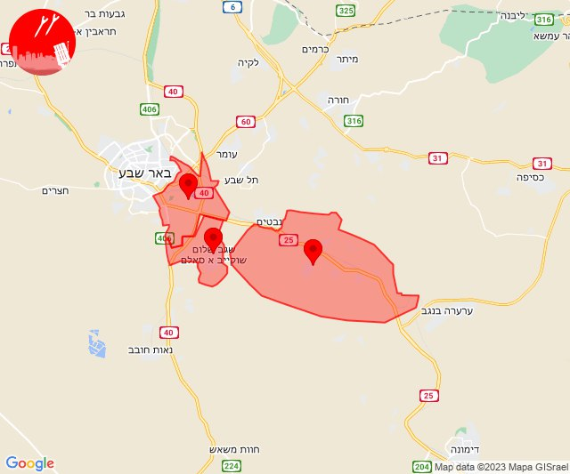
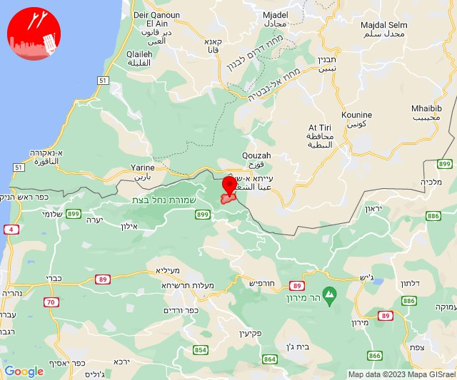

# Alerts for 2023-11-11

## 04:12

🔴 צבע אדום (11/11/2023):

06:12:
• עוטף עזה: כיסופים (15 שניות)

צופר - צבע אדום

## 04:12

## 05:28

🔴 צבע אדום (11/11/2023):

07:28:
• עוטף עזה: כיסופים (15 שניות)

צופר - צבע אדום

## 05:28

## 07:34

🔴 צבע אדום (11/11/2023):

09:34:
• קו העימות: מרגליות (מיידי)

צופר - צבע אדום

## 07:34

## 07:35

✈️ חדירת כלי טיס עוין (11/11/2023):

09:35:
• קו העימות: בית הלל, כפר גלעדי, כפר יובל, מטולה, מנרה, מעיין ברוך, משגב עם, קריית שמונה, תל חי, מרגליות 

צופר - צבע אדום

## 07:35

## 09:23

🔴 צבע אדום (11/11/2023):

11:23:
• עוטף עזה: בארי (15 שניות)

צופר - צבע אדום

## 09:23

## 10:01

🔴 צבע אדום (11/11/2023):

12:01:
• עוטף עזה: כיסופים (15 שניות)

צופר - צבע אדום

## 10:01

## 11:00

🔴 צבע אדום (11/11/2023):

13:00:
• עוטף עזה: כיסופים (15 שניות)

צופר - צבע אדום

## 11:00

## 11:42

🔴 צבע אדום (11/11/2023):

13:42:
• קו העימות: נטועה (מיידי)

צופר - צבע אדום

## 11:42

## 12:32

🔴 צבע אדום (11/11/2023):

14:30:
• מרכז הנגב: שגב שלום והפזורה (דקה וחצי)
• דרום הנגב: אבו-תלול והפזורה (דקה וחצי)

14:31:
• מרכז הנגב: תל שבע, אום בטין והפזורה, באר שבע - מזרח, באר שבע - צפון, לקיה והפזורה, עומר, נבטים (דקה וחצי, דקה)
• דרום הנגב: ואדי אל נעם דרום (דקה וחצי)

14:32:
• מרכז הנגב: באר שבע - דרום, באר שבע - מערב (דקה)

צופר - צבע אדום

## 12:32

## 12:34

🔴 צבע אדום (11/11/2023):

14:34:
• דרום הנגב: אבו-תלול והפזורה (דקה וחצי)
• מרכז הנגב: שגב שלום והפזורה, באר שבע - מזרח (דקה וחצי, דקה)

צופר - צבע אדום

## 12:34

## 13:11

✈️ חדירת כלי טיס עוין (11/11/2023):

15:11:
• קו העימות: כברי 

צופר - צבע אדום

## 13:11

## 13:12

🔴 צבע אדום (11/11/2023):

15:12:
• קו העימות: מנות, נווה זיו, עבדון (מיידי)

צופר - צבע אדום

## 13:12

## 17:07

✈️ חדירת כלי טיס עוין (11/11/2023):

19:07:
• עוטף עזה: גבים, מכללת ספיר, מטווח ניר עם, שדרות, איבים, ניר עם 

צופר - צבע אדום

## 17:07

## 17:08

🔴 צבע אדום (11/11/2023):

19:08:
• עוטף עזה: שדרות, איבים, ניר עם, גבים, מכללת ספיר, שדרות, איבים, ניר עם (15 שניות)

צופר - צבע אדום

## 17:08

## 17:15

🔴 צבע אדום (11/11/2023):

19:15:
• דרום הגולן: אלי עד, אבני איתן, נוב (מיידי)

צופר - צבע אדום

## 17:15

## 18:38

🔴 צבע אדום (11/11/2023):

20:38:
• קו העימות: שתולה (מיידי)

צופר - צבע אדום

## 18:38

## 21:21

✈️ חדירת כלי טיס עוין (11/11/2023):

23:21:
• עוטף עזה: גבים, מכללת ספיר, שדרות, איבים, ניר עם 

צופר - צבע אדום

## 21:21

## 21:23

✈️ חדירת כלי טיס עוין (11/11/2023):

23:23:
• עוטף עזה: אור הנר, ארז 

צופר - צבע אדום

## 21:23

## 21:24

🔴 צבע אדום (11/11/2023):

23:24:
• עוטף עזה: שדרות, איבים, ניר עם, אור הנר (15 שניות)

צופר - צבע אדום

## 21:24

