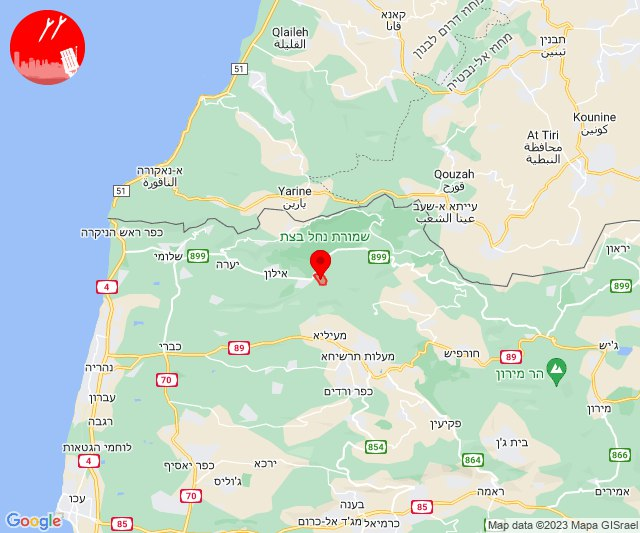
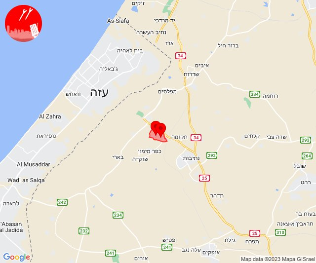
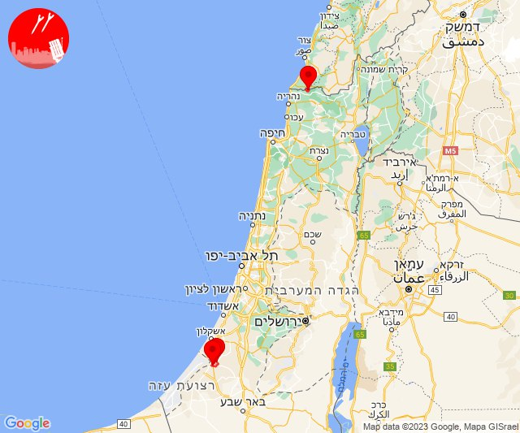
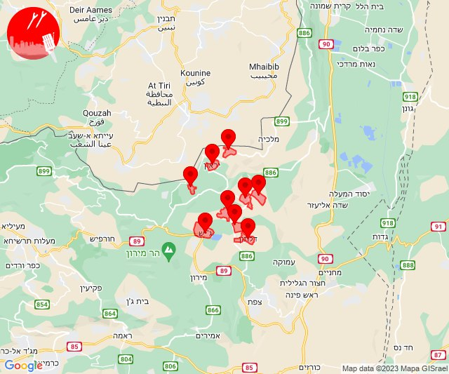
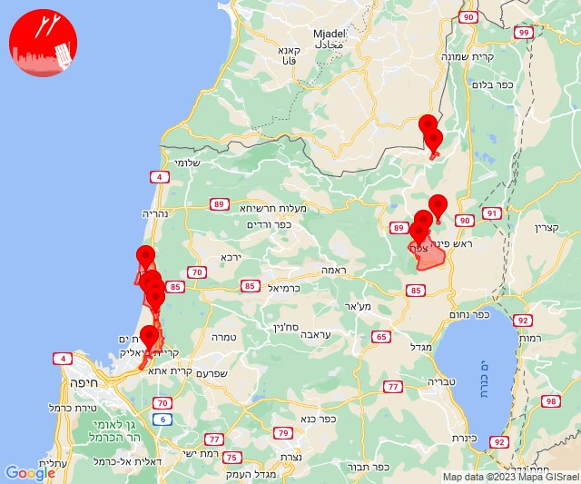
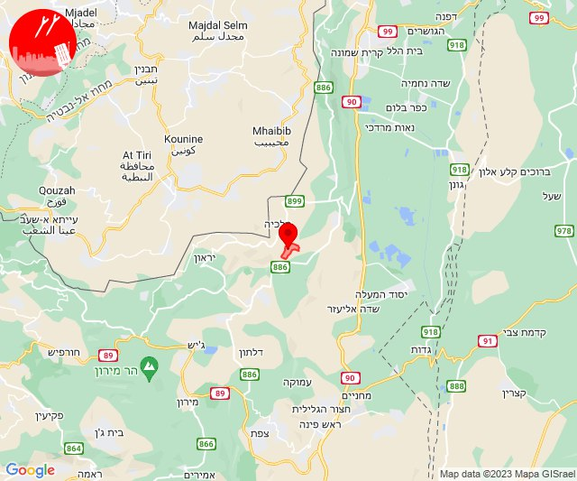
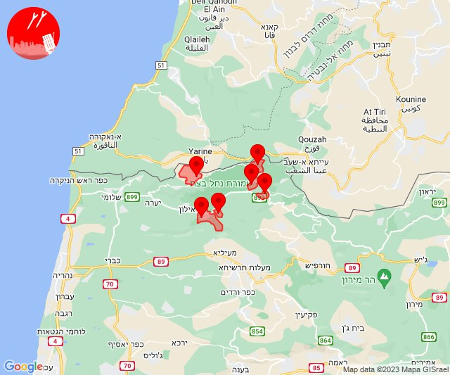
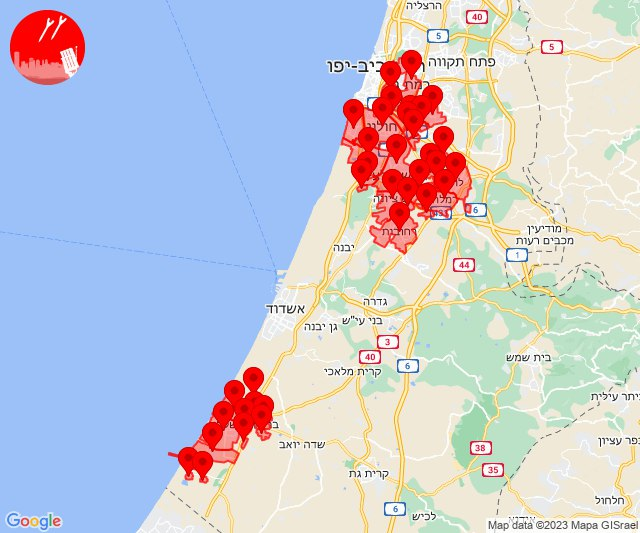
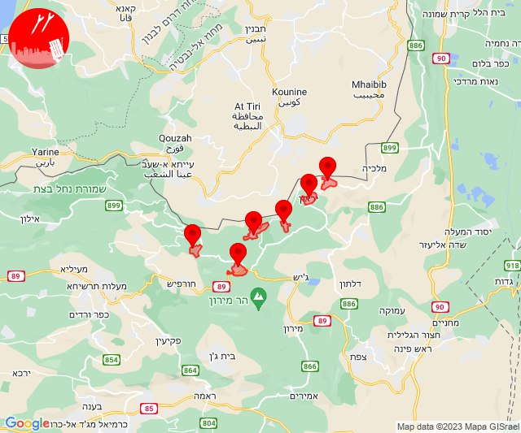

# Alerts for 2023-11-13

## 06:50

🔴 צבע אדום (13/11/2023):

08:50:
• קו העימות: גורנות הגליל (מיידי)

צופר - צבע אדום

## 06:50

## 07:43

🔴 צבע אדום (13/11/2023):

09:43:
• עוטף עזה: זמרת, שובה (15 שניות)

צופר - צבע אדום

## 07:43

## 08:31

🔴 צבע אדום (13/11/2023):

10:30:
• עוטף עזה: שדרות, איבים, ניר עם (15 שניות)

10:31:
• קו העימות: ערב אל עראמשה (מיידי)

צופר - צבע אדום

## 08:31

## 10:48

✈️ חדירת כלי טיס עוין (13/11/2023):

12:48:
• קו העימות: אביבים, אזור תעשייה רמת דלתון, ברעם, ג'ש - גוש חלב, דלתון, יראון, כרם בן זמרה, עלמה, ריחאנייה 

צופר - צבע אדום

## 10:48

## 10:55

🔴 צבע אדום (13/11/2023):

12:54:
• גליל עליון: ביריה, עמוקה, צפת (30 שניות)

12:55:
• קו העימות: דישון, מלכיה (מיידי)
• גליל עליון: אזור תעשייה שער נעמן, עכו, כפר מסריק, עין המפרץ, עכו - אזור תעשייה (דקה, 30 שניות)
• המפרץ: קריית ביאליק (דקה)

צופר - צבע אדום

## 10:55

## 10:59

🔴 צבע אדום (13/11/2023):

12:59:
• קו העימות: דישון (מיידי)

צופר - צבע אדום

## 10:59

## 12:39

🔴 צבע אדום (13/11/2023):

14:39:
• קו העימות: אבן מנחם, גורן, גורנות הגליל, זרעית, ערב אל עראמשה, שומרה (מיידי)

צופר - צבע אדום

## 12:39

## 17:39

🔴 צבע אדום (13/11/2023):

19:38:
• עוטף עזה: נתיב העשרה (15 שניות)

19:39:
• עוטף עזה: זיקים (15 שניות)

צופר - צבע אדום

## 17:39

## 17:46

🔴 צבע אדום (13/11/2023):

19:46:
• עוטף עזה: זיקים (15 שניות)

צופר - צבע אדום

## 17:46

## 18:04

🔴 צבע אדום (13/11/2023):

20:01:
• השפלה: גן שורק, פארק תעשיות פלמחים, ראשון לציון - מערב, נצר סרני, רחובות, נס ציונה, רמלה, ראשון לציון - מזרח, באר יעקב, לוד, ניר צבי, תעשיון צריפין, אחיעזר, בית דגן, חמד, משמר השבעה, גנות (דקה וחצי)
• דן: בת-ים, חולון, אור יהודה, אזור, תל אביב - מזרח, רמת גן - מערב (דקה וחצי)

20:02:
• השפלה: ישרש (דקה וחצי)
• מערב לכיש: אשקלון - דרום, אזור תעשייה הדרומי אשקלון (30 שניות)
• עוטף עזה: זיקים, כרמיה (15 שניות)

20:03:
• מערב לכיש: אשקלון - צפון, אזור תעשייה צפוני אשקלון, באר גנים, בת הדר, ברכיה, כפר סילבר (30 שניות)

20:04:
• מערב לכיש: משען (30 שניות)

צופר - צבע אדום

## 18:04

## 20:34

✈️ חדירת כלי טיס עוין (13/11/2023):

22:34:
• קו העימות: אביבים, ברעם, דוב''ב, יראון, מתת, סאסא 

צופר - צבע אדום

## 20:34

## 21:43

🔴 צבע אדום (13/11/2023):

23:43:
• עוטף עזה: נתיב העשרה (15 שניות)

צופר - צבע אדום

## 21:43

