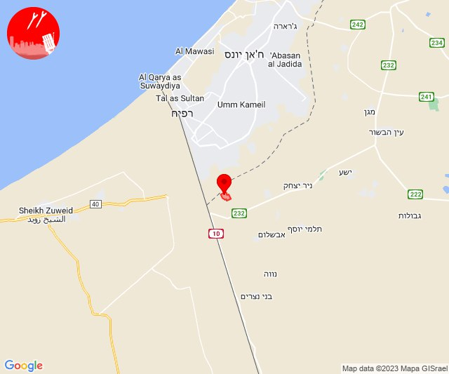
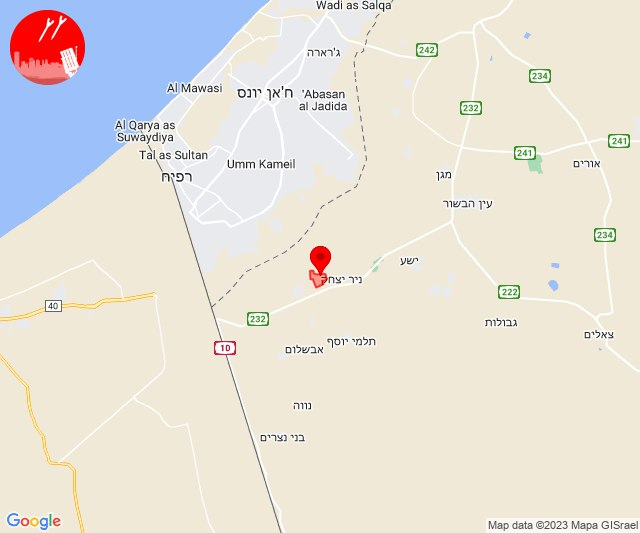

# Alerts for 2023-11-14

## 05:26

🔴 צבע אדום (14/11/2023):

07:26:
• עוטף עזה: כיסופים (15 שניות)

צופר - צבע אדום

## 05:26

## 06:52

🔴 צבע אדום (14/11/2023):

08:51:
• עוטף עזה: נירים (15 שניות)

08:52:
• עוטף עזה: ניר עוז (15 שניות)

צופר - צבע אדום

## 06:52

## 07:33

🔴 צבע אדום (14/11/2023):

09:33:
• עוטף עזה: נירים (15 שניות)

צופר - צבע אדום

## 07:33

## 09:40

🔴 צבע אדום (14/11/2023):

11:40:
• מערב לכיש: אשקלון - דרום, אשקלון - צפון, אזור תעשייה צפוני אשקלון, בת הדר, אזור תעשייה הדרומי אשקלון, מבקיעים, בית שקמה, גיאה (30 שניות)
• עוטף עזה: זיקים, יד מרדכי, כרמיה (15 שניות)

צופר - צבע אדום

## 09:40

## 10:44

🔴 צבע אדום (14/11/2023):

12:44:
• אילת: אילת (30 שניות)

צופר - צבע אדום

## 10:44

## 11:00

🔴 צבע אדום (14/11/2023):

13:00:
• עוטף עזה: כיסופים (15 שניות)

צופר - צבע אדום

## 11:00

## 11:18

🔴 צבע אדום (14/11/2023):

13:18:
• עוטף עזה: נחל עוז (15 שניות)

צופר - צבע אדום

## 11:18

## 11:26

🔴 צבע אדום (14/11/2023):

13:26:
• קו העימות: שומרה, אבן מנחם, זרעית, שומרה, שתולה (מיידי)

צופר - צבע אדום

## 11:26

## 11:29

🔴 צבע אדום (14/11/2023):

13:29:
• עוטף עזה: כפר עזה, נחל עוז, סעד, עלומים (15 שניות)

צופר - צבע אדום

## 11:29

## 12:10

🔴 צבע אדום (14/11/2023):

14:10:
• עוטף עזה: נחל עוז, עלומים (15 שניות)

צופר - צבע אדום

## 12:10

## 12:38

🔴 צבע אדום (14/11/2023):

14:38:
• עוטף עזה: כרם שלום (15 שניות)

צופר - צבע אדום

## 12:38

## 13:03

🔴 צבע אדום (14/11/2023):

15:03:
• עוטף עזה: סעד, נחל עוז (15 שניות)

צופר - צבע אדום

## 13:03

## 13:55

🔴 צבע אדום (14/11/2023):

15:55:
• עוטף עזה: כיסופים, עין השלושה (15 שניות)

צופר - צבע אדום

## 13:55

## 14:04

🔴 צבע אדום (14/11/2023):

16:04:
• עוטף עזה: סופה (15 שניות)

צופר - צבע אדום

## 14:04

## 15:01

🔴 צבע אדום (14/11/2023):

17:01:
• עוטף עזה: עין השלושה (15 שניות)

צופר - צבע אדום

## 15:01

## 15:11

🔴 צבע אדום (14/11/2023):

17:11:
• דן: בת-ים, חולון, תל אביב - דרום העיר ויפו, תל אביב - מרכז העיר (דקה וחצי)

צופר - צבע אדום

## 15:11

## 16:37

🔴 צבע אדום (14/11/2023):

18:37:
• עוטף עזה: נירים, עין השלושה (15 שניות)

צופר - צבע אדום

## 16:37

## 17:46

🔴 צבע אדום (14/11/2023):

19:46:
• עוטף עזה: נירים (15 שניות)

צופר - צבע אדום

## 17:46

## 17:51

🔴 צבע אדום (14/11/2023):

19:51:
• אילת: אילות, אילת (30 שניות)

צופר - צבע אדום

## 17:51

## 18:07

🔴 צבע אדום (14/11/2023):

20:07:
• עוטף עזה: סופה (15 שניות)

צופר - צבע אדום

## 18:07

