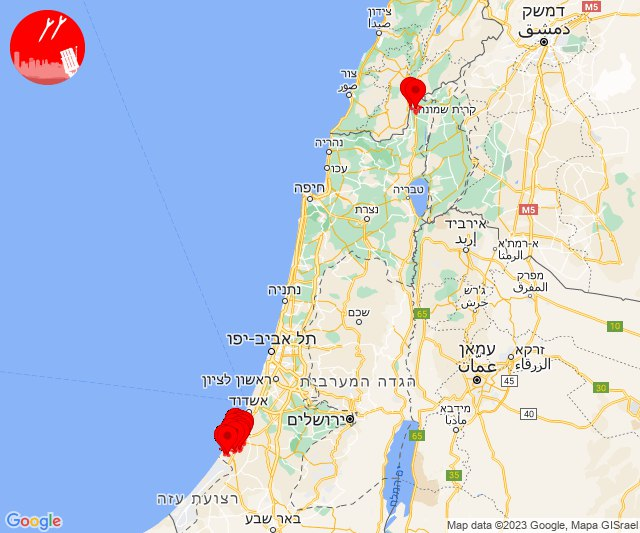
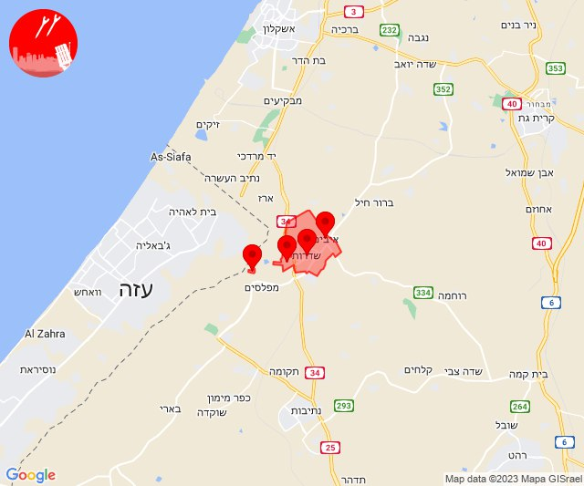
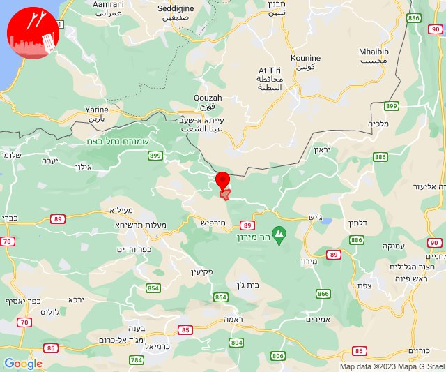
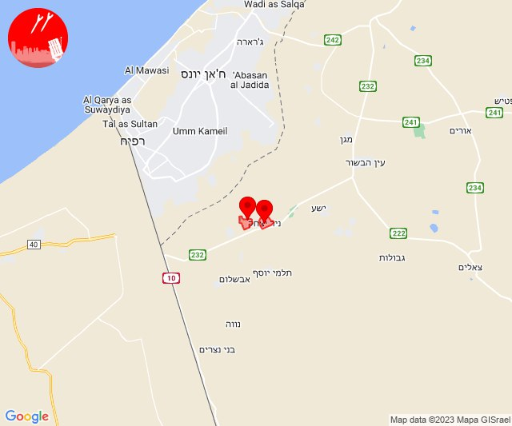

# Alerts for 2023-11-15

## 12:01

🔴 צבע אדום (15/11/2023):

14:00:
• קו העימות: מרגליות, קריית שמונה (מיידי)

14:01:
• מערב לכיש: אשקלון - דרום, אזור תעשייה הדרומי אשקלון, אזור תעשייה צפוני אשקלון, בית שקמה, ברכיה, בת הדר, גיאה, כפר סילבר, משען, אשקלון - צפון, מבקיעים (30 שניות)
• עוטף עזה: כרמיה, זיקים (15 שניות)

צופר - צבע אדום

## 12:01

## 12:05

🔴 צבע אדום (15/11/2023):

14:05:
• קו העימות: משגב עם (מיידי)

צופר - צבע אדום

## 12:05

## 13:00

🔴 צבע אדום (15/11/2023):

15:00:
• עוטף עזה: מטווח ניר עם, שדרות, איבים, ניר עם (15 שניות)

צופר - צבע אדום

## 13:00

## 13:16

🔴 צבע אדום (15/11/2023):

15:16:
• עוטף עזה: שדרות, איבים, ניר עם (15 שניות)

צופר - צבע אדום

## 13:16

## 13:18

🔴 צבע אדום (15/11/2023):

15:18:
• קו העימות: מתת (מיידי)

צופר - צבע אדום

## 13:18

## 15:48

✈️ חדירת כלי טיס עוין (15/11/2023):

17:48:
• קו העימות: דפנה, הגושרים, ע'ג'ר, קיבוץ דן, שאר ישוב, שניר 

צופר - צבע אדום

## 15:48

## 16:15

🔴 צבע אדום (15/11/2023):

18:15:
• עוטף עזה: ניר יצחק, סופה (15 שניות)

צופר - צבע אדום

## 16:15

## 19:20

🔴 צבע אדום (15/11/2023):

21:20:
• עוטף עזה: כפר עזה, סעד (15 שניות)

צופר - צבע אדום

## 19:20

