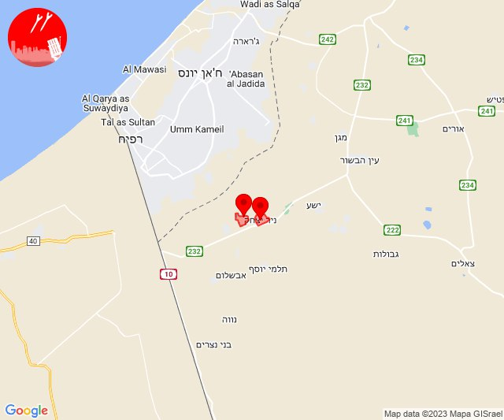

# Alerts for 2023-11-16

## 04:45

🔴 צבע אדום (16/11/2023):

06:45:
• עוטף עזה: סופה, ניר יצחק (15 שניות)

צופר - צבע אדום

## 04:45

## 08:13

🔴 צבע אדום (16/11/2023):

10:13:
• קו העימות: שתולה (מיידי)

צופר - צבע אדום

## 08:13

## 09:22

🔴 צבע אדום (16/11/2023):

11:22:
• עוטף עזה: כפר עזה, נחל עוז, סעד, עלומים (15 שניות)

צופר - צבע אדום

## 09:22

## 10:27

🔴 צבע אדום (16/11/2023):

12:27:
• עוטף עזה: נחל עוז (15 שניות)

צופר - צבע אדום

## 10:27

## 11:59

🔴 צבע אדום (16/11/2023):

13:59:
• עוטף עזה: שדרות, איבים, ניר עם (15 שניות)

צופר - צבע אדום

## 11:59

## 12:35

🔴 צבע אדום (16/11/2023):

14:35:
• קו העימות: אבן מנחם (מיידי)

צופר - צבע אדום

## 12:35

## 12:36

🔴 צבע אדום (16/11/2023):

14:36:
• קו העימות: שתולה (מיידי)

צופר - צבע אדום

## 12:36

## 14:18

🔴 צבע אדום (16/11/2023):

16:18:
• קו העימות: שתולה (מיידי)

צופר - צבע אדום

## 14:18

## 14:29

🔴 צבע אדום (16/11/2023):

16:29:
• עוטף עזה: נירים, עין השלושה, ניר עוז (15 שניות)

צופר - צבע אדום

## 14:29

## 14:47

🔴 צבע אדום (16/11/2023):

16:47:
• עוטף עזה: כרם שלום (15 שניות)

צופר - צבע אדום

## 14:47

