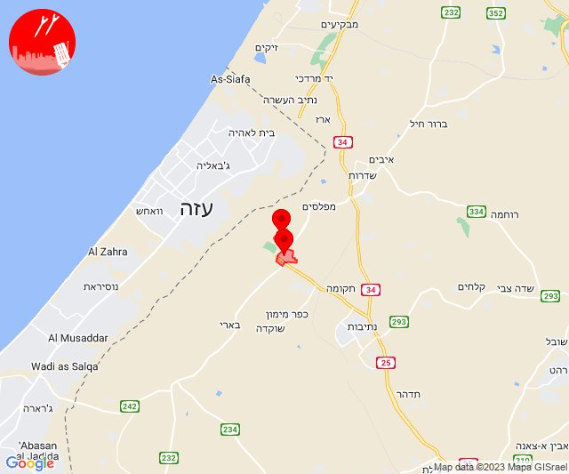
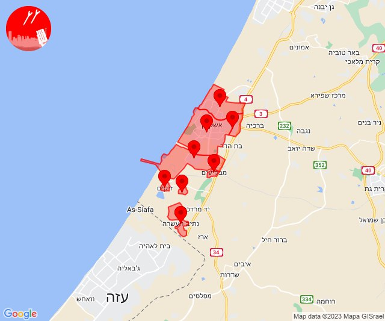
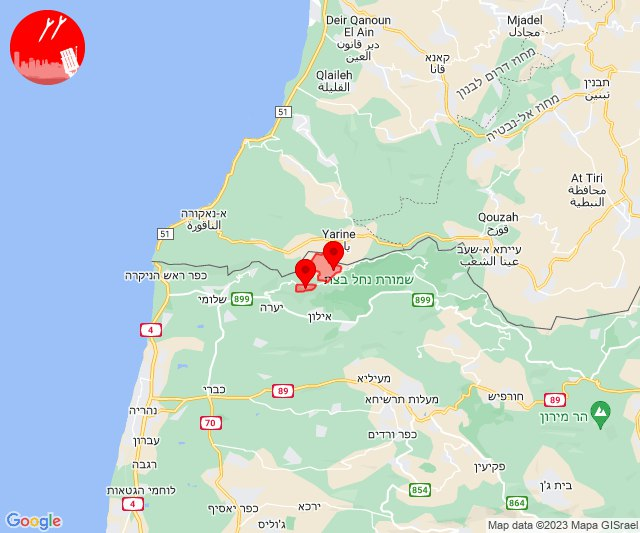
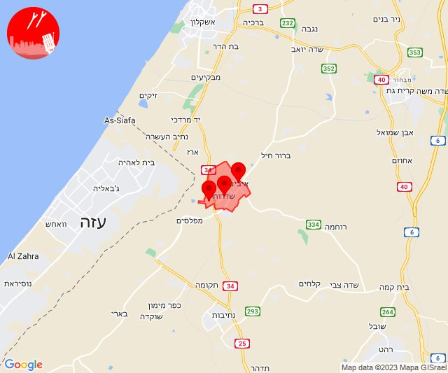
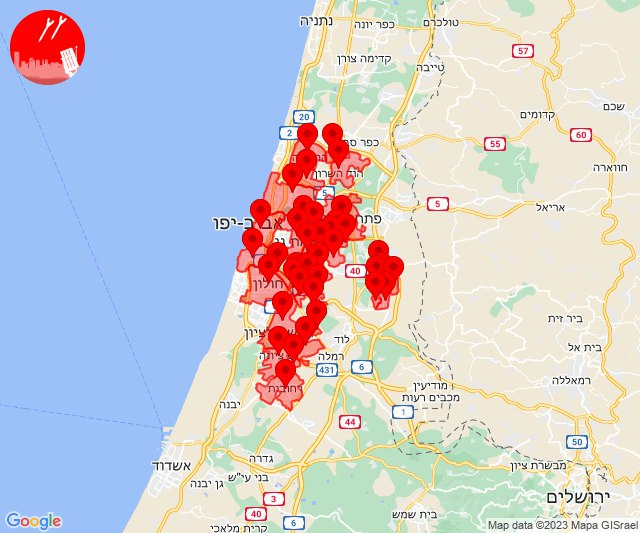
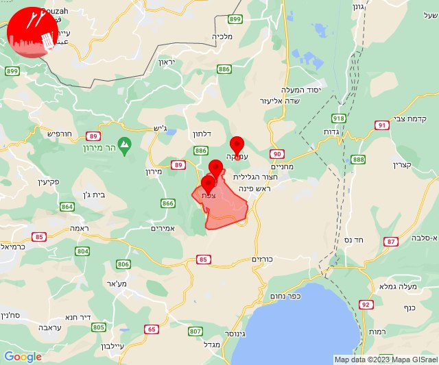

# Alerts for 2023-11-17

## 05:47

🔴 צבע אדום (17/11/2023):

07:47:
• עוטף עזה: כפר עזה, סעד (15 שניות)

צופר - צבע אדום

## 05:47

## 06:31

🔴 צבע אדום (17/11/2023):

08:31:
• עוטף עזה: נירים (15 שניות)

צופר - צבע אדום

## 06:31

## 09:34

🔴 צבע אדום (17/11/2023):

11:34:
• עוטף עזה: כיסופים (15 שניות)

צופר - צבע אדום

## 09:34

## 11:01

🔴 צבע אדום (17/11/2023):

13:01:
• מערב לכיש: אשקלון - צפון, אשקלון - דרום, אזור תעשייה הדרומי אשקלון, מבקיעים, אזור תעשייה צפוני אשקלון (30 שניות)
• עוטף עזה: כרמיה, נתיב העשרה, זיקים (15 שניות)

צופר - צבע אדום

## 11:01

## 11:17

🔴 צבע אדום (17/11/2023):

13:16:
• קו העימות: ערב אל עראמשה (מיידי)

13:17:
• קו העימות: אדמית (מיידי)

צופר - צבע אדום

## 11:17

## 12:30

🔴 צבע אדום (17/11/2023):

14:30:
• עוטף עזה: שדרות, איבים, ניר עם (15 שניות)

צופר - צבע אדום

## 12:30

## 15:03

🔴 צבע אדום (17/11/2023):

17:03:
• עוטף עזה: חולית (15 שניות)

צופר - צבע אדום

## 15:03

## 16:03

🔴 צבע אדום (17/11/2023):

18:01:
• השפלה: באר יעקב, נס ציונה, נצר סרני, ראשון לציון - מזרח, רחובות, תעשיון צריפין (דקה וחצי)

18:02:
• דן: תל אביב - דרום העיר ויפו, תל אביב - מרכז העיר, תל אביב - עבר הירקון, גבעת שמואל, גת רימון, מעש, סביון, פתח תקווה, קריית אונו, רמת גן - מזרח, גני תקווה, הרצליה - מרכז וגליל ים, רמת השרון (דקה וחצי)
• ירקון: גבעת כ''ח, אזור תעשייה חבל מודיעין, בית עריף, ברקת, טירת יהודה, שהם (דקה וחצי)
• שרון: גבעת חן, הוד השרון (דקה וחצי)

18:03:
• דן: אור יהודה, אזור, חולון, בני ברק, רמת גן - מערב (דקה וחצי)
• השפלה: בית דגן, חמד, כפר חב''ד, משמר השבעה, צפריה, גנות (דקה וחצי)

צופר - צבע אדום

## 16:03

## 23:50

🔴 צבע אדום (18/11/2023):

01:50:
• גליל עליון: ביריה, עמוקה, צפת (30 שניות)

צופר - צבע אדום

## 23:50

