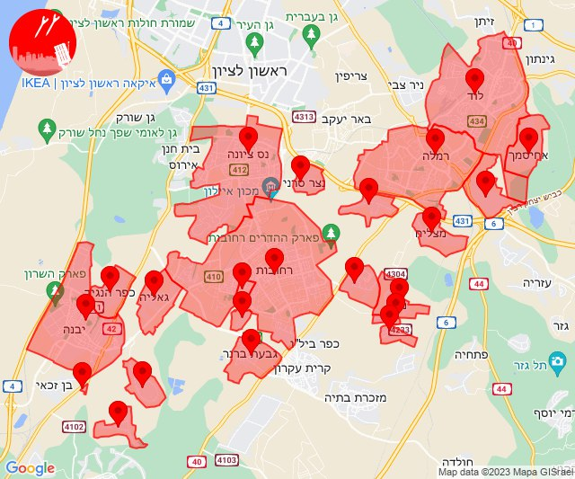

# Alerts for 2023-11-18

## 07:53

🔴 צבע אדום (18/11/2023):

09:53:
• קו העימות: סאסא (מיידי)

צופר - צבע אדום

## 07:53

## 08:00

🔴 צבע אדום (18/11/2023):

10:00:
• קו העימות: שתולה (מיידי)

צופר - צבע אדום

## 08:00

## 11:00

🔴 צבע אדום (18/11/2023):

13:00:
• קו העימות: קריית שמונה, מרגליות (מיידי)

צופר - צבע אדום

## 11:00

## 12:01

🔴 צבע אדום (18/11/2023):

14:01:
• עוטף עזה: נירים (15 שניות)

צופר - צבע אדום

## 12:01

## 12:04

🔴 צבע אדום (18/11/2023):

14:03:
• מערב לכיש: אשקלון - דרום, אשקלון - צפון (30 שניות)

14:04:
• מערב לכיש: אזור תעשייה הדרומי אשקלון, מבקיעים, באר גנים, אזור תעשייה צפוני אשקלון (30 שניות)
• עוטף עזה: כרמיה (15 שניות)

צופר - צבע אדום

## 12:04

## 12:59

🔴 צבע אדום (18/11/2023):

14:59:
• עוטף עזה: שדרות, איבים, ניר עם, מטווח ניר עם (15 שניות)

צופר - צבע אדום

## 12:59

## 15:03

🔴 צבע אדום (18/11/2023):

17:01:
• השפלה: גיבתון, נס ציונה, נצר סרני, רחובות, אזור תעשייה נשר - רמלה, אחיסמך, לוד, מצליח, רמלה (דקה וחצי)

17:02:
• השפלה: גאליה, גן שלמה (דקה, דקה וחצי)
• לכיש: יבנה, כפר הנגיד, גבעת ברנר, בית גמליאל, בניה, מעון צופיה (דקה, דקה וחצי)

17:03:
• השפלה: גני הדר, ישרש, נען, סתריה, רמות מאיר (דקה וחצי)

צופר - צבע אדום

## 15:03

## 19:47

🔴 צבע אדום (18/11/2023):

21:47:
• עוטף עזה: גברעם (15 שניות)

צופר - צבע אדום

## 19:47

## 21:00

🔴 צבע אדום (18/11/2023):

22:59:
• עוטף עזה: שדרות, איבים, ניר עם (15 שניות)

23:00:
• עוטף עזה: מפלסים (15 שניות)

צופר - צבע אדום

## 21:00

