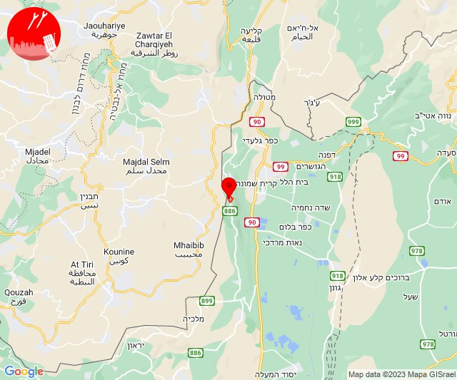

# Alerts for 2023-11-19

## 06:31

🔴 צבע אדום (19/11/2023):

08:31:
• קו העימות: שלומי (מיידי)

צופר - צבע אדום

## 06:31

## 07:50

🔴 צבע אדום (19/11/2023):

09:50:
• עוטף עזה: כפר עזה, נחל עוז, סעד, עלומים (15 שניות)

צופר - צבע אדום

## 07:50

## 07:53

🔴 צבע אדום (19/11/2023):

09:53:
• עוטף עזה: נחל עוז (15 שניות)

צופר - צבע אדום

## 07:53

## 07:56

🔴 צבע אדום (19/11/2023):

09:56:
• קו העימות: מרגליות (מיידי)

צופר - צבע אדום

## 07:56

## 07:58

🔴 צבע אדום (19/11/2023):

09:58:
• קו העימות: מנרה (מיידי)

צופר - צבע אדום

## 07:58

## 08:28

✈️ חדירת כלי טיס עוין (19/11/2023):

10:28:
• קו העימות: אביבים, ברעם, יראון 

צופר - צבע אדום

## 08:28

## 08:29

🔴 צבע אדום (19/11/2023):

10:29:
• קו העימות: יראון (מיידי)

צופר - צבע אדום

## 08:29

## 08:32

✈️ חדירת כלי טיס עוין (19/11/2023):

10:32:
• קו העימות: אזור תעשייה רמת דלתון, ג'ש - גוש חלב, דוב''ב, דלתון, כרם בן זמרה, מתת, סאסא, עלמה, ריחאנייה, בית ספר שדה מירון, חורפיש, פקיעין, צבעון, צוריאל 

צופר - צבע אדום

## 08:32

## 08:33

🔴 צבע אדום (19/11/2023):

10:32:
• קו העימות: ג'ש - גוש חלב (מיידי)

10:33:
• קו העימות: כרם בן זמרה (מיידי)

צופר - צבע אדום

## 08:33

## 08:40

🔴 צבע אדום (19/11/2023):

10:40:
• גליל עליון: אזור תעשייה חצור הגלילית, חצור הגלילית, עמוקה (30 שניות)

צופר - צבע אדום

## 08:40

## 09:30

🔴 צבע אדום (19/11/2023):

11:30:
• קו העימות: משגב עם (מיידי)

צופר - צבע אדום

## 09:30

## 10:42

🔴 צבע אדום (19/11/2023):

12:42:
• עוטף עזה: כיסופים (15 שניות)

צופר - צבע אדום

## 10:42

## 10:45

🔴 צבע אדום (19/11/2023):

12:45:
• קו העימות: בצת, שלומי (מיידי)

צופר - צבע אדום

## 10:45

## 11:11

🔴 צבע אדום (19/11/2023):

13:11:
• עוטף עזה: כיסופים (15 שניות)

צופר - צבע אדום

## 11:11

## 11:14

🔴 צבע אדום (19/11/2023):

13:14:
• עוטף עזה: מפלסים, מטווח ניר עם (15 שניות)

צופר - צבע אדום

## 11:14

## 11:18

🔴 צבע אדום (19/11/2023):

13:18:
• קו העימות: מרגליות (מיידי)

צופר - צבע אדום

## 11:18

## 12:02

🔴 צבע אדום (19/11/2023):

14:01:
• מערב לכיש: אזור תעשייה הדרומי אשקלון, אשקלון - דרום, אשקלון - צפון, אזור תעשייה צפוני אשקלון (30 שניות)
• עוטף עזה: זיקים, כרמיה, נתיב העשרה (15 שניות)

14:02:
• מערב לכיש: מבקיעים (30 שניות)

צופר - צבע אדום

## 12:02

## 12:06

🔴 צבע אדום (19/11/2023):

14:06:
• קו העימות: כפר גלעדי, תל חי (מיידי)

צופר - צבע אדום

## 12:06

## 13:54

🔴 צבע אדום (19/11/2023):

15:54:
• עוטף עזה: כיסופים (15 שניות)

צופר - צבע אדום

## 13:54

## 15:26

🔴 צבע אדום (19/11/2023):

17:26:
• עוטף עזה: כיסופים (15 שניות)

צופר - צבע אדום

## 15:26

## 15:29

🔴 צבע אדום (19/11/2023):

17:29:
• עוטף עזה: כיסופים (15 שניות)

צופר - צבע אדום

## 15:29

## 17:56

🔴 צבע אדום (19/11/2023):

19:56:
• קו העימות: אזור תעשייה רמת דלתון, דלתון (מיידי)

צופר - צבע אדום

## 17:56

