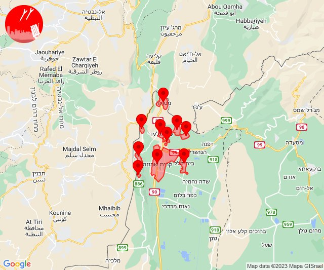

# Alerts for 2023-11-20

## 00:08

🔴 צבע אדום (20/11/2023):

02:08:
• עוטף עזה: נתיב העשרה (15 שניות)

צופר - צבע אדום

## 00:08

## 01:52

🔴 צבע אדום (20/11/2023):

03:52:
• עוטף עזה: מטווח ניר עם (15 שניות)

צופר - צבע אדום

## 01:52

## 01:58

🔴 צבע אדום (20/11/2023):

03:58:
• עוטף עזה: מטווח ניר עם, מפלסים (15 שניות)

צופר - צבע אדום

## 01:58

## 02:25

🔴 צבע אדום (20/11/2023):

04:25:
• עוטף עזה: מפלסים (15 שניות)

צופר - צבע אדום

## 02:25

## 06:24

🔴 צבע אדום (20/11/2023):

08:24:
• עוטף עזה: שדרות, איבים, ניר עם, מטווח ניר עם (15 שניות)

צופר - צבע אדום

## 06:24

## 06:54

🔴 צבע אדום (20/11/2023):

08:54:
• עוטף עזה: ארז, יד מרדכי, נתיב העשרה (15 שניות)

צופר - צבע אדום

## 06:54

## 08:08

🔴 צבע אדום (20/11/2023):

10:07:
• קו העימות: ברעם (מיידי)

10:08:
• עוטף עזה: כיסופים (15 שניות)

צופר - צבע אדום

## 08:08

## 09:19

🔴 צבע אדום (20/11/2023):

11:19:
• עוטף עזה: עין השלושה (15 שניות)

צופר - צבע אדום

## 09:19

## 09:24

🔴 צבע אדום (20/11/2023):

11:24:
• עוטף עזה: נתיב העשרה (15 שניות)

צופר - צבע אדום

## 09:24

## 10:31

🔴 צבע אדום (20/11/2023):

12:31:
• עוטף עזה: כיסופים (15 שניות)

צופר - צבע אדום

## 10:31

## 11:19

🔴 צבע אדום (20/11/2023):

13:19:
• קו העימות: מנרה, מרגליות, קריית שמונה (מיידי)

צופר - צבע אדום

## 11:19

## 11:32

🔴 צבע אדום (20/11/2023):

13:32:
• קו העימות: מנרה, מרגליות, קריית שמונה (מיידי)

צופר - צבע אדום

## 11:32

## 11:55

🔴 צבע אדום (20/11/2023):

13:55:
• קו העימות: שלומי (מיידי)

צופר - צבע אדום

## 11:55

## 12:03

🔴 צבע אדום (20/11/2023):

14:02:
• מערב לכיש: ניצן (45 שניות)
• לכיש: אשדוד - א,ב,ד,ה, אשדוד - יא,יב,טו,יז,מרינה,סיטי (45 שניות)

14:03:
• לכיש: גן הדרום, שתולים (דקה, 45 שניות)
• מערב לכיש: אזור תעשייה צפוני אשקלון, אשקלון - דרום, אשקלון - צפון, באר גנים, כפר סילבר, ניצנים (30 שניות)

צופר - צבע אדום

## 12:03

## 12:20

🔴 צבע אדום (20/11/2023):

14:20:
• עוטף עזה: ניר עוז, נירים (15 שניות)

צופר - צבע אדום

## 12:20

## 12:47

✈️ חדירת כלי טיס עוין (20/11/2023):

14:47:
• קו העימות: אביבים, ברעם, יראון 

צופר - צבע אדום

## 12:47

## 14:02

🔴 צבע אדום (20/11/2023):

16:02:
• עוטף עזה: כרם שלום (15 שניות)

צופר - צבע אדום

## 14:02

## 15:20

🔴 צבע אדום (20/11/2023):

17:20:
• קו העימות: משגב עם (מיידי)

צופר - צבע אדום

## 15:20

## 15:21

✈️ חדירת כלי טיס עוין (20/11/2023):

17:21:
• קו העימות: בית הלל, כפר גלעדי, כפר יובל, מטולה, מנרה, מעיין ברוך, מרגליות, קריית שמונה, תל חי, משגב עם 

צופר - צבע אדום

## 15:21

## 16:03

🔴 צבע אדום (20/11/2023):

18:01:
• לכיש: פלמחים (דקה וחצי)

18:02:
• דן: תל אביב - מרכז העיר, תל אביב - עבר הירקון, רמת גן - מערב (דקה וחצי)

18:03:
• לכיש: אשדוד - אזור תעשייה צפוני ונמל, ניר גלים, יבנה, בני דרום, בית אלעזרי, גדרה, כפר הנגיד, קדרון, אזור תעשייה כנות, בית גמליאל, בן זכאי, בניה, גבעת וושינגטון, כפר אביב, כפר מרדכי, כרם ביבנה, מישר, משגב דב, מתחם בני דרום, נווה מבטח, עשרת, קבוצת יבנה, שדמה, מעון צופיה, גבעת ברנר (45 שניות, דקה, דקה וחצי)
• דן: גבעתיים, תל אביב - מזרח, חולון, תל אביב - דרום העיר ויפו, אור יהודה, אזור, בני ברק, בת-ים, גבעת השלושה, גבעת שמואל, גת רימון, הרצליה - מערב, הרצליה - מרכז וגליל ים, יהוד-מונוסון, כפר סירקין, כפר שמריהו, מעש, מקווה ישראל, סביון, פתח תקווה, קריית אונו, רמת גן - מזרח, רמת השרון, גני תקווה, מגשימים, סינמה סיטי גלילות, מתחם פי גלילות (דקה וחצי)
• שרון: גבעת חן, רעננה, גני עם, הוד השרון, ירקונה, כפר מל''ל, נווה ירק, עדנים, רמות השבים, ארסוף, רשפון, שפיים, מרכז אזורי דרום השרון (דקה וחצי)
• השפלה: גיבתון, גן שלמה, נצר סרני, פארק תעשיות פלמחים, ראשון לציון - מזרח, ראשון לציון - מערב, רחובות, אזור תעשייה נשר - רמלה, אחיסמך, אירוס, באר יעקב, גאליה, בית חנן, בית עובד, בן שמן, גינתון, גן שורק, ישרש, כפר נוער בן שמן, לוד, מצליח, נטעים, ניר צבי, נס ציונה, עיינות, רמלה, תעשיון צריפין, אחיעזר, בית דגן, בית חשמונאי, בית עוזיאל, גני הדר, גני יוחנן, זיתן, חמד, יגל, יד רמב''ם, יציץ, כפר ביל''ו, כפר חב''ד, מזכרת בתיה, משמר השבעה, נען, סתריה, עזריה, פדיה, פתחיה, צפריה, קריית עקרון, רמות מאיר, גנות (דקה וחצי, דקה)
• ירקון: גמזו, כפר דניאל, אלעד, בארות יצחק, בני עטרות, גבעת כ''ח, מזור, נופך, נחלים, נחשונים, עינת, ראש העין, רינתיה, תעשיון חצב, אזור תעשייה חבל מודיעין, בית נחמיה, בית עריף, ברקת, חדיד, טירת יהודה, כפר טרומן, שהם (דקה וחצי)

צופר - צבע אדום

## 16:03

