# Alerts for 2023-11-21

## 02:13

🔴 צבע אדום (21/11/2023):

04:13:
• עוטף עזה: נתיב העשרה (15 שניות)

צופר - צבע אדום

## 02:13

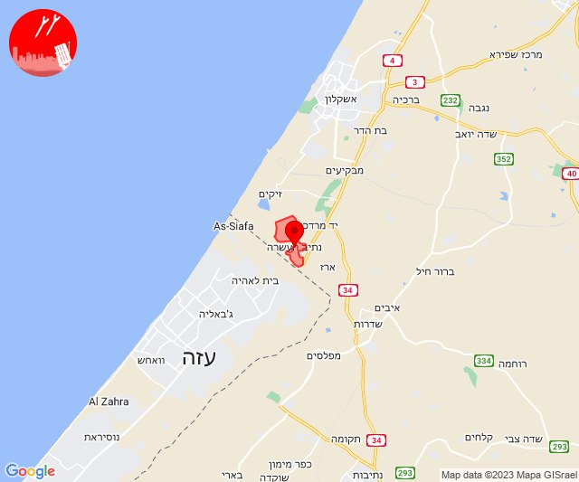

## 05:21

✈️ חדירת כלי טיס עוין (21/11/2023):

07:21:
• קו העימות: קיבוץ דן, דפנה, הגושרים, ע'ג'ר, שאר ישוב, שניר 

צופר - צבע אדום

## 05:21

## 09:20

🔴 צבע אדום (21/11/2023):

11:20:
• קו העימות: ברעם (מיידי)

צופר - צבע אדום

## 09:20

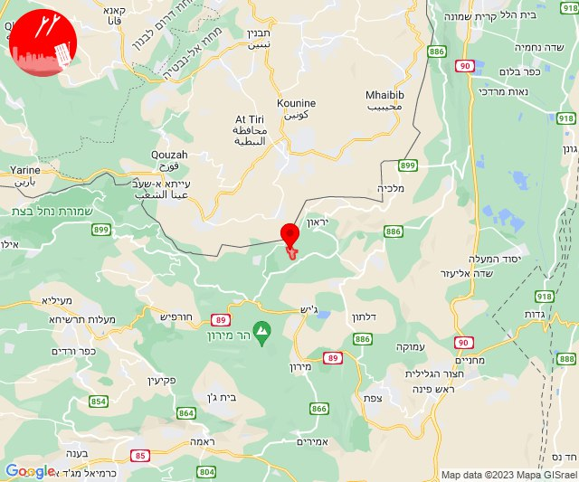

## 10:59

🔴 צבע אדום (21/11/2023):

12:59:
• עוטף עזה: נירים, ניר עוז (15 שניות)

צופר - צבע אדום

## 10:59

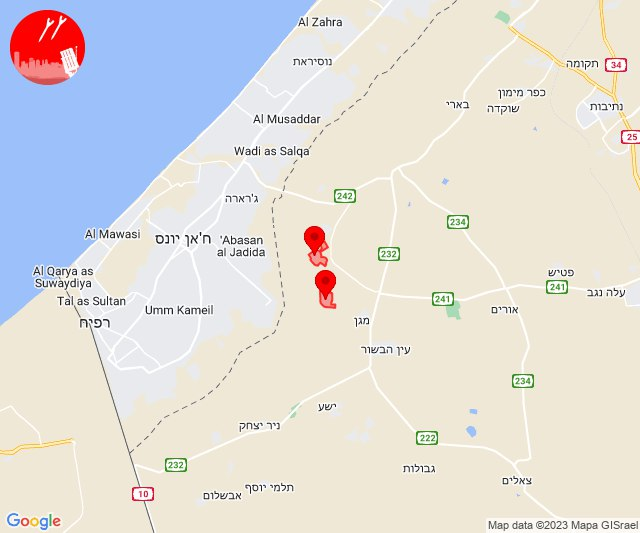

## 11:02

🔴 צבע אדום (21/11/2023):

13:02:
• עוטף עזה: מבטחים, עמיעוז, ישע (15 שניות)

צופר - צבע אדום

## 11:02

## 12:45

🔴 צבע אדום (21/11/2023):

14:45:
• עוטף עזה: עין השלושה (15 שניות)

צופר - צבע אדום

## 12:45

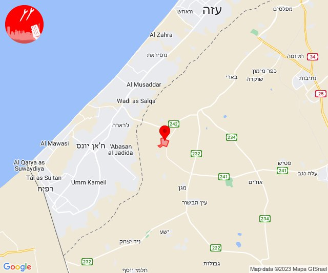

## 12:57

🔴 צבע אדום (21/11/2023):

14:57:
• עוטף עזה: כפר עזה, סעד (15 שניות)

צופר - צבע אדום

## 12:57

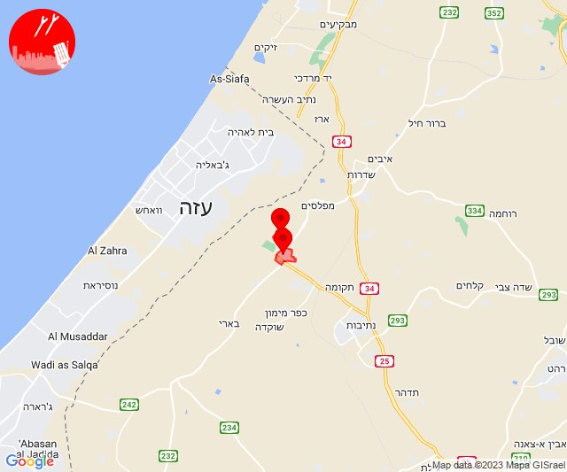

## 13:06

🔴 צבע אדום (21/11/2023):

15:06:
• עוטף עזה: כיסופים (15 שניות)

צופר - צבע אדום

## 13:06

## 14:05

🔴 צבע אדום (21/11/2023):

16:05:
• קו העימות: בית הלל, קריית שמונה, כפר גלעדי, תל חי (מיידי)

צופר - צבע אדום

## 14:05

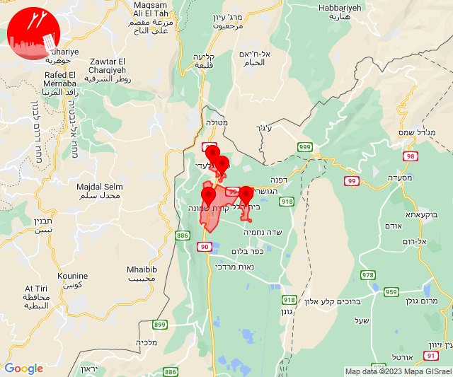

## 14:10

🔴 צבע אדום (21/11/2023):

16:10:
• קו העימות: בית הלל, הגושרים, מעיין ברוך, קריית שמונה, תל חי, כפר יובל (מיידי)

צופר - צבע אדום

## 14:11

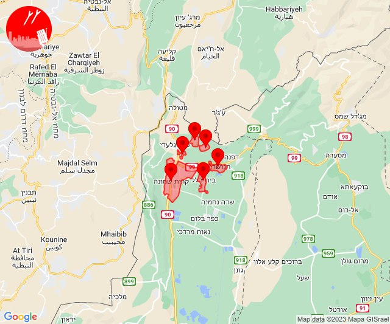

## 14:15

🔴 צבע אדום (21/11/2023):

16:15:
• קו העימות: חניתה, יערה (מיידי)

צופר - צבע אדום

## 14:15

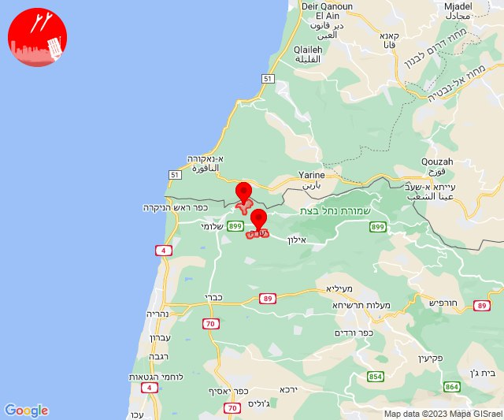

## 14:55

🔴 צבע אדום (21/11/2023):

16:55:
• מערב לכיש: אזור תעשייה הדרומי אשקלון, אשקלון - דרום, מבקיעים (30 שניות)

צופר - צבע אדום

## 14:55

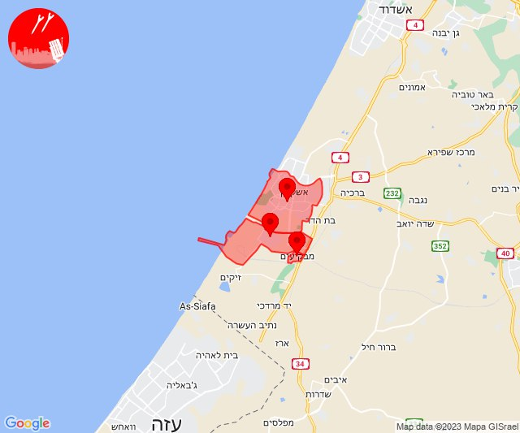

## 16:09

✈️ חדירת כלי טיס עוין (21/11/2023):

18:09:
• קו העימות: אזור תעשייה אכזיב מילואות, בצת, לימן, מצובה, ראש הנקרה, שלומי 

צופר - צבע אדום

## 16:09

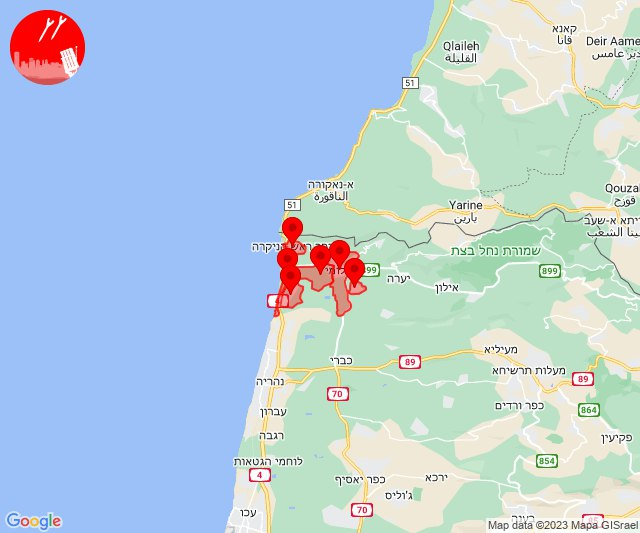

## 16:11

🔴 צבע אדום (21/11/2023):

18:09:
• קו העימות: שלומי (מיידי)

18:10:
• קו העימות: שלומי (מיידי)

18:11:
• קו העימות: בצת (מיידי)

צופר - צבע אדום

## 16:11

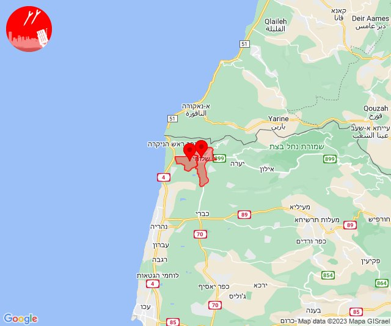

## 16:12

✈️ חדירת כלי טיס עוין (21/11/2023):

18:12:
• קו העימות: אזור תעשייה אכזיב מילואות, בצת, לימן, מצובה, ראש הנקרה, שלומי 

צופר - צבע אדום

## 16:12

## 16:14

✈️ חדירת כלי טיס עוין (21/11/2023):

18:14:
• קו העימות: דוב''ב, מתת, סאסא 

צופר - צבע אדום

## 16:14

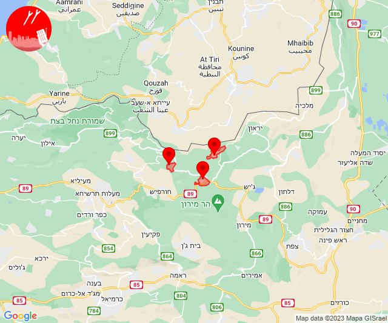

## 16:17

🔴 צבע אדום (21/11/2023):

18:17:
• השפלה: באר יעקב, נס ציונה, פארק תעשיות פלמחים, ראשון לציון - מזרח, ראשון לציון - מערב, גן שורק, נטעים, אירוס, בית חנן, בית עובד (דקה וחצי)
• שפלת יהודה: בקוע, גיזו, הראל, טל שחר, צלפון (דקה וחצי)

צופר - צבע אדום

## 16:17

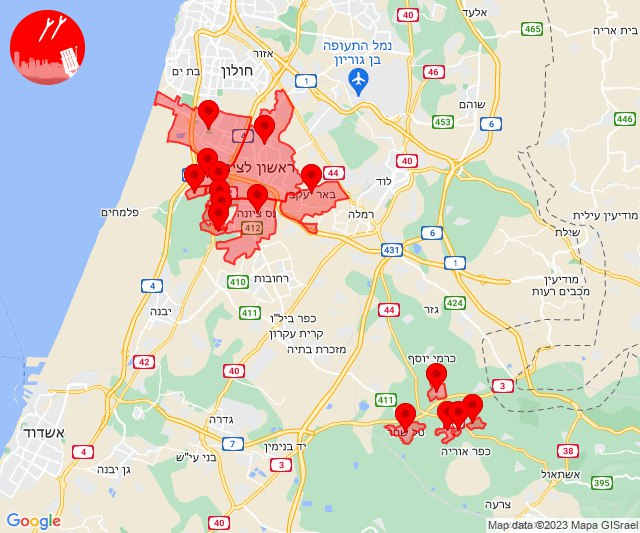

## 16:18

🔴 צבע אדום (21/11/2023):

18:18:
• השפלה: גאליה, רחובות, עיינות (דקה, דקה וחצי)
• לכיש: כפר הנגיד (דקה)
• שפלת יהודה: תירוש, גפן (דקה)

צופר - צבע אדום

## 16:18

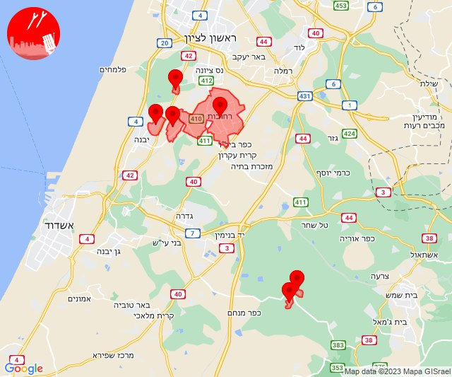

## 16:44

✈️ חדירת כלי טיס עוין (21/11/2023):

18:44:
• קו העימות: קיבוץ דן, דפנה, הגושרים, ע'ג'ר, שאר ישוב, שניר 

צופר - צבע אדום

## 16:44

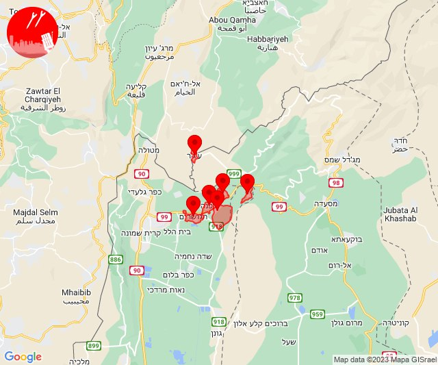

## 19:29

🔴 צבע אדום (21/11/2023):

21:29:
• מרכז הגליל: בועיינה-נוג'ידאת (דקה)

צופר - צבע אדום

## 19:29

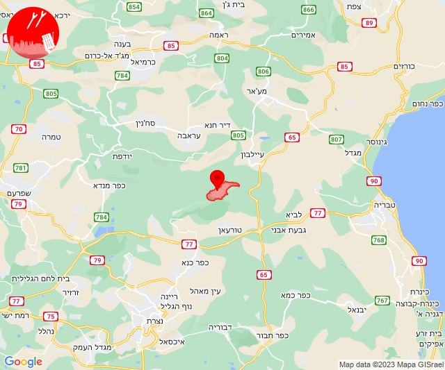

## 21:37

✈️ חדירת כלי טיס עוין (21/11/2023):

23:37:
• קו העימות: חניתה 

צופר - צבע אדום

## 21:37

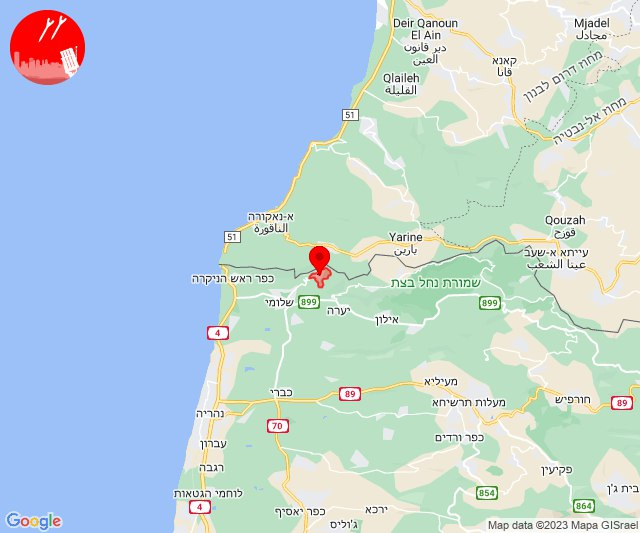

## 21:38

🔴 צבע אדום (21/11/2023):

23:38:
• קו העימות: חניתה, שלומי (מיידי)

צופר - צבע אדום

## 21:38

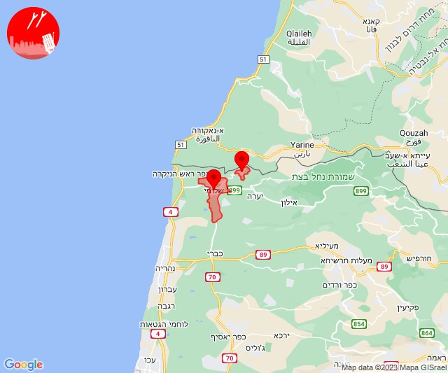

## 21:46

✈️ חדירת כלי טיס עוין (21/11/2023):

23:46:
• קו העימות: ראש הנקרה 

צופר - צבע אדום

## 21:46

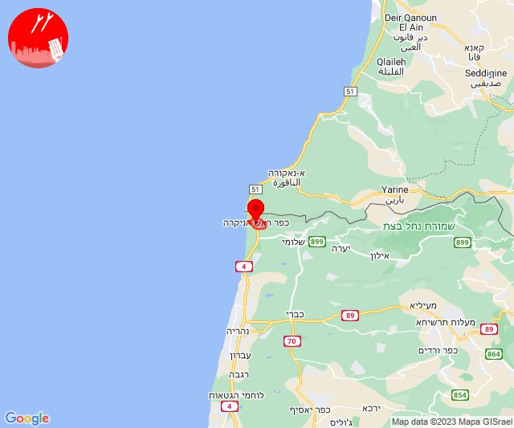

