# Alerts for 2023-11-22

## 05:00

🔴 צבע אדום (22/11/2023):

07:00:
• עוטף עזה: שדרות, איבים, ניר עם, מטווח ניר עם (15 שניות)

צופר - צבע אדום

## 05:00

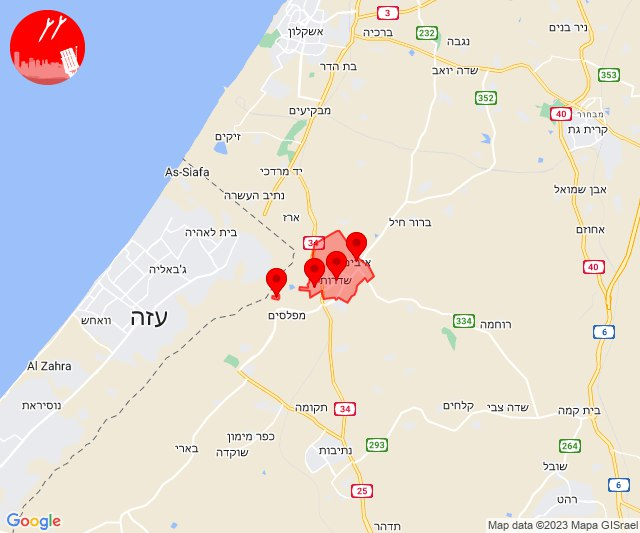

## 05:18

🔴 צבע אדום (22/11/2023):

07:18:
• עוטף עזה: כפר עזה, נחל עוז, סעד, עלומים (15 שניות)

צופר - צבע אדום

## 05:18

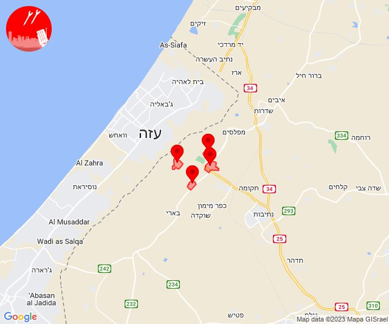

## 08:52

🔴 צבע אדום (22/11/2023):

10:52:
• עוטף עזה: מטווח ניר עם, שדרות, איבים, ניר עם, כפר עזה, מפלסים, מטווח ניר עם (15 שניות)

צופר - צבע אדום

## 08:52

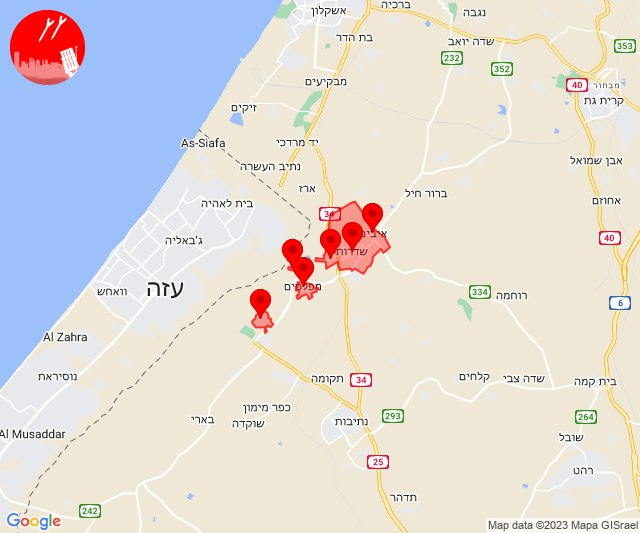

## 09:00

🔴 צבע אדום (22/11/2023):

10:58:
• קו העימות: ראש הנקרה (מיידי)

11:00:
• עוטף עזה: מטווח ניר עם (15 שניות)

צופר - צבע אדום

## 09:00

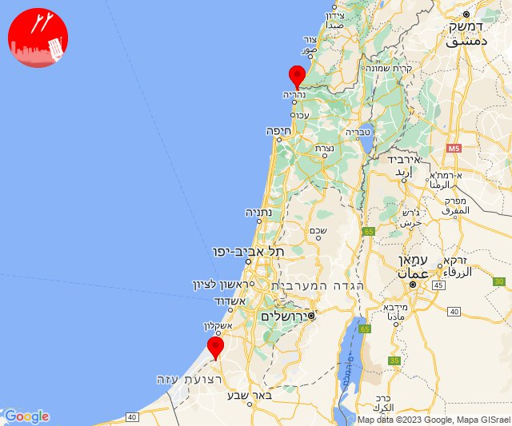

## 09:12

🔴 צבע אדום (22/11/2023):

11:12:
• עוטף עזה: מטווח ניר עם (15 שניות)

צופר - צבע אדום

## 09:12

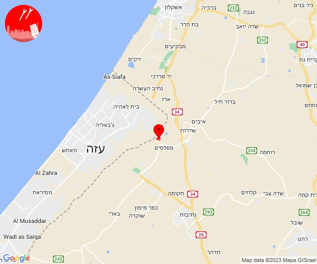

## 09:38

🔴 צבע אדום (22/11/2023):

11:38:
• קו העימות: ראש הנקרה (מיידי)

צופר - צבע אדום

## 09:38

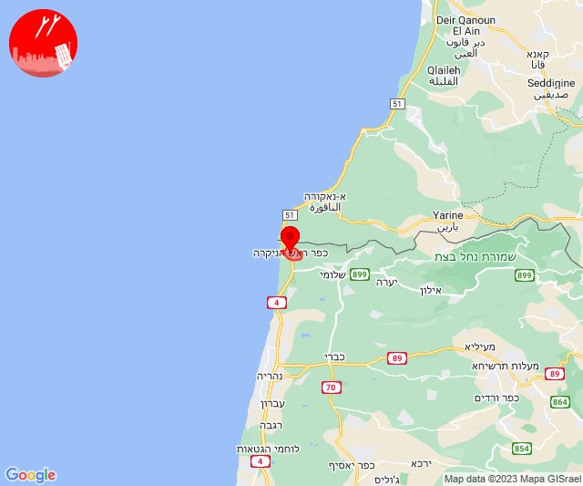

## 10:12

🔴 צבע אדום (22/11/2023):

12:12:
• קו העימות: נטועה (מיידי)

צופר - צבע אדום

## 10:12

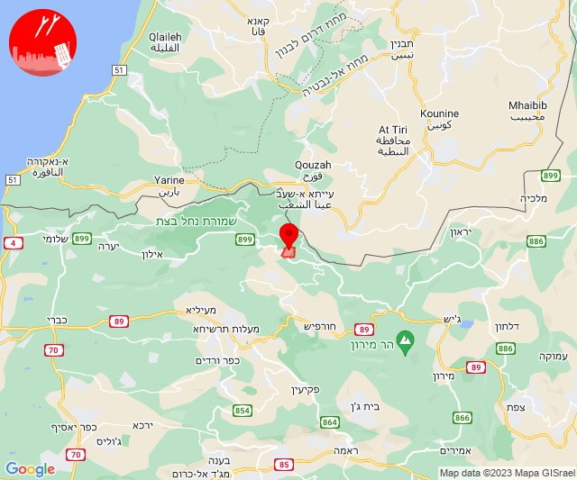

## 11:20

🔴 צבע אדום (22/11/2023):

13:20:
• קו העימות: זרעית (מיידי)
• עוטף עזה: עין השלושה (15 שניות)

צופר - צבע אדום

## 11:20

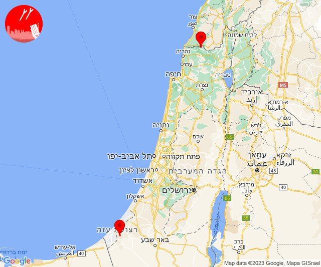

## 11:40

🔴 צבע אדום (22/11/2023):

13:40:
• עוטף עזה: נתיב העשרה, מטווח ניר עם, מפלסים, שדרות, איבים, ניר עם (15 שניות)

צופר - צבע אדום

## 11:40

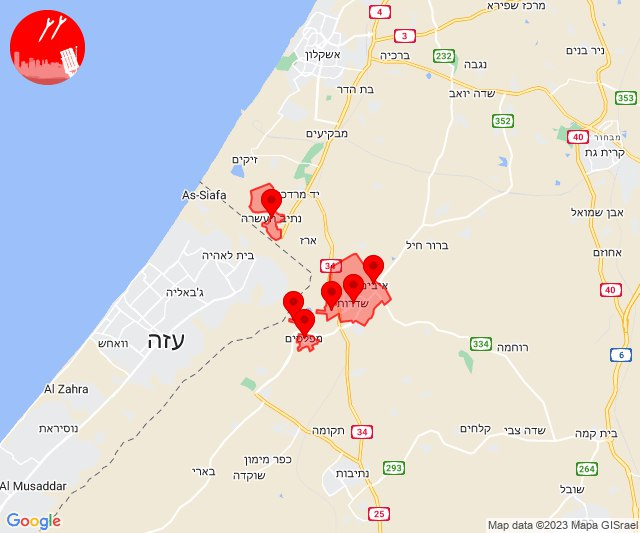

## 13:02

🔴 צבע אדום (22/11/2023):

15:02:
• עוטף עזה: פרי גן, ניר יצחק, סופה (15 שניות)

צופר - צבע אדום

## 13:02

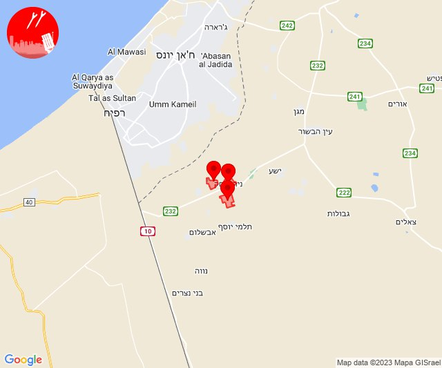

## 13:43

🔴 צבע אדום (22/11/2023):

15:41:
• קו העימות: חניתה (מיידי)

15:43:
• קו העימות: אדמית (מיידי)

צופר - צבע אדום

## 13:43

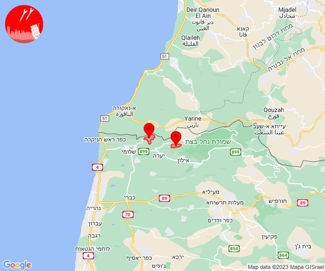

## 14:04

✈️ חדירת כלי טיס עוין (22/11/2023):

16:04:
• אילת: אילת 

צופר - צבע אדום

## 14:04

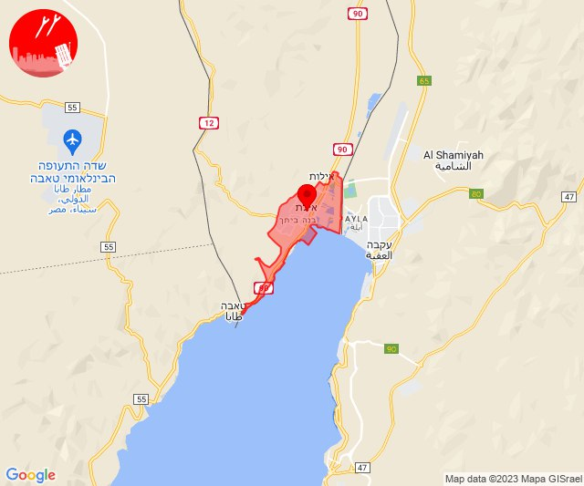

## 14:14

🔴 צבע אדום (22/11/2023):

16:14:
• עוטף עזה: כיסופים (15 שניות)

צופר - צבע אדום

## 14:14

## 14:51

🔴 צבע אדום (22/11/2023):

16:51:
• עוטף עזה: כפר עזה, סעד (15 שניות)

צופר - צבע אדום

## 14:51

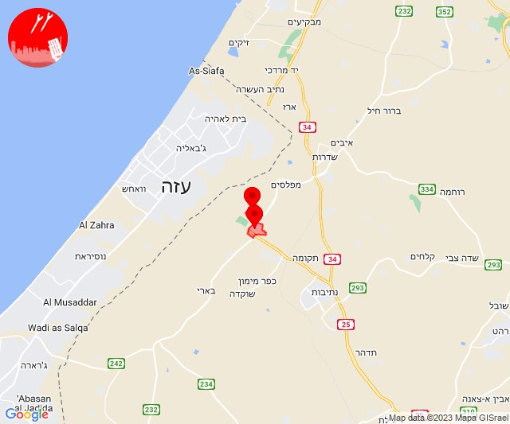

## 15:01

🔴 צבע אדום (22/11/2023):

17:01:
• קו העימות: יפתח, מרכז אזורי מבואות חרמון, רמות נפתלי (מיידי)

צופר - צבע אדום

## 15:01

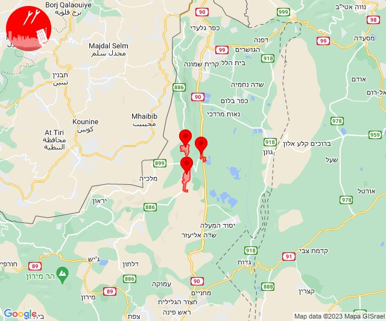

## 15:51

🔴 צבע אדום (22/11/2023):

17:51:
• עוטף עזה: מטווח ניר עם (15 שניות)

צופר - צבע אדום

## 15:51

## 18:11

ערב טוב לכולם.

מערכת צופר פותחה בהתנדבות מלאה, למען אזרחי מדינת ישראל

מתחילת המלחמה (47 ימים), מפתחי צופר עובדים ומתחזקים את המערכות השונות מסביב לשעון, כאשר מולנו מטרה אחת ויחידה - לספק שירות התרעות אמין, מיידי ומציל חיים.

עקב ריבוי המשתמשים נשמח לעזרתכם

יותר ממליון משתמשים נעזרים ומקבלים התרעות מצופר, ועקב ריבוי המשתמשים הגדול אנו נדרשים להרחיב ולשדרג את המערכות, לבצע תחזוקות שוטפות ולשפר מנגנוני אבטחת מידע למניעת התקפות סייבר.

התרומות שלכם יאפשרו לנו להמשיך ולספק לכם שירות התרעות חיוני ומציל חיים.

תרומה באמצעות פייפאל:
https://paypal.me/tzevaadom

תרומה באמצעות פייבוקס:
https://payboxapp.page.link/D61pA1neQXyGhBui7

אנו רוצים להודות מכאן, לכל האנשים הטובים והיקרים שתרמו ותורמים מכספם עבור המערכת!

צופר מחזקת את אזרחי ישראל וחיילי צה״ל
ביחד ננצח! 🇮🇱

איתכם בכל זמן,
צוות צופר

