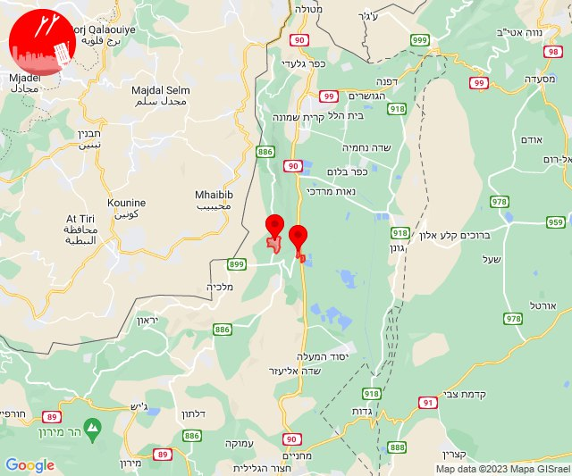

# Alerts for 2023-11-25

## 04:52

✈️ חדירת כלי טיס עוין (25/11/2023):

06:52:
• קו העימות: דישון, יפתח, מלכיה, מרכז אזורי מבואות חרמון, רמות נפתלי 

צופר - צבע אדום

## 04:52

## 04:53

🔴 צבע אדום (25/11/2023):

06:53:
• קו העימות: יפתח, מרכז אזורי מבואות חרמון (מיידי)

צופר - צבע אדום

## 04:53

## 10:47

🔴 צבע אדום (25/11/2023):

12:47:
• קו העימות: אילון, יערה, עבדון (מיידי)

צופר - צבע אדום

## 10:47

