# Alerts for 2023-10-07

## 03:53

🔴 צבע אדום (07/10/2023):

06:29:
• דן: בת-ים (דקה וחצי)
• לכיש: פלמחים, קריית גת, כרמי גת, אזור תעשייה קריית גת, שדה משה, זוהר, ניר ח''ן, שחר (דקה וחצי, 45 שניות, 30 שניות)
• השפלה: ראשון לציון - מערב (דקה וחצי)
• עוטף עזה: נתיב העשרה, יד מרדכי, נחל עוז, ארז, שדרות, איבים, ניר עם, אור הנר, מטווח ניר עם, כפר עזה, זמרת, שובה, תקומה, זיקים (15 שניות)

06:30:
• עוטף עזה: נתיב העשרה, מפלסים, עלומים, ניר עוז, נירים, כיסופים, נחל עוז, סופה, ארז, כרם שלום, עין השלושה, שדרות, איבים, ניר עם, מטווח ניר עם, אור הנר, יבול, חולית, פרי גן (15 שניות)
• לכיש: קריית גת, כרמי גת (45 שניות)
• מערב הנגב: אורים (30 שניות)

06:31:
• מערב הנגב: פטיש, צאלים (30 שניות)
• עוטף עזה: שדה אברהם, נווה, בני נצרים, נתיב העשרה, ניר יצחק, מבטחים, עמיעוז, ישע, צוחר, אוהד, מפלסים, עלומים, שלומית, ניר עוז, נירים, כיסופים, נחל עוז, עין השלושה, שדרות, איבים, ניר עם, סופה, מטווח ניר עם, אבשלום, יתד, כפר עזה, זיקים, כרמיה (15 שניות, 30 שניות)
• לכיש: בית אלעזרי, גדרה, קדרון, אזור תעשייה כנות, ביצרון, בית גמליאל, בני עי''ש, בניה, גבעת וושינגטון, גן הדרום, גן יבנה, חצב, חצור, כנות, כפר אביב, כפר מרדכי, כרם ביבנה, מישר, משגב דב, נווה מבטח, עשרת, קבוצת יבנה, שדמה, עזריקם, שתולים, פארק תעשייה ראם, אשדוד - א,ב,ד,ה, אשדוד - אזור תעשייה צפוני ונמל, אשדוד - ג,ו,ז, אשדוד - ח,ט,י,יג,יד,טז, אשדוד - יא,יב,טו,יז,מרינה,סיטי, ניר גלים, יבנה, כפר הנגיד, בן זכאי, מתחם בני דרום, מעון צופיה, קריית גת, כרמי גת, בני דרום (דקה, 45 שניות)
• מערב לכיש: אזור תעשייה הדרומי אשקלון, ניצן, אשקלון - דרום, אשקלון - צפון, באר גנים (30 שניות, 45 שניות)
• דן: חולון (דקה וחצי)
• השפלה: פארק תעשיות פלמחים, ראשון לציון - מזרח, ראשון לציון - מערב, גן שורק, נטעים, רחובות, גאליה, עיינות, בית חנן (דקה וחצי, דקה)

06:32:
• עוטף עזה: גברעם, נתיב העשרה, ניר יצחק, מבטחים, עמיעוז, ישע, ארז, עלומים, נירים, נחל עוז, שדרות, איבים, ניר עם, אור הנר, סופה, סעד, כיסופים, זיקים (15 שניות)
• לכיש: ניר ח''ן, שחר, אמונים, בית עזרא, גבעתי, עזר, גת, פלמחים, אשדוד - א,ב,ד,ה, אשדוד - אזור תעשייה צפוני ונמל, אשדוד - ג,ו,ז, אשדוד - ח,ט,י,יג,יד,טז, אשדוד - יא,יב,טו,יז,מרינה,סיטי, בני דרום, ניר גלים (30 שניות, 45 שניות, דקה וחצי)
• דן: בת-ים (דקה וחצי)
• שפלת יהודה: בית ניר, גלאון (דקה, 45 שניות)
• מערב לכיש: אזור תעשייה צפוני אשקלון, אשקלון - דרום, אשקלון - צפון, באר גנים, אזור תעשייה הדרומי אשקלון (30 שניות)
• מערב הנגב: גבולות, אופקים (30 שניות, 45 שניות)

06:33:
• עוטף עזה: ניר עוז, מטווח ניר עם, מפלסים, גברעם, נתיב העשרה, מבטחים, עמיעוז, ישע, כרם שלום, יד מרדכי, שדרות, איבים, ניר עם, אור הנר, נירים, נחל עוז, עלומים, כיסופים (15 שניות)
• לכיש: נהורה, נוגה, ניר ח''ן, שחר, גן הדרום, גן יבנה, כפר אביב, כרם ביבנה, מתחם בני דרום, קבוצת יבנה, קריית גת, כרמי גת, יבנה, בית גמליאל, בן זכאי, אזור תעשייה עד הלום, אשדוד - א,ב,ד,ה, אשדוד - אזור תעשייה צפוני ונמל, אשדוד - ג,ו,ז, אשדוד - ח,ט,י,יג,יד,טז, אשדוד - יא,יב,טו,יז,מרינה,סיטי, בני דרום, ניר גלים, שדה עוזיהו, שתולים, עוצם (30 שניות, דקה, 45 שניות)
• השפלה: גיבתון, גן שלמה, נצר סרני, ראשון לציון - מזרח, רחובות, באר יעקב, ישרש, נס ציונה, רמלה, תעשיון צריפין, פארק תעשיות פלמחים, ראשון לציון - מערב, גן שורק, נטעים, גאליה (דקה וחצי, דקה)
• שפלת יהודה: שריגים - ליאון, גבעת ישעיהו (דקה)
• דן: תל אביב - מזרח, תל אביב - עבר הירקון, אזור, בני ברק, גבעתיים, הרצליה - מרכז וגליל ים, חולון, רמת גן - מערב, רמת השרון (דקה וחצי)
• שרון: גבעת חן, רעננה, הוד השרון, חרות, כפר סבא, שדה ורבורג (דקה וחצי)
• מערב הנגב: אורים, פטיש (30 שניות)
• מערב לכיש: אזור תעשייה הדרומי אשקלון (30 שניות)

06:34:
• עוטף עזה: זמרת, שובה, מטווח ניר עם, זיקים, תקומה, כפר עזה, סעד, ניר עוז, נתיב העשרה, מבטחים, עמיעוז, ישע, שדרות, איבים, ניר עם, כרם שלום, נירים, מגן, אור הנר, בארי (15 שניות)
• מערב הנגב: יושיביה, אופקים (15 שניות, 45 שניות)
• מרכז הנגב: נבטים, שגב שלום והפזורה, תל שבע, באר שבע - דרום, באר שבע - מערב, חצרים, באר שבע - מזרח, באר שבע - צפון, עומר (דקה וחצי, דקה)
• דרום הנגב: סעייה-מולדה והפזורה, אבו-תלול והפזורה (דקה וחצי)
• שפלת יהודה: צפרירים, גבעת ישעיהו, אביעזר, אדרת, גבעות עדן, נווה מיכאל - רוגלית, נתיב הל''ה (דקה, דקה וחצי)

## 04:02

• לכיש: גבעת ברנר, אורות, בית אלעזרי, גדרה, קדרון, אזור תעשייה כנות, ביצרון, בני עי''ש, בניה, גבעת וושינגטון, גן הדרום, גן יבנה, חצב, חצור, כנות, כפר אביב, כפר מרדכי, כרם ביבנה, מישר, משגב דב, נווה מבטח, עשרת, קבוצת יבנה, שדמה, פארק תעשייה ראם, עזריקם, שתולים (דקה וחצי, 45 שניות, דקה)
• מערב לכיש: אשקלון - דרום, אשקלון - צפון (30 שניות)

06:35:
• עוטף עזה: עין השלושה, נחל עוז, כיסופים, עלומים, ניר עוז, כפר עזה, סעד, שדרות, איבים, ניר עם, נירים, זיקים, כרם שלום, נתיב העשרה (15 שניות)
• דרום הנגב: ערערה בנגב, אל פורעה והפזורה, כסייפה והפזורה, ערד, תל ערד והפזורה, מדרשת בן גוריון, שאנטי במדבר (דקה וחצי)
• לכיש: זוהר, ניר ח''ן, בית חלקיה, בני ראם, חפץ חיים, יד בנימין, רבדים (30 שניות, דקה)
• מערב לכיש: חלץ (30 שניות)
• מערב הנגב: בית הגדי, נתיבות (30 שניות)

06:36:
• עוטף עזה: מפלסים, נחל עוז, כיסופים, עלומים, מבטחים, עמיעוז, ישע, תקומה, אור הנר, ניר עוז, זמרת, שובה, כפר מימון ותושיה, בני נצרים, נירים, מטווח ניר עם, שלומית, שדרות, איבים, ניר עם (15 שניות, 30 שניות)
• שפלת יהודה: גפן, גלאון (דקה, 45 שניות)
• לכיש: קריית גת, כרמי גת, גת, שדה משה (45 שניות)
• מערב הנגב: פטיש (30 שניות)

06:37:
• עוטף עזה: נתיב העשרה, נחל עוז, נווה, כיסופים, כפר עזה, סופה, מבטחים, עמיעוז, ישע, גבים, מכללת ספיר, מפלסים, אור הנר, מגן (15 שניות, 30 שניות)
• מרכז הנגב: חצרים (דקה)
• השפלה: רחובות, גאליה, גיבתון, גן שלמה (דקה וחצי, דקה)
• לכיש: יבנה, בית גמליאל, בניה, קריית גת, כרמי גת, מנוחה, נחלה, גבעת ברנר (דקה, 45 שניות, דקה וחצי)

06:38:
• עוטף עזה: נתיב העשרה, כיסופים, בני נצרים, ניר עוז, עין הבשור, צוחר, אוהד, שדה ניצן, תלמי אליהו, תלמי יוסף, נירים, שדרות, איבים, ניר עם, שלומית, אור הנר, כפר עזה (15 שניות, 30 שניות)
• מערב הנגב: צאלים, פטיש (30 שניות)
• דן: אזור, חולון (דקה וחצי)
• השפלה: פארק תעשיות פלמחים, ראשון לציון - מזרח, ראשון לציון - מערב, אירוס, בית חנן, בית עובד, גן שורק, נטעים, נס ציונה, עיינות, בית דגן, משמר השבעה, גנות (דקה וחצי)

06:39:
• עוטף עזה: סעד, כיסופים, בני נצרים, סופה, בארי, שדרות, איבים, ניר עם, גבים, מכללת ספיר, מפלסים, מטווח ניר עם (15 שניות, 30 שניות)
• לכיש: אל עזי, יבנה, כפר הנגיד, כפר הרי''ף וצומת ראם (45 שניות, דקה)
• מרכז הנגב: נבטים, תל שבע (דקה וחצי)
• דרום הנגב: סעייה-מולדה והפזורה, אבו-תלול והפזורה (דקה וחצי)

06:40:
• עוטף עזה: נתיב העשרה, שלומית, חולית, כיסופים, אור הנר, מבטחים, עמיעוז, ישע, בני נצרים, מפלסים, שדרות, איבים, ניר עם (15 שניות, 30 שניות)
• השפלה: רחובות, גאליה (דקה וחצי, דקה)
• מערב הנגב: חוות שיקמים, אורים (15 שניות, 30 שניות)
• לכיש: לכיש (45 שניות)
• מערב לכיש: אשקלון - צפון (30 שניות)

06:41:
• עוטף עזה: ניר יצחק, סופה, גבים, מכללת ספיר, אור הנר, שלומית, מבטחים, עמיעוז, ישע, נתיב העשרה, נירים, עין השלושה, בני נצרים, כיסופים (15 שניות, 30 שניות)
• דרום הנגב: ערערה בנגב (דקה וחצי)
• מרכז הנגב: שגב שלום והפזורה (דקה וחצי)
• מערב לכיש: ניצן (45 שניות)

06:42:
• עוטף עזה: ניר יצחק, נווה, שדרות, איבים, ניר עם, אור הנר, כרם שלום, מבטחים, עמיעוז, ישע, שלומית, נתיב העשרה, כיסופים, יבול, סופה, מפלסים (15 שניות, 30 שניות)
• דרום הנגב: אבו-תלול והפזורה (דקה וחצי)
• מערב לכיש: אשקלון - צפון (30 שניות)
• מערב הנגב: פטיש (30 שניות)
• דן: בת-ים, חולון (דקה וחצי)
• השפלה: פארק תעשיות פלמחים, ראשון לציון - מערב, גן שורק (דקה וחצי)
• לכיש: פלמחים (דקה וחצי)

06:43:
• עוטף עזה: בני נצרים, ניר יצחק, פרי גן, חולית, עין השלושה, מטווח ניר עם, שדרות, איבים, ניר עם, נתיב העשרה (30 שניות, 15 שניות)
• לכיש: גדרה, אזור תעשייה כנות, ביצרון, בני עי''ש, כנות, מישר, נווה מבטח, כפר מרדכי, משגב דב, גני טל, קדרון, חצב, קריית גת, כרמי גת (דקה, 45 שניות)
• דרום הנגב: כסייפה והפזורה, מרעית, סעייה-מולדה והפזורה, הר הנגב (דקה וחצי)
• מרכז הנגב: אל סייד והפזורה, חורה, תל שבע, אום בטין והפזורה, עומר (דקה וחצי, דקה)
• מערב הנגב: אופקים, מסלול, דניאל, פטיש (45 שניות, 30 שניות)
• השפלה: אזור תעשייה נשר - רמלה, לוד, מצליח, יד רמב''ם, נען, עזריה (דקה וחצי)

06:44:
• השפלה: גני הדר, פתחיה, רמות מאיר (דקה וחצי)
• עוטף עזה: כיסופים, ארז, בני נצרים, שלומית, אור הנר, מבטחים, עמיעוז, ישע, גברעם, מטווח ניר עם (15 שניות, 30 שניות)
• לכיש: בני ראם, פארק תעשייה ראם, תלמי יחיאל, יד נתן, שדה יואב (דקה, 45 שניות, 30 שניות)

## 04:06

• לכיש: גבעת ברנר, אורות, בית אלעזרי, גדרה, קדרון, אזור תעשייה כנות, ביצרון, בני עי''ש, בניה, גבעת וושינגטון, גן הדרום, גן יבנה, חצב, חצור, כנות, כפר אביב, כפר מרדכי, כרם ביבנה, מישר, משגב דב, נווה מבטח, עשרת, קבוצת יבנה, שדמה, פארק תעשייה ראם, עזריקם, שתולים (דקה וחצי, 45 שניות, דקה)
• מערב לכיש: אשקלון - דרום, אשקלון - צפון (30 שניות)

06:35:
• עוטף עזה: עין השלושה, נחל עוז, כיסופים, עלומים, ניר עוז, כפר עזה, סעד, שדרות, איבים, ניר עם, נירים, זיקים, כרם שלום, נתיב העשרה (15 שניות)
• דרום הנגב: ערערה בנגב, אל פורעה והפזורה, כסייפה והפזורה, ערד, תל ערד והפזורה, מדרשת בן גוריון, שאנטי במדבר (דקה וחצי)
• לכיש: זוהר, ניר ח''ן, בית חלקיה, בני ראם, חפץ חיים, יד בנימין, רבדים (30 שניות, דקה)
• מערב לכיש: חלץ (30 שניות)
• מערב הנגב: בית הגדי, נתיבות (30 שניות)

06:36:
• עוטף עזה: מפלסים, נחל עוז, כיסופים, עלומים, מבטחים, עמיעוז, ישע, תקומה, אור הנר, ניר עוז, זמרת, שובה, כפר מימון ותושיה, בני נצרים, נירים, מטווח ניר עם, שלומית, שדרות, איבים, ניר עם (15 שניות, 30 שניות)
• שפלת יהודה: גפן, גלאון (דקה, 45 שניות)
• לכיש: קריית גת, כרמי גת, גת, שדה משה (45 שניות)
• מערב הנגב: פטיש (30 שניות)

06:37:
• עוטף עזה: נתיב העשרה, נחל עוז, נווה, כיסופים, כפר עזה, סופה, מבטחים, עמיעוז, ישע, גבים, מכללת ספיר, מפלסים, אור הנר, מגן (15 שניות, 30 שניות)
• מרכז הנגב: חצרים (דקה)
• השפלה: רחובות, גאליה, גיבתון, גן שלמה (דקה וחצי, דקה)
• לכיש: יבנה, בית גמליאל, בניה, קריית גת, כרמי גת, מנוחה, נחלה, גבעת ברנר (דקה, 45 שניות, דקה וחצי)

06:38:
• עוטף עזה: נתיב העשרה, כיסופים, בני נצרים, ניר עוז, עין הבשור, צוחר, אוהד, שדה ניצן, תלמי אליהו, תלמי יוסף, נירים, שדרות, איבים, ניר עם, שלומית, אור הנר, כפר עזה (15 שניות, 30 שניות)
• מערב הנגב: צאלים, פטיש (30 שניות)
• דן: אזור, חולון (דקה וחצי)
• השפלה: פארק תעשיות פלמחים, ראשון לציון - מזרח, ראשון לציון - מערב, אירוס, בית חנן, בית עובד, גן שורק, נטעים, נס ציונה, עיינות, בית דגן, משמר השבעה, גנות (דקה וחצי)

06:39:
• עוטף עזה: סעד, כיסופים, בני נצרים, סופה, בארי, שדרות, איבים, ניר עם, גבים, מכללת ספיר, מפלסים, מטווח ניר עם (15 שניות, 30 שניות)
• לכיש: אל עזי, יבנה, כפר הנגיד, כפר הרי''ף וצומת ראם (45 שניות, דקה)
• מרכז הנגב: נבטים, תל שבע (דקה וחצי)
• דרום הנגב: סעייה-מולדה והפזורה, אבו-תלול והפזורה (דקה וחצי)

06:40:
• עוטף עזה: נתיב העשרה, שלומית, חולית, כיסופים, אור הנר, מבטחים, עמיעוז, ישע, בני נצרים, מפלסים, שדרות, איבים, ניר עם (15 שניות, 30 שניות)
• השפלה: רחובות, גאליה (דקה וחצי, דקה)
• מערב הנגב: חוות שיקמים, אורים (15 שניות, 30 שניות)
• לכיש: לכיש (45 שניות)
• מערב לכיש: אשקלון - צפון (30 שניות)

06:41:
• עוטף עזה: ניר יצחק, סופה, גבים, מכללת ספיר, אור הנר, שלומית, מבטחים, עמיעוז, ישע, נתיב העשרה, נירים, עין השלושה, בני נצרים, כיסופים (15 שניות, 30 שניות)
• דרום הנגב: ערערה בנגב (דקה וחצי)
• מרכז הנגב: שגב שלום והפזורה (דקה וחצי)
• מערב לכיש: ניצן (45 שניות)

06:42:
• עוטף עזה: ניר יצחק, נווה, שדרות, איבים, ניר עם, אור הנר, כרם שלום, מבטחים, עמיעוז, ישע, שלומית, נתיב העשרה, כיסופים, יבול, סופה, מפלסים (15 שניות, 30 שניות)
• דרום הנגב: אבו-תלול והפזורה (דקה וחצי)
• מערב לכיש: אשקלון - צפון (30 שניות)
• מערב הנגב: פטיש (30 שניות)
• דן: בת-ים, חולון (דקה וחצי)
• השפלה: פארק תעשיות פלמחים, ראשון לציון - מערב, גן שורק (דקה וחצי)
• לכיש: פלמחים (דקה וחצי)

06:43:
• עוטף עזה: בני נצרים, ניר יצחק, פרי גן, חולית, עין השלושה, מטווח ניר עם, שדרות, איבים, ניר עם, נתיב העשרה (30 שניות, 15 שניות)
• לכיש: גדרה, אזור תעשייה כנות, ביצרון, בני עי''ש, כנות, מישר, נווה מבטח, כפר מרדכי, משגב דב, גני טל, קדרון, חצב, קריית גת, כרמי גת (דקה, 45 שניות)
• דרום הנגב: כסייפה והפזורה, מרעית, סעייה-מולדה והפזורה, הר הנגב (דקה וחצי)
• מרכז הנגב: אל סייד והפזורה, חורה, תל שבע, אום בטין והפזורה, עומר (דקה וחצי, דקה)
• מערב הנגב: אופקים, מסלול, דניאל, פטיש (45 שניות, 30 שניות)
• השפלה: אזור תעשייה נשר - רמלה, לוד, מצליח, יד רמב''ם, נען, עזריה (דקה וחצי)

06:44:
• השפלה: גני הדר, פתחיה, רמות מאיר (דקה וחצי)
• עוטף עזה: כיסופים, ארז, בני נצרים, שלומית, אור הנר, מבטחים, עמיעוז, ישע, גברעם, מטווח ניר עם (15 שניות, 30 שניות)
• לכיש: בני ראם, פארק תעשייה ראם, תלמי יחיאל, יד נתן, שדה יואב (דקה, 45 שניות, 30 שניות)

## 04:09

🔴 צבע אדום (07/10/2023):

06:29:
• דן: בת-ים (דקה וחצי)
• לכיש: פלמחים, קריית גת, כרמי גת, אזור תעשייה קריית גת, שדה משה, זוהר, ניר ח''ן, שחר (דקה וחצי, 45 שניות, 30 שניות)
• השפלה: ראשון לציון - מערב (דקה וחצי)
• עוטף עזה: נתיב העשרה, יד מרדכי, נחל עוז, ארז, שדרות, איבים, ניר עם, אור הנר, מטווח ניר עם, כפר עזה, זמרת, שובה, תקומה, זיקים (15 שניות)

06:30:
• עוטף עזה: נתיב העשרה, מפלסים, עלומים, ניר עוז, נירים, כיסופים, נחל עוז, סופה, ארז, כרם שלום, עין השלושה, שדרות, איבים, ניר עם, מטווח ניר עם, אור הנר, יבול, חולית, פרי גן (15 שניות)
• לכיש: קריית גת, כרמי גת (45 שניות)
• מערב הנגב: אורים (30 שניות)

06:31:
• מערב הנגב: פטיש, צאלים (30 שניות)
• עוטף עזה: שדה אברהם, נווה, בני נצרים, נתיב העשרה, ניר יצחק, מבטחים, עמיעוז, ישע, צוחר, אוהד, מפלסים, עלומים, שלומית, ניר עוז, נירים, כיסופים, נחל עוז, עין השלושה, שדרות, איבים, ניר עם, סופה, מטווח ניר עם, אבשלום, יתד, כפר עזה, זיקים, כרמיה (15 שניות, 30 שניות)
• לכיש: בית אלעזרי, גדרה, קדרון, אזור תעשייה כנות, ביצרון, בית גמליאל, בני עי''ש, בניה, גבעת וושינגטון, גן הדרום, גן יבנה, חצב, חצור, כנות, כפר אביב, כפר מרדכי, כרם ביבנה, מישר, משגב דב, נווה מבטח, עשרת, קבוצת יבנה, שדמה, עזריקם, שתולים, פארק תעשייה ראם, אשדוד - א,ב,ד,ה, אשדוד - אזור תעשייה צפוני ונמל, אשדוד - ג,ו,ז, אשדוד - ח,ט,י,יג,יד,טז, אשדוד - יא,יב,טו,יז,מרינה,סיטי, ניר גלים, יבנה, כפר הנגיד, בן זכאי, מתחם בני דרום, מעון צופיה, קריית גת, כרמי גת, בני דרום (דקה, 45 שניות)
• מערב לכיש: אזור תעשייה הדרומי אשקלון, ניצן, אשקלון - דרום, אשקלון - צפון, באר גנים (30 שניות, 45 שניות)
• דן: חולון (דקה וחצי)
• השפלה: פארק תעשיות פלמחים, ראשון לציון - מזרח, ראשון לציון - מערב, גן שורק, נטעים, רחובות, גאליה, עיינות, בית חנן (דקה וחצי, דקה)

06:32:
• עוטף עזה: גברעם, נתיב העשרה, ניר יצחק, מבטחים, עמיעוז, ישע, ארז, עלומים, נירים, נחל עוז, שדרות, איבים, ניר עם, אור הנר, סופה, סעד, כיסופים, זיקים (15 שניות)
• לכיש: ניר ח''ן, שחר, אמונים, בית עזרא, גבעתי, עזר, גת, פלמחים, אשדוד - א,ב,ד,ה, אשדוד - אזור תעשייה צפוני ונמל, אשדוד - ג,ו,ז, אשדוד - ח,ט,י,יג,יד,טז, אשדוד - יא,יב,טו,יז,מרינה,סיטי, בני דרום, ניר גלים (30 שניות, 45 שניות, דקה וחצי)
• דן: בת-ים (דקה וחצי)
• שפלת יהודה: בית ניר, גלאון (דקה, 45 שניות)
• מערב לכיש: אזור תעשייה צפוני אשקלון, אשקלון - דרום, אשקלון - צפון, באר גנים, אזור תעשייה הדרומי אשקלון (30 שניות)
• מערב הנגב: גבולות, אופקים (30 שניות, 45 שניות)

06:33:
• עוטף עזה: ניר עוז, מטווח ניר עם, מפלסים, גברעם, נתיב העשרה, מבטחים, עמיעוז, ישע, כרם שלום, יד מרדכי, שדרות, איבים, ניר עם, אור הנר, נירים, נחל עוז, עלומים, כיסופים (15 שניות)
• לכיש: נהורה, נוגה, ניר ח''ן, שחר, גן הדרום, גן יבנה, כפר אביב, כרם ביבנה, מתחם בני דרום, קבוצת יבנה, קריית גת, כרמי גת, יבנה, בית גמליאל, בן זכאי, אזור תעשייה עד הלום, אשדוד - א,ב,ד,ה, אשדוד - אזור תעשייה צפוני ונמל, אשדוד - ג,ו,ז, אשדוד - ח,ט,י,יג,יד,טז, אשדוד - יא,יב,טו,יז,מרינה,סיטי, בני דרום, ניר גלים, שדה עוזיהו, שתולים, עוצם (30 שניות, דקה, 45 שניות)
• השפלה: גיבתון, גן שלמה, נצר סרני, ראשון לציון - מזרח, רחובות, באר יעקב, ישרש, נס ציונה, רמלה, תעשיון צריפין, פארק תעשיות פלמחים, ראשון לציון - מערב, גן שורק, נטעים, גאליה (דקה וחצי, דקה)
• שפלת יהודה: שריגים - ליאון, גבעת ישעיהו (דקה)
• דן: תל אביב - מזרח, תל אביב - עבר הירקון, אזור, בני ברק, גבעתיים, הרצליה - מרכז וגליל ים, חולון, רמת גן - מערב, רמת השרון (דקה וחצי)
• שרון: גבעת חן, רעננה, הוד השרון, חרות, כפר סבא, שדה ורבורג (דקה וחצי)
• מערב הנגב: אורים, פטיש (30 שניות)
• מערב לכיש: אזור תעשייה הדרומי אשקלון (30 שניות)

06:34:
• עוטף עזה: זמרת, שובה, מטווח ניר עם, זיקים, תקומה, כפר עזה, סעד, ניר עוז, נתיב העשרה, מבטחים, עמיעוז, ישע, שדרות, איבים, ניר עם, כרם שלום, נירים, מגן, אור הנר, בארי (15 שניות)
• מערב הנגב: יושיביה, אופקים (15 שניות, 45 שניות)
• מרכז הנגב: נבטים, שגב שלום והפזורה, תל שבע, באר שבע - דרום, באר שבע - מערב, חצרים, באר שבע - מזרח, באר שבע - צפון, עומר (דקה וחצי, דקה)
• דרום הנגב: סעייה-מולדה והפזורה, אבו-תלול והפזורה (דקה וחצי)
• שפלת יהודה: צפרירים, גבעת ישעיהו, אביעזר, אדרת, גבעות עדן, נווה מיכאל - רוגלית, נתיב הל''ה (דקה, דקה וחצי)

## 04:17

🔴 צבע אדום (07/10/2023):

06:29:
• דן: בת-ים (דקה וחצי)
• לכיש: פלמחים, קריית גת, כרמי גת, אזור תעשייה קריית גת, שדה משה, זוהר, ניר ח''ן, שחר (דקה וחצי, 45 שניות, 30 שניות)
• השפלה: ראשון לציון - מערב (דקה וחצי)
• עוטף עזה: נתיב העשרה, יד מרדכי, נחל עוז, ארז, שדרות, איבים, ניר עם, אור הנר, מטווח ניר עם, כפר עזה, זמרת, שובה, תקומה, זיקים (15 שניות)

06:30:
• עוטף עזה: נתיב העשרה, מפלסים, עלומים, ניר עוז, נירים, כיסופים, נחל עוז, סופה, ארז, כרם שלום, עין השלושה, שדרות, איבים, ניר עם, מטווח ניר עם, אור הנר, יבול, חולית, פרי גן (15 שניות)
• לכיש: קריית גת, כרמי גת (45 שניות)
• מערב הנגב: אורים (30 שניות)

06:31:
• מערב הנגב: פטיש, צאלים (30 שניות)
• עוטף עזה: שדה אברהם, נווה, בני נצרים, נתיב העשרה, ניר יצחק, מבטחים, עמיעוז, ישע, צוחר, אוהד, מפלסים, עלומים, שלומית, ניר עוז, נירים, כיסופים, נחל עוז, עין השלושה, שדרות, איבים, ניר עם, סופה, מטווח ניר עם, אבשלום, יתד, כפר עזה, זיקים, כרמיה (15 שניות, 30 שניות)
• לכיש: בית אלעזרי, גדרה, קדרון, אזור תעשייה כנות, ביצרון, בית גמליאל, בני עי''ש, בניה, גבעת וושינגטון, גן הדרום, גן יבנה, חצב, חצור, כנות, כפר אביב, כפר מרדכי, כרם ביבנה, מישר, משגב דב, נווה מבטח, עשרת, קבוצת יבנה, שדמה, עזריקם, שתולים, פארק תעשייה ראם, אשדוד - א,ב,ד,ה, אשדוד - אזור תעשייה צפוני ונמל, אשדוד - ג,ו,ז, אשדוד - ח,ט,י,יג,יד,טז, אשדוד - יא,יב,טו,יז,מרינה,סיטי, ניר גלים, יבנה, כפר הנגיד, בן זכאי, מתחם בני דרום, מעון צופיה, קריית גת, כרמי גת, בני דרום (דקה, 45 שניות)
• מערב לכיש: אזור תעשייה הדרומי אשקלון, ניצן, אשקלון - דרום, אשקלון - צפון, באר גנים (30 שניות, 45 שניות)
• דן: חולון (דקה וחצי)
• השפלה: פארק תעשיות פלמחים, ראשון לציון - מזרח, ראשון לציון - מערב, גן שורק, נטעים, רחובות, גאליה, עיינות, בית חנן (דקה וחצי, דקה)

06:32:
• עוטף עזה: גברעם, נתיב העשרה, ניר יצחק, מבטחים, עמיעוז, ישע, ארז, עלומים, נירים, נחל עוז, שדרות, איבים, ניר עם, אור הנר, סופה, סעד, כיסופים, זיקים (15 שניות)
• לכיש: ניר ח''ן, שחר, אמונים, בית עזרא, גבעתי, עזר, גת, פלמחים, אשדוד - א,ב,ד,ה, אשדוד - אזור תעשייה צפוני ונמל, אשדוד - ג,ו,ז, אשדוד - ח,ט,י,יג,יד,טז, אשדוד - יא,יב,טו,יז,מרינה,סיטי, בני דרום, ניר גלים (30 שניות, 45 שניות, דקה וחצי)
• דן: בת-ים (דקה וחצי)
• שפלת יהודה: בית ניר, גלאון (דקה, 45 שניות)
• מערב לכיש: אזור תעשייה צפוני אשקלון, אשקלון - דרום, אשקלון - צפון, באר גנים, אזור תעשייה הדרומי אשקלון (30 שניות)
• מערב הנגב: גבולות, אופקים (30 שניות, 45 שניות)

06:33:
• עוטף עזה: ניר עוז, מטווח ניר עם, מפלסים, גברעם, נתיב העשרה, מבטחים, עמיעוז, ישע, כרם שלום, יד מרדכי, שדרות, איבים, ניר עם, אור הנר, נירים, נחל עוז, עלומים, כיסופים (15 שניות)
• לכיש: נהורה, נוגה, ניר ח''ן, שחר, גן הדרום, גן יבנה, כפר אביב, כרם ביבנה, מתחם בני דרום, קבוצת יבנה, קריית גת, כרמי גת, יבנה, בית גמליאל, בן זכאי, אזור תעשייה עד הלום, אשדוד - א,ב,ד,ה, אשדוד - אזור תעשייה צפוני ונמל, אשדוד - ג,ו,ז, אשדוד - ח,ט,י,יג,יד,טז, אשדוד - יא,יב,טו,יז,מרינה,סיטי, בני דרום, ניר גלים, שדה עוזיהו, שתולים, עוצם (30 שניות, דקה, 45 שניות)
• השפלה: גיבתון, גן שלמה, נצר סרני, ראשון לציון - מזרח, רחובות, באר יעקב, ישרש, נס ציונה, רמלה, תעשיון צריפין, פארק תעשיות פלמחים, ראשון לציון - מערב, גן שורק, נטעים, גאליה (דקה וחצי, דקה)
• שפלת יהודה: שריגים - ליאון, גבעת ישעיהו (דקה)
• דן: תל אביב - מזרח, תל אביב - עבר הירקון, אזור, בני ברק, גבעתיים, הרצליה - מרכז וגליל ים, חולון, רמת גן - מערב, רמת השרון (דקה וחצי)
• שרון: גבעת חן, רעננה, הוד השרון, חרות, כפר סבא, שדה ורבורג (דקה וחצי)
• מערב הנגב: אורים, פטיש (30 שניות)
• מערב לכיש: אזור תעשייה הדרומי אשקלון (30 שניות)

06:34:
• עוטף עזה: זמרת, שובה, מטווח ניר עם, זיקים, תקומה, כפר עזה, סעד, ניר עוז, נתיב העשרה, מבטחים, עמיעוז, ישע, שדרות, איבים, ניר עם, כרם שלום, נירים, מגן, אור הנר, בארי (15 שניות)
• מערב הנגב: יושיביה, אופקים (15 שניות, 45 שניות)
• מרכז הנגב: נבטים, שגב שלום והפזורה, תל שבע, באר שבע - דרום, באר שבע - מערב, חצרים, באר שבע - מזרח, באר שבע - צפון, עומר (דקה וחצי, דקה)
• דרום הנגב: סעייה-מולדה והפזורה, אבו-תלול והפזורה (דקה וחצי)
• שפלת יהודה: צפרירים, גבעת ישעיהו, אביעזר, אדרת, גבעות עדן, נווה מיכאל - רוגלית, נתיב הל''ה (דקה, דקה וחצי)

## 04:25

• לכיש: גבעת ברנר, אורות, בית אלעזרי, גדרה, קדרון, אזור תעשייה כנות, ביצרון, בני עי''ש, בניה, גבעת וושינגטון, גן הדרום, גן יבנה, חצב, חצור, כנות, כפר אביב, כפר מרדכי, כרם ביבנה, מישר, משגב דב, נווה מבטח, עשרת, קבוצת יבנה, שדמה, פארק תעשייה ראם, עזריקם, שתולים (דקה וחצי, 45 שניות, דקה)
• מערב לכיש: אשקלון - דרום, אשקלון - צפון (30 שניות)

06:35:
• עוטף עזה: עין השלושה, נחל עוז, כיסופים, עלומים, ניר עוז, כפר עזה, סעד, שדרות, איבים, ניר עם, נירים, זיקים, כרם שלום, נתיב העשרה (15 שניות)
• דרום הנגב: ערערה בנגב, אל פורעה והפזורה, כסייפה והפזורה, ערד, תל ערד והפזורה, מדרשת בן גוריון, שאנטי במדבר (דקה וחצי)
• לכיש: זוהר, ניר ח''ן, בית חלקיה, בני ראם, חפץ חיים, יד בנימין, רבדים (30 שניות, דקה)
• מערב לכיש: חלץ (30 שניות)
• מערב הנגב: בית הגדי, נתיבות (30 שניות)

06:36:
• עוטף עזה: מפלסים, נחל עוז, כיסופים, עלומים, מבטחים, עמיעוז, ישע, תקומה, אור הנר, ניר עוז, זמרת, שובה, כפר מימון ותושיה, בני נצרים, נירים, מטווח ניר עם, שלומית, שדרות, איבים, ניר עם (15 שניות, 30 שניות)
• שפלת יהודה: גפן, גלאון (דקה, 45 שניות)
• לכיש: קריית גת, כרמי גת, גת, שדה משה (45 שניות)
• מערב הנגב: פטיש (30 שניות)

06:37:
• עוטף עזה: נתיב העשרה, נחל עוז, נווה, כיסופים, כפר עזה, סופה, מבטחים, עמיעוז, ישע, גבים, מכללת ספיר, מפלסים, אור הנר, מגן (15 שניות, 30 שניות)
• מרכז הנגב: חצרים (דקה)
• השפלה: רחובות, גאליה, גיבתון, גן שלמה (דקה וחצי, דקה)
• לכיש: יבנה, בית גמליאל, בניה, קריית גת, כרמי גת, מנוחה, נחלה, גבעת ברנר (דקה, 45 שניות, דקה וחצי)

06:38:
• עוטף עזה: נתיב העשרה, כיסופים, בני נצרים, ניר עוז, עין הבשור, צוחר, אוהד, שדה ניצן, תלמי אליהו, תלמי יוסף, נירים, שדרות, איבים, ניר עם, שלומית, אור הנר, כפר עזה (15 שניות, 30 שניות)
• מערב הנגב: צאלים, פטיש (30 שניות)
• דן: אזור, חולון (דקה וחצי)
• השפלה: פארק תעשיות פלמחים, ראשון לציון - מזרח, ראשון לציון - מערב, אירוס, בית חנן, בית עובד, גן שורק, נטעים, נס ציונה, עיינות, בית דגן, משמר השבעה, גנות (דקה וחצי)

06:39:
• עוטף עזה: סעד, כיסופים, בני נצרים, סופה, בארי, שדרות, איבים, ניר עם, גבים, מכללת ספיר, מפלסים, מטווח ניר עם (15 שניות, 30 שניות)
• לכיש: אל עזי, יבנה, כפר הנגיד, כפר הרי''ף וצומת ראם (45 שניות, דקה)
• מרכז הנגב: נבטים, תל שבע (דקה וחצי)
• דרום הנגב: סעייה-מולדה והפזורה, אבו-תלול והפזורה (דקה וחצי)

06:40:
• עוטף עזה: נתיב העשרה, שלומית, חולית, כיסופים, אור הנר, מבטחים, עמיעוז, ישע, בני נצרים, מפלסים, שדרות, איבים, ניר עם (15 שניות, 30 שניות)
• השפלה: רחובות, גאליה (דקה וחצי, דקה)
• מערב הנגב: חוות שיקמים, אורים (15 שניות, 30 שניות)
• לכיש: לכיש (45 שניות)
• מערב לכיש: אשקלון - צפון (30 שניות)

06:41:
• עוטף עזה: ניר יצחק, סופה, גבים, מכללת ספיר, אור הנר, שלומית, מבטחים, עמיעוז, ישע, נתיב העשרה, נירים, עין השלושה, בני נצרים, כיסופים (15 שניות, 30 שניות)
• דרום הנגב: ערערה בנגב (דקה וחצי)
• מרכז הנגב: שגב שלום והפזורה (דקה וחצי)
• מערב לכיש: ניצן (45 שניות)

06:42:
• עוטף עזה: ניר יצחק, נווה, שדרות, איבים, ניר עם, אור הנר, כרם שלום, מבטחים, עמיעוז, ישע, שלומית, נתיב העשרה, כיסופים, יבול, סופה, מפלסים (15 שניות, 30 שניות)
• דרום הנגב: אבו-תלול והפזורה (דקה וחצי)
• מערב לכיש: אשקלון - צפון (30 שניות)
• מערב הנגב: פטיש (30 שניות)
• דן: בת-ים, חולון (דקה וחצי)
• השפלה: פארק תעשיות פלמחים, ראשון לציון - מערב, גן שורק (דקה וחצי)
• לכיש: פלמחים (דקה וחצי)

06:43:
• עוטף עזה: בני נצרים, ניר יצחק, פרי גן, חולית, עין השלושה, מטווח ניר עם, שדרות, איבים, ניר עם, נתיב העשרה (30 שניות, 15 שניות)
• לכיש: גדרה, אזור תעשייה כנות, ביצרון, בני עי''ש, כנות, מישר, נווה מבטח, כפר מרדכי, משגב דב, גני טל, קדרון, חצב, קריית גת, כרמי גת (דקה, 45 שניות)
• דרום הנגב: כסייפה והפזורה, מרעית, סעייה-מולדה והפזורה, הר הנגב (דקה וחצי)
• מרכז הנגב: אל סייד והפזורה, חורה, תל שבע, אום בטין והפזורה, עומר (דקה וחצי, דקה)
• מערב הנגב: אופקים, מסלול, דניאל, פטיש (45 שניות, 30 שניות)
• השפלה: אזור תעשייה נשר - רמלה, לוד, מצליח, יד רמב''ם, נען, עזריה (דקה וחצי)

06:44:
• השפלה: גני הדר, פתחיה, רמות מאיר (דקה וחצי)
• עוטף עזה: כיסופים, ארז, בני נצרים, שלומית, אור הנר, מבטחים, עמיעוז, ישע, גברעם, מטווח ניר עם (15 שניות, 30 שניות)
• לכיש: בני ראם, פארק תעשייה ראם, תלמי יחיאל, יד נתן, שדה יואב (דקה, 45 שניות, 30 שניות)

## 04:31

• לכיש: גבעת ברנר, אורות, בית אלעזרי, גדרה, קדרון, אזור תעשייה כנות, ביצרון, בני עי''ש, בניה, גבעת וושינגטון, גן הדרום, גן יבנה, חצב, חצור, כנות, כפר אביב, כפר מרדכי, כרם ביבנה, מישר, משגב דב, נווה מבטח, עשרת, קבוצת יבנה, שדמה, פארק תעשייה ראם, עזריקם, שתולים (דקה וחצי, 45 שניות, דקה)
• מערב לכיש: אשקלון - דרום, אשקלון - צפון (30 שניות)

06:35:
• עוטף עזה: עין השלושה, נחל עוז, כיסופים, עלומים, ניר עוז, כפר עזה, סעד, שדרות, איבים, ניר עם, נירים, זיקים, כרם שלום, נתיב העשרה (15 שניות)
• דרום הנגב: ערערה בנגב, אל פורעה והפזורה, כסייפה והפזורה, ערד, תל ערד והפזורה, מדרשת בן גוריון, שאנטי במדבר (דקה וחצי)
• לכיש: זוהר, ניר ח''ן, בית חלקיה, בני ראם, חפץ חיים, יד בנימין, רבדים (30 שניות, דקה)
• מערב לכיש: חלץ (30 שניות)
• מערב הנגב: בית הגדי, נתיבות (30 שניות)

06:36:
• עוטף עזה: מפלסים, נחל עוז, כיסופים, עלומים, מבטחים, עמיעוז, ישע, תקומה, אור הנר, ניר עוז, זמרת, שובה, כפר מימון ותושיה, בני נצרים, נירים, מטווח ניר עם, שלומית, שדרות, איבים, ניר עם (15 שניות, 30 שניות)
• שפלת יהודה: גפן, גלאון (דקה, 45 שניות)
• לכיש: קריית גת, כרמי גת, גת, שדה משה (45 שניות)
• מערב הנגב: פטיש (30 שניות)

06:37:
• עוטף עזה: נתיב העשרה, נחל עוז, נווה, כיסופים, כפר עזה, סופה, מבטחים, עמיעוז, ישע, גבים, מכללת ספיר, מפלסים, אור הנר, מגן (15 שניות, 30 שניות)
• מרכז הנגב: חצרים (דקה)
• השפלה: רחובות, גאליה, גיבתון, גן שלמה (דקה וחצי, דקה)
• לכיש: יבנה, בית גמליאל, בניה, קריית גת, כרמי גת, מנוחה, נחלה, גבעת ברנר (דקה, 45 שניות, דקה וחצי)

06:38:
• עוטף עזה: נתיב העשרה, כיסופים, בני נצרים, ניר עוז, עין הבשור, צוחר, אוהד, שדה ניצן, תלמי אליהו, תלמי יוסף, נירים, שדרות, איבים, ניר עם, שלומית, אור הנר, כפר עזה (15 שניות, 30 שניות)
• מערב הנגב: צאלים, פטיש (30 שניות)
• דן: אזור, חולון (דקה וחצי)
• השפלה: פארק תעשיות פלמחים, ראשון לציון - מזרח, ראשון לציון - מערב, אירוס, בית חנן, בית עובד, גן שורק, נטעים, נס ציונה, עיינות, בית דגן, משמר השבעה, גנות (דקה וחצי)

06:39:
• עוטף עזה: סעד, כיסופים, בני נצרים, סופה, בארי, שדרות, איבים, ניר עם, גבים, מכללת ספיר, מפלסים, מטווח ניר עם (15 שניות, 30 שניות)
• לכיש: אל עזי, יבנה, כפר הנגיד, כפר הרי''ף וצומת ראם (45 שניות, דקה)
• מרכז הנגב: נבטים, תל שבע (דקה וחצי)
• דרום הנגב: סעייה-מולדה והפזורה, אבו-תלול והפזורה (דקה וחצי)

06:40:
• עוטף עזה: נתיב העשרה, שלומית, חולית, כיסופים, אור הנר, מבטחים, עמיעוז, ישע, בני נצרים, מפלסים, שדרות, איבים, ניר עם (15 שניות, 30 שניות)
• השפלה: רחובות, גאליה (דקה וחצי, דקה)
• מערב הנגב: חוות שיקמים, אורים (15 שניות, 30 שניות)
• לכיש: לכיש (45 שניות)
• מערב לכיש: אשקלון - צפון (30 שניות)

06:41:
• עוטף עזה: ניר יצחק, סופה, גבים, מכללת ספיר, אור הנר, שלומית, מבטחים, עמיעוז, ישע, נתיב העשרה, נירים, עין השלושה, בני נצרים, כיסופים (15 שניות, 30 שניות)
• דרום הנגב: ערערה בנגב (דקה וחצי)
• מרכז הנגב: שגב שלום והפזורה (דקה וחצי)
• מערב לכיש: ניצן (45 שניות)

06:42:
• עוטף עזה: ניר יצחק, נווה, שדרות, איבים, ניר עם, אור הנר, כרם שלום, מבטחים, עמיעוז, ישע, שלומית, נתיב העשרה, כיסופים, יבול, סופה, מפלסים (15 שניות, 30 שניות)
• דרום הנגב: אבו-תלול והפזורה (דקה וחצי)
• מערב לכיש: אשקלון - צפון (30 שניות)
• מערב הנגב: פטיש (30 שניות)
• דן: בת-ים, חולון (דקה וחצי)
• השפלה: פארק תעשיות פלמחים, ראשון לציון - מערב, גן שורק (דקה וחצי)
• לכיש: פלמחים (דקה וחצי)

06:43:
• עוטף עזה: בני נצרים, ניר יצחק, פרי גן, חולית, עין השלושה, מטווח ניר עם, שדרות, איבים, ניר עם, נתיב העשרה (30 שניות, 15 שניות)
• לכיש: גדרה, אזור תעשייה כנות, ביצרון, בני עי''ש, כנות, מישר, נווה מבטח, כפר מרדכי, משגב דב, גני טל, קדרון, חצב, קריית גת, כרמי גת (דקה, 45 שניות)
• דרום הנגב: כסייפה והפזורה, מרעית, סעייה-מולדה והפזורה, הר הנגב (דקה וחצי)
• מרכז הנגב: אל סייד והפזורה, חורה, תל שבע, אום בטין והפזורה, עומר (דקה וחצי, דקה)
• מערב הנגב: אופקים, מסלול, דניאל, פטיש (45 שניות, 30 שניות)
• השפלה: אזור תעשייה נשר - רמלה, לוד, מצליח, יד רמב''ם, נען, עזריה (דקה וחצי)

06:44:
• השפלה: גני הדר, פתחיה, רמות מאיר (דקה וחצי)
• עוטף עזה: כיסופים, ארז, בני נצרים, שלומית, אור הנר, מבטחים, עמיעוז, ישע, גברעם, מטווח ניר עם (15 שניות, 30 שניות)
• לכיש: בני ראם, פארק תעשייה ראם, תלמי יחיאל, יד נתן, שדה יואב (דקה, 45 שניות, 30 שניות)

## 04:32

צופר גם בוואטסאפ

הצטרפו לערוץ הווטסאפ החדש שלנו כדי לקבל התרעות בזמן אמת גם בוואטסאפ
https://whatsapp.com/channel/0029Va6c4jpIHphPAwLl4j0q

## 04:40

• מערב לכיש: כוכב מיכאל, תלמי יפה (30 שניות)

06:45:
• עוטף עזה: מפלסים, נתיב העשרה, כיסופים, עין השלושה, ארז, בני נצרים, שדרות, איבים, ניר עם, אור הנר, מבטחים, עמיעוז, ישע, כרם שלום, שלומית, נווה (15 שניות, 30 שניות)
• לכיש: זרחיה, קדמה, קוממיות, בניה, כפר מרדכי, מישר, משגב דב, עשרת, שדמה, בית גמליאל (45 שניות, דקה)
• מערב הנגב: פטיש, אופקים, מסלול, דניאל, קריית חינוך מרחבים, אורים (30 שניות, 45 שניות)
• מרכז הנגב: שגב שלום והפזורה, באר שבע - מזרח (דקה וחצי, דקה)
• דרום הנגב: אבו קרינאת והפזורה, ערערה בנגב, קצר-א-סיר והפזורה, אבו-תלול והפזורה (דקה וחצי)

06:46:
• מרכז הנגב: חצרים (דקה)
• עוטף עזה: עין השלושה, שדרות, איבים, ניר עם, אור הנר, מטווח ניר עם (15 שניות)
• שפלת יהודה: כפר מנחם (דקה)
• לכיש: לכיש (45 שניות)

06:47:
• עוטף עזה: מפלסים, כיסופים, נתיב העשרה, ניר עוז, ארז, נירים, כרם שלום, שדרות, איבים, ניר עם (15 שניות)
• לכיש: אחווה, ינון, כפר אחים, כפר הרי''ף וצומת ראם, ערוגות, תלמי יחיאל, בני ראם (45 שניות, דקה)
• דרום הנגב: ערערה בנגב (דקה וחצי)

06:48:
• דרום הנגב: אבו-תלול והפזורה (דקה וחצי)
• עוטף עזה: בני נצרים, כיסופים (30 שניות, 15 שניות)
• מערב הנגב: פטיש (30 שניות)
• לכיש: חצב, רבדים (דקה)

06:49:
• לכיש: בני ראם, כפר הרי''ף וצומת ראם, רבדים (דקה)
• מערב הנגב: צאלים (30 שניות)
• עוטף עזה: כרם שלום, כיסופים (15 שניות)
• דרום הנגב: ערערה בנגב (דקה וחצי)

06:50:
• דרום הנגב: דימונה, ממשית, כסייפה והפזורה, סעייה-מולדה והפזורה (דקה וחצי)
• לכיש: זבדיאל, ניר בנים, סגולה, אלומה, זרחיה, יד נתן, עוצם, קוממיות, רווחה, שחר (45 שניות, 30 שניות)
• עוטף עזה: עין השלושה, כרם שלום (15 שניות)
• מערב הנגב: צאלים, אופקים, מסלול, פדויים, דניאל, קריית חינוך מרחבים, פטיש (30 שניות, 45 שניות)
• מרכז הנגב: באר שבע - דרום, באר שבע - מערב (דקה)

06:51:
• השפלה: גיבתון, גן שלמה, רחובות, כפר ביל''ו, קריית עקרון (דקה וחצי)
• לכיש: גבעת ברנר (דקה וחצי)
• דרום הנגב: אל פורעה והפזורה, תל ערד והפזורה (דקה וחצי)

06:52:
• עוטף עזה: כיסופים, כרם שלום, נתיב העשרה (15 שניות)
• לכיש: בית אלעזרי (דקה)
• מרכז הנגב: באר שבע - דרום (דקה)
• מערב הנגב: אורים (30 שניות)

06:53:
• עוטף עזה: זיקים, כיסופים (15 שניות)
• דרום הנגב: כסייפה והפזורה (דקה וחצי)
• שפלת יהודה: טל שחר (דקה וחצי)
• השפלה: משמר דוד (דקה וחצי)
• מערב הנגב: גילת, תפרח (45 שניות)

06:54:
• עוטף עזה: נתיב העשרה (15 שניות)
• מערב הנגב: פטיש, צאלים (30 שניות)

06:55:
• השפלה: מזכרת בתיה (דקה וחצי)
• לכיש: קדרון (דקה)
• עוטף עזה: נתיב העשרה (15 שניות)
• מרכז הנגב: באר שבע - דרום (דקה)

06:56:
• דרום הנגב: עבדת, שאנטי במדבר (דקה וחצי)
• מערב לכיש: אזור תעשייה הדרומי אשקלון (30 שניות)
• לכיש: בית חלקיה, בני ראם, גני טל, חפץ חיים, כפר הרי''ף וצומת ראם, חצב, גדרה, פארק תעשייה ראם (דקה)
• השפלה: חולדה, יסודות, משמר דוד, נצר חזני, בית חשמונאי, בית עוזיאל, גזר, יד רמב''ם, כפר שמואל, עזריה, פדיה, פתחיה (דקה וחצי)
• עוטף עזה: כיסופים (15 שניות)

06:57:
• עוטף עזה: נתיב העשרה, גברעם (15 שניות)
• מערב הנגב: צאלים (30 שניות)
• לכיש: זרחיה, קוממיות, יד נתן, עוצם, שדה יואב, אל עזי (45 שניות, 30 שניות)
• השפלה: נצר סרני, רחובות, באר יעקב, ישרש, גיבתון (דקה וחצי)
• מערב לכיש: כוכב מיכאל (30 שניות)
• שפלת יהודה: כפר מנחם (דקה)
• מרכז הנגב: באר שבע - דרום, באר שבע - מערב (דקה)

06:58:
• עוטף עזה: ארז, נתיב העשרה, כיסופים, כרמיה (15 שניות)
• לכיש: גבעת ברנר, בית אלעזרי (דקה וחצי, דקה)
• השפלה: כפר ביל''ו, קריית עקרון (דקה וחצי)
• שפלת יהודה: גיזו, הראל, כפר אוריה, צלפון (דקה וחצי)

06:59:
• מרכז הנגב: באר שבע - דרום, חצרים (דקה)
• עוטף עזה: ארז, נתיב העשרה (15 שניות)
• לכיש: בני ראם, כפר הרי''ף וצומת ראם, רבדים (דקה)
• מערב הנגב: צאלים (30 שניות)

07:00:
• עוטף עזה: מגן, מבטחים, עמיעוז, ישע, כיסופים (15 שניות)
• מרכז הנגב: באר שבע - דרום (דקה)
• מערב הנגב: אורים (30 שניות)
• השפלה: יסודות, מזכרת בתיה, נצר חזני (דקה וחצי)
• לכיש: בית חלקיה, יד בנימין, אחווה, בני עי''ש, בני ראם, גדרה, גני טל, חפץ חיים, חצב, ינון, כפר אחים, כפר הרי''ף וצומת ראם, פארק תעשייה ראם, קדרון, רבדים, תלמי יחיאל (דקה, 45 שניות)

07:01:
• לכיש: פלמחים (דקה וחצי)
• עוטף עזה: נתיב העשרה, כיסופים, כרמיה (15 שניות)

## 04:40

• השפלה: קריית עקרון, באר יעקב, לוד, ניר צבי, רמלה, תעשיון צריפין, אחיעזר, זיתן (דקה וחצי)

07:02:
• לכיש: בית אלעזרי, גדרה, קדרון, אזור תעשייה כנות, ביצרון, בני עי''ש, חצב, כנות, אשדוד - אזור תעשייה צפוני ונמל, רבדים (דקה, 45 שניות)
• עוטף עזה: עין הבשור, נתיב העשרה (15 שניות)

07:03:
• לכיש: גן יבנה, אזור תעשייה עד הלום, אשדוד - ח,ט,י,יג,יד,טז, בית עזרא, שדה עוזיהו, שתולים, אשדוד - א,ב,ד,ה, אשדוד - ג,ו,ז, אשדוד - יא,יב,טו,יז,מרינה,סיטי, אשדוד - אזור תעשייה צפוני ונמל, אמונים, עזר (45 שניות)
• מערב לכיש: ניצן, ניצנים (45 שניות, 30 שניות)
• השפלה: יציץ, מזכרת בתיה, פדיה, פתחיה (דקה וחצי)

07:04:
• עוטף עזה: נתיב העשרה (15 שניות)
• השפלה: גני הדר, גני יוחנן, נען, קריית עקרון, רמות מאיר (דקה וחצי)
• לכיש: עזריקם, שתולים, אזור תעשייה כנות, ביצרון, בני עי''ש, גדרה, גן יבנה, חצב, חצור, כנות, מישר, משגב דב, נווה מבטח, פארק תעשייה ראם (45 שניות, דקה)

07:05:
• עוטף עזה: נתיב העשרה (15 שניות)
• השפלה: יציץ, מזכרת בתיה, רחובות, כפר ביל''ו, סתריה (דקה וחצי)
• לכיש: גבעת ברנר (דקה וחצי)

07:06:
• השפלה: גני הדר, נען, רמות מאיר (דקה וחצי)
• עוטף עזה: נתיב העשרה, מגן (15 שניות)
• לכיש: גדרה, קדרון, אזור תעשייה כנות, בני עי''ש, חצב (דקה)
• דרום הנגב: בית סוהר נפחא, כסייפה והפזורה, סעייה-מולדה והפזורה, עבדת (דקה וחצי)

07:07:
• השפלה: אזור תעשייה נשר - רמלה, אחיסמך, בן שמן, לוד, מצליח, רמלה, יד רמב''ם, ישרש, ניר צבי (דקה וחצי)
• מערב הנגב: צאלים (30 שניות)
• לכיש: אורות, באר טוביה, ביצרון, גן יבנה, חצור, פארק תעשייה ראם (45 שניות, דקה)
• דרום הנגב: מרעית, תל ערד והפזורה (דקה וחצי)

07:08:
• לכיש: אזור תעשייה כנות, בני עי''ש, כנות (דקה)
• השפלה: באר יעקב (דקה וחצי)
• עוטף עזה: נתיב העשרה (15 שניות)
• דרום הנגב: סעייה-מולדה והפזורה (דקה וחצי)
• שפלת יהודה: כפר מנחם (דקה)

07:09:
• מערב לכיש: באר גנים, ברכיה, הודיה, ניצנים, ניר ישראל (30 שניות)
• לכיש: אל עזי, בני עי''ש, פארק תעשייה ראם (45 שניות, דקה)
• מערב הנגב: אורים (30 שניות)
• דרום הנגב: ואדי אל נעם דרום, ערערה בנגב (דקה וחצי)
• עוטף עזה: נתיב העשרה, מגן, ניר עוז (15 שניות)

07:10:
• לכיש: חצב (דקה)
• דרום הנגב: ואדי אל נעם דרום (דקה וחצי)
• מערב לכיש: אזור תעשייה הדרומי אשקלון (30 שניות)

07:11:
• מערב הנגב: צאלים, פטיש (30 שניות)
• עוטף עזה: מגן, ניר עוז (15 שניות)
• לכיש: גדרה, קדרון, חצב (דקה)

07:12:
• דרום הנגב: ערערה בנגב (דקה וחצי)
• לכיש: בני עי''ש (דקה)
• עוטף עזה: זיקים, זמרת, שובה, כפר מימון ותושיה, כפר עזה, נחל עוז, סעד, עלומים, שוקדה, נתיב העשרה (15 שניות)

07:13:
• עוטף עזה: יד מרדכי, כרמיה, מטווח ניר עם, מבטחים, עמיעוז, ישע, צוחר, אוהד, שדה ניצן, תלמי אליהו (15 שניות)
• מערב לכיש: מבקיעים (30 שניות)
• השפלה: חולדה, כרמי יוסף, משמר דוד, יסודות, מזכרת בתיה, נצר חזני, גני הדר, גני יוחנן, יציץ, רמות מאיר, רחובות, ישרש, מצליח, רמלה, כפר ביל''ו, נען, סתריה, קריית עקרון, אחיסמך, יד רמב''ם, אזור תעשייה נשר - רמלה, לוד, פדיה, פתחיה, בית עוזיאל, גזר, כפר שמואל, משמר איילון (דקה וחצי)
• שפלת יהודה: בקוע, טל שחר (דקה וחצי)
• לכיש: גדרה, אזור תעשייה כנות, בני עי''ש, חצב, גבעת ברנר, בית אלעזרי (דקה, דקה וחצי)
• מערב הנגב: צאלים, פטיש, אורים, גבולות (30 שניות)
• ירקון: גמזו, כפר דניאל (דקה וחצי)
• דרום הנגב: ירוחם (דקה וחצי)

07:14:
• דרום הנגב: ערערה בנגב, אבו-תלול והפזורה, חירן (דקה וחצי)
• עוטף עזה: נתיב העשרה (15 שניות)
• לכיש: ביצרון, גן יבנה, חצור (דקה, 45 שניות)
• שפלת יהודה: כפר מנחם (דקה)

07:15:
• מערב הנגב: אופקים, פדויים, רנן, אשל הנשיא, בטחה, גילת, תפרח, ברוש, מעגלים, גבעולים, מלילות, תאשור, תדהר, אורים (45 שניות, 30 שניות)
• מרכז הנגב: אתר דודאים, חורה (45 שניות, דקה וחצי)
• לכיש: אמונים, עזריקם, שדה עוזיהו, שתולים, אל עזי, אורות, באר טוביה, גבעת וושינגטון, גן הדרום, כרם ביבנה, משגב דב, קבוצת יבנה, נווה מבטח, עשרת, שדמה, ביצרון (45 שניות, דקה)
• מערב לכיש: הודיה, ניצנים, ניר ישראל, אזור תעשייה צפוני אשקלון, אשקלון - דרום, אזור תעשייה הדרומי אשקלון, בית שקמה, ברכיה, בת הדר, גיאה, מבקיעים, משען, תלמי יפה (30 שניות)
• דרום הנגב: ערערה בנגב, אבו-תלול והפזורה, אזור תעשייה דימונה, קצר-א-סיר והפזורה, ממשית (דקה וחצי)

07:16:
• לכיש: נגבה, גבעתי, מרכז שפירא, משואות יצחק, מנוחה, נחלה (30 שניות, 45 שניות)

## 04:44

• השפלה: גן שורק, גני יוחנן, יציץ, מזכרת בתיה, בית דגן, כפר חב''ד, משמר השבעה, באר יעקב, לוד, ניר צבי, רמלה, תעשיון צריפין, אחיעזר, זיתן, גיבתון, גן שלמה, רחובות, כפר ביל''ו, קריית עקרון, ראשון לציון - מערב, פארק תעשיות פלמחים, גאליה, צפריה (דקה וחצי, דקה)
• עוטף עזה: נתיב העשרה, רעים (15 שניות)
• דן: תל אביב - דרום העיר ויפו, גבעתיים, רמת גן - מערב, מתחם פי גלילות, תל אביב - מזרח, תל אביב - מרכז העיר, תל אביב - עבר הירקון, אור יהודה, גת רימון, יהוד-מונוסון, כפר סירקין, מעש, סביון, פתח תקווה, קריית אונו, גני תקווה, מגשימים, חולון (דקה וחצי)
• ירקון: בארות יצחק, מזור, נופך, נחלים (דקה וחצי)

07:34:
• לכיש: אשדוד - יא,יב,טו,יז,מרינה,סיטי, אמונים, בית עזרא, עזר, שדה עוזיהו, רווחה, עוצם, שחר (45 שניות, 30 שניות)
• מערב לכיש: ניצן, ניצנים (45 שניות, 30 שניות)
• מרכז הנגב: באר שבע - מערב (דקה)

07:35:
• מרכז הנגב: באר שבע - דרום, באר שבע - מזרח (דקה)

07:36:
• לכיש: אשדוד - א,ב,ד,ה, אשדוד - אזור תעשייה צפוני ונמל, אשדוד - ג,ו,ז (45 שניות)

07:37:
• מערב הנגב: פטיש (30 שניות)

07:38:
• מרכז הנגב: חצרים (דקה)

07:39:
• דרום הנגב: אבו-תלול והפזורה, ערערה בנגב, ואדי אל נעם דרום, אבו קרינאת והפזורה, קצר-א-סיר והפזורה (דקה וחצי)
• לכיש: אורות, באר טוביה, משואות יצחק, נגבה, גן יבנה, שתולים, עזריקם, אזור תעשייה כנות, בני עי''ש, חצב, פארק תעשייה ראם, כפר ורבורג, מרכז שפירא, עין צורים, אמונים, בית עזרא, גבעתי, עזר (45 שניות, 30 שניות, דקה)
• מערב לכיש: הודיה, ניר ישראל, אזור תעשייה צפוני אשקלון, אשקלון - צפון, ברכיה, כפר סילבר, משען, ניצן, ניצנים (30 שניות, 45 שניות)
• עוטף עזה: יד מרדכי (15 שניות)

07:40:
• לכיש: ביצרון, גבעת וושינגטון, גן הדרום, גן יבנה, כרם ביבנה, קבוצת יבנה (דקה, 45 שניות)

07:41:
• דרום הנגב: אל פורעה והפזורה, כסייפה והפזורה, אבו-תלול והפזורה, סעייה-מולדה והפזורה (דקה וחצי)
• מערב הנגב: אורים, פטיש (30 שניות)
• מרכז הנגב: חצרים (דקה)
• לכיש: גבעת ברנר, אזור תעשייה כנות, בני עי''ש, גדרה, כנות, נווה מבטח, בית גמליאל, בניה, כפר מרדכי, מישר, משגב דב, עשרת, שדמה (דקה וחצי, דקה)

07:42:
• השפלה: קריית עקרון (דקה וחצי)
• לכיש: ביצרון, גן יבנה, חצור, עזריקם, בית אלעזרי, גדרה, קדרון (דקה, 45 שניות)
• מערב הנגב: מסלול (30 שניות)

07:43:
• מערב הנגב: פטיש (30 שניות)
• דרום הנגב: אבו-תלול והפזורה, סעייה-מולדה והפזורה (דקה וחצי)
• לכיש: כפר אחים, קריית מלאכי, תלמי יחיאל, חצב, משואות יצחק (45 שניות, דקה)
• מערב לכיש: הודיה, ניצנים, ניר ישראל, ברכיה (30 שניות)

07:44:
• השפלה: יציץ, מזכרת בתיה (דקה וחצי)

צופר - צבע אדום

## 04:47

• לכיש: גבעת ברנר, אורות, בית אלעזרי, גדרה, קדרון, אזור תעשייה כנות, ביצרון, בני עי''ש, בניה, גבעת וושינגטון, גן הדרום, גן יבנה, חצב, חצור, כנות, כפר אביב, כפר מרדכי, כרם ביבנה, מישר, משגב דב, נווה מבטח, עשרת, קבוצת יבנה, שדמה, פארק תעשייה ראם, עזריקם, שתולים (דקה וחצי, 45 שניות, דקה)
• מערב לכיש: אשקלון - דרום, אשקלון - צפון (30 שניות)

06:35:
• עוטף עזה: עין השלושה, נחל עוז, כיסופים, עלומים, ניר עוז, כפר עזה, סעד, שדרות, איבים, ניר עם, נירים, זיקים, כרם שלום, נתיב העשרה (15 שניות)
• דרום הנגב: ערערה בנגב, אל פורעה והפזורה, כסייפה והפזורה, ערד, תל ערד והפזורה, מדרשת בן גוריון, שאנטי במדבר (דקה וחצי)
• לכיש: זוהר, ניר ח''ן, בית חלקיה, בני ראם, חפץ חיים, יד בנימין, רבדים (30 שניות, דקה)
• מערב לכיש: חלץ (30 שניות)
• מערב הנגב: בית הגדי, נתיבות (30 שניות)

06:36:
• עוטף עזה: מפלסים, נחל עוז, כיסופים, עלומים, מבטחים, עמיעוז, ישע, תקומה, אור הנר, ניר עוז, זמרת, שובה, כפר מימון ותושיה, בני נצרים, נירים, מטווח ניר עם, שלומית, שדרות, איבים, ניר עם (15 שניות, 30 שניות)
• שפלת יהודה: גפן, גלאון (דקה, 45 שניות)
• לכיש: קריית גת, כרמי גת, גת, שדה משה (45 שניות)
• מערב הנגב: פטיש (30 שניות)

06:37:
• עוטף עזה: נתיב העשרה, נחל עוז, נווה, כיסופים, כפר עזה, סופה, מבטחים, עמיעוז, ישע, גבים, מכללת ספיר, מפלסים, אור הנר, מגן (15 שניות, 30 שניות)
• מרכז הנגב: חצרים (דקה)
• השפלה: רחובות, גאליה, גיבתון, גן שלמה (דקה וחצי, דקה)
• לכיש: יבנה, בית גמליאל, בניה, קריית גת, כרמי גת, מנוחה, נחלה, גבעת ברנר (דקה, 45 שניות, דקה וחצי)

06:38:
• עוטף עזה: נתיב העשרה, כיסופים, בני נצרים, ניר עוז, עין הבשור, צוחר, אוהד, שדה ניצן, תלמי אליהו, תלמי יוסף, נירים, שדרות, איבים, ניר עם, שלומית, אור הנר, כפר עזה (15 שניות, 30 שניות)
• מערב הנגב: צאלים, פטיש (30 שניות)
• דן: אזור, חולון (דקה וחצי)
• השפלה: פארק תעשיות פלמחים, ראשון לציון - מזרח, ראשון לציון - מערב, אירוס, בית חנן, בית עובד, גן שורק, נטעים, נס ציונה, עיינות, בית דגן, משמר השבעה, גנות (דקה וחצי)

06:39:
• עוטף עזה: סעד, כיסופים, בני נצרים, סופה, בארי, שדרות, איבים, ניר עם, גבים, מכללת ספיר, מפלסים, מטווח ניר עם (15 שניות, 30 שניות)
• לכיש: אל עזי, יבנה, כפר הנגיד, כפר הרי''ף וצומת ראם (45 שניות, דקה)
• מרכז הנגב: נבטים, תל שבע (דקה וחצי)
• דרום הנגב: סעייה-מולדה והפזורה, אבו-תלול והפזורה (דקה וחצי)

06:40:
• עוטף עזה: נתיב העשרה, שלומית, חולית, כיסופים, אור הנר, מבטחים, עמיעוז, ישע, בני נצרים, מפלסים, שדרות, איבים, ניר עם (15 שניות, 30 שניות)
• השפלה: רחובות, גאליה (דקה וחצי, דקה)
• מערב הנגב: חוות שיקמים, אורים (15 שניות, 30 שניות)
• לכיש: לכיש (45 שניות)
• מערב לכיש: אשקלון - צפון (30 שניות)

06:41:
• עוטף עזה: ניר יצחק, סופה, גבים, מכללת ספיר, אור הנר, שלומית, מבטחים, עמיעוז, ישע, נתיב העשרה, נירים, עין השלושה, בני נצרים, כיסופים (15 שניות, 30 שניות)
• דרום הנגב: ערערה בנגב (דקה וחצי)
• מרכז הנגב: שגב שלום והפזורה (דקה וחצי)
• מערב לכיש: ניצן (45 שניות)

06:42:
• עוטף עזה: ניר יצחק, נווה, שדרות, איבים, ניר עם, אור הנר, כרם שלום, מבטחים, עמיעוז, ישע, שלומית, נתיב העשרה, כיסופים, יבול, סופה, מפלסים (15 שניות, 30 שניות)
• דרום הנגב: אבו-תלול והפזורה (דקה וחצי)
• מערב לכיש: אשקלון - צפון (30 שניות)
• מערב הנגב: פטיש (30 שניות)
• דן: בת-ים, חולון (דקה וחצי)
• השפלה: פארק תעשיות פלמחים, ראשון לציון - מערב, גן שורק (דקה וחצי)
• לכיש: פלמחים (דקה וחצי)

06:43:
• עוטף עזה: בני נצרים, ניר יצחק, פרי גן, חולית, עין השלושה, מטווח ניר עם, שדרות, איבים, ניר עם, נתיב העשרה (30 שניות, 15 שניות)
• לכיש: גדרה, אזור תעשייה כנות, ביצרון, בני עי''ש, כנות, מישר, נווה מבטח, כפר מרדכי, משגב דב, גני טל, קדרון, חצב, קריית גת, כרמי גת (דקה, 45 שניות)
• דרום הנגב: כסייפה והפזורה, מרעית, סעייה-מולדה והפזורה, הר הנגב (דקה וחצי)
• מרכז הנגב: אל סייד והפזורה, חורה, תל שבע, אום בטין והפזורה, עומר (דקה וחצי, דקה)
• מערב הנגב: אופקים, מסלול, דניאל, פטיש (45 שניות, 30 שניות)
• השפלה: אזור תעשייה נשר - רמלה, לוד, מצליח, יד רמב''ם, נען, עזריה (דקה וחצי)

06:44:
• השפלה: גני הדר, פתחיה, רמות מאיר (דקה וחצי)
• עוטף עזה: כיסופים, ארז, בני נצרים, שלומית, אור הנר, מבטחים, עמיעוז, ישע, גברעם, מטווח ניר עם (15 שניות, 30 שניות)
• לכיש: בני ראם, פארק תעשייה ראם, תלמי יחיאל, יד נתן, שדה יואב (דקה, 45 שניות, 30 שניות)

## 04:57

• דרום הנגב: דימונה (דקה וחצי)
• עוטף עזה: זיקים (15 שניות)

07:17:
• עוטף עזה: נתיב העשרה, רעים (15 שניות)
• מערב הנגב: אורים (30 שניות)
• דרום הנגב: ערערה בנגב, שאנטי במדבר (דקה וחצי)

07:18:
• לכיש: באר טוביה (45 שניות)
• דרום הנגב: סעייה-מולדה והפזורה (דקה וחצי)
• מערב הנגב: אורים (30 שניות)
• מערב לכיש: ברכיה, הודיה, כפר סילבר, משען, ניר ישראל (30 שניות)

07:19:
• לכיש: בית עזרא, אבן שמואל, אזור תעשייה קריית גת, עוזה (45 שניות, 30 שניות)
• מערב לכיש: ניצן, ניצנים, אזור תעשייה צפוני אשקלון, אשקלון - דרום, בית שקמה, בת הדר (45 שניות, 30 שניות)
• דרום הנגב: אל פורעה והפזורה, כסייפה והפזורה, תל ערד והפזורה (דקה וחצי)
• מערב הנגב: מסלול, דניאל (30 שניות, 45 שניות)

07:20:
• מערב הנגב: פטיש (30 שניות)
• מערב לכיש: אשקלון - צפון (30 שניות)
• לכיש: איתן, אביגדור, אזור תעשייה באר טוביה, אחווה, באר טוביה, כפר אחים, כפר ורבורג, ערוגות, קריית מלאכי, תימורים, אזור תעשייה תימורים, יד נתן, מרכז שפירא, משואות יצחק, נגבה (30 שניות, 45 שניות)
• עוטף עזה: נתיב העשרה, מגן (15 שניות)

07:21:
• לכיש: עין צורים (45 שניות)
• עוטף עזה: נתיב העשרה (15 שניות)
• דרום הנגב: אבו-תלול והפזורה (דקה וחצי)
• מרכז הנגב: שגב שלום והפזורה, תל שבע (דקה וחצי)
• מערב הנגב: פטיש (30 שניות)

07:22:
• מרכז הנגב: באר שבע - מזרח (דקה)
• לכיש: אזור תעשייה קריית גת, גת, קריית גת, כרמי גת, שדה משה (45 שניות)

07:23:
• לכיש: איתן, ניר ח''ן, עוזה, שחר, בית חלקיה, בני ראם, גדרה, גני טל, חפץ חיים, יד בנימין, קדרון, תלמי יחיאל, חצב, פארק תעשייה ראם, אחווה, ינון, כפר הרי''ף וצומת ראם (30 שניות, דקה, 45 שניות)
• מערב הנגב: פטיש (30 שניות)
• השפלה: מזכרת בתיה (דקה וחצי)
• דרום הנגב: כסייפה והפזורה, מרעית, תל ערד והפזורה (דקה וחצי)
• מרכז הנגב: חצרים (דקה)

07:24:
• לכיש: כפר אחים, מרכז שפירא, משואות יצחק, נגבה, אביגדור, אזור תעשייה באר טוביה, כפר ורבורג, שפיר (45 שניות, 30 שניות)
• עוטף עזה: נירים, עין השלושה (15 שניות)
• מערב לכיש: הודיה, ניר ישראל (30 שניות)
• דרום הנגב: אבו-תלול והפזורה, סעייה-מולדה והפזורה (דקה וחצי)
• מערב הנגב: פטיש (30 שניות)
• מרכז הנגב: באר שבע - דרום, באר שבע - מערב, אל סייד והפזורה, אום בטין והפזורה, מתחם צומת שוקת, נבטים, שגב שלום והפזורה, תל שבע (דקה, דקה וחצי)

07:25:
• מרכז הנגב: באר שבע - מזרח, לקיה והפזורה, באר שבע - צפון, עומר (דקה)
• עוטף עזה: רעים (15 שניות)
• מערב הנגב: אורים (30 שניות)
• השפלה: גיבתון, גן שלמה, רחובות, כפר ביל''ו, סתריה, קריית עקרון (דקה וחצי)
• לכיש: גבעת ברנר, שדה משה (דקה וחצי, 45 שניות)

07:26:
• השפלה: גן שורק, פארק תעשיות פלמחים (דקה וחצי)
• לכיש: פלמחים (דקה וחצי)

07:27:
• דרום הנגב: תל ערד והפזורה (דקה וחצי)
• השפלה: ראשון לציון - מזרח, אירוס, בית חנן, בית עובד, נטעים, נס ציונה, עיינות (דקה וחצי)

07:28:
• לכיש: יבנה, נהורה, נוגה (דקה, 30 שניות)
• דרום הנגב: אבו קרינאת והפזורה, סעייה-מולדה והפזורה (דקה וחצי)
• השפלה: נצר סרני, רחובות, באר יעקב (דקה וחצי)

07:29:
• דרום הנגב: אבו-תלול והפזורה, אל פורעה והפזורה, כסייפה והפזורה (דקה וחצי)
• לכיש: זוהר (30 שניות)
• השפלה: יסודות, נצר חזני, ישרש, מצליח, רמלה, נען, סתריה (דקה וחצי)
• מערב לכיש: בית שקמה, גיאה, תלמי יפה (30 שניות)
• מערב הנגב: פטיש (30 שניות)

07:30:
• השפלה: אירוס, בית חנן, בית עובד, נטעים, נס ציונה, עיינות, ראשון לציון - מזרח, גן שורק, פארק תעשיות פלמחים (דקה וחצי)
• עוטף עזה: נתיב העשרה (15 שניות)

07:31:
• עוטף עזה: נתיב העשרה, ניר עוז, מגן, עין הבשור (15 שניות)
• מערב לכיש: בית שקמה, גיאה, תלמי יפה (30 שניות)
• השפלה: גיבתון, רחובות, גאליה (דקה וחצי, דקה)
• מערב הנגב: פטיש (30 שניות)

07:32:
• עוטף עזה: זיקים (15 שניות)
• השפלה: אירוס, בית חנן, בית עובד, נטעים, נס ציונה, עיינות, ראשון לציון - מזרח (דקה וחצי)

07:33:
• לכיש: יבנה, גבעת ברנר, בית אלעזרי, גדרה, קדרון, אזור תעשייה כנות, ביצרון, בית גמליאל, בניה, גבעת וושינגטון, גן יבנה, כנות, כפר אביב, כפר מרדכי, כרם ביבנה, מישר, משגב דב, נווה מבטח, עשרת, קבוצת יבנה, שדמה, אשדוד - אזור תעשייה צפוני ונמל, גן הדרום, מתחם בני דרום, אזור תעשייה עד הלום, אשדוד - ג,ו,ז, אשדוד - ח,ט,י,יג,יד,טז, שתולים (דקה, דקה וחצי, 45 שניות)

## 05:12

🔴 צבע אדום (07/10/2023):

06:29:
• דן: בת-ים (דקה וחצי)
• לכיש: פלמחים, קריית גת, כרמי גת, אזור תעשייה קריית גת, שדה משה, זוהר, ניר ח''ן, שחר (דקה וחצי, 45 שניות, 30 שניות)
• השפלה: ראשון לציון - מערב (דקה וחצי)
• עוטף עזה: נתיב העשרה, יד מרדכי, נחל עוז, ארז, שדרות, איבים, ניר עם, אור הנר, מטווח ניר עם, כפר עזה, זמרת, שובה, תקומה, זיקים (15 שניות)

06:30:
• עוטף עזה: נתיב העשרה, מפלסים, עלומים, ניר עוז, נירים, כיסופים, נחל עוז, סופה, ארז, כרם שלום, עין השלושה, שדרות, איבים, ניר עם, מטווח ניר עם, אור הנר, יבול, חולית, פרי גן (15 שניות)
• לכיש: קריית גת, כרמי גת (45 שניות)
• מערב הנגב: אורים (30 שניות)

06:31:
• מערב הנגב: פטיש, צאלים (30 שניות)
• עוטף עזה: שדה אברהם, נווה, בני נצרים, נתיב העשרה, ניר יצחק, מבטחים, עמיעוז, ישע, צוחר, אוהד, מפלסים, עלומים, שלומית, ניר עוז, נירים, כיסופים, נחל עוז, עין השלושה, שדרות, איבים, ניר עם, סופה, מטווח ניר עם, אבשלום, יתד, כפר עזה, זיקים, כרמיה (15 שניות, 30 שניות)
• לכיש: בית אלעזרי, גדרה, קדרון, אזור תעשייה כנות, ביצרון, בית גמליאל, בני עי''ש, בניה, גבעת וושינגטון, גן הדרום, גן יבנה, חצב, חצור, כנות, כפר אביב, כפר מרדכי, כרם ביבנה, מישר, משגב דב, נווה מבטח, עשרת, קבוצת יבנה, שדמה, עזריקם, שתולים, פארק תעשייה ראם, אשדוד - א,ב,ד,ה, אשדוד - אזור תעשייה צפוני ונמל, אשדוד - ג,ו,ז, אשדוד - ח,ט,י,יג,יד,טז, אשדוד - יא,יב,טו,יז,מרינה,סיטי, ניר גלים, יבנה, כפר הנגיד, בן זכאי, מתחם בני דרום, מעון צופיה, קריית גת, כרמי גת, בני דרום (דקה, 45 שניות)
• מערב לכיש: אזור תעשייה הדרומי אשקלון, ניצן, אשקלון - דרום, אשקלון - צפון, באר גנים (30 שניות, 45 שניות)
• דן: חולון (דקה וחצי)
• השפלה: פארק תעשיות פלמחים, ראשון לציון - מזרח, ראשון לציון - מערב, גן שורק, נטעים, רחובות, גאליה, עיינות, בית חנן (דקה וחצי, דקה)

06:32:
• עוטף עזה: גברעם, נתיב העשרה, ניר יצחק, מבטחים, עמיעוז, ישע, ארז, עלומים, נירים, נחל עוז, שדרות, איבים, ניר עם, אור הנר, סופה, סעד, כיסופים, זיקים (15 שניות)
• לכיש: ניר ח''ן, שחר, אמונים, בית עזרא, גבעתי, עזר, גת, פלמחים, אשדוד - א,ב,ד,ה, אשדוד - אזור תעשייה צפוני ונמל, אשדוד - ג,ו,ז, אשדוד - ח,ט,י,יג,יד,טז, אשדוד - יא,יב,טו,יז,מרינה,סיטי, בני דרום, ניר גלים (30 שניות, 45 שניות, דקה וחצי)
• דן: בת-ים (דקה וחצי)
• שפלת יהודה: בית ניר, גלאון (דקה, 45 שניות)
• מערב לכיש: אזור תעשייה צפוני אשקלון, אשקלון - דרום, אשקלון - צפון, באר גנים, אזור תעשייה הדרומי אשקלון (30 שניות)
• מערב הנגב: גבולות, אופקים (30 שניות, 45 שניות)

06:33:
• עוטף עזה: ניר עוז, מטווח ניר עם, מפלסים, גברעם, נתיב העשרה, מבטחים, עמיעוז, ישע, כרם שלום, יד מרדכי, שדרות, איבים, ניר עם, אור הנר, נירים, נחל עוז, עלומים, כיסופים (15 שניות)
• לכיש: נהורה, נוגה, ניר ח''ן, שחר, גן הדרום, גן יבנה, כפר אביב, כרם ביבנה, מתחם בני דרום, קבוצת יבנה, קריית גת, כרמי גת, יבנה, בית גמליאל, בן זכאי, אזור תעשייה עד הלום, אשדוד - א,ב,ד,ה, אשדוד - אזור תעשייה צפוני ונמל, אשדוד - ג,ו,ז, אשדוד - ח,ט,י,יג,יד,טז, אשדוד - יא,יב,טו,יז,מרינה,סיטי, בני דרום, ניר גלים, שדה עוזיהו, שתולים, עוצם (30 שניות, דקה, 45 שניות)
• השפלה: גיבתון, גן שלמה, נצר סרני, ראשון לציון - מזרח, רחובות, באר יעקב, ישרש, נס ציונה, רמלה, תעשיון צריפין, פארק תעשיות פלמחים, ראשון לציון - מערב, גן שורק, נטעים, גאליה (דקה וחצי, דקה)
• שפלת יהודה: שריגים - ליאון, גבעת ישעיהו (דקה)
• דן: תל אביב - מזרח, תל אביב - עבר הירקון, אזור, בני ברק, גבעתיים, הרצליה - מרכז וגליל ים, חולון, רמת גן - מערב, רמת השרון (דקה וחצי)
• שרון: גבעת חן, רעננה, הוד השרון, חרות, כפר סבא, שדה ורבורג (דקה וחצי)
• מערב הנגב: אורים, פטיש (30 שניות)
• מערב לכיש: אזור תעשייה הדרומי אשקלון (30 שניות)

06:34:
• עוטף עזה: זמרת, שובה, מטווח ניר עם, זיקים, תקומה, כפר עזה, סעד, ניר עוז, נתיב העשרה, מבטחים, עמיעוז, ישע, שדרות, איבים, ניר עם, כרם שלום, נירים, מגן, אור הנר, בארי (15 שניות)
• מערב הנגב: יושיביה, אופקים (15 שניות, 45 שניות)
• מרכז הנגב: נבטים, שגב שלום והפזורה, תל שבע, באר שבע - דרום, באר שבע - מערב, חצרים, באר שבע - מזרח, באר שבע - צפון, עומר (דקה וחצי, דקה)
• דרום הנגב: סעייה-מולדה והפזורה, אבו-תלול והפזורה (דקה וחצי)
• שפלת יהודה: צפרירים, גבעת ישעיהו, אביעזר, אדרת, גבעות עדן, נווה מיכאל - רוגלית, נתיב הל''ה (דקה, דקה וחצי)

## 05:21

• השפלה: קריית עקרון, באר יעקב, לוד, ניר צבי, רמלה, תעשיון צריפין, אחיעזר, זיתן (דקה וחצי)

07:02:
• לכיש: בית אלעזרי, גדרה, קדרון, אזור תעשייה כנות, ביצרון, בני עי''ש, חצב, כנות, אשדוד - אזור תעשייה צפוני ונמל, רבדים (דקה, 45 שניות)
• עוטף עזה: עין הבשור, נתיב העשרה (15 שניות)

07:03:
• לכיש: גן יבנה, אזור תעשייה עד הלום, אשדוד - ח,ט,י,יג,יד,טז, בית עזרא, שדה עוזיהו, שתולים, אשדוד - א,ב,ד,ה, אשדוד - ג,ו,ז, אשדוד - יא,יב,טו,יז,מרינה,סיטי, אשדוד - אזור תעשייה צפוני ונמל, אמונים, עזר (45 שניות)
• מערב לכיש: ניצן, ניצנים (45 שניות, 30 שניות)
• השפלה: יציץ, מזכרת בתיה, פדיה, פתחיה (דקה וחצי)

07:04:
• עוטף עזה: נתיב העשרה (15 שניות)
• השפלה: גני הדר, גני יוחנן, נען, קריית עקרון, רמות מאיר (דקה וחצי)
• לכיש: עזריקם, שתולים, אזור תעשייה כנות, ביצרון, בני עי''ש, גדרה, גן יבנה, חצב, חצור, כנות, מישר, משגב דב, נווה מבטח, פארק תעשייה ראם (45 שניות, דקה)

07:05:
• עוטף עזה: נתיב העשרה (15 שניות)
• השפלה: יציץ, מזכרת בתיה, רחובות, כפר ביל''ו, סתריה (דקה וחצי)
• לכיש: גבעת ברנר (דקה וחצי)

07:06:
• השפלה: גני הדר, נען, רמות מאיר (דקה וחצי)
• עוטף עזה: נתיב העשרה, מגן (15 שניות)
• לכיש: גדרה, קדרון, אזור תעשייה כנות, בני עי''ש, חצב (דקה)
• דרום הנגב: בית סוהר נפחא, כסייפה והפזורה, סעייה-מולדה והפזורה, עבדת (דקה וחצי)

07:07:
• השפלה: אזור תעשייה נשר - רמלה, אחיסמך, בן שמן, לוד, מצליח, רמלה, יד רמב''ם, ישרש, ניר צבי (דקה וחצי)
• מערב הנגב: צאלים (30 שניות)
• לכיש: אורות, באר טוביה, ביצרון, גן יבנה, חצור, פארק תעשייה ראם (45 שניות, דקה)
• דרום הנגב: מרעית, תל ערד והפזורה (דקה וחצי)

07:08:
• לכיש: אזור תעשייה כנות, בני עי''ש, כנות (דקה)
• השפלה: באר יעקב (דקה וחצי)
• עוטף עזה: נתיב העשרה (15 שניות)
• דרום הנגב: סעייה-מולדה והפזורה (דקה וחצי)
• שפלת יהודה: כפר מנחם (דקה)

07:09:
• מערב לכיש: באר גנים, ברכיה, הודיה, ניצנים, ניר ישראל (30 שניות)
• לכיש: אל עזי, בני עי''ש, פארק תעשייה ראם (45 שניות, דקה)
• מערב הנגב: אורים (30 שניות)
• דרום הנגב: ואדי אל נעם דרום, ערערה בנגב (דקה וחצי)
• עוטף עזה: נתיב העשרה, מגן, ניר עוז (15 שניות)

07:10:
• לכיש: חצב (דקה)
• דרום הנגב: ואדי אל נעם דרום (דקה וחצי)
• מערב לכיש: אזור תעשייה הדרומי אשקלון (30 שניות)

07:11:
• מערב הנגב: צאלים, פטיש (30 שניות)
• עוטף עזה: מגן, ניר עוז (15 שניות)
• לכיש: גדרה, קדרון, חצב (דקה)

07:12:
• דרום הנגב: ערערה בנגב (דקה וחצי)
• לכיש: בני עי''ש (דקה)
• עוטף עזה: זיקים, זמרת, שובה, כפר מימון ותושיה, כפר עזה, נחל עוז, סעד, עלומים, שוקדה, נתיב העשרה (15 שניות)

07:13:
• עוטף עזה: יד מרדכי, כרמיה, מטווח ניר עם, מבטחים, עמיעוז, ישע, צוחר, אוהד, שדה ניצן, תלמי אליהו (15 שניות)
• מערב לכיש: מבקיעים (30 שניות)
• השפלה: חולדה, כרמי יוסף, משמר דוד, יסודות, מזכרת בתיה, נצר חזני, גני הדר, גני יוחנן, יציץ, רמות מאיר, רחובות, ישרש, מצליח, רמלה, כפר ביל''ו, נען, סתריה, קריית עקרון, אחיסמך, יד רמב''ם, אזור תעשייה נשר - רמלה, לוד, פדיה, פתחיה, בית עוזיאל, גזר, כפר שמואל, משמר איילון (דקה וחצי)
• שפלת יהודה: בקוע, טל שחר (דקה וחצי)
• לכיש: גדרה, אזור תעשייה כנות, בני עי''ש, חצב, גבעת ברנר, בית אלעזרי (דקה, דקה וחצי)
• מערב הנגב: צאלים, פטיש, אורים, גבולות (30 שניות)
• ירקון: גמזו, כפר דניאל (דקה וחצי)
• דרום הנגב: ירוחם (דקה וחצי)

07:14:
• דרום הנגב: ערערה בנגב, אבו-תלול והפזורה, חירן (דקה וחצי)
• עוטף עזה: נתיב העשרה (15 שניות)
• לכיש: ביצרון, גן יבנה, חצור (דקה, 45 שניות)
• שפלת יהודה: כפר מנחם (דקה)

07:15:
• מערב הנגב: אופקים, פדויים, רנן, אשל הנשיא, בטחה, גילת, תפרח, ברוש, מעגלים, גבעולים, מלילות, תאשור, תדהר, אורים (45 שניות, 30 שניות)
• מרכז הנגב: אתר דודאים, חורה (45 שניות, דקה וחצי)
• לכיש: אמונים, עזריקם, שדה עוזיהו, שתולים, אל עזי, אורות, באר טוביה, גבעת וושינגטון, גן הדרום, כרם ביבנה, משגב דב, קבוצת יבנה, נווה מבטח, עשרת, שדמה, ביצרון (45 שניות, דקה)
• מערב לכיש: הודיה, ניצנים, ניר ישראל, אזור תעשייה צפוני אשקלון, אשקלון - דרום, אזור תעשייה הדרומי אשקלון, בית שקמה, ברכיה, בת הדר, גיאה, מבקיעים, משען, תלמי יפה (30 שניות)
• דרום הנגב: ערערה בנגב, אבו-תלול והפזורה, אזור תעשייה דימונה, קצר-א-סיר והפזורה, ממשית (דקה וחצי)

07:16:
• לכיש: נגבה, גבעתי, מרכז שפירא, משואות יצחק, מנוחה, נחלה (30 שניות, 45 שניות)

## 05:31

🔴 צבע אדום (07/10/2023):

06:29:
• דן: בת-ים (דקה וחצי)
• לכיש: פלמחים, קריית גת, כרמי גת, אזור תעשייה קריית גת, שדה משה, זוהר, ניר ח''ן, שחר (דקה וחצי, 45 שניות, 30 שניות)
• השפלה: ראשון לציון - מערב (דקה וחצי)
• עוטף עזה: נתיב העשרה, יד מרדכי, נחל עוז, ארז, שדרות, איבים, ניר עם, אור הנר, מטווח ניר עם, כפר עזה, זמרת, שובה, תקומה, זיקים (15 שניות)

06:30:
• עוטף עזה: נתיב העשרה, מפלסים, עלומים, ניר עוז, נירים, כיסופים, נחל עוז, סופה, ארז, כרם שלום, עין השלושה, שדרות, איבים, ניר עם, מטווח ניר עם, אור הנר, יבול, חולית, פרי גן (15 שניות)
• לכיש: קריית גת, כרמי גת (45 שניות)
• מערב הנגב: אורים (30 שניות)

06:31:
• מערב הנגב: פטיש, צאלים (30 שניות)
• עוטף עזה: שדה אברהם, נווה, בני נצרים, נתיב העשרה, ניר יצחק, מבטחים, עמיעוז, ישע, צוחר, אוהד, מפלסים, עלומים, שלומית, ניר עוז, נירים, כיסופים, נחל עוז, עין השלושה, שדרות, איבים, ניר עם, סופה, מטווח ניר עם, אבשלום, יתד, כפר עזה, זיקים, כרמיה (15 שניות, 30 שניות)
• לכיש: בית אלעזרי, גדרה, קדרון, אזור תעשייה כנות, ביצרון, בית גמליאל, בני עי''ש, בניה, גבעת וושינגטון, גן הדרום, גן יבנה, חצב, חצור, כנות, כפר אביב, כפר מרדכי, כרם ביבנה, מישר, משגב דב, נווה מבטח, עשרת, קבוצת יבנה, שדמה, עזריקם, שתולים, פארק תעשייה ראם, אשדוד - א,ב,ד,ה, אשדוד - אזור תעשייה צפוני ונמל, אשדוד - ג,ו,ז, אשדוד - ח,ט,י,יג,יד,טז, אשדוד - יא,יב,טו,יז,מרינה,סיטי, ניר גלים, יבנה, כפר הנגיד, בן זכאי, מתחם בני דרום, מעון צופיה, קריית גת, כרמי גת, בני דרום (דקה, 45 שניות)
• מערב לכיש: אזור תעשייה הדרומי אשקלון, ניצן, אשקלון - דרום, אשקלון - צפון, באר גנים (30 שניות, 45 שניות)
• דן: חולון (דקה וחצי)
• השפלה: פארק תעשיות פלמחים, ראשון לציון - מזרח, ראשון לציון - מערב, גן שורק, נטעים, רחובות, גאליה, עיינות, בית חנן (דקה וחצי, דקה)

06:32:
• עוטף עזה: גברעם, נתיב העשרה, ניר יצחק, מבטחים, עמיעוז, ישע, ארז, עלומים, נירים, נחל עוז, שדרות, איבים, ניר עם, אור הנר, סופה, סעד, כיסופים, זיקים (15 שניות)
• לכיש: ניר ח''ן, שחר, אמונים, בית עזרא, גבעתי, עזר, גת, פלמחים, אשדוד - א,ב,ד,ה, אשדוד - אזור תעשייה צפוני ונמל, אשדוד - ג,ו,ז, אשדוד - ח,ט,י,יג,יד,טז, אשדוד - יא,יב,טו,יז,מרינה,סיטי, בני דרום, ניר גלים (30 שניות, 45 שניות, דקה וחצי)
• דן: בת-ים (דקה וחצי)
• שפלת יהודה: בית ניר, גלאון (דקה, 45 שניות)
• מערב לכיש: אזור תעשייה צפוני אשקלון, אשקלון - דרום, אשקלון - צפון, באר גנים, אזור תעשייה הדרומי אשקלון (30 שניות)
• מערב הנגב: גבולות, אופקים (30 שניות, 45 שניות)

06:33:
• עוטף עזה: ניר עוז, מטווח ניר עם, מפלסים, גברעם, נתיב העשרה, מבטחים, עמיעוז, ישע, כרם שלום, יד מרדכי, שדרות, איבים, ניר עם, אור הנר, נירים, נחל עוז, עלומים, כיסופים (15 שניות)
• לכיש: נהורה, נוגה, ניר ח''ן, שחר, גן הדרום, גן יבנה, כפר אביב, כרם ביבנה, מתחם בני דרום, קבוצת יבנה, קריית גת, כרמי גת, יבנה, בית גמליאל, בן זכאי, אזור תעשייה עד הלום, אשדוד - א,ב,ד,ה, אשדוד - אזור תעשייה צפוני ונמל, אשדוד - ג,ו,ז, אשדוד - ח,ט,י,יג,יד,טז, אשדוד - יא,יב,טו,יז,מרינה,סיטי, בני דרום, ניר גלים, שדה עוזיהו, שתולים, עוצם (30 שניות, דקה, 45 שניות)
• השפלה: גיבתון, גן שלמה, נצר סרני, ראשון לציון - מזרח, רחובות, באר יעקב, ישרש, נס ציונה, רמלה, תעשיון צריפין, פארק תעשיות פלמחים, ראשון לציון - מערב, גן שורק, נטעים, גאליה (דקה וחצי, דקה)
• שפלת יהודה: שריגים - ליאון, גבעת ישעיהו (דקה)
• דן: תל אביב - מזרח, תל אביב - עבר הירקון, אזור, בני ברק, גבעתיים, הרצליה - מרכז וגליל ים, חולון, רמת גן - מערב, רמת השרון (דקה וחצי)
• שרון: גבעת חן, רעננה, הוד השרון, חרות, כפר סבא, שדה ורבורג (דקה וחצי)
• מערב הנגב: אורים, פטיש (30 שניות)
• מערב לכיש: אזור תעשייה הדרומי אשקלון (30 שניות)

06:34:
• עוטף עזה: זמרת, שובה, מטווח ניר עם, זיקים, תקומה, כפר עזה, סעד, ניר עוז, נתיב העשרה, מבטחים, עמיעוז, ישע, שדרות, איבים, ניר עם, כרם שלום, נירים, מגן, אור הנר, בארי (15 שניות)
• מערב הנגב: יושיביה, אופקים (15 שניות, 45 שניות)
• מרכז הנגב: נבטים, שגב שלום והפזורה, תל שבע, באר שבע - דרום, באר שבע - מערב, חצרים, באר שבע - מזרח, באר שבע - צפון, עומר (דקה וחצי, דקה)
• דרום הנגב: סעייה-מולדה והפזורה, אבו-תלול והפזורה (דקה וחצי)
• שפלת יהודה: צפרירים, גבעת ישעיהו, אביעזר, אדרת, גבעות עדן, נווה מיכאל - רוגלית, נתיב הל''ה (דקה, דקה וחצי)

## 05:31

• לכיש: גבעת ברנר, אורות, בית אלעזרי, גדרה, קדרון, אזור תעשייה כנות, ביצרון, בני עי''ש, בניה, גבעת וושינגטון, גן הדרום, גן יבנה, חצב, חצור, כנות, כפר אביב, כפר מרדכי, כרם ביבנה, מישר, משגב דב, נווה מבטח, עשרת, קבוצת יבנה, שדמה, פארק תעשייה ראם, עזריקם, שתולים (דקה וחצי, 45 שניות, דקה)
• מערב לכיש: אשקלון - דרום, אשקלון - צפון (30 שניות)

06:35:
• עוטף עזה: עין השלושה, נחל עוז, כיסופים, עלומים, ניר עוז, כפר עזה, סעד, שדרות, איבים, ניר עם, נירים, זיקים, כרם שלום, נתיב העשרה (15 שניות)
• דרום הנגב: ערערה בנגב, אל פורעה והפזורה, כסייפה והפזורה, ערד, תל ערד והפזורה, מדרשת בן גוריון, שאנטי במדבר (דקה וחצי)
• לכיש: זוהר, ניר ח''ן, בית חלקיה, בני ראם, חפץ חיים, יד בנימין, רבדים (30 שניות, דקה)
• מערב לכיש: חלץ (30 שניות)
• מערב הנגב: בית הגדי, נתיבות (30 שניות)

06:36:
• עוטף עזה: מפלסים, נחל עוז, כיסופים, עלומים, מבטחים, עמיעוז, ישע, תקומה, אור הנר, ניר עוז, זמרת, שובה, כפר מימון ותושיה, בני נצרים, נירים, מטווח ניר עם, שלומית, שדרות, איבים, ניר עם (15 שניות, 30 שניות)
• שפלת יהודה: גפן, גלאון (דקה, 45 שניות)
• לכיש: קריית גת, כרמי גת, גת, שדה משה (45 שניות)
• מערב הנגב: פטיש (30 שניות)

06:37:
• עוטף עזה: נתיב העשרה, נחל עוז, נווה, כיסופים, כפר עזה, סופה, מבטחים, עמיעוז, ישע, גבים, מכללת ספיר, מפלסים, אור הנר, מגן (15 שניות, 30 שניות)
• מרכז הנגב: חצרים (דקה)
• השפלה: רחובות, גאליה, גיבתון, גן שלמה (דקה וחצי, דקה)
• לכיש: יבנה, בית גמליאל, בניה, קריית גת, כרמי גת, מנוחה, נחלה, גבעת ברנר (דקה, 45 שניות, דקה וחצי)

06:38:
• עוטף עזה: נתיב העשרה, כיסופים, בני נצרים, ניר עוז, עין הבשור, צוחר, אוהד, שדה ניצן, תלמי אליהו, תלמי יוסף, נירים, שדרות, איבים, ניר עם, שלומית, אור הנר, כפר עזה (15 שניות, 30 שניות)
• מערב הנגב: צאלים, פטיש (30 שניות)
• דן: אזור, חולון (דקה וחצי)
• השפלה: פארק תעשיות פלמחים, ראשון לציון - מזרח, ראשון לציון - מערב, אירוס, בית חנן, בית עובד, גן שורק, נטעים, נס ציונה, עיינות, בית דגן, משמר השבעה, גנות (דקה וחצי)

06:39:
• עוטף עזה: סעד, כיסופים, בני נצרים, סופה, בארי, שדרות, איבים, ניר עם, גבים, מכללת ספיר, מפלסים, מטווח ניר עם (15 שניות, 30 שניות)
• לכיש: אל עזי, יבנה, כפר הנגיד, כפר הרי''ף וצומת ראם (45 שניות, דקה)
• מרכז הנגב: נבטים, תל שבע (דקה וחצי)
• דרום הנגב: סעייה-מולדה והפזורה, אבו-תלול והפזורה (דקה וחצי)

06:40:
• עוטף עזה: נתיב העשרה, שלומית, חולית, כיסופים, אור הנר, מבטחים, עמיעוז, ישע, בני נצרים, מפלסים, שדרות, איבים, ניר עם (15 שניות, 30 שניות)
• השפלה: רחובות, גאליה (דקה וחצי, דקה)
• מערב הנגב: חוות שיקמים, אורים (15 שניות, 30 שניות)
• לכיש: לכיש (45 שניות)
• מערב לכיש: אשקלון - צפון (30 שניות)

06:41:
• עוטף עזה: ניר יצחק, סופה, גבים, מכללת ספיר, אור הנר, שלומית, מבטחים, עמיעוז, ישע, נתיב העשרה, נירים, עין השלושה, בני נצרים, כיסופים (15 שניות, 30 שניות)
• דרום הנגב: ערערה בנגב (דקה וחצי)
• מרכז הנגב: שגב שלום והפזורה (דקה וחצי)
• מערב לכיש: ניצן (45 שניות)

06:42:
• עוטף עזה: ניר יצחק, נווה, שדרות, איבים, ניר עם, אור הנר, כרם שלום, מבטחים, עמיעוז, ישע, שלומית, נתיב העשרה, כיסופים, יבול, סופה, מפלסים (15 שניות, 30 שניות)
• דרום הנגב: אבו-תלול והפזורה (דקה וחצי)
• מערב לכיש: אשקלון - צפון (30 שניות)
• מערב הנגב: פטיש (30 שניות)
• דן: בת-ים, חולון (דקה וחצי)
• השפלה: פארק תעשיות פלמחים, ראשון לציון - מערב, גן שורק (דקה וחצי)
• לכיש: פלמחים (דקה וחצי)

06:43:
• עוטף עזה: בני נצרים, ניר יצחק, פרי גן, חולית, עין השלושה, מטווח ניר עם, שדרות, איבים, ניר עם, נתיב העשרה (30 שניות, 15 שניות)
• לכיש: גדרה, אזור תעשייה כנות, ביצרון, בני עי''ש, כנות, מישר, נווה מבטח, כפר מרדכי, משגב דב, גני טל, קדרון, חצב, קריית גת, כרמי גת (דקה, 45 שניות)
• דרום הנגב: כסייפה והפזורה, מרעית, סעייה-מולדה והפזורה, הר הנגב (דקה וחצי)
• מרכז הנגב: אל סייד והפזורה, חורה, תל שבע, אום בטין והפזורה, עומר (דקה וחצי, דקה)
• מערב הנגב: אופקים, מסלול, דניאל, פטיש (45 שניות, 30 שניות)
• השפלה: אזור תעשייה נשר - רמלה, לוד, מצליח, יד רמב''ם, נען, עזריה (דקה וחצי)

06:44:
• השפלה: גני הדר, פתחיה, רמות מאיר (דקה וחצי)
• עוטף עזה: כיסופים, ארז, בני נצרים, שלומית, אור הנר, מבטחים, עמיעוז, ישע, גברעם, מטווח ניר עם (15 שניות, 30 שניות)
• לכיש: בני ראם, פארק תעשייה ראם, תלמי יחיאל, יד נתן, שדה יואב (דקה, 45 שניות, 30 שניות)

## 05:31

• מערב לכיש: כוכב מיכאל, תלמי יפה (30 שניות)

06:45:
• עוטף עזה: מפלסים, נתיב העשרה, כיסופים, עין השלושה, ארז, בני נצרים, שדרות, איבים, ניר עם, אור הנר, מבטחים, עמיעוז, ישע, כרם שלום, שלומית, נווה (15 שניות, 30 שניות)
• לכיש: זרחיה, קדמה, קוממיות, בניה, כפר מרדכי, מישר, משגב דב, עשרת, שדמה, בית גמליאל (45 שניות, דקה)
• מערב הנגב: פטיש, אופקים, מסלול, דניאל, קריית חינוך מרחבים, אורים (30 שניות, 45 שניות)
• מרכז הנגב: שגב שלום והפזורה, באר שבע - מזרח (דקה וחצי, דקה)
• דרום הנגב: אבו קרינאת והפזורה, ערערה בנגב, קצר-א-סיר והפזורה, אבו-תלול והפזורה (דקה וחצי)

06:46:
• מרכז הנגב: חצרים (דקה)
• עוטף עזה: עין השלושה, שדרות, איבים, ניר עם, אור הנר, מטווח ניר עם (15 שניות)
• שפלת יהודה: כפר מנחם (דקה)
• לכיש: לכיש (45 שניות)

06:47:
• עוטף עזה: מפלסים, כיסופים, נתיב העשרה, ניר עוז, ארז, נירים, כרם שלום, שדרות, איבים, ניר עם (15 שניות)
• לכיש: אחווה, ינון, כפר אחים, כפר הרי''ף וצומת ראם, ערוגות, תלמי יחיאל, בני ראם (45 שניות, דקה)
• דרום הנגב: ערערה בנגב (דקה וחצי)

06:48:
• דרום הנגב: אבו-תלול והפזורה (דקה וחצי)
• עוטף עזה: בני נצרים, כיסופים (30 שניות, 15 שניות)
• מערב הנגב: פטיש (30 שניות)
• לכיש: חצב, רבדים (דקה)

06:49:
• לכיש: בני ראם, כפר הרי''ף וצומת ראם, רבדים (דקה)
• מערב הנגב: צאלים (30 שניות)
• עוטף עזה: כרם שלום, כיסופים (15 שניות)
• דרום הנגב: ערערה בנגב (דקה וחצי)

06:50:
• דרום הנגב: דימונה, ממשית, כסייפה והפזורה, סעייה-מולדה והפזורה (דקה וחצי)
• לכיש: זבדיאל, ניר בנים, סגולה, אלומה, זרחיה, יד נתן, עוצם, קוממיות, רווחה, שחר (45 שניות, 30 שניות)
• עוטף עזה: עין השלושה, כרם שלום (15 שניות)
• מערב הנגב: צאלים, אופקים, מסלול, פדויים, דניאל, קריית חינוך מרחבים, פטיש (30 שניות, 45 שניות)
• מרכז הנגב: באר שבע - דרום, באר שבע - מערב (דקה)

06:51:
• השפלה: גיבתון, גן שלמה, רחובות, כפר ביל''ו, קריית עקרון (דקה וחצי)
• לכיש: גבעת ברנר (דקה וחצי)
• דרום הנגב: אל פורעה והפזורה, תל ערד והפזורה (דקה וחצי)

06:52:
• עוטף עזה: כיסופים, כרם שלום, נתיב העשרה (15 שניות)
• לכיש: בית אלעזרי (דקה)
• מרכז הנגב: באר שבע - דרום (דקה)
• מערב הנגב: אורים (30 שניות)

06:53:
• עוטף עזה: זיקים, כיסופים (15 שניות)
• דרום הנגב: כסייפה והפזורה (דקה וחצי)
• שפלת יהודה: טל שחר (דקה וחצי)
• השפלה: משמר דוד (דקה וחצי)
• מערב הנגב: גילת, תפרח (45 שניות)

06:54:
• עוטף עזה: נתיב העשרה (15 שניות)
• מערב הנגב: פטיש, צאלים (30 שניות)

06:55:
• השפלה: מזכרת בתיה (דקה וחצי)
• לכיש: קדרון (דקה)
• עוטף עזה: נתיב העשרה (15 שניות)
• מרכז הנגב: באר שבע - דרום (דקה)

06:56:
• דרום הנגב: עבדת, שאנטי במדבר (דקה וחצי)
• מערב לכיש: אזור תעשייה הדרומי אשקלון (30 שניות)
• לכיש: בית חלקיה, בני ראם, גני טל, חפץ חיים, כפר הרי''ף וצומת ראם, חצב, גדרה, פארק תעשייה ראם (דקה)
• השפלה: חולדה, יסודות, משמר דוד, נצר חזני, בית חשמונאי, בית עוזיאל, גזר, יד רמב''ם, כפר שמואל, עזריה, פדיה, פתחיה (דקה וחצי)
• עוטף עזה: כיסופים (15 שניות)

06:57:
• עוטף עזה: נתיב העשרה, גברעם (15 שניות)
• מערב הנגב: צאלים (30 שניות)
• לכיש: זרחיה, קוממיות, יד נתן, עוצם, שדה יואב, אל עזי (45 שניות, 30 שניות)
• השפלה: נצר סרני, רחובות, באר יעקב, ישרש, גיבתון (דקה וחצי)
• מערב לכיש: כוכב מיכאל (30 שניות)
• שפלת יהודה: כפר מנחם (דקה)
• מרכז הנגב: באר שבע - דרום, באר שבע - מערב (דקה)

06:58:
• עוטף עזה: ארז, נתיב העשרה, כיסופים, כרמיה (15 שניות)
• לכיש: גבעת ברנר, בית אלעזרי (דקה וחצי, דקה)
• השפלה: כפר ביל''ו, קריית עקרון (דקה וחצי)
• שפלת יהודה: גיזו, הראל, כפר אוריה, צלפון (דקה וחצי)

06:59:
• מרכז הנגב: באר שבע - דרום, חצרים (דקה)
• עוטף עזה: ארז, נתיב העשרה (15 שניות)
• לכיש: בני ראם, כפר הרי''ף וצומת ראם, רבדים (דקה)
• מערב הנגב: צאלים (30 שניות)

07:00:
• עוטף עזה: מגן, מבטחים, עמיעוז, ישע, כיסופים (15 שניות)
• מרכז הנגב: באר שבע - דרום (דקה)
• מערב הנגב: אורים (30 שניות)
• השפלה: יסודות, מזכרת בתיה, נצר חזני (דקה וחצי)
• לכיש: בית חלקיה, יד בנימין, אחווה, בני עי''ש, בני ראם, גדרה, גני טל, חפץ חיים, חצב, ינון, כפר אחים, כפר הרי''ף וצומת ראם, פארק תעשייה ראם, קדרון, רבדים, תלמי יחיאל (דקה, 45 שניות)

07:01:
• לכיש: פלמחים (דקה וחצי)
• עוטף עזה: נתיב העשרה, כיסופים, כרמיה (15 שניות)

## 05:31

• השפלה: קריית עקרון, באר יעקב, לוד, ניר צבי, רמלה, תעשיון צריפין, אחיעזר, זיתן (דקה וחצי)

07:02:
• לכיש: בית אלעזרי, גדרה, קדרון, אזור תעשייה כנות, ביצרון, בני עי''ש, חצב, כנות, אשדוד - אזור תעשייה צפוני ונמל, רבדים (דקה, 45 שניות)
• עוטף עזה: עין הבשור, נתיב העשרה (15 שניות)

07:03:
• לכיש: גן יבנה, אזור תעשייה עד הלום, אשדוד - ח,ט,י,יג,יד,טז, בית עזרא, שדה עוזיהו, שתולים, אשדוד - א,ב,ד,ה, אשדוד - ג,ו,ז, אשדוד - יא,יב,טו,יז,מרינה,סיטי, אשדוד - אזור תעשייה צפוני ונמל, אמונים, עזר (45 שניות)
• מערב לכיש: ניצן, ניצנים (45 שניות, 30 שניות)
• השפלה: יציץ, מזכרת בתיה, פדיה, פתחיה (דקה וחצי)

07:04:
• עוטף עזה: נתיב העשרה (15 שניות)
• השפלה: גני הדר, גני יוחנן, נען, קריית עקרון, רמות מאיר (דקה וחצי)
• לכיש: עזריקם, שתולים, אזור תעשייה כנות, ביצרון, בני עי''ש, גדרה, גן יבנה, חצב, חצור, כנות, מישר, משגב דב, נווה מבטח, פארק תעשייה ראם (45 שניות, דקה)

07:05:
• עוטף עזה: נתיב העשרה (15 שניות)
• השפלה: יציץ, מזכרת בתיה, רחובות, כפר ביל''ו, סתריה (דקה וחצי)
• לכיש: גבעת ברנר (דקה וחצי)

07:06:
• השפלה: גני הדר, נען, רמות מאיר (דקה וחצי)
• עוטף עזה: נתיב העשרה, מגן (15 שניות)
• לכיש: גדרה, קדרון, אזור תעשייה כנות, בני עי''ש, חצב (דקה)
• דרום הנגב: בית סוהר נפחא, כסייפה והפזורה, סעייה-מולדה והפזורה, עבדת (דקה וחצי)

07:07:
• השפלה: אזור תעשייה נשר - רמלה, אחיסמך, בן שמן, לוד, מצליח, רמלה, יד רמב''ם, ישרש, ניר צבי (דקה וחצי)
• מערב הנגב: צאלים (30 שניות)
• לכיש: אורות, באר טוביה, ביצרון, גן יבנה, חצור, פארק תעשייה ראם (45 שניות, דקה)
• דרום הנגב: מרעית, תל ערד והפזורה (דקה וחצי)

07:08:
• לכיש: אזור תעשייה כנות, בני עי''ש, כנות (דקה)
• השפלה: באר יעקב (דקה וחצי)
• עוטף עזה: נתיב העשרה (15 שניות)
• דרום הנגב: סעייה-מולדה והפזורה (דקה וחצי)
• שפלת יהודה: כפר מנחם (דקה)

07:09:
• מערב לכיש: באר גנים, ברכיה, הודיה, ניצנים, ניר ישראל (30 שניות)
• לכיש: אל עזי, בני עי''ש, פארק תעשייה ראם (45 שניות, דקה)
• מערב הנגב: אורים (30 שניות)
• דרום הנגב: ואדי אל נעם דרום, ערערה בנגב (דקה וחצי)
• עוטף עזה: נתיב העשרה, מגן, ניר עוז (15 שניות)

07:10:
• לכיש: חצב (דקה)
• דרום הנגב: ואדי אל נעם דרום (דקה וחצי)
• מערב לכיש: אזור תעשייה הדרומי אשקלון (30 שניות)

07:11:
• מערב הנגב: צאלים, פטיש (30 שניות)
• עוטף עזה: מגן, ניר עוז (15 שניות)
• לכיש: גדרה, קדרון, חצב (דקה)

07:12:
• דרום הנגב: ערערה בנגב (דקה וחצי)
• לכיש: בני עי''ש (דקה)
• עוטף עזה: זיקים, זמרת, שובה, כפר מימון ותושיה, כפר עזה, נחל עוז, סעד, עלומים, שוקדה, נתיב העשרה (15 שניות)

07:13:
• עוטף עזה: יד מרדכי, כרמיה, מטווח ניר עם, מבטחים, עמיעוז, ישע, צוחר, אוהד, שדה ניצן, תלמי אליהו (15 שניות)
• מערב לכיש: מבקיעים (30 שניות)
• השפלה: חולדה, כרמי יוסף, משמר דוד, יסודות, מזכרת בתיה, נצר חזני, גני הדר, גני יוחנן, יציץ, רמות מאיר, רחובות, ישרש, מצליח, רמלה, כפר ביל''ו, נען, סתריה, קריית עקרון, אחיסמך, יד רמב''ם, אזור תעשייה נשר - רמלה, לוד, פדיה, פתחיה, בית עוזיאל, גזר, כפר שמואל, משמר איילון (דקה וחצי)
• שפלת יהודה: בקוע, טל שחר (דקה וחצי)
• לכיש: גדרה, אזור תעשייה כנות, בני עי''ש, חצב, גבעת ברנר, בית אלעזרי (דקה, דקה וחצי)
• מערב הנגב: צאלים, פטיש, אורים, גבולות (30 שניות)
• ירקון: גמזו, כפר דניאל (דקה וחצי)
• דרום הנגב: ירוחם (דקה וחצי)

07:14:
• דרום הנגב: ערערה בנגב, אבו-תלול והפזורה, חירן (דקה וחצי)
• עוטף עזה: נתיב העשרה (15 שניות)
• לכיש: ביצרון, גן יבנה, חצור (דקה, 45 שניות)
• שפלת יהודה: כפר מנחם (דקה)

07:15:
• מערב הנגב: אופקים, פדויים, רנן, אשל הנשיא, בטחה, גילת, תפרח, ברוש, מעגלים, גבעולים, מלילות, תאשור, תדהר, אורים (45 שניות, 30 שניות)
• מרכז הנגב: אתר דודאים, חורה (45 שניות, דקה וחצי)
• לכיש: אמונים, עזריקם, שדה עוזיהו, שתולים, אל עזי, אורות, באר טוביה, גבעת וושינגטון, גן הדרום, כרם ביבנה, משגב דב, קבוצת יבנה, נווה מבטח, עשרת, שדמה, ביצרון (45 שניות, דקה)
• מערב לכיש: הודיה, ניצנים, ניר ישראל, אזור תעשייה צפוני אשקלון, אשקלון - דרום, אזור תעשייה הדרומי אשקלון, בית שקמה, ברכיה, בת הדר, גיאה, מבקיעים, משען, תלמי יפה (30 שניות)
• דרום הנגב: ערערה בנגב, אבו-תלול והפזורה, אזור תעשייה דימונה, קצר-א-סיר והפזורה, ממשית (דקה וחצי)

07:16:
• לכיש: נגבה, גבעתי, מרכז שפירא, משואות יצחק, מנוחה, נחלה (30 שניות, 45 שניות)

## 05:31

• דרום הנגב: דימונה (דקה וחצי)
• עוטף עזה: זיקים (15 שניות)

07:17:
• עוטף עזה: נתיב העשרה, רעים (15 שניות)
• מערב הנגב: אורים (30 שניות)
• דרום הנגב: ערערה בנגב, שאנטי במדבר (דקה וחצי)

07:18:
• לכיש: באר טוביה (45 שניות)
• דרום הנגב: סעייה-מולדה והפזורה (דקה וחצי)
• מערב הנגב: אורים (30 שניות)
• מערב לכיש: ברכיה, הודיה, כפר סילבר, משען, ניר ישראל (30 שניות)

07:19:
• לכיש: בית עזרא, אבן שמואל, אזור תעשייה קריית גת, עוזה (45 שניות, 30 שניות)
• מערב לכיש: ניצן, ניצנים, אזור תעשייה צפוני אשקלון, אשקלון - דרום, בית שקמה, בת הדר (45 שניות, 30 שניות)
• דרום הנגב: אל פורעה והפזורה, כסייפה והפזורה, תל ערד והפזורה (דקה וחצי)
• מערב הנגב: מסלול, דניאל (30 שניות, 45 שניות)

07:20:
• מערב הנגב: פטיש (30 שניות)
• מערב לכיש: אשקלון - צפון (30 שניות)
• לכיש: איתן, אביגדור, אזור תעשייה באר טוביה, אחווה, באר טוביה, כפר אחים, כפר ורבורג, ערוגות, קריית מלאכי, תימורים, אזור תעשייה תימורים, יד נתן, מרכז שפירא, משואות יצחק, נגבה (30 שניות, 45 שניות)
• עוטף עזה: נתיב העשרה, מגן (15 שניות)

07:21:
• לכיש: עין צורים (45 שניות)
• עוטף עזה: נתיב העשרה (15 שניות)
• דרום הנגב: אבו-תלול והפזורה (דקה וחצי)
• מרכז הנגב: שגב שלום והפזורה, תל שבע (דקה וחצי)
• מערב הנגב: פטיש (30 שניות)

07:22:
• מרכז הנגב: באר שבע - מזרח (דקה)
• לכיש: אזור תעשייה קריית גת, גת, קריית גת, כרמי גת, שדה משה (45 שניות)

07:23:
• לכיש: איתן, ניר ח''ן, עוזה, שחר, בית חלקיה, בני ראם, גדרה, גני טל, חפץ חיים, יד בנימין, קדרון, תלמי יחיאל, חצב, פארק תעשייה ראם, אחווה, ינון, כפר הרי''ף וצומת ראם (30 שניות, דקה, 45 שניות)
• מערב הנגב: פטיש (30 שניות)
• השפלה: מזכרת בתיה (דקה וחצי)
• דרום הנגב: כסייפה והפזורה, מרעית, תל ערד והפזורה (דקה וחצי)
• מרכז הנגב: חצרים (דקה)

07:24:
• לכיש: כפר אחים, מרכז שפירא, משואות יצחק, נגבה, אביגדור, אזור תעשייה באר טוביה, כפר ורבורג, שפיר (45 שניות, 30 שניות)
• עוטף עזה: נירים, עין השלושה (15 שניות)
• מערב לכיש: הודיה, ניר ישראל (30 שניות)
• דרום הנגב: אבו-תלול והפזורה, סעייה-מולדה והפזורה (דקה וחצי)
• מערב הנגב: פטיש (30 שניות)
• מרכז הנגב: באר שבע - דרום, באר שבע - מערב, אל סייד והפזורה, אום בטין והפזורה, מתחם צומת שוקת, נבטים, שגב שלום והפזורה, תל שבע (דקה, דקה וחצי)

07:25:
• מרכז הנגב: באר שבע - מזרח, לקיה והפזורה, באר שבע - צפון, עומר (דקה)
• עוטף עזה: רעים (15 שניות)
• מערב הנגב: אורים (30 שניות)
• השפלה: גיבתון, גן שלמה, רחובות, כפר ביל''ו, סתריה, קריית עקרון (דקה וחצי)
• לכיש: גבעת ברנר, שדה משה (דקה וחצי, 45 שניות)

07:26:
• השפלה: גן שורק, פארק תעשיות פלמחים (דקה וחצי)
• לכיש: פלמחים (דקה וחצי)

07:27:
• דרום הנגב: תל ערד והפזורה (דקה וחצי)
• השפלה: ראשון לציון - מזרח, אירוס, בית חנן, בית עובד, נטעים, נס ציונה, עיינות (דקה וחצי)

07:28:
• לכיש: יבנה, נהורה, נוגה (דקה, 30 שניות)
• דרום הנגב: אבו קרינאת והפזורה, סעייה-מולדה והפזורה (דקה וחצי)
• השפלה: נצר סרני, רחובות, באר יעקב (דקה וחצי)

07:29:
• דרום הנגב: אבו-תלול והפזורה, אל פורעה והפזורה, כסייפה והפזורה (דקה וחצי)
• לכיש: זוהר (30 שניות)
• השפלה: יסודות, נצר חזני, ישרש, מצליח, רמלה, נען, סתריה (דקה וחצי)
• מערב לכיש: בית שקמה, גיאה, תלמי יפה (30 שניות)
• מערב הנגב: פטיש (30 שניות)

07:30:
• השפלה: אירוס, בית חנן, בית עובד, נטעים, נס ציונה, עיינות, ראשון לציון - מזרח, גן שורק, פארק תעשיות פלמחים (דקה וחצי)
• עוטף עזה: נתיב העשרה (15 שניות)

07:31:
• עוטף עזה: נתיב העשרה, ניר עוז, מגן, עין הבשור (15 שניות)
• מערב לכיש: בית שקמה, גיאה, תלמי יפה (30 שניות)
• השפלה: גיבתון, רחובות, גאליה (דקה וחצי, דקה)
• מערב הנגב: פטיש (30 שניות)

07:32:
• עוטף עזה: זיקים (15 שניות)
• השפלה: אירוס, בית חנן, בית עובד, נטעים, נס ציונה, עיינות, ראשון לציון - מזרח (דקה וחצי)

07:33:
• לכיש: יבנה, גבעת ברנר, בית אלעזרי, גדרה, קדרון, אזור תעשייה כנות, ביצרון, בית גמליאל, בניה, גבעת וושינגטון, גן יבנה, כנות, כפר אביב, כפר מרדכי, כרם ביבנה, מישר, משגב דב, נווה מבטח, עשרת, קבוצת יבנה, שדמה, אשדוד - אזור תעשייה צפוני ונמל, גן הדרום, מתחם בני דרום, אזור תעשייה עד הלום, אשדוד - ג,ו,ז, אשדוד - ח,ט,י,יג,יד,טז, שתולים (דקה, דקה וחצי, 45 שניות)

## 05:31

• השפלה: גן שורק, גני יוחנן, יציץ, מזכרת בתיה, בית דגן, כפר חב''ד, משמר השבעה, באר יעקב, לוד, ניר צבי, רמלה, תעשיון צריפין, אחיעזר, זיתן, גיבתון, גן שלמה, רחובות, כפר ביל''ו, קריית עקרון, ראשון לציון - מערב, פארק תעשיות פלמחים, גאליה, צפריה (דקה וחצי, דקה)
• עוטף עזה: נתיב העשרה, רעים (15 שניות)
• דן: תל אביב - דרום העיר ויפו, גבעתיים, רמת גן - מערב, מתחם פי גלילות, תל אביב - מזרח, תל אביב - מרכז העיר, תל אביב - עבר הירקון, אור יהודה, גת רימון, יהוד-מונוסון, כפר סירקין, מעש, סביון, פתח תקווה, קריית אונו, גני תקווה, מגשימים, חולון (דקה וחצי)
• ירקון: בארות יצחק, מזור, נופך, נחלים (דקה וחצי)

07:34:
• לכיש: אשדוד - יא,יב,טו,יז,מרינה,סיטי, אמונים, בית עזרא, עזר, שדה עוזיהו, רווחה, עוצם, שחר (45 שניות, 30 שניות)
• מערב לכיש: ניצן, ניצנים (45 שניות, 30 שניות)
• מרכז הנגב: באר שבע - מערב (דקה)

07:35:
• מרכז הנגב: באר שבע - דרום, באר שבע - מזרח (דקה)

07:36:
• לכיש: אשדוד - א,ב,ד,ה, אשדוד - אזור תעשייה צפוני ונמל, אשדוד - ג,ו,ז (45 שניות)

07:37:
• מערב הנגב: פטיש (30 שניות)

07:38:
• מרכז הנגב: חצרים (דקה)

07:39:
• דרום הנגב: אבו-תלול והפזורה, ערערה בנגב, ואדי אל נעם דרום, אבו קרינאת והפזורה, קצר-א-סיר והפזורה (דקה וחצי)
• לכיש: אורות, באר טוביה, משואות יצחק, נגבה, גן יבנה, שתולים, עזריקם, אזור תעשייה כנות, בני עי''ש, חצב, פארק תעשייה ראם, כפר ורבורג, מרכז שפירא, עין צורים, אמונים, בית עזרא, גבעתי, עזר (45 שניות, 30 שניות, דקה)
• מערב לכיש: הודיה, ניר ישראל, אזור תעשייה צפוני אשקלון, אשקלון - צפון, ברכיה, כפר סילבר, משען, ניצן, ניצנים (30 שניות, 45 שניות)
• עוטף עזה: יד מרדכי (15 שניות)

07:40:
• לכיש: ביצרון, גבעת וושינגטון, גן הדרום, גן יבנה, כרם ביבנה, קבוצת יבנה (דקה, 45 שניות)

07:41:
• דרום הנגב: אל פורעה והפזורה, כסייפה והפזורה, אבו-תלול והפזורה, סעייה-מולדה והפזורה (דקה וחצי)
• מערב הנגב: אורים, פטיש (30 שניות)
• מרכז הנגב: חצרים (דקה)
• לכיש: גבעת ברנר, אזור תעשייה כנות, בני עי''ש, גדרה, כנות, נווה מבטח, בית גמליאל, בניה, כפר מרדכי, מישר, משגב דב, עשרת, שדמה (דקה וחצי, דקה)

07:42:
• השפלה: קריית עקרון (דקה וחצי)
• לכיש: ביצרון, גן יבנה, חצור, עזריקם, בית אלעזרי, גדרה, קדרון (דקה, 45 שניות)
• מערב הנגב: מסלול (30 שניות)

07:43:
• מערב הנגב: פטיש (30 שניות)
• דרום הנגב: אבו-תלול והפזורה, סעייה-מולדה והפזורה (דקה וחצי)
• לכיש: כפר אחים, קריית מלאכי, תלמי יחיאל, חצב, משואות יצחק (45 שניות, דקה)
• מערב לכיש: הודיה, ניצנים, ניר ישראל, ברכיה (30 שניות)

07:44:
• השפלה: יציץ, מזכרת בתיה, יסודות, נצר חזני, גני יוחנן, פדיה, פתחיה, רמות מאיר (דקה וחצי)
• מערב הנגב: אורים (30 שניות)
• מרכז הנגב: באר שבע - דרום (דקה)
• לכיש: כפר אחים, תלמי יחיאל (45 שניות)

07:45:
• מרכז הנגב: באר שבע - מזרח, חצרים (דקה)
• דרום הנגב: אבו-תלול והפזורה (דקה וחצי)
• מערב הנגב: מסלול, פטיש (30 שניות)
• לכיש: ביצרון, גן יבנה, חצור, נווה מבטח, פארק תעשייה ראם, ינון, כפר הרי''ף וצומת ראם, רבדים, בני ראם, בית חלקיה, יבנה (דקה, 45 שניות)
• שפלת יהודה: בקוע, טל שחר (דקה וחצי)
• השפלה: משמר דוד (דקה וחצי)

07:46:
• דרום הנגב: ערערה בנגב (דקה וחצי)
• מערב הנגב: אורים (30 שניות)
• לכיש: גבעת וושינגטון, גן הדרום, כפר אביב, כרם ביבנה, משגב דב, עשרת, קבוצת יבנה, שדמה, אזור תעשייה כנות, כנות, מישר, ביצרון, גן יבנה, חצור, גדרה, בני עי''ש, חצב, פארק תעשייה ראם, שדה עוזיהו, שתולים, חפץ חיים, יד בנימין, בית גמליאל, בניה, כפר מרדכי, אביגדור, אורות, אזור תעשייה באר טוביה, אחווה, באר טוביה, כפר אחים, כפר ורבורג, ערוגות, קריית מלאכי, תימורים, תלמי יחיאל, אזור תעשייה תימורים, עזריקם (דקה, 45 שניות)
• מערב לכיש: בית שקמה, גיאה, תלמי יפה (30 שניות)
• עוטף עזה: יד מרדכי (15 שניות)

07:47:
• לכיש: גבעתי, מרכז שפירא, משואות יצחק, עין צורים, שפיר, נווה מבטח, נגבה, בני ראם, ינון, כפר הרי''ף וצומת ראם, רבדים, שדה יואב (45 שניות, דקה, 30 שניות)
• דרום הנגב: כסייפה והפזורה, מרעית, תל ערד והפזורה (דקה וחצי)
• מערב לכיש: ברכיה, הודיה, ניר ישראל, כוכב מיכאל (30 שניות)

07:48:
• לכיש: יבנה, מרכז שפירא, חצב, תלמי יחיאל, אורות, באר טוביה, כפר ורבורג, פארק תעשייה ראם, קריית מלאכי, בית חלקיה, בני ראם, גני טל, חפץ חיים, גדרה (דקה, 45 שניות)
• דרום הנגב: אבו קרינאת והפזורה, קצר-א-סיר והפזורה, עבדת, שאנטי במדבר (דקה וחצי)
• מערב הנגב: פטיש (30 שניות)

07:49:

## 05:31

• השפלה: רחובות, אירוס, בית חנן, בית עובד, נטעים, נס ציונה, עיינות, ראשון לציון - מזרח (דקה וחצי)
• דרום הנגב: ערערה בנגב, אבו-תלול והפזורה (דקה וחצי)
• מערב הנגב: אורים (30 שניות)
• לכיש: אזור תעשייה כנות, ביצרון, בני עי''ש, כנות, נווה מבטח, מישר (דקה)

07:50:
• מערב הנגב: מסלול, פטיש (30 שניות)
• שפלת יהודה: טל שחר (דקה וחצי)
• דרום הנגב: כסייפה והפזורה, סעייה-מולדה והפזורה (דקה וחצי)
• לכיש: בית גמליאל, יבנה (דקה)
• השפלה: גאליה (דקה)

07:51:
• מערב לכיש: אזור תעשייה הדרומי אשקלון (30 שניות)
• מערב הנגב: אורים, צאלים (30 שניות)
• לכיש: יבנה, כפר הנגיד (דקה)

07:52:
• השפלה: גיבתון, נצר סרני, גאליה (דקה וחצי, דקה)
• מערב הנגב: אורים, פטיש (30 שניות)

07:53:
• לכיש: גבעת ברנר, בית אלעזרי (דקה וחצי, דקה)
• השפלה: כפר ביל''ו, נען, סתריה, קריית עקרון (דקה וחצי)

07:54:
• מערב הנגב: אורים (30 שניות)

07:55:
• מערב הנגב: פטיש (30 שניות)

07:56:
• עוטף עזה: זיקים (15 שניות)
• מערב הנגב: פטיש (30 שניות)
• לכיש: קריית גת, כרמי גת, שחר, נהורה, עוצם (45 שניות, 30 שניות)
• דרום הנגב: מדרשת בן גוריון (דקה וחצי)

07:57:
• דרום הנגב: ערערה בנגב, אל פורעה והפזורה (דקה וחצי)
• מערב הנגב: פטיש (30 שניות)

07:58:
• שפלת יהודה: גפן, תירוש (דקה)
• דרום הנגב: כסייפה והפזורה, סעייה-מולדה והפזורה, חירן, אבו-תלול והפזורה (דקה וחצי)
• מרכז הנגב: אל סייד והפזורה, חורה (דקה וחצי)
• מערב הנגב: אורים (30 שניות)

07:59:
• מערב הנגב: אורים (30 שניות)

08:00:
• דרום הנגב: ערערה בנגב, אבו-תלול והפזורה (דקה וחצי)
• השפלה: רחובות, גיבתון, גן שלמה, נס ציונה, עיינות, בית עובד, גאליה (דקה וחצי, דקה)
• לכיש: יבנה, בן זכאי, מעון צופיה, בית גמליאל, בניה, כפר אביב, כפר הנגיד (דקה)
• מערב הנגב: אופקים (45 שניות)

08:01:
• מערב הנגב: אורים, פטיש (30 שניות)
• דרום הנגב: מרעית, תל ערד והפזורה (דקה וחצי)
• לכיש: כפר מרדכי, מישר, משגב דב, עשרת, שדמה, בית חלקיה, בני ראם, חפץ חיים, יד בנימין, רבדים, גבעת ברנר (דקה, דקה וחצי)
• השפלה: קריית עקרון (דקה וחצי)

08:02:
• השפלה: גני הדר, מצליח, נען, סתריה, רמלה, כפר ביל''ו, גני יוחנן, מזכרת בתיה (דקה וחצי)
• לכיש: בית אלעזרי (דקה)
• מערב הנגב: פטיש (30 שניות)

08:03:
• השפלה: חולדה, כרמי יוסף, משמר דוד, נצר חזני, פדיה, יציץ, רמות מאיר, בית עוזיאל, גזר, פתחיה, יסודות, ישרש (דקה וחצי)
• שפלת יהודה: טל שחר, גיזו, הראל, כפר אוריה, צלפון (דקה וחצי)
• לכיש: בית חלקיה, בני ראם, גני טל, חפץ חיים, יד בנימין, חצב (דקה)
• מערב הנגב: אורים, פטיש (30 שניות)

08:04:
• לכיש: גדרה, אזור תעשייה כנות, ביצרון, כנות, כפר מרדכי, מישר, משגב דב, נווה מבטח, עשרת, בית אלעזרי, קדרון, אחווה, ינון, כפר אחים, כפר הרי''ף וצומת ראם, ערוגות, תלמי יחיאל, פארק תעשייה ראם, קריית מלאכי, אזור תעשייה באר טוביה, חצב (דקה, 45 שניות)
• עוטף עזה: שדרות, איבים, ניר עם (15 שניות)
• דרום הנגב: אל פורעה והפזורה (דקה וחצי)
• מערב הנגב: אורים (30 שניות)

08:05:
• לכיש: חצור, בני עי''ש, גדרה, בניה, כפר מרדכי, מישר, משגב דב, עשרת, שדמה, בית גמליאל, רבדים (45 שניות, דקה)
• עוטף עזה: נחל עוז (15 שניות)
• מערב הנגב: אורים, פטיש (30 שניות)

08:06:
• מרכז הנגב: שגב שלום והפזורה (דקה וחצי)
• לכיש: בית חלקיה, יד בנימין (דקה)

08:07:
• לכיש: ינון, כפר הרי''ף וצומת ראם (דקה)
• מערב הנגב: אורים (30 שניות)

08:08:
• דרום הנגב: כסייפה והפזורה (דקה וחצי)
• מערב הנגב: אורים (30 שניות)
• מרכז הנגב: באר שבע - דרום, חצרים (דקה)

08:09:
• דרום הנגב: ערערה בנגב (דקה וחצי)
• מרכז הנגב: חצרים (דקה)

08:10:
• השפלה: רחובות, כפר ביל''ו, קריית עקרון (דקה וחצי)
• לכיש: גבעת ברנר, בית אלעזרי (דקה וחצי, דקה)

08:11:
• מרכז הנגב: חצרים (דקה)
• דרום הנגב: סעייה-מולדה והפזורה, אבו-תלול והפזורה, מרעית, ואדי אל נעם דרום (דקה וחצי)
• לכיש: בני ראם, כפר הרי''ף וצומת ראם, תלמי יחיאל, חצב, ביצרון, גבעת וושינגטון, כרם ביבנה, משגב דב, נווה מבטח, עשרת, קבוצת יבנה, שדמה, אחווה (דקה, 45 שניות)
• עוטף עזה: נתיב העשרה, בארי (15 שניות)

08:12:
• לכיש: בית חלקיה, גני טל, חפץ חיים, יד בנימין, כפר אחים, ערוגות, קריית מלאכי, תלמי יחיאל (דקה, 45 שניות)
• השפלה: מזכרת בתיה (דקה וחצי)

08:13:
• לכיש: אורות, באר טוביה, פלמחים, גדרה, קדרון (45 שניות, דקה וחצי, דקה)

08:14:

## 05:31

• ירושלים: ירושלים - דרום, ירושלים - מערב, ירושלים - מרכז, אורה, עמינדב, ירושלים - מזרח (דקה וחצי)
• יהודה: הר גילה (דקה וחצי)
• שפלת יהודה: גפן, תירוש (דקה)

08:15:
• יהודה: ביתר עילית (דקה וחצי)
• שפלת יהודה: מבוא ביתר, צור הדסה, בית גוברין, בית ניר, גלאון, כפר זוהרים, לוזית (דקה וחצי, דקה, 45 שניות)
• מערב הנגב: גילת, תפרח (45 שניות)
• לכיש: יבנה (דקה)

08:16:
• השפלה: גיבתון, גן שלמה (דקה וחצי)
• שפלת יהודה: גפן, תירוש (דקה)
• מרכז הנגב: חצרים, אתר דודאים, לקיה והפזורה (דקה, 45 שניות)
• לכיש: ינון, כפר הרי''ף וצומת ראם, ערוגות, בית אלעזרי, גדרה, קדרון, כפר מרדכי, מישר, אשדוד - א,ב,ד,ה, אשדוד - אזור תעשייה צפוני ונמל, אשדוד - ג,ו,ז, אשדוד - ח,ט,י,יג,יד,טז, אשדוד - יא,יב,טו,יז,מרינה,סיטי, בני דרום, ניר גלים, בן זכאי, גן הדרום, כפר אביב, כרם ביבנה, מתחם בני דרום, קבוצת יבנה (דקה, 45 שניות)

08:17:
• מערב הנגב: גילת (45 שניות)
• עוטף עזה: מבטחים, עמיעוז, ישע, רעים (15 שניות)
• לכיש: ביצרון, גן יבנה, חצור, בית גמליאל, בניה (דקה, 45 שניות)
• השפלה: רחובות, נס ציונה, גאליה (דקה וחצי, דקה)

08:18:
• לכיש: יבנה, גדרה, קדרון, אזור תעשייה כנות, בני עי''ש (דקה)
• עוטף עזה: מבטחים, עמיעוז, ישע (15 שניות)
• השפלה: ישרש, רמלה (דקה וחצי)

08:19:
• לכיש: גבעת ברנר, אשדוד - אזור תעשייה צפוני ונמל, אביגדור, אזור תעשייה באר טוביה, אחווה, בית חלקיה, בני ראם, חפץ חיים, יד בנימין, ינון, כפר אחים, כפר הרי''ף וצומת ראם, ערוגות, קריית מלאכי, רבדים, תימורים, תלמי יחיאל, חצב, אזור תעשייה תימורים, באר טוביה (דקה וחצי, 45 שניות, דקה)
• השפלה: בית עוזיאל, גזר, חולדה, יסודות, כפר בן נון, כפר שמואל, כרמי יוסף, משמר איילון, משמר דוד, נצר חזני, פדיה, בית חנן, בית עובד, גן שורק, נטעים (דקה וחצי)
• שפלת יהודה: בקוע, טל שחר, כפר מנחם (דקה וחצי, דקה)
• ירקון: מודיעין - ישפרו סנטר (דקה וחצי)
• דרום הנגב: סעייה-מולדה והפזורה (דקה וחצי)
• מערב הנגב: פטיש (30 שניות)

08:20:
• לכיש: יבנה, גבעתי (דקה, 45 שניות)
• השפלה: מזכרת בתיה (דקה וחצי)
• מרכז הנגב: באר שבע - דרום, באר שבע - מזרח (דקה)

08:21:
• עוטף עזה: רעים (15 שניות)
• לכיש: בן זכאי, יבנה, כפר הנגיד, מעון צופיה, בית גמליאל, בית אלעזרי (דקה)
• השפלה: גאליה, גני יוחנן, קריית עקרון (דקה, דקה וחצי)

08:22:
• לכיש: אשדוד - א,ב,ד,ה, אשדוד - אזור תעשייה צפוני ונמל (45 שניות)
• השפלה: נצר סרני, באר יעקב, גאליה (דקה וחצי, דקה)
• מערב הנגב: נתיבות, בית הגדי, אזור תעשייה נ.ע.מ, פטיש (30 שניות)
• עוטף עזה: שדרות, איבים, ניר עם, זמרת, שובה, כפר מימון ותושיה, שוקדה, תקומה, חוות יזרעם (15 שניות)
• מרכז הנגב: באר שבע - צפון, באר שבע - מערב, באר שבע - דרום, לקיה והפזורה, באר שבע - מזרח (דקה)

08:23:
• השפלה: פארק תעשיות פלמחים, ראשון לציון - מזרח, ראשון לציון - מערב (דקה וחצי)

08:24:
• השפלה: גן שלמה (דקה וחצי)
• לכיש: בית גמליאל (דקה)
• מערב הנגב: פטיש (30 שניות)

08:25:
• מערב הנגב: פטיש (30 שניות)

08:26:
• השפלה: רחובות (דקה וחצי)
• לכיש: בית גמליאל (דקה)
• מערב הנגב: אזור תעשייה נ.ע.מ, בית הגדי, נתיבות, שרשרת, שיבולים, פטיש (30 שניות)
• דרום הנגב: כסייפה והפזורה, סעייה-מולדה והפזורה (דקה וחצי)
• עוטף עזה: כפר מימון ותושיה, שוקדה (15 שניות)

08:27:
• מערב הנגב: תלמי ביל''ו, מעגלים, גבעולים, מלילות, יושיביה (30 שניות, 15 שניות)
• השפלה: נס ציונה, גאליה (דקה וחצי, דקה)
• עוטף עזה: תקומה (15 שניות)
• דרום הנגב: אבו קרינאת והפזורה (דקה וחצי)

08:28:
• מערב הנגב: פטיש, דניאל, מסלול, קריית חינוך מרחבים, בטחה, פדויים, רנן, אופקים (30 שניות, 45 שניות)
• עוטף עזה: סופה (15 שניות)

08:29:
• מרכז הנגב: חצרים (דקה)

08:30:
• שפלת יהודה: גפן, תירוש (דקה)
• דרום הנגב: אבו-תלול והפזורה, ערערה בנגב (דקה וחצי)
• מרכז הנגב: נבטים (דקה וחצי)

08:31:
• עוטף עזה: חולית (15 שניות)

צופר - צבע אדום

## 05:31

## 05:44

🔴 צבע אדום (07/10/2023):

08:34:
• עוטף עזה: סופה (15 שניות)
• מערב לכיש: אזור תעשייה הדרומי אשקלון, אשקלון - דרום, אשקלון - צפון (30 שניות)
• לכיש: פלמחים (דקה וחצי)
• השפלה: גן שורק (דקה וחצי)

08:35:
• מערב לכיש: אזור תעשייה צפוני אשקלון, בית שקמה, בת הדר, גיאה, מבקיעים, משען, תלמי יפה, באר גנים, אזור תעשייה הדרומי אשקלון, אשקלון - דרום, אשקלון - צפון (30 שניות)
• שפלת יהודה: גפן, תירוש (דקה)
• מערב הנגב: אזור תעשייה נ.ע.מ, בית הגדי, נתיבות, שרשרת (30 שניות)
• לכיש: אשדוד - א,ב,ד,ה, אשדוד - אזור תעשייה צפוני ונמל, אשדוד - ג,ו,ז, אשדוד - ח,ט,י,יג,יד,טז, אשדוד - יא,יב,טו,יז,מרינה,סיטי, בני דרום, ניר גלים, יבנה, גן הדרום, כפר אביב, כרם ביבנה, מתחם בני דרום, קבוצת יבנה (45 שניות, דקה)

08:36:
• מערב הנגב: יושיביה, מעגלים, גבעולים, מלילות, שיבולים (15 שניות, 30 שניות)
• עוטף עזה: חוות יזרעם, תקומה, נתיב העשרה (15 שניות)
• מערב לכיש: אזור תעשייה צפוני אשקלון, בית שקמה, בת הדר, גיאה, מבקיעים, תלמי יפה, אשקלון - דרום, אזור תעשייה הדרומי אשקלון (30 שניות)

08:37:
• מערב לכיש: אשקלון - צפון, אשקלון - דרום, אזור תעשייה הדרומי אשקלון (30 שניות)
• עוטף עזה: כרמיה (15 שניות)

08:38:
• מערב לכיש: אשקלון - צפון, אשקלון - דרום (30 שניות)
• עוטף עזה: כרמיה (15 שניות)

08:39:
• מערב לכיש: אזור תעשייה צפוני אשקלון, אשקלון - דרום, אזור תעשייה הדרומי אשקלון, מבקיעים (30 שניות)
• מערב הנגב: נתיבות, שרשרת, מעגלים, גבעולים, מלילות, בית הגדי (30 שניות)
• עוטף עזה: שוקדה, כפר מימון ותושיה, תקומה, זמרת, שובה, כפר עזה, נתיב העשרה (15 שניות)

08:40:
• עוטף עזה: חוות יזרעם, נתיב העשרה (15 שניות)
• מערב לכיש: אשקלון - דרום, אזור תעשייה הדרומי אשקלון (30 שניות)

08:41:
• לכיש: אביגדור, אורות, אזור תעשייה באר טוביה, אחווה, באר טוביה, בני ראם, ינון, כפר אחים, כפר הרי''ף וצומת ראם, כפר ורבורג, ערוגות, קריית מלאכי, תימורים, תלמי יחיאל, חצב, אזור תעשייה תימורים (45 שניות, דקה)
• מערב לכיש: אשקלון - דרום, אשקלון - צפון, אזור תעשייה הדרומי אשקלון (30 שניות)
• עוטף עזה: כרמיה (15 שניות)

08:42:
• מערב הנגב: נתיבות (30 שניות)
• עוטף עזה: זמרת, שובה, כפר מימון ותושיה, חוות יזרעם, תקומה, ארז (15 שניות)
• השפלה: גזר, כרמי יוסף, מזכרת בתיה, חולדה (דקה וחצי)
• לכיש: רבדים (דקה)
• מרכז הנגב: אתר דודאים (45 שניות)

08:43:
• לכיש: קדרון (דקה)
• עוטף עזה: סופה, נחל עוז, נתיב העשרה, זיקים, כרמיה (15 שניות)
• מערב לכיש: אזור תעשייה הדרומי אשקלון (30 שניות)

08:44:
• עוטף עזה: יד מרדכי, סופה (15 שניות)

צופר - צבע אדום

## 05:44

## 06:18

• שפלת יהודה: בית נקופה, צובה, קריית ענבים, אבו-גוש, גבעת יערים, מבוא ביתר, עין נקובא, עין ראפה, צור הדסה, קריית יערים (דקה וחצי)
• יהודה: ביתר עילית, הר גילה (דקה וחצי)

09:02:
• השפלה: פארק תעשיות פלמחים, בית חנן, בית עובד, גן שורק, נטעים (דקה וחצי)
• עוטף עזה: ארז, נתיב העשרה, שדרות, איבים, ניר עם, אור הנר (15 שניות)
• לכיש: אזור תעשייה עד הלום, אשדוד - ח,ט,י,יג,יד,טז, אמונים, עזריקם, שדה עוזיהו, שתולים, אורות, באר טוביה, בני עי''ש, חצב, פארק תעשייה ראם (45 שניות, דקה)
• מערב לכיש: אשקלון - דרום, אשקלון - צפון (30 שניות)

09:03:
• לכיש: גבעתי, מרכז שפירא, משואות יצחק, עין צורים, שפיר, אביגדור, כפר אחים, כפר ורבורג, קריית מלאכי, תלמי יחיאל, אזור תעשייה באר טוביה, אחווה, ערוגות, עזר, בית עזרא, באר טוביה, תימורים, גבעתי (45 שניות)
• מערב לכיש: הודיה, ניר ישראל, אזור תעשייה הדרומי אשקלון, מבקיעים, ניצן, ניצנים (30 שניות, 45 שניות)
• מרכז הנגב: באר שבע - מערב (דקה)
• עוטף עזה: ארז (15 שניות)
• השפלה: אזור תעשייה נשר - רמלה, ישרש, לוד, מצליח, רמלה, סתריה (דקה וחצי)

09:04:
• מערב לכיש: אשקלון - צפון, אשקלון - דרום, אזור תעשייה צפוני אשקלון, אזור תעשייה הדרומי אשקלון, מבקיעים (30 שניות)
• עוטף עזה: יד מרדכי, זיקים, נתיב העשרה, שדרות, איבים, ניר עם, אור הנר, כרמיה (15 שניות)
• לכיש: אשדוד - יא,יב,טו,יז,מרינה,סיטי (45 שניות)
• מרכז הנגב: באר שבע - דרום, באר שבע - מזרח (דקה)

09:05:
• עוטף עזה: ארז, יד מרדכי, נתיב העשרה, זמרת, שובה (15 שניות)
• מרכז הנגב: חצרים (דקה)
• מערב לכיש: אזור תעשייה הדרומי אשקלון, אשקלון - דרום (30 שניות)
• מערב הנגב: נתיבות (30 שניות)

09:06:
• עוטף עזה: זיקים, נחל עוז, יד מרדכי (15 שניות)
• מערב לכיש: אזור תעשייה הדרומי אשקלון (30 שניות)

09:07:
• מרכז הנגב: חצרים, רהט והפזורה (דקה, 45 שניות)
• עוטף עזה: נתיב העשרה (15 שניות)
• דן: אור יהודה, אזור, חולון (דקה וחצי)
• השפלה: ראשון לציון - מזרח, בית דגן, חמד, משמר השבעה, גנות (דקה וחצי)
• מערב לכיש: אזור תעשייה הדרומי אשקלון (30 שניות)

09:08:
• מרכז הנגב: לקיה והפזורה (דקה)
• לכיש: אזור תעשייה עד הלום, אמונים, בית עזרא, שדה עוזיהו, שתולים, אביגדור, אזור תעשייה תימורים, תימורים, קדמה, שפיר (45 שניות)
• עוטף עזה: ניר עוז, יד מרדכי, נתיב העשרה, זיקים (15 שניות)
• שפלת יהודה: גפן, תירוש (דקה)

09:09:
• השפלה: גאליה, גיבתון, גן שלמה, רחובות, אירוס, נס ציונה, עיינות (דקה, דקה וחצי)
• לכיש: יבנה, כפר הנגיד, בית גמליאל, בן זכאי, בניה, כפר אביב, כפר מרדכי, עשרת, שדמה, מעון צופיה, פלמחים, גבעת ברנר (דקה, דקה וחצי)
• עוטף עזה: מגן, ניר עוז, יד מרדכי (15 שניות)
• מערב לכיש: אזור תעשייה הדרומי אשקלון, מבקיעים, אשקלון - דרום (30 שניות)
• מרכז הנגב: באר שבע - דרום, באר שבע - מערב (דקה)

09:10:
• עוטף עזה: כרמיה, שדרות, איבים, ניר עם (15 שניות)
• מערב לכיש: אזור תעשייה צפוני אשקלון (30 שניות)

09:11:
• עוטף עזה: מטווח ניר עם, גבים, מכללת ספיר, מגן, ניר עוז (15 שניות)
• מערב הנגב: אשל הנשיא, תפרח (45 שניות)
• לכיש: אבן שמואל, אזור תעשייה קריית גת, עוזה, עין צורים, שפיר (30 שניות, 45 שניות)

09:12:
• לכיש: נגבה, גן יבנה, חצור (30 שניות, 45 שניות)
• מרכז הנגב: באר שבע - מזרח, באר שבע - צפון (דקה)
• מערב לכיש: אזור תעשייה הדרומי אשקלון (30 שניות)

09:13:
• לכיש: אשדוד - יא,יב,טו,יז,מרינה,סיטי, שתולים, אשדוד - א,ב,ד,ה (45 שניות)
• עוטף עזה: זיקים, כרמיה, נתיב העשרה (15 שניות)

09:14:
• לכיש: אשדוד - יא,יב,טו,יז,מרינה,סיטי (45 שניות)
• מערב לכיש: אזור תעשייה הדרומי אשקלון, אשקלון - דרום (30 שניות)
• מרכז הנגב: לקיה והפזורה (דקה)

09:15:
• לכיש: אשדוד - א,ב,ד,ה, אשדוד - יא,יב,טו,יז,מרינה,סיטי (45 שניות)
• עוטף עזה: נחל עוז (15 שניות)
• מערב הנגב: בטחה, גילת, תפרח (45 שניות)

09:16:
• מרכז הנגב: שגב שלום והפזורה, תראבין א-צאנע והפזורה (דקה וחצי, 45 שניות)
• מערב לכיש: ניצנים, ניר ישראל (30 שניות)
• מערב הנגב: בית הגדי, נתיבות, תלמי ביל''ו, אזור תעשייה נ.ע.מ, יושיביה, שרשרת, מעגלים, גבעולים, מלילות, שיבולים (30 שניות, 15 שניות)
• עוטף עזה: חוות יזרעם, תקומה, שוקדה, כפר מימון ותושיה, זמרת, שובה, עלומים (15 שניות)

09:17:
• מרכז הנגב: תל שבע, באר שבע - דרום, באר שבע - מזרח, באר שבע - צפון, אתר דודאים (דקה וחצי, דקה, 45 שניות)
• מערב לכיש: אשקלון - דרום, אשקלון - צפון (30 שניות)

## 06:36

• שפלת יהודה: בית נקופה, צובה, קריית ענבים, אבו-גוש, גבעת יערים, מבוא ביתר, עין נקובא, עין ראפה, צור הדסה, קריית יערים (דקה וחצי)
• יהודה: ביתר עילית, הר גילה (דקה וחצי)

09:02:
• השפלה: פארק תעשיות פלמחים, בית חנן, בית עובד, גן שורק, נטעים (דקה וחצי)
• עוטף עזה: ארז, נתיב העשרה, שדרות, איבים, ניר עם, אור הנר (15 שניות)
• לכיש: אזור תעשייה עד הלום, אשדוד - ח,ט,י,יג,יד,טז, אמונים, עזריקם, שדה עוזיהו, שתולים, אורות, באר טוביה, בני עי''ש, חצב, פארק תעשייה ראם (45 שניות, דקה)
• מערב לכיש: אשקלון - דרום, אשקלון - צפון (30 שניות)

09:03:
• לכיש: גבעתי, מרכז שפירא, משואות יצחק, עין צורים, שפיר, אביגדור, כפר אחים, כפר ורבורג, קריית מלאכי, תלמי יחיאל, אזור תעשייה באר טוביה, אחווה, ערוגות, עזר, בית עזרא, באר טוביה, תימורים, גבעתי (45 שניות)
• מערב לכיש: הודיה, ניר ישראל, אזור תעשייה הדרומי אשקלון, מבקיעים, ניצן, ניצנים (30 שניות, 45 שניות)
• מרכז הנגב: באר שבע - מערב (דקה)
• עוטף עזה: ארז (15 שניות)
• השפלה: אזור תעשייה נשר - רמלה, ישרש, לוד, מצליח, רמלה, סתריה (דקה וחצי)

09:04:
• מערב לכיש: אשקלון - צפון, אשקלון - דרום, אזור תעשייה צפוני אשקלון, אזור תעשייה הדרומי אשקלון, מבקיעים (30 שניות)
• עוטף עזה: יד מרדכי, זיקים, נתיב העשרה, שדרות, איבים, ניר עם, אור הנר, כרמיה (15 שניות)
• לכיש: אשדוד - יא,יב,טו,יז,מרינה,סיטי (45 שניות)
• מרכז הנגב: באר שבע - דרום, באר שבע - מזרח (דקה)

09:05:
• עוטף עזה: ארז, יד מרדכי, נתיב העשרה, זמרת, שובה (15 שניות)
• מרכז הנגב: חצרים (דקה)
• מערב לכיש: אזור תעשייה הדרומי אשקלון, אשקלון - דרום (30 שניות)
• מערב הנגב: נתיבות (30 שניות)

09:06:
• עוטף עזה: זיקים, נחל עוז, יד מרדכי (15 שניות)
• מערב לכיש: אזור תעשייה הדרומי אשקלון (30 שניות)

09:07:
• מרכז הנגב: חצרים, רהט והפזורה (דקה, 45 שניות)
• עוטף עזה: נתיב העשרה (15 שניות)
• דן: אור יהודה, אזור, חולון (דקה וחצי)
• השפלה: ראשון לציון - מזרח, בית דגן, חמד, משמר השבעה, גנות (דקה וחצי)
• מערב לכיש: אזור תעשייה הדרומי אשקלון (30 שניות)

09:08:
• מרכז הנגב: לקיה והפזורה (דקה)
• לכיש: אזור תעשייה עד הלום, אמונים, בית עזרא, שדה עוזיהו, שתולים, אביגדור, אזור תעשייה תימורים, תימורים, קדמה, שפיר (45 שניות)
• עוטף עזה: ניר עוז, יד מרדכי, נתיב העשרה, זיקים (15 שניות)
• שפלת יהודה: גפן, תירוש (דקה)

09:09:
• השפלה: גאליה, גיבתון, גן שלמה, רחובות, אירוס, נס ציונה, עיינות (דקה, דקה וחצי)
• לכיש: יבנה, כפר הנגיד, בית גמליאל, בן זכאי, בניה, כפר אביב, כפר מרדכי, עשרת, שדמה, מעון צופיה, פלמחים, גבעת ברנר (דקה, דקה וחצי)
• עוטף עזה: מגן, ניר עוז, יד מרדכי (15 שניות)
• מערב לכיש: אזור תעשייה הדרומי אשקלון, מבקיעים, אשקלון - דרום (30 שניות)
• מרכז הנגב: באר שבע - דרום, באר שבע - מערב (דקה)

09:10:
• עוטף עזה: כרמיה, שדרות, איבים, ניר עם (15 שניות)
• מערב לכיש: אזור תעשייה צפוני אשקלון (30 שניות)

09:11:
• עוטף עזה: מטווח ניר עם, גבים, מכללת ספיר, מגן, ניר עוז (15 שניות)
• מערב הנגב: אשל הנשיא, תפרח (45 שניות)
• לכיש: אבן שמואל, אזור תעשייה קריית גת, עוזה, עין צורים, שפיר (30 שניות, 45 שניות)

09:12:
• לכיש: נגבה, גן יבנה, חצור (30 שניות, 45 שניות)
• מרכז הנגב: באר שבע - מזרח, באר שבע - צפון (דקה)
• מערב לכיש: אזור תעשייה הדרומי אשקלון (30 שניות)

09:13:
• לכיש: אשדוד - יא,יב,טו,יז,מרינה,סיטי, שתולים, אשדוד - א,ב,ד,ה (45 שניות)
• עוטף עזה: זיקים, כרמיה, נתיב העשרה (15 שניות)

09:14:
• לכיש: אשדוד - יא,יב,טו,יז,מרינה,סיטי (45 שניות)
• מערב לכיש: אזור תעשייה הדרומי אשקלון, אשקלון - דרום (30 שניות)
• מרכז הנגב: לקיה והפזורה (דקה)

09:15:
• לכיש: אשדוד - א,ב,ד,ה, אשדוד - יא,יב,טו,יז,מרינה,סיטי (45 שניות)
• עוטף עזה: נחל עוז (15 שניות)
• מערב הנגב: בטחה, גילת, תפרח (45 שניות)

09:16:
• מרכז הנגב: שגב שלום והפזורה, תראבין א-צאנע והפזורה (דקה וחצי, 45 שניות)
• מערב לכיש: ניצנים, ניר ישראל (30 שניות)
• מערב הנגב: בית הגדי, נתיבות, תלמי ביל''ו, אזור תעשייה נ.ע.מ, יושיביה, שרשרת, מעגלים, גבעולים, מלילות, שיבולים (30 שניות, 15 שניות)
• עוטף עזה: חוות יזרעם, תקומה, שוקדה, כפר מימון ותושיה, זמרת, שובה, עלומים (15 שניות)

09:17:
• מרכז הנגב: תל שבע, באר שבע - דרום, באר שבע - מזרח, באר שבע - צפון, אתר דודאים (דקה וחצי, דקה, 45 שניות)
• מערב לכיש: אשקלון - דרום, אשקלון - צפון (30 שניות)

## 06:36

• לכיש: חצור, חצב, פארק תעשייה ראם, עזריקם, בני עי''ש, אחווה, ינון, ערוגות, קריית מלאכי, אזור תעשייה תימורים (45 שניות, דקה)
• עוטף עזה: שדרות, איבים, ניר עם, ארז, יד מרדכי, נתיב העשרה (15 שניות)
• מערב הנגב: אופקים (45 שניות)

09:18:
• מערב הנגב: גילת (45 שניות)
• לכיש: אמונים, באר טוביה, גבעתי, עזר, שדה עוזיהו, אזור תעשייה באר טוביה, כפר אחים, אורות, משואות יצחק, אביגדור, כפר ורבורג, תימורים, אזור תעשייה באר טוביה (45 שניות)
• מערב לכיש: אשקלון - דרום, אשקלון - צפון, אזור תעשייה הדרומי אשקלון, בית שקמה, ברכיה, בת הדר, גיאה, הודיה, משען, ניר ישראל, אזור תעשייה צפוני אשקלון, כפר סילבר (30 שניות)
• מרכז הנגב: באר שבע - מערב, אתר דודאים (דקה, 45 שניות)

09:19:
• מערב לכיש: מבקיעים, אשקלון - דרום, אשקלון - צפון, אזור תעשייה הדרומי אשקלון, בית שקמה, גיאה (30 שניות)
• עוטף עזה: שדרות, איבים, ניר עם, נתיב העשרה, זיקים (15 שניות)
• שפלת יהודה: אבו-גוש, יד השמונה, מעלה החמישה, נווה אילן, קריית יערים, שואבה, שורש, בית נקופה (דקה וחצי)
• יהודה: אפרת, נווה דניאל (דקה וחצי)
• ירושלים: ירושלים - מערב, ירושלים - צפון, מבשרת ציון, מוצא עילית (דקה וחצי)
• לכיש: מרכז שפירא (45 שניות)

09:20:
• מרכז הנגב: אתר דודאים (45 שניות)
• מערב לכיש: אשקלון - דרום, אשקלון - צפון, אזור תעשייה הדרומי אשקלון (30 שניות)

09:21:
• מערב לכיש: אשקלון - דרום (30 שניות)
• לכיש: כפר אביב, כרם ביבנה, קבוצת יבנה, גן הדרום, מתחם בני דרום (דקה)
• מרכז הנגב: משמר הנגב (45 שניות)

09:22:
• מערב לכיש: אזור תעשייה הדרומי אשקלון, אשקלון - דרום, אשקלון - צפון (30 שניות)

09:23:
• שפלת יהודה: מבוא ביתר, צור הדסה (דקה וחצי)
• מרכז הנגב: תראבין א-צאנע והפזורה, אתר דודאים (45 שניות)
• לכיש: אשדוד - אזור תעשייה צפוני ונמל (45 שניות)
• מערב לכיש: אזור תעשייה הדרומי אשקלון (30 שניות)

09:24:
• מערב לכיש: אשקלון - צפון, באר גנים, אשקלון - דרום, אזור תעשייה הדרומי אשקלון (30 שניות)
• מרכז הנגב: גבעות בר, משמר הנגב, רהט והפזורה, תראבין א-צאנע והפזורה, באר שבע - מערב (45 שניות, דקה)
• לכיש: אורות, באר טוביה, כפר אחים, תלמי יחיאל, בני עי''ש, חצב, חצור, פארק תעשייה ראם, אשדוד - א,ב,ד,ה, אשדוד - ג,ו,ז (45 שניות, דקה)

09:25:
• מערב לכיש: אשקלון - צפון, מבקיעים, אזור תעשייה צפוני אשקלון, אשקלון - דרום, באר גנים, אזור תעשייה הדרומי אשקלון (30 שניות)
• לכיש: כפר ורבורג, קריית מלאכי, עזריקם, בית חלקיה, בני ראם, גני טל, חפץ חיים, יד בנימין (45 שניות, דקה)
• עוטף עזה: שדרות, איבים, ניר עם, כרמיה (15 שניות)
• מרכז הנגב: משמר הנגב, תראבין א-צאנע והפזורה (45 שניות)

09:26:
• מרכז הנגב: באר שבע - דרום, חצרים, באר שבע - מזרח, באר שבע - צפון, לקיה והפזורה, עומר (דקה)
• לכיש: תלמי יחיאל, חצב, פארק תעשייה ראם, אורות, אזור תעשייה באר טוביה, אחווה, ינון, כפר אחים, כפר הרי''ף וצומת ראם, ערוגות, קריית מלאכי, אשדוד - אזור תעשייה צפוני ונמל, אשדוד - א,ב,ד,ה (45 שניות, דקה)
• מערב לכיש: מבקיעים, אשקלון - דרום, אשקלון - צפון (30 שניות)

09:27:
• מרכז הנגב: חצרים, תראבין א-צאנע והפזורה (דקה, 45 שניות)
• לכיש: אשדוד - יא,יב,טו,יז,מרינה,סיטי, באר טוביה, כפר ורבורג, עזריקם (45 שניות)
• עוטף עזה: שדרות, איבים, ניר עם (15 שניות)

09:28:
• מרכז הנגב: עומר, אתר דודאים (דקה, 45 שניות)
• מערב הנגב: אשל הנשיא (45 שניות)

09:29:
• מערב לכיש: בת הדר, בית שקמה (30 שניות)

09:30:
• מרכז הנגב: באר שבע - מערב, רהט והפזורה, תראבין א-צאנע והפזורה, גבעות בר (דקה, 45 שניות)
• מערב לכיש: אזור תעשייה הדרומי אשקלון, מבקיעים, אשקלון - דרום (30 שניות)
• לכיש: פארק תעשייה ראם, תלמי יחיאל (דקה, 45 שניות)

09:31:
• ירושלים: ירושלים - מערב, פנימיית עין כרם, אבן ספיר, אורה, עמינדב (דקה וחצי)
• לכיש: גבעתי, אורות, באר טוביה, כפר ורבורג, קריית מלאכי (45 שניות)
• מערב לכיש: אשקלון - דרום, אזור תעשייה הדרומי אשקלון (30 שניות)
• מרכז הנגב: גבעות בר, משמר הנגב, רהט והפזורה, תראבין א-צאנע והפזורה (45 שניות)

09:32:
• לכיש: אשדוד - אזור תעשייה צפוני ונמל, יבנה (45 שניות, דקה)
• עוטף עזה: זיקים (15 שניות)
• מרכז הנגב: אתר דודאים (45 שניות)
• מערב לכיש: אשקלון - צפון, מבקיעים (30 שניות)
• יהודה: ביתר עילית, גבעות (דקה וחצי)
• שפלת יהודה: בר גיורא, גבעת יערים, כסלון, מבוא ביתר, מטע, נס הרים, צור הדסה, רמת רזיאל (דקה וחצי)

09:33:

## 06:39

• לכיש: חצור, חצב, פארק תעשייה ראם, עזריקם, בני עי''ש, אחווה, ינון, ערוגות, קריית מלאכי, אזור תעשייה תימורים (45 שניות, דקה)
• עוטף עזה: שדרות, איבים, ניר עם, ארז, יד מרדכי, נתיב העשרה (15 שניות)
• מערב הנגב: אופקים (45 שניות)

09:18:
• מערב הנגב: גילת (45 שניות)
• לכיש: אמונים, באר טוביה, גבעתי, עזר, שדה עוזיהו, אזור תעשייה באר טוביה, כפר אחים, אורות, משואות יצחק, אביגדור, כפר ורבורג, תימורים, אזור תעשייה באר טוביה (45 שניות)
• מערב לכיש: אשקלון - דרום, אשקלון - צפון, אזור תעשייה הדרומי אשקלון, בית שקמה, ברכיה, בת הדר, גיאה, הודיה, משען, ניר ישראל, אזור תעשייה צפוני אשקלון, כפר סילבר (30 שניות)
• מרכז הנגב: באר שבע - מערב, אתר דודאים (דקה, 45 שניות)

09:19:
• מערב לכיש: מבקיעים, אשקלון - דרום, אשקלון - צפון, אזור תעשייה הדרומי אשקלון, בית שקמה, גיאה (30 שניות)
• עוטף עזה: שדרות, איבים, ניר עם, נתיב העשרה, זיקים (15 שניות)
• שפלת יהודה: אבו-גוש, יד השמונה, מעלה החמישה, נווה אילן, קריית יערים, שואבה, שורש, בית נקופה (דקה וחצי)
• יהודה: אפרת, נווה דניאל (דקה וחצי)
• ירושלים: ירושלים - מערב, ירושלים - צפון, מבשרת ציון, מוצא עילית (דקה וחצי)
• לכיש: מרכז שפירא (45 שניות)

09:20:
• מרכז הנגב: אתר דודאים (45 שניות)
• מערב לכיש: אשקלון - דרום, אשקלון - צפון, אזור תעשייה הדרומי אשקלון (30 שניות)

09:21:
• מערב לכיש: אשקלון - דרום (30 שניות)
• לכיש: כפר אביב, כרם ביבנה, קבוצת יבנה, גן הדרום, מתחם בני דרום (דקה)
• מרכז הנגב: משמר הנגב (45 שניות)

09:22:
• מערב לכיש: אזור תעשייה הדרומי אשקלון, אשקלון - דרום, אשקלון - צפון (30 שניות)

09:23:
• שפלת יהודה: מבוא ביתר, צור הדסה (דקה וחצי)
• מרכז הנגב: תראבין א-צאנע והפזורה, אתר דודאים (45 שניות)
• לכיש: אשדוד - אזור תעשייה צפוני ונמל (45 שניות)
• מערב לכיש: אזור תעשייה הדרומי אשקלון (30 שניות)

09:24:
• מערב לכיש: אשקלון - צפון, באר גנים, אשקלון - דרום, אזור תעשייה הדרומי אשקלון (30 שניות)
• מרכז הנגב: גבעות בר, משמר הנגב, רהט והפזורה, תראבין א-צאנע והפזורה, באר שבע - מערב (45 שניות, דקה)
• לכיש: אורות, באר טוביה, כפר אחים, תלמי יחיאל, בני עי''ש, חצב, חצור, פארק תעשייה ראם, אשדוד - א,ב,ד,ה, אשדוד - ג,ו,ז (45 שניות, דקה)

09:25:
• מערב לכיש: אשקלון - צפון, מבקיעים, אזור תעשייה צפוני אשקלון, אשקלון - דרום, באר גנים, אזור תעשייה הדרומי אשקלון (30 שניות)
• לכיש: כפר ורבורג, קריית מלאכי, עזריקם, בית חלקיה, בני ראם, גני טל, חפץ חיים, יד בנימין (45 שניות, דקה)
• עוטף עזה: שדרות, איבים, ניר עם, כרמיה (15 שניות)
• מרכז הנגב: משמר הנגב, תראבין א-צאנע והפזורה (45 שניות)

09:26:
• מרכז הנגב: באר שבע - דרום, חצרים, באר שבע - מזרח, באר שבע - צפון, לקיה והפזורה, עומר (דקה)
• לכיש: תלמי יחיאל, חצב, פארק תעשייה ראם, אורות, אזור תעשייה באר טוביה, אחווה, ינון, כפר אחים, כפר הרי''ף וצומת ראם, ערוגות, קריית מלאכי, אשדוד - אזור תעשייה צפוני ונמל, אשדוד - א,ב,ד,ה (45 שניות, דקה)
• מערב לכיש: מבקיעים, אשקלון - דרום, אשקלון - צפון (30 שניות)

09:27:
• מרכז הנגב: חצרים, תראבין א-צאנע והפזורה (דקה, 45 שניות)
• לכיש: אשדוד - יא,יב,טו,יז,מרינה,סיטי, באר טוביה, כפר ורבורג, עזריקם (45 שניות)
• עוטף עזה: שדרות, איבים, ניר עם (15 שניות)

09:28:
• מרכז הנגב: עומר, אתר דודאים (דקה, 45 שניות)
• מערב הנגב: אשל הנשיא (45 שניות)

09:29:
• מערב לכיש: בת הדר, בית שקמה (30 שניות)

09:30:
• מרכז הנגב: באר שבע - מערב, רהט והפזורה, תראבין א-צאנע והפזורה, גבעות בר (דקה, 45 שניות)
• מערב לכיש: אזור תעשייה הדרומי אשקלון, מבקיעים, אשקלון - דרום (30 שניות)
• לכיש: פארק תעשייה ראם, תלמי יחיאל (דקה, 45 שניות)

09:31:
• ירושלים: ירושלים - מערב, פנימיית עין כרם, אבן ספיר, אורה, עמינדב (דקה וחצי)
• לכיש: גבעתי, אורות, באר טוביה, כפר ורבורג, קריית מלאכי (45 שניות)
• מערב לכיש: אשקלון - דרום, אזור תעשייה הדרומי אשקלון (30 שניות)
• מרכז הנגב: גבעות בר, משמר הנגב, רהט והפזורה, תראבין א-צאנע והפזורה (45 שניות)

09:32:
• לכיש: אשדוד - אזור תעשייה צפוני ונמל, יבנה (45 שניות, דקה)
• עוטף עזה: זיקים (15 שניות)
• מרכז הנגב: אתר דודאים (45 שניות)
• מערב לכיש: אשקלון - צפון, מבקיעים (30 שניות)
• יהודה: ביתר עילית, גבעות (דקה וחצי)
• שפלת יהודה: בר גיורא, גבעת יערים, כסלון, מבוא ביתר, מטע, נס הרים, צור הדסה, רמת רזיאל (דקה וחצי)

09:33:

## 06:43

🔴 צבע אדום (07/10/2023):

08:48:
• מערב הנגב: אופקים (45 שניות)

08:49:
• מערב הנגב: פטיש, דניאל, מסלול, קריית חינוך מרחבים, אופקים (30 שניות, 45 שניות)

08:50:
• מערב לכיש: אשקלון - דרום, אזור תעשייה הדרומי אשקלון, אשקלון - צפון (30 שניות)
• עוטף עזה: זיקים, כרמיה (15 שניות)
• מערב הנגב: פדויים, קריית חינוך מרחבים, גילת, תפרח, דניאל, מסלול (45 שניות, 30 שניות)
• השפלה: נצר סרני, ראשון לציון - מזרח, רחובות, באר יעקב, נס ציונה (דקה וחצי)

08:51:
• מערב הנגב: אופקים, בטחה, גילת (45 שניות)
• מרכז הנגב: לקיה והפזורה, תל שבע (דקה, דקה וחצי)

08:52:
• מרכז הנגב: באר שבע - דרום, באר שבע - מזרח, באר שבע - מערב (דקה)
• מערב לכיש: אשקלון - דרום, אזור תעשייה הדרומי אשקלון, מבקיעים, אשקלון - צפון, באר גנים (30 שניות)
• עוטף עזה: כרמיה (15 שניות)
• השפלה: פארק תעשיות פלמחים, אירוס, בית חנן, בית עובד, גן שורק, נטעים, עיינות (דקה וחצי)

08:53:
• מרכז הנגב: אום בטין והפזורה (דקה וחצי)

08:54:
• עוטף עזה: ניר יצחק, פרי גן (15 שניות)
• מרכז הנגב: באר שבע - צפון, לקיה והפזורה, עומר, שגב שלום והפזורה (דקה, דקה וחצי)
• לכיש: אביגדור, אזור תעשייה באר טוביה, כפר ורבורג, קריית מלאכי, ערוגות, תימורים, אזור תעשייה תימורים, נגבה, אל עזי, מרכז שפירא, עין צורים, שפיר (45 שניות, 30 שניות)
• שפלת יהודה: כפר מנחם (דקה)
• דרום הנגב: אבו-תלול והפזורה (דקה וחצי)
• השפלה: לוד, אחיעזר, זיתן, יגל (דקה וחצי)
• ואדי ערה: באקה אל גרבייה (דקה וחצי)
• מנשה: גן השומרון, עין שמר, גבעת חביבה, מאור, מענית, שער מנשה, תלמי אלעזר (דקה וחצי)

08:55:
• השפלה: אזור תעשייה נשר - רמלה, באר יעקב, בית דגן, גיבתון, גני הדר, ישרש, כפר ביל''ו, כפר חב''ד, מצליח, ניר צבי, נען, נצר סרני, סתריה, רחובות, רמלה, תעשיון צריפין (דקה וחצי)
• שפלת יהודה: בר גיורא, מבוא ביתר, מטע, צור הדסה (דקה וחצי)
• עוטף עזה: סופה (15 שניות)
• ירושלים: ירושלים - דרום, עמינדב, ירושלים - מערב, בית זית, מבשרת ציון, פנימיית עין כרם, אבן ספיר (דקה וחצי)

08:56:
• לכיש: אזור תעשייה באר טוביה, כפר אחים, קריית מלאכי, אורות, תלמי יחיאל (45 שניות)
• יהודה: ביתר עילית (דקה וחצי)
• שפלת יהודה: גפן, תירוש (דקה)

08:57:
• לכיש: אביגדור, באר טוביה, כפר ורבורג (45 שניות)
• שפלת יהודה: אזור תעשייה הר טוב - צרעה, אשתאול, בית שמש, זנוח, מחסיה, נחם, בית מאיר, גבעת יערים, כסלון, נס הרים, רמת רזיאל, שואבה, שורש, בית נקופה, צובה, קריית ענבים, אבו-גוש, עין נקובא, עין ראפה, קריית יערים (דקה וחצי)
• ירושלים: מבשרת ציון (דקה וחצי)
• יהודה: אפרת (דקה וחצי)

08:58:
• השפלה: פדיה, מזכרת בתיה (דקה וחצי)
• יהודה: ביתר עילית, נווה דניאל (דקה וחצי)
• שפלת יהודה: יד השמונה, מעלה החמישה, נווה אילן (דקה וחצי)
• עוטף עזה: ניר עוז (15 שניות)

08:59:
• שפלת יהודה: רמת רזיאל, גפן, תירוש (דקה וחצי, דקה)
• מערב לכיש: אשקלון - דרום, אשקלון - צפון, אזור תעשייה הדרומי אשקלון, מבקיעים, אזור תעשייה צפוני אשקלון, בית שקמה, בת הדר, גיאה, משען, תלמי יפה (30 שניות)
• ירושלים: ירושלים - מערב, ירושלים - מרכז, בית זית, פנימיית עין כרם, אורה (דקה וחצי)
• לכיש: חצור, גבעת וושינגטון, כפר אביב, כרם ביבנה, משגב דב, קבוצת יבנה, שדמה, כפר אחים, קריית מלאכי, תלמי יחיאל (45 שניות, דקה)

09:00:
• ירושלים: אבן ספיר, עמינדב (דקה וחצי)
• לכיש: אחווה, באר טוביה, אמונים, גבעתי, עזר, עזריקם, שדה עוזיהו, אשדוד - אזור תעשייה צפוני ונמל, אשדוד - ג,ו,ז, אשדוד - ח,ט,י,יג,יד,טז, גן הדרום, גן יבנה, שתולים, אביגדור, אורות, אזור תעשייה באר טוביה, כפר ורבורג, בית אלעזרי, גדרה, קדרון (45 שניות, דקה)
• שפלת יהודה: גבעת ישעיהו, אביעזר, אדרת, בית שמש, גבעות עדן, זנוח, נווה מיכאל - רוגלית, נתיב הל''ה, גפן, תירוש (דקה, דקה וחצי)
• מערב לכיש: אשקלון - דרום, אשקלון - צפון, אזור תעשייה הדרומי אשקלון, מבקיעים (30 שניות)
• דן: תל אביב - מזרח, בני ברק, גבעת שמואל, גבעתיים, רמת גן - מזרח, רמת גן - מערב (דקה וחצי)

09:01:
• לכיש: אשדוד - א,ב,ד,ה, אשדוד - יא,יב,טו,יז,מרינה,סיטי, בני דרום, ניר גלים, בית עזרא, אזור תעשייה כנות, ביצרון, בני עי''ש, חצב, כנות, כפר מרדכי, מישר, משגב דב, נווה מבטח, עשרת, גן יבנה (45 שניות, דקה)
• מערב לכיש: ניצן, ניצנים, אשקלון - דרום, אשקלון - צפון (45 שניות, 30 שניות)
• ירושלים: ירושלים - דרום, ירושלים - מערב, ירושלים - מרכז, בית זית, מבשרת ציון, מוצא עילית, פנימיית עין כרם, אורה (דקה וחצי)

## 06:58

🔴 צבע אדום (07/10/2023):

08:48:
• מערב הנגב: אופקים (45 שניות)

08:49:
• מערב הנגב: פטיש, דניאל, מסלול, קריית חינוך מרחבים, אופקים (30 שניות, 45 שניות)

08:50:
• מערב לכיש: אשקלון - דרום, אזור תעשייה הדרומי אשקלון, אשקלון - צפון (30 שניות)
• עוטף עזה: זיקים, כרמיה (15 שניות)
• מערב הנגב: פדויים, קריית חינוך מרחבים, גילת, תפרח, דניאל, מסלול (45 שניות, 30 שניות)
• השפלה: נצר סרני, ראשון לציון - מזרח, רחובות, באר יעקב, נס ציונה (דקה וחצי)

08:51:
• מערב הנגב: אופקים, בטחה, גילת (45 שניות)
• מרכז הנגב: לקיה והפזורה, תל שבע (דקה, דקה וחצי)

08:52:
• מרכז הנגב: באר שבע - דרום, באר שבע - מזרח, באר שבע - מערב (דקה)
• מערב לכיש: אשקלון - דרום, אזור תעשייה הדרומי אשקלון, מבקיעים, אשקלון - צפון, באר גנים (30 שניות)
• עוטף עזה: כרמיה (15 שניות)
• השפלה: פארק תעשיות פלמחים, אירוס, בית חנן, בית עובד, גן שורק, נטעים, עיינות (דקה וחצי)

08:53:
• מרכז הנגב: אום בטין והפזורה (דקה וחצי)

08:54:
• עוטף עזה: ניר יצחק, פרי גן (15 שניות)
• מרכז הנגב: באר שבע - צפון, לקיה והפזורה, עומר, שגב שלום והפזורה (דקה, דקה וחצי)
• לכיש: אביגדור, אזור תעשייה באר טוביה, כפר ורבורג, קריית מלאכי, ערוגות, תימורים, אזור תעשייה תימורים, נגבה, אל עזי, מרכז שפירא, עין צורים, שפיר (45 שניות, 30 שניות)
• שפלת יהודה: כפר מנחם (דקה)
• דרום הנגב: אבו-תלול והפזורה (דקה וחצי)
• השפלה: לוד, אחיעזר, זיתן, יגל (דקה וחצי)
• ואדי ערה: באקה אל גרבייה (דקה וחצי)
• מנשה: גן השומרון, עין שמר, גבעת חביבה, מאור, מענית, שער מנשה, תלמי אלעזר (דקה וחצי)

08:55:
• השפלה: אזור תעשייה נשר - רמלה, באר יעקב, בית דגן, גיבתון, גני הדר, ישרש, כפר ביל''ו, כפר חב''ד, מצליח, ניר צבי, נען, נצר סרני, סתריה, רחובות, רמלה, תעשיון צריפין (דקה וחצי)
• שפלת יהודה: בר גיורא, מבוא ביתר, מטע, צור הדסה (דקה וחצי)
• עוטף עזה: סופה (15 שניות)
• ירושלים: ירושלים - דרום, עמינדב, ירושלים - מערב, בית זית, מבשרת ציון, פנימיית עין כרם, אבן ספיר (דקה וחצי)

08:56:
• לכיש: אזור תעשייה באר טוביה, כפר אחים, קריית מלאכי, אורות, תלמי יחיאל (45 שניות)
• יהודה: ביתר עילית (דקה וחצי)
• שפלת יהודה: גפן, תירוש (דקה)

08:57:
• לכיש: אביגדור, באר טוביה, כפר ורבורג (45 שניות)
• שפלת יהודה: אזור תעשייה הר טוב - צרעה, אשתאול, בית שמש, זנוח, מחסיה, נחם, בית מאיר, גבעת יערים, כסלון, נס הרים, רמת רזיאל, שואבה, שורש, בית נקופה, צובה, קריית ענבים, אבו-גוש, עין נקובא, עין ראפה, קריית יערים (דקה וחצי)
• ירושלים: מבשרת ציון (דקה וחצי)
• יהודה: אפרת (דקה וחצי)

08:58:
• השפלה: פדיה, מזכרת בתיה (דקה וחצי)
• יהודה: ביתר עילית, נווה דניאל (דקה וחצי)
• שפלת יהודה: יד השמונה, מעלה החמישה, נווה אילן (דקה וחצי)
• עוטף עזה: ניר עוז (15 שניות)

08:59:
• שפלת יהודה: רמת רזיאל, גפן, תירוש (דקה וחצי, דקה)
• מערב לכיש: אשקלון - דרום, אשקלון - צפון, אזור תעשייה הדרומי אשקלון, מבקיעים, אזור תעשייה צפוני אשקלון, בית שקמה, בת הדר, גיאה, משען, תלמי יפה (30 שניות)
• ירושלים: ירושלים - מערב, ירושלים - מרכז, בית זית, פנימיית עין כרם, אורה (דקה וחצי)
• לכיש: חצור, גבעת וושינגטון, כפר אביב, כרם ביבנה, משגב דב, קבוצת יבנה, שדמה, כפר אחים, קריית מלאכי, תלמי יחיאל (45 שניות, דקה)

09:00:
• ירושלים: אבן ספיר, עמינדב (דקה וחצי)
• לכיש: אחווה, באר טוביה, אמונים, גבעתי, עזר, עזריקם, שדה עוזיהו, אשדוד - אזור תעשייה צפוני ונמל, אשדוד - ג,ו,ז, אשדוד - ח,ט,י,יג,יד,טז, גן הדרום, גן יבנה, שתולים, אביגדור, אורות, אזור תעשייה באר טוביה, כפר ורבורג, בית אלעזרי, גדרה, קדרון (45 שניות, דקה)
• שפלת יהודה: גבעת ישעיהו, אביעזר, אדרת, בית שמש, גבעות עדן, זנוח, נווה מיכאל - רוגלית, נתיב הל''ה, גפן, תירוש (דקה, דקה וחצי)
• מערב לכיש: אשקלון - דרום, אשקלון - צפון, אזור תעשייה הדרומי אשקלון, מבקיעים (30 שניות)
• דן: תל אביב - מזרח, בני ברק, גבעת שמואל, גבעתיים, רמת גן - מזרח, רמת גן - מערב (דקה וחצי)

09:01:
• לכיש: אשדוד - א,ב,ד,ה, אשדוד - יא,יב,טו,יז,מרינה,סיטי, בני דרום, ניר גלים, בית עזרא, אזור תעשייה כנות, ביצרון, בני עי''ש, חצב, כנות, כפר מרדכי, מישר, משגב דב, נווה מבטח, עשרת, גן יבנה (45 שניות, דקה)
• מערב לכיש: ניצן, ניצנים, אשקלון - דרום, אשקלון - צפון (45 שניות, 30 שניות)
• ירושלים: ירושלים - דרום, ירושלים - מערב, ירושלים - מרכז, בית זית, מבשרת ציון, מוצא עילית, פנימיית עין כרם, אורה (דקה וחצי)

## 07:01

• שפלת יהודה: בית נקופה, צובה, קריית ענבים, אבו-גוש, גבעת יערים, מבוא ביתר, עין נקובא, עין ראפה, צור הדסה, קריית יערים (דקה וחצי)
• יהודה: ביתר עילית, הר גילה (דקה וחצי)

09:02:
• השפלה: פארק תעשיות פלמחים, בית חנן, בית עובד, גן שורק, נטעים (דקה וחצי)
• עוטף עזה: ארז, נתיב העשרה, שדרות, איבים, ניר עם, אור הנר (15 שניות)
• לכיש: אזור תעשייה עד הלום, אשדוד - ח,ט,י,יג,יד,טז, אמונים, עזריקם, שדה עוזיהו, שתולים, אורות, באר טוביה, בני עי''ש, חצב, פארק תעשייה ראם (45 שניות, דקה)
• מערב לכיש: אשקלון - דרום, אשקלון - צפון (30 שניות)

09:03:
• לכיש: גבעתי, מרכז שפירא, משואות יצחק, עין צורים, שפיר, אביגדור, כפר אחים, כפר ורבורג, קריית מלאכי, תלמי יחיאל, אזור תעשייה באר טוביה, אחווה, ערוגות, עזר, בית עזרא, באר טוביה, תימורים, גבעתי (45 שניות)
• מערב לכיש: הודיה, ניר ישראל, אזור תעשייה הדרומי אשקלון, מבקיעים, ניצן, ניצנים (30 שניות, 45 שניות)
• מרכז הנגב: באר שבע - מערב (דקה)
• עוטף עזה: ארז (15 שניות)
• השפלה: אזור תעשייה נשר - רמלה, ישרש, לוד, מצליח, רמלה, סתריה (דקה וחצי)

09:04:
• מערב לכיש: אשקלון - צפון, אשקלון - דרום, אזור תעשייה צפוני אשקלון, אזור תעשייה הדרומי אשקלון, מבקיעים (30 שניות)
• עוטף עזה: יד מרדכי, זיקים, נתיב העשרה, שדרות, איבים, ניר עם, אור הנר, כרמיה (15 שניות)
• לכיש: אשדוד - יא,יב,טו,יז,מרינה,סיטי (45 שניות)
• מרכז הנגב: באר שבע - דרום, באר שבע - מזרח (דקה)

09:05:
• עוטף עזה: ארז, יד מרדכי, נתיב העשרה, זמרת, שובה (15 שניות)
• מרכז הנגב: חצרים (דקה)
• מערב לכיש: אזור תעשייה הדרומי אשקלון, אשקלון - דרום (30 שניות)
• מערב הנגב: נתיבות (30 שניות)

09:06:
• עוטף עזה: זיקים, נחל עוז, יד מרדכי (15 שניות)
• מערב לכיש: אזור תעשייה הדרומי אשקלון (30 שניות)

09:07:
• מרכז הנגב: חצרים, רהט והפזורה (דקה, 45 שניות)
• עוטף עזה: נתיב העשרה (15 שניות)
• דן: אור יהודה, אזור, חולון (דקה וחצי)
• השפלה: ראשון לציון - מזרח, בית דגן, חמד, משמר השבעה, גנות (דקה וחצי)
• מערב לכיש: אזור תעשייה הדרומי אשקלון (30 שניות)

09:08:
• מרכז הנגב: לקיה והפזורה (דקה)
• לכיש: אזור תעשייה עד הלום, אמונים, בית עזרא, שדה עוזיהו, שתולים, אביגדור, אזור תעשייה תימורים, תימורים, קדמה, שפיר (45 שניות)
• עוטף עזה: ניר עוז, יד מרדכי, נתיב העשרה, זיקים (15 שניות)
• שפלת יהודה: גפן, תירוש (דקה)

09:09:
• השפלה: גאליה, גיבתון, גן שלמה, רחובות, אירוס, נס ציונה, עיינות (דקה, דקה וחצי)
• לכיש: יבנה, כפר הנגיד, בית גמליאל, בן זכאי, בניה, כפר אביב, כפר מרדכי, עשרת, שדמה, מעון צופיה, פלמחים, גבעת ברנר (דקה, דקה וחצי)
• עוטף עזה: מגן, ניר עוז, יד מרדכי (15 שניות)
• מערב לכיש: אזור תעשייה הדרומי אשקלון, מבקיעים, אשקלון - דרום (30 שניות)
• מרכז הנגב: באר שבע - דרום, באר שבע - מערב (דקה)

09:10:
• עוטף עזה: כרמיה, שדרות, איבים, ניר עם (15 שניות)
• מערב לכיש: אזור תעשייה צפוני אשקלון (30 שניות)

09:11:
• עוטף עזה: מטווח ניר עם, גבים, מכללת ספיר, מגן, ניר עוז (15 שניות)
• מערב הנגב: אשל הנשיא, תפרח (45 שניות)
• לכיש: אבן שמואל, אזור תעשייה קריית גת, עוזה, עין צורים, שפיר (30 שניות, 45 שניות)

09:12:
• לכיש: נגבה, גן יבנה, חצור (30 שניות, 45 שניות)
• מרכז הנגב: באר שבע - מזרח, באר שבע - צפון (דקה)
• מערב לכיש: אזור תעשייה הדרומי אשקלון (30 שניות)

09:13:
• לכיש: אשדוד - יא,יב,טו,יז,מרינה,סיטי, שתולים, אשדוד - א,ב,ד,ה (45 שניות)
• עוטף עזה: זיקים, כרמיה, נתיב העשרה (15 שניות)

09:14:
• לכיש: אשדוד - יא,יב,טו,יז,מרינה,סיטי (45 שניות)
• מערב לכיש: אזור תעשייה הדרומי אשקלון, אשקלון - דרום (30 שניות)
• מרכז הנגב: לקיה והפזורה (דקה)

09:15:
• לכיש: אשדוד - א,ב,ד,ה, אשדוד - יא,יב,טו,יז,מרינה,סיטי (45 שניות)
• עוטף עזה: נחל עוז (15 שניות)
• מערב הנגב: בטחה, גילת, תפרח (45 שניות)

09:16:
• מרכז הנגב: שגב שלום והפזורה, תראבין א-צאנע והפזורה (דקה וחצי, 45 שניות)
• מערב לכיש: ניצנים, ניר ישראל (30 שניות)
• מערב הנגב: בית הגדי, נתיבות, תלמי ביל''ו, אזור תעשייה נ.ע.מ, יושיביה, שרשרת, מעגלים, גבעולים, מלילות, שיבולים (30 שניות, 15 שניות)
• עוטף עזה: חוות יזרעם, תקומה, שוקדה, כפר מימון ותושיה, זמרת, שובה, עלומים (15 שניות)

09:17:
• מרכז הנגב: תל שבע, באר שבע - דרום, באר שבע - מזרח, באר שבע - צפון, אתר דודאים (דקה וחצי, דקה, 45 שניות)
• מערב לכיש: אשקלון - דרום, אשקלון - צפון (30 שניות)

## 07:03

🔴 צבע אדום (07/10/2023):

08:48:
• מערב הנגב: אופקים (45 שניות)

08:49:
• מערב הנגב: פטיש, דניאל, מסלול, קריית חינוך מרחבים, אופקים (30 שניות, 45 שניות)

08:50:
• מערב לכיש: אשקלון - דרום, אזור תעשייה הדרומי אשקלון, אשקלון - צפון (30 שניות)
• עוטף עזה: זיקים, כרמיה (15 שניות)
• מערב הנגב: פדויים, קריית חינוך מרחבים, גילת, תפרח, דניאל, מסלול (45 שניות, 30 שניות)
• השפלה: נצר סרני, ראשון לציון - מזרח, רחובות, באר יעקב, נס ציונה (דקה וחצי)

08:51:
• מערב הנגב: אופקים, בטחה, גילת (45 שניות)
• מרכז הנגב: לקיה והפזורה, תל שבע (דקה, דקה וחצי)

08:52:
• מרכז הנגב: באר שבע - דרום, באר שבע - מזרח, באר שבע - מערב (דקה)
• מערב לכיש: אשקלון - דרום, אזור תעשייה הדרומי אשקלון, מבקיעים, אשקלון - צפון, באר גנים (30 שניות)
• עוטף עזה: כרמיה (15 שניות)
• השפלה: פארק תעשיות פלמחים, אירוס, בית חנן, בית עובד, גן שורק, נטעים, עיינות (דקה וחצי)

08:53:
• מרכז הנגב: אום בטין והפזורה (דקה וחצי)

08:54:
• עוטף עזה: ניר יצחק, פרי גן (15 שניות)
• מרכז הנגב: באר שבע - צפון, לקיה והפזורה, עומר, שגב שלום והפזורה (דקה, דקה וחצי)
• לכיש: אביגדור, אזור תעשייה באר טוביה, כפר ורבורג, קריית מלאכי, ערוגות, תימורים, אזור תעשייה תימורים, נגבה, אל עזי, מרכז שפירא, עין צורים, שפיר (45 שניות, 30 שניות)
• שפלת יהודה: כפר מנחם (דקה)
• דרום הנגב: אבו-תלול והפזורה (דקה וחצי)
• השפלה: לוד, אחיעזר, זיתן, יגל (דקה וחצי)
• ואדי ערה: באקה אל גרבייה (דקה וחצי)
• מנשה: גן השומרון, עין שמר, גבעת חביבה, מאור, מענית, שער מנשה, תלמי אלעזר (דקה וחצי)

08:55:
• השפלה: אזור תעשייה נשר - רמלה, באר יעקב, בית דגן, גיבתון, גני הדר, ישרש, כפר ביל''ו, כפר חב''ד, מצליח, ניר צבי, נען, נצר סרני, סתריה, רחובות, רמלה, תעשיון צריפין (דקה וחצי)
• שפלת יהודה: בר גיורא, מבוא ביתר, מטע, צור הדסה (דקה וחצי)
• עוטף עזה: סופה (15 שניות)
• ירושלים: ירושלים - דרום, עמינדב, ירושלים - מערב, בית זית, מבשרת ציון, פנימיית עין כרם, אבן ספיר (דקה וחצי)

08:56:
• לכיש: אזור תעשייה באר טוביה, כפר אחים, קריית מלאכי, אורות, תלמי יחיאל (45 שניות)
• יהודה: ביתר עילית (דקה וחצי)
• שפלת יהודה: גפן, תירוש (דקה)

08:57:
• לכיש: אביגדור, באר טוביה, כפר ורבורג (45 שניות)
• שפלת יהודה: אזור תעשייה הר טוב - צרעה, אשתאול, בית שמש, זנוח, מחסיה, נחם, בית מאיר, גבעת יערים, כסלון, נס הרים, רמת רזיאל, שואבה, שורש, בית נקופה, צובה, קריית ענבים, אבו-גוש, עין נקובא, עין ראפה, קריית יערים (דקה וחצי)
• ירושלים: מבשרת ציון (דקה וחצי)
• יהודה: אפרת (דקה וחצי)

08:58:
• השפלה: פדיה, מזכרת בתיה (דקה וחצי)
• יהודה: ביתר עילית, נווה דניאל (דקה וחצי)
• שפלת יהודה: יד השמונה, מעלה החמישה, נווה אילן (דקה וחצי)
• עוטף עזה: ניר עוז (15 שניות)

08:59:
• שפלת יהודה: רמת רזיאל, גפן, תירוש (דקה וחצי, דקה)
• מערב לכיש: אשקלון - דרום, אשקלון - צפון, אזור תעשייה הדרומי אשקלון, מבקיעים, אזור תעשייה צפוני אשקלון, בית שקמה, בת הדר, גיאה, משען, תלמי יפה (30 שניות)
• ירושלים: ירושלים - מערב, ירושלים - מרכז, בית זית, פנימיית עין כרם, אורה (דקה וחצי)
• לכיש: חצור, גבעת וושינגטון, כפר אביב, כרם ביבנה, משגב דב, קבוצת יבנה, שדמה, כפר אחים, קריית מלאכי, תלמי יחיאל (45 שניות, דקה)

09:00:
• ירושלים: אבן ספיר, עמינדב (דקה וחצי)
• לכיש: אחווה, באר טוביה, אמונים, גבעתי, עזר, עזריקם, שדה עוזיהו, אשדוד - אזור תעשייה צפוני ונמל, אשדוד - ג,ו,ז, אשדוד - ח,ט,י,יג,יד,טז, גן הדרום, גן יבנה, שתולים, אביגדור, אורות, אזור תעשייה באר טוביה, כפר ורבורג, בית אלעזרי, גדרה, קדרון (45 שניות, דקה)
• שפלת יהודה: גבעת ישעיהו, אביעזר, אדרת, בית שמש, גבעות עדן, זנוח, נווה מיכאל - רוגלית, נתיב הל''ה, גפן, תירוש (דקה, דקה וחצי)
• מערב לכיש: אשקלון - דרום, אשקלון - צפון, אזור תעשייה הדרומי אשקלון, מבקיעים (30 שניות)
• דן: תל אביב - מזרח, בני ברק, גבעת שמואל, גבעתיים, רמת גן - מזרח, רמת גן - מערב (דקה וחצי)

09:01:
• לכיש: אשדוד - א,ב,ד,ה, אשדוד - יא,יב,טו,יז,מרינה,סיטי, בני דרום, ניר גלים, בית עזרא, אזור תעשייה כנות, ביצרון, בני עי''ש, חצב, כנות, כפר מרדכי, מישר, משגב דב, נווה מבטח, עשרת, גן יבנה (45 שניות, דקה)
• מערב לכיש: ניצן, ניצנים, אשקלון - דרום, אשקלון - צפון (45 שניות, 30 שניות)
• ירושלים: ירושלים - דרום, ירושלים - מערב, ירושלים - מרכז, בית זית, מבשרת ציון, מוצא עילית, פנימיית עין כרם, אורה (דקה וחצי)

## 07:03

• שפלת יהודה: בית נקופה, צובה, קריית ענבים, אבו-גוש, גבעת יערים, מבוא ביתר, עין נקובא, עין ראפה, צור הדסה, קריית יערים (דקה וחצי)
• יהודה: ביתר עילית, הר גילה (דקה וחצי)

09:02:
• השפלה: פארק תעשיות פלמחים, בית חנן, בית עובד, גן שורק, נטעים (דקה וחצי)
• עוטף עזה: ארז, נתיב העשרה, שדרות, איבים, ניר עם, אור הנר (15 שניות)
• לכיש: אזור תעשייה עד הלום, אשדוד - ח,ט,י,יג,יד,טז, אמונים, עזריקם, שדה עוזיהו, שתולים, אורות, באר טוביה, בני עי''ש, חצב, פארק תעשייה ראם (45 שניות, דקה)
• מערב לכיש: אשקלון - דרום, אשקלון - צפון (30 שניות)

09:03:
• לכיש: גבעתי, מרכז שפירא, משואות יצחק, עין צורים, שפיר, אביגדור, כפר אחים, כפר ורבורג, קריית מלאכי, תלמי יחיאל, אזור תעשייה באר טוביה, אחווה, ערוגות, עזר, בית עזרא, באר טוביה, תימורים, גבעתי (45 שניות)
• מערב לכיש: הודיה, ניר ישראל, אזור תעשייה הדרומי אשקלון, מבקיעים, ניצן, ניצנים (30 שניות, 45 שניות)
• מרכז הנגב: באר שבע - מערב (דקה)
• עוטף עזה: ארז (15 שניות)
• השפלה: אזור תעשייה נשר - רמלה, ישרש, לוד, מצליח, רמלה, סתריה (דקה וחצי)

09:04:
• מערב לכיש: אשקלון - צפון, אשקלון - דרום, אזור תעשייה צפוני אשקלון, אזור תעשייה הדרומי אשקלון, מבקיעים (30 שניות)
• עוטף עזה: יד מרדכי, זיקים, נתיב העשרה, שדרות, איבים, ניר עם, אור הנר, כרמיה (15 שניות)
• לכיש: אשדוד - יא,יב,טו,יז,מרינה,סיטי (45 שניות)
• מרכז הנגב: באר שבע - דרום, באר שבע - מזרח (דקה)

09:05:
• עוטף עזה: ארז, יד מרדכי, נתיב העשרה, זמרת, שובה (15 שניות)
• מרכז הנגב: חצרים (דקה)
• מערב לכיש: אזור תעשייה הדרומי אשקלון, אשקלון - דרום (30 שניות)
• מערב הנגב: נתיבות (30 שניות)

09:06:
• עוטף עזה: זיקים, נחל עוז, יד מרדכי (15 שניות)
• מערב לכיש: אזור תעשייה הדרומי אשקלון (30 שניות)

09:07:
• מרכז הנגב: חצרים, רהט והפזורה (דקה, 45 שניות)
• עוטף עזה: נתיב העשרה (15 שניות)
• דן: אור יהודה, אזור, חולון (דקה וחצי)
• השפלה: ראשון לציון - מזרח, בית דגן, חמד, משמר השבעה, גנות (דקה וחצי)
• מערב לכיש: אזור תעשייה הדרומי אשקלון (30 שניות)

09:08:
• מרכז הנגב: לקיה והפזורה (דקה)
• לכיש: אזור תעשייה עד הלום, אמונים, בית עזרא, שדה עוזיהו, שתולים, אביגדור, אזור תעשייה תימורים, תימורים, קדמה, שפיר (45 שניות)
• עוטף עזה: ניר עוז, יד מרדכי, נתיב העשרה, זיקים (15 שניות)
• שפלת יהודה: גפן, תירוש (דקה)

09:09:
• השפלה: גאליה, גיבתון, גן שלמה, רחובות, אירוס, נס ציונה, עיינות (דקה, דקה וחצי)
• לכיש: יבנה, כפר הנגיד, בית גמליאל, בן זכאי, בניה, כפר אביב, כפר מרדכי, עשרת, שדמה, מעון צופיה, פלמחים, גבעת ברנר (דקה, דקה וחצי)
• עוטף עזה: מגן, ניר עוז, יד מרדכי (15 שניות)
• מערב לכיש: אזור תעשייה הדרומי אשקלון, מבקיעים, אשקלון - דרום (30 שניות)
• מרכז הנגב: באר שבע - דרום, באר שבע - מערב (דקה)

09:10:
• עוטף עזה: כרמיה, שדרות, איבים, ניר עם (15 שניות)
• מערב לכיש: אזור תעשייה צפוני אשקלון (30 שניות)

09:11:
• עוטף עזה: מטווח ניר עם, גבים, מכללת ספיר, מגן, ניר עוז (15 שניות)
• מערב הנגב: אשל הנשיא, תפרח (45 שניות)
• לכיש: אבן שמואל, אזור תעשייה קריית גת, עוזה, עין צורים, שפיר (30 שניות, 45 שניות)

09:12:
• לכיש: נגבה, גן יבנה, חצור (30 שניות, 45 שניות)
• מרכז הנגב: באר שבע - מזרח, באר שבע - צפון (דקה)
• מערב לכיש: אזור תעשייה הדרומי אשקלון (30 שניות)

09:13:
• לכיש: אשדוד - יא,יב,טו,יז,מרינה,סיטי, שתולים, אשדוד - א,ב,ד,ה (45 שניות)
• עוטף עזה: זיקים, כרמיה, נתיב העשרה (15 שניות)

09:14:
• לכיש: אשדוד - יא,יב,טו,יז,מרינה,סיטי (45 שניות)
• מערב לכיש: אזור תעשייה הדרומי אשקלון, אשקלון - דרום (30 שניות)
• מרכז הנגב: לקיה והפזורה (דקה)

09:15:
• לכיש: אשדוד - א,ב,ד,ה, אשדוד - יא,יב,טו,יז,מרינה,סיטי (45 שניות)
• עוטף עזה: נחל עוז (15 שניות)
• מערב הנגב: בטחה, גילת, תפרח (45 שניות)

09:16:
• מרכז הנגב: שגב שלום והפזורה, תראבין א-צאנע והפזורה (דקה וחצי, 45 שניות)
• מערב לכיש: ניצנים, ניר ישראל (30 שניות)
• מערב הנגב: בית הגדי, נתיבות, תלמי ביל''ו, אזור תעשייה נ.ע.מ, יושיביה, שרשרת, מעגלים, גבעולים, מלילות, שיבולים (30 שניות, 15 שניות)
• עוטף עזה: חוות יזרעם, תקומה, שוקדה, כפר מימון ותושיה, זמרת, שובה, עלומים (15 שניות)

09:17:
• מרכז הנגב: תל שבע, באר שבע - דרום, באר שבע - מזרח, באר שבע - צפון, אתר דודאים (דקה וחצי, דקה, 45 שניות)
• מערב לכיש: אשקלון - דרום, אשקלון - צפון (30 שניות)

## 07:03

• לכיש: חצור, חצב, פארק תעשייה ראם, עזריקם, בני עי''ש, אחווה, ינון, ערוגות, קריית מלאכי, אזור תעשייה תימורים (45 שניות, דקה)
• עוטף עזה: שדרות, איבים, ניר עם, ארז, יד מרדכי, נתיב העשרה (15 שניות)
• מערב הנגב: אופקים (45 שניות)

09:18:
• מערב הנגב: גילת (45 שניות)
• לכיש: אמונים, באר טוביה, גבעתי, עזר, שדה עוזיהו, אזור תעשייה באר טוביה, כפר אחים, אורות, משואות יצחק, אביגדור, כפר ורבורג, תימורים, אזור תעשייה באר טוביה (45 שניות)
• מערב לכיש: אשקלון - דרום, אשקלון - צפון, אזור תעשייה הדרומי אשקלון, בית שקמה, ברכיה, בת הדר, גיאה, הודיה, משען, ניר ישראל, אזור תעשייה צפוני אשקלון, כפר סילבר (30 שניות)
• מרכז הנגב: באר שבע - מערב, אתר דודאים (דקה, 45 שניות)

09:19:
• מערב לכיש: מבקיעים, אשקלון - דרום, אשקלון - צפון, אזור תעשייה הדרומי אשקלון, בית שקמה, גיאה (30 שניות)
• עוטף עזה: שדרות, איבים, ניר עם, נתיב העשרה, זיקים (15 שניות)
• שפלת יהודה: אבו-גוש, יד השמונה, מעלה החמישה, נווה אילן, קריית יערים, שואבה, שורש, בית נקופה (דקה וחצי)
• יהודה: אפרת, נווה דניאל (דקה וחצי)
• ירושלים: ירושלים - מערב, ירושלים - צפון, מבשרת ציון, מוצא עילית (דקה וחצי)
• לכיש: מרכז שפירא (45 שניות)

09:20:
• מרכז הנגב: אתר דודאים (45 שניות)
• מערב לכיש: אשקלון - דרום, אשקלון - צפון, אזור תעשייה הדרומי אשקלון (30 שניות)

09:21:
• מערב לכיש: אשקלון - דרום (30 שניות)
• לכיש: כפר אביב, כרם ביבנה, קבוצת יבנה, גן הדרום, מתחם בני דרום (דקה)
• מרכז הנגב: משמר הנגב (45 שניות)

09:22:
• מערב לכיש: אזור תעשייה הדרומי אשקלון, אשקלון - דרום, אשקלון - צפון (30 שניות)

09:23:
• שפלת יהודה: מבוא ביתר, צור הדסה (דקה וחצי)
• מרכז הנגב: תראבין א-צאנע והפזורה, אתר דודאים (45 שניות)
• לכיש: אשדוד - אזור תעשייה צפוני ונמל (45 שניות)
• מערב לכיש: אזור תעשייה הדרומי אשקלון (30 שניות)

09:24:
• מערב לכיש: אשקלון - צפון, באר גנים, אשקלון - דרום, אזור תעשייה הדרומי אשקלון (30 שניות)
• מרכז הנגב: גבעות בר, משמר הנגב, רהט והפזורה, תראבין א-צאנע והפזורה, באר שבע - מערב (45 שניות, דקה)
• לכיש: אורות, באר טוביה, כפר אחים, תלמי יחיאל, בני עי''ש, חצב, חצור, פארק תעשייה ראם, אשדוד - א,ב,ד,ה, אשדוד - ג,ו,ז (45 שניות, דקה)

09:25:
• מערב לכיש: אשקלון - צפון, מבקיעים, אזור תעשייה צפוני אשקלון, אשקלון - דרום, באר גנים, אזור תעשייה הדרומי אשקלון (30 שניות)
• לכיש: כפר ורבורג, קריית מלאכי, עזריקם, בית חלקיה, בני ראם, גני טל, חפץ חיים, יד בנימין (45 שניות, דקה)
• עוטף עזה: שדרות, איבים, ניר עם, כרמיה (15 שניות)
• מרכז הנגב: משמר הנגב, תראבין א-צאנע והפזורה (45 שניות)

09:26:
• מרכז הנגב: באר שבע - דרום, חצרים, באר שבע - מזרח, באר שבע - צפון, לקיה והפזורה, עומר (דקה)
• לכיש: תלמי יחיאל, חצב, פארק תעשייה ראם, אורות, אזור תעשייה באר טוביה, אחווה, ינון, כפר אחים, כפר הרי''ף וצומת ראם, ערוגות, קריית מלאכי, אשדוד - אזור תעשייה צפוני ונמל, אשדוד - א,ב,ד,ה (45 שניות, דקה)
• מערב לכיש: מבקיעים, אשקלון - דרום, אשקלון - צפון (30 שניות)

09:27:
• מרכז הנגב: חצרים, תראבין א-צאנע והפזורה (דקה, 45 שניות)
• לכיש: אשדוד - יא,יב,טו,יז,מרינה,סיטי, באר טוביה, כפר ורבורג, עזריקם (45 שניות)
• עוטף עזה: שדרות, איבים, ניר עם (15 שניות)

09:28:
• מרכז הנגב: עומר, אתר דודאים (דקה, 45 שניות)
• מערב הנגב: אשל הנשיא (45 שניות)

09:29:
• מערב לכיש: בת הדר, בית שקמה (30 שניות)

09:30:
• מרכז הנגב: באר שבע - מערב, רהט והפזורה, תראבין א-צאנע והפזורה, גבעות בר (דקה, 45 שניות)
• מערב לכיש: אזור תעשייה הדרומי אשקלון, מבקיעים, אשקלון - דרום (30 שניות)
• לכיש: פארק תעשייה ראם, תלמי יחיאל (דקה, 45 שניות)

09:31:
• ירושלים: ירושלים - מערב, פנימיית עין כרם, אבן ספיר, אורה, עמינדב (דקה וחצי)
• לכיש: גבעתי, אורות, באר טוביה, כפר ורבורג, קריית מלאכי (45 שניות)
• מערב לכיש: אשקלון - דרום, אזור תעשייה הדרומי אשקלון (30 שניות)
• מרכז הנגב: גבעות בר, משמר הנגב, רהט והפזורה, תראבין א-צאנע והפזורה (45 שניות)

09:32:
• לכיש: אשדוד - אזור תעשייה צפוני ונמל, יבנה (45 שניות, דקה)
• עוטף עזה: זיקים (15 שניות)
• מרכז הנגב: אתר דודאים (45 שניות)
• מערב לכיש: אשקלון - צפון, מבקיעים (30 שניות)
• יהודה: ביתר עילית, גבעות (דקה וחצי)
• שפלת יהודה: בר גיורא, גבעת יערים, כסלון, מבוא ביתר, מטע, נס הרים, צור הדסה, רמת רזיאל (דקה וחצי)

09:33:

## 07:03

• לכיש: קריית גת, כרמי גת, אלומה, זבדיאל, רווחה, נהורה, עוצם, שחר, ניר ח''ן (45 שניות, 30 שניות)
• מערב לכיש: אזור תעשייה הדרומי אשקלון, אשקלון - דרום, אזור תעשייה צפוני אשקלון, בית שקמה, בת הדר, אשקלון - צפון (30 שניות)
• מרכז הנגב: משמר הנגב, תראבין א-צאנע והפזורה (45 שניות)

09:34:
• לכיש: יד בנימין, רבדים, אזור תעשייה עד הלום, אשדוד - ח,ט,י,יג,יד,טז, שדה עוזיהו, שתולים, אמונים, בית עזרא (דקה, 45 שניות)
• מרכז הנגב: לקיה והפזורה (דקה)
• מערב לכיש: ניצן (45 שניות)

09:35:
• דרום הנגב: ניצנה (דקה)
• מרכז הנגב: אתר דודאים, באר שבע - מערב, באר שבע - צפון (45 שניות, דקה)
• לכיש: גבעת ברנר, בית אלעזרי (דקה וחצי, דקה)
• השפלה: קריית עקרון (דקה וחצי)
• מערב לכיש: אשקלון - דרום, אשקלון - צפון, בית שקמה, גיאה, אזור תעשייה צפוני אשקלון (30 שניות)
• עוטף עזה: שדרות, איבים, ניר עם, זיקים (15 שניות)

09:36:
• מערב לכיש: אזור תעשייה הדרומי אשקלון (30 שניות)
• מרכז הנגב: לקיה והפזורה, באר שבע - דרום (דקה)
• לכיש: גדרה, קדרון (דקה)

09:37:
• לכיש: בית חלקיה, גני טל, חפץ חיים, יד בנימין, אביגדור, כפר ורבורג, אזור תעשייה באר טוביה, קריית מלאכי, תימורים, אזור תעשייה תימורים, מרכז שפירא, עין צורים, שפיר (דקה, 45 שניות)
• מערב הנגב: אופקים, גילת, תפרח (45 שניות)
• מרכז הנגב: אתר דודאים (45 שניות)

09:38:
• לכיש: אורות, אחווה, בני ראם, ינון, כפר אחים, כפר הרי''ף וצומת ראם, ערוגות, תלמי יחיאל, חצב, פארק תעשייה ראם, בני עי''ש, משואות יצחק (45 שניות, דקה)

09:39:
• ירושלים: עמינדב (דקה וחצי)
• עוטף עזה: מטווח ניר עם, שדרות, איבים, ניר עם, מפלסים, כרם שלום, ניר יצחק (15 שניות)
• מערב הנגב: חוות שיקמים (15 שניות)
• לכיש: אלומה, זבדיאל, קוממיות, רווחה (45 שניות)
• מערב לכיש: אשקלון - דרום, אזור תעשייה הדרומי אשקלון, אשקלון - צפון, אזור תעשייה צפוני אשקלון (30 שניות)

09:40:
• עוטף עזה: חולית, שדה אברהם, זיקים, כרמיה (15 שניות)
• מערב לכיש: ניצן, אשקלון - דרום, אזור תעשייה הדרומי אשקלון (45 שניות, 30 שניות)
• מרכז הנגב: נבטים, שגב שלום והפזורה, תל שבע, באר שבע - מזרח, תראבין א-צאנע והפזורה (דקה וחצי, דקה, 45 שניות)
• דרום הנגב: אבו-תלול והפזורה (דקה וחצי)

09:41:
• לכיש: בני ראם, רבדים (דקה)
• מרכז הנגב: באר שבע - מערב (דקה)
• עוטף עזה: כרם שלום, זיקים, גברעם, יתד, יבול, זמרת, שובה, כפר מימון ותושיה, חוות יזרעם (15 שניות)
• מערב לכיש: תלמי יפה (30 שניות)
• מערב הנגב: בית הגדי, נתיבות (30 שניות)

09:42:
• לכיש: קריית גת, כרמי גת, מנוחה, נחלה, שדה משה (45 שניות)
• מרכז הנגב: באר שבע - דרום, נבטים, תל שבע, שגב שלום והפזורה (דקה, דקה וחצי)
• דרום הנגב: אבו-תלול והפזורה, סעייה-מולדה והפזורה (דקה וחצי)
• מערב לכיש: אזור תעשייה הדרומי אשקלון, אשקלון - דרום (30 שניות)

09:43:
• עוטף עזה: זיקים, חולית, רעים (15 שניות)
• מרכז הנגב: באר שבע - צפון, עומר (דקה)

09:44:
• מרכז הנגב: רהט והפזורה (45 שניות)
• עוטף עזה: כרם שלום, חולית, יד מרדכי, נתיב העשרה (15 שניות)
• מערב לכיש: אשקלון - דרום, אזור תעשייה הדרומי אשקלון, אשקלון - צפון, אזור תעשייה צפוני אשקלון, בת הדר, ברכיה, משען, כפר סילבר (30 שניות)
• מערב הנגב: בית הגדי, נתיבות (30 שניות)

09:45:
• מערב הנגב: אזור תעשייה נ.ע.מ, מעגלים, גבעולים, מלילות, שרשרת, נתיבות (30 שניות)
• עוטף עזה: זמרת, שובה, כפר מימון ותושיה, סעד, עלומים, תקומה, חוות יזרעם, שוקדה (15 שניות)
• מרכז הנגב: נבטים, שגב שלום והפזורה, תל שבע (דקה וחצי)
• דרום הנגב: סעייה-מולדה והפזורה, אבו-תלול והפזורה (דקה וחצי)
• מערב לכיש: אשקלון - דרום, אזור תעשייה הדרומי אשקלון, אזור תעשייה צפוני אשקלון (30 שניות)

09:46:
• עוטף עזה: זמרת, שובה, כפר מימון ותושיה (15 שניות)
• מערב לכיש: ברכיה, כפר סילבר, אשקלון - צפון, משען (30 שניות)
• מערב הנגב: בית הגדי (30 שניות)
• לכיש: אשדוד - א,ב,ד,ה, אשדוד - יא,יב,טו,יז,מרינה,סיטי (45 שניות)

09:47:
• מערב הנגב: אופקים, פדויים, רנן, בטחה, גילת, תפרח (45 שניות, 30 שניות)

09:48:
• עוטף עזה: חולית, כרם שלום, שדה אברהם, סופה (15 שניות)
• מרכז הנגב: אתר דודאים, רהט והפזורה (45 שניות)

09:49:
• מרכז הנגב: תראבין א-צאנע והפזורה (45 שניות)
• לכיש: אלומה, זבדיאל, ניר בנים, קוממיות, רווחה (45 שניות)
• מערב לכיש: אשקלון - דרום, אשקלון - צפון (30 שניות)

09:50:

## 07:03

• מרכז הנגב: שגב שלום והפזורה, באר שבע - דרום, באר שבע - מזרח, באר שבע - מערב, אתר דודאים (דקה וחצי, דקה, 45 שניות)
• דרום הנגב: ואדי אל נעם דרום (דקה וחצי)

09:51:
• מערב לכיש: אשקלון - דרום, אשקלון - צפון, אזור תעשייה הדרומי אשקלון (30 שניות)

09:52:
• מערב לכיש: אשקלון - דרום, אזור תעשייה צפוני אשקלון (30 שניות)
• לכיש: אזור תעשייה קריית גת, עוזה, קריית גת, כרמי גת, איתן (45 שניות, 30 שניות)
• השפלה: בית עוזיאל, גזר, עזריה, מצליח, גני הדר, נען, רמות מאיר, פדיה, סתריה (דקה וחצי)

09:53:
• השפלה: חולדה, גני יוחנן, מזכרת בתיה (דקה וחצי)
• מערב לכיש: אשקלון - דרום, אשקלון - צפון, אזור תעשייה הדרומי אשקלון (30 שניות)
• לכיש: אשדוד - אזור תעשייה צפוני ונמל, יבנה (45 שניות, דקה)
• מערב הנגב: מעגלים, גבעולים, מלילות, שיבולים, שרשרת (30 שניות)

09:54:
• לכיש: אורות, אזור תעשייה באר טוביה, אחווה, בית אלעזרי, בית חלקיה, בני ראם, גדרה, גני טל, חפץ חיים, יד בנימין, ינון, כפר אחים, כפר הרי''ף וצומת ראם, ערוגות, קדרון, קריית מלאכי, רבדים, תלמי יחיאל, אזור תעשייה כנות, ביצרון, בני עי''ש, בניה, גבעת וושינגטון, גן הדרום, גן יבנה, חצב, חצור, כנות, כפר אביב, כפר מרדכי, כרם ביבנה, מישר, משגב דב, נווה מבטח, עשרת, קבוצת יבנה, שדמה, אזור תעשייה תימורים, פארק תעשייה ראם (45 שניות, דקה)
• מערב הנגב: נתיבות (30 שניות)
• מערב לכיש: אזור תעשייה צפוני אשקלון, אשקלון - דרום, אשקלון - צפון, אזור תעשייה הדרומי אשקלון (30 שניות)

09:55:
• מערב לכיש: אשקלון - דרום, אשקלון - צפון, מבקיעים (30 שניות)
• לכיש: קריית גת, כרמי גת (45 שניות)

09:56:
• מערב הנגב: נתיבות, שרשרת, מעגלים, גבעולים, מלילות, שיבולים, אשל הנשיא (30 שניות, 45 שניות)
• לכיש: אזור תעשייה קריית גת (45 שניות)
• עוטף עזה: כפר מימון ותושיה, שוקדה (15 שניות)
• מרכז הנגב: באר שבע - מערב, אתר דודאים (דקה, 45 שניות)

09:57:
• מרכז הנגב: משמר הנגב, תראבין א-צאנע והפזורה (45 שניות)
• מערב לכיש: אשקלון - דרום, אזור תעשייה הדרומי אשקלון, מבקיעים (30 שניות)
• ירושלים: ירושלים - מערב, ירושלים - מרכז, בית זית (דקה וחצי)
• לכיש: גת, קריית גת, כרמי גת, אשדוד - אזור תעשייה צפוני ונמל, יבנה (45 שניות, דקה)

09:58:
• יהודה: ביתר עילית, גבעות, הר גילה (דקה וחצי)
• שפלת יהודה: בר גיורא, גבעת יערים, כסלון, מבוא ביתר, מטע, נס הרים, צור הדסה, רמת רזיאל (דקה וחצי)
• לכיש: נהורה, נוגה, ניר ח''ן, שחר, קריית גת, כרמי גת (30 שניות, 45 שניות)
• ירושלים: ירושלים - דרום, אורה (דקה וחצי)
• מערב הנגב: נתיבות, מעגלים, גבעולים, מלילות, שרשרת, בית הגדי, אזור תעשייה נ.ע.מ (30 שניות)
• עוטף עזה: כפר מימון ותושיה, שוקדה, זיקים (15 שניות)

09:59:
• מערב הנגב: יושיביה (15 שניות)
• לכיש: נהורה, שחר, גת (30 שניות, 45 שניות)
• ירושלים: ירושלים - מערב, עמינדב (דקה וחצי)

10:00:
• עוטף עזה: זיקים (15 שניות)
• מערב לכיש: אזור תעשייה הדרומי אשקלון (30 שניות)
• ירושלים: ירושלים - דרום, ירושלים - מרכז, אורה (דקה וחצי)

10:01:
• עוטף עזה: זמרת, שובה, חוות יזרעם, תקומה, זיקים (15 שניות)
• מערב לכיש: אשקלון - דרום, אזור תעשייה הדרומי אשקלון (30 שניות)
• מערב הנגב: אזור תעשייה נ.ע.מ, בית הגדי, נתיבות, מעגלים, גבעולים, מלילות, שיבולים, יושיביה (30 שניות, 15 שניות)
• לכיש: אשדוד - אזור תעשייה צפוני ונמל, יבנה (45 שניות, דקה)
• שפלת יהודה: אביעזר, בית שמש, זנוח, מחסיה, בר גיורא, כסלון, מבוא ביתר, מטע, נס הרים, צור הדסה, רמת רזיאל (דקה וחצי)
• יהודה: ביתר עילית, גבעות (דקה וחצי)

10:02:
• מערב לכיש: אשקלון - דרום, אזור תעשייה הדרומי אשקלון (30 שניות)

10:03:
• מערב לכיש: אשקלון - צפון (30 שניות)

צופר - צבע אדום

## 07:03

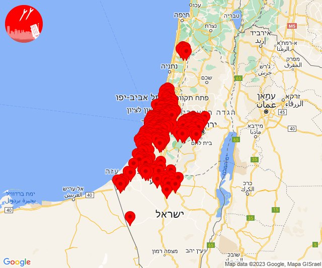

## 07:09

🔴 צבע אדום (07/10/2023):

10:06:
• עוטף עזה: זיקים, כרמיה (15 שניות)
• מערב לכיש: אזור תעשייה הדרומי אשקלון, אשקלון - דרום, אשקלון - צפון (30 שניות)

10:08:
• מערב לכיש: אזור תעשייה הדרומי אשקלון, אשקלון - דרום, אשקלון - צפון, אזור תעשייה צפוני אשקלון, בית שקמה, גיאה, בת הדר (30 שניות)
• עוטף עזה: כרמיה, נתיב העשרה (15 שניות)

10:09:
• עוטף עזה: ארז, יד מרדכי (15 שניות)

צופר - צבע אדום

## 07:09

## 07:12

🔴 צבע אדום (07/10/2023):

10:10:
• לכיש: אשדוד - ח,ט,י,יג,יד,טז, אשדוד - יא,יב,טו,יז,מרינה,סיטי (45 שניות)

10:11:
• לכיש: ניר ח''ן (30 שניות)
• עוטף עזה: זיקים (15 שניות)

10:12:
• לכיש: שחר (30 שניות)

צופר - צבע אדום

## 07:12

## 07:17

🔴 צבע אדום (07/10/2023):

10:13:
• עוטף עזה: יבול, אבשלום (15 שניות)

10:14:
• עוטף עזה: יתד, ארז (15 שניות)
• מערב לכיש: אזור תעשייה הדרומי אשקלון, בית שקמה, בת הדר, אשקלון - דרום, אשקלון - צפון, אזור תעשייה צפוני אשקלון, חלץ (30 שניות)
• שפלת יהודה: צובה, גבעת יערים, עין נקובא, עין ראפה, רמת רזיאל, הר אדר, מעלה החמישה, אבו-גוש, יד השמונה, נווה אילן, קריית יערים, כסלון (דקה וחצי)
• ירושלים: גבעת זאב (דקה וחצי)
• מערב הנגב: ברור חיל (30 שניות)
• לכיש: שדה דוד, תלמים (30 שניות)

10:15:
• שפלת יהודה: קריית ענבים, גפן, תירוש (דקה וחצי, דקה)
• ירושלים: ירושלים - מזרח, ירושלים - צפון (דקה וחצי)
• יהודה: עלמון, נופי פרת (דקה וחצי)
• מערב לכיש: ברכיה, משען (30 שניות)

10:16:
• שפלת יהודה: אביעזר, אדרת, אזור תעשייה הר טוב - צרעה, אשתאול, בית שמש, זנוח, ישעי, מחסיה, נווה מיכאל - רוגלית, נחם, נתיב הל''ה, צרעה, רטורנו - גבעת שמש, תרום, נס הרים, אזור תעשייה ברוש, זכריה, בר גיורא, מבוא ביתר, מטע, צור הדסה (דקה וחצי, דקה)
• לכיש: אשדוד - אזור תעשייה צפוני ונמל, יבנה (45 שניות, דקה)
• יהודה: אלון שבות, אלעזר, אפרת, ביתר עילית, בת עין, הר גילה, כפר עציון, נווה דניאל, ראש צורים, גבעות (דקה וחצי)
• ירושלים: עמינדב (דקה וחצי)
• עוטף עזה: נתיב העשרה (15 שניות)

10:17:
• עוטף עזה: שדרות, איבים, ניר עם (15 שניות)

צופר - צבע אדום

## 07:17

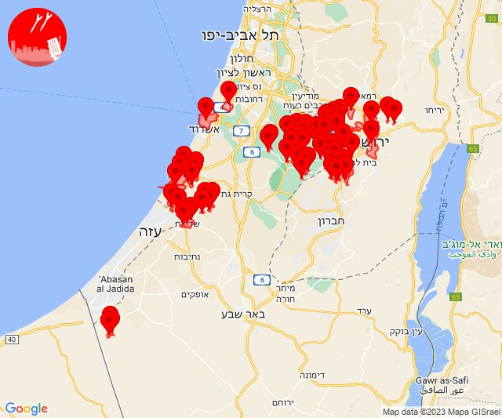

## 07:19

🔴 צבע אדום (07/10/2023):

10:19:
• מערב לכיש: אזור תעשייה הדרומי אשקלון (30 שניות)

צופר - צבע אדום

## 07:19

## 07:21

🔴 צבע אדום (07/10/2023):

10:20:
• מערב לכיש: אשקלון - דרום, אשקלון - צפון (30 שניות)

10:21:
• עוטף עזה: כרמיה (15 שניות)
• מערב לכיש: מבקיעים (30 שניות)

צופר - צבע אדום

## 07:21

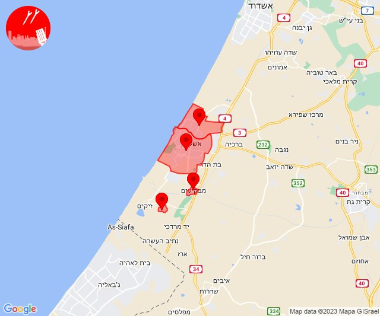

## 07:25

🔴 צבע אדום (07/10/2023):

10:23:
• עוטף עזה: זמרת, שובה (15 שניות)
• מערב הנגב: נתיבות (30 שניות)

10:24:
• עוטף עזה: ניר יצחק, סופה, חוות יזרעם, תקומה, כיסופים (15 שניות)

10:25:
• עוטף עזה: ארז, יד מרדכי, נתיב העשרה (15 שניות)

צופר - צבע אדום

## 07:25

## 07:29

## 07:30

🔴 צבע אדום (07/10/2023):

10:29:
• לכיש: באר טוביה, בני ראם, כפר הרי''ף וצומת ראם, תלמי יחיאל, חצב, עזריקם, כפר אחים (45 שניות, דקה)

10:30:
• עוטף עזה: כפר עזה, סעד (15 שניות)
• לכיש: אורות, אזור תעשייה באר טוביה, כפר ורבורג, קריית מלאכי (45 שניות)

צופר - צבע אדום

## 07:30

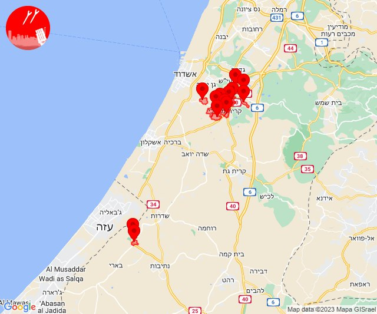

## 07:34

🔴 צבע אדום (07/10/2023):

10:31:
• עוטף עזה: זמרת, שובה (15 שניות)
• מרכז הנגב: באר שבע - מזרח, באר שבע - מערב, באר שבע - צפון, באר שבע - דרום (דקה)

10:32:
• דן: בת-ים, חולון, תל אביב - דרום העיר ויפו, תל אביב - מרכז העיר (דקה וחצי)
• השפלה: ראשון לציון - מערב, ראשון לציון - מזרח (דקה וחצי)
• לכיש: פלמחים (דקה וחצי)

10:33:
• ואדי ערה: באקה אל גרבייה (דקה וחצי)
• מנשה: גן השומרון, עין שמר, גבעת חביבה, מאור, מענית, שער מנשה, תלמי אלעזר (דקה וחצי)
• לכיש: אשדוד - א,ב,ד,ה, אשדוד - אזור תעשייה צפוני ונמל, אשדוד - יא,יב,טו,יז,מרינה,סיטי, יבנה, כפר הנגיד, בן זכאי, מעון צופיה (45 שניות, דקה)

10:34:
• עוטף עזה: בני נצרים (30 שניות)
• השפלה: פארק תעשיות פלמחים, אירוס, בית חנן, בית עובד, גן שורק, נטעים, נס ציונה, עיינות (דקה וחצי)

צופר - צבע אדום

## 07:34

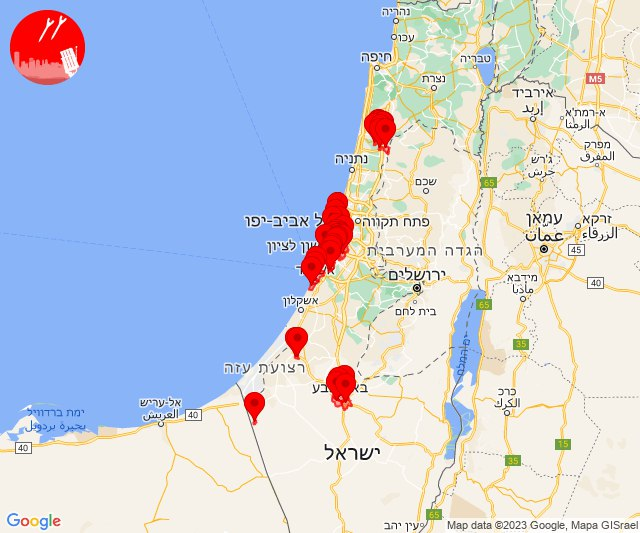

## 07:42

🔴 צבע אדום (07/10/2023):

10:42:
• מערב הנגב: נתיבות, מעגלים, גבעולים, מלילות, ברוש, שיבולים, תדהר, בטחה (30 שניות, 45 שניות)

צופר - צבע אדום

## 07:42

## 07:55

🔴 צבע אדום (07/10/2023):

10:45:
• עוטף עזה: מטווח ניר עם (15 שניות)

10:47:
• מערב לכיש: אזור תעשייה הדרומי אשקלון (30 שניות)
• עוטף עזה: זיקים (15 שניות)

10:48:
• ירושלים: ירושלים - מערב, ירושלים - צפון, בית זית, מבשרת ציון, מוצא עילית, פנימיית עין כרם, אבן ספיר (דקה וחצי)

10:49:
• לכיש: נהורה, נוגה, עוצם (30 שניות)
• ירושלים: ירושלים - דרום, אורה, עמינדב, ירושלים - מזרח, ירושלים - מרכז (דקה וחצי)
• עוטף עזה: שדרות, איבים, ניר עם (15 שניות)
• שפלת יהודה: מבוא ביתר, צור הדסה, בר גיורא (דקה וחצי)

10:50:
• לכיש: אורות, כפר אחים, תלמי יחיאל, איתן, עוזה, קריית גת, כרמי גת, אזור תעשייה קריית גת, באר טוביה, כפר ורבורג, גבעתי, משואות יצחק, עזריקם, גת, שדה דוד, תלמים (45 שניות, 30 שניות)
• שפלת יהודה: גפן, תירוש, מחסיה, גבעת יערים, כסלון, מטע, נס הרים, רמת רזיאל, אביעזר, זנוח, מבוא ביתר, צור הדסה (דקה, דקה וחצי)
• יהודה: ביתר עילית, גבעות (דקה וחצי)

10:51:
• לכיש: זוהר, ניר ח''ן, פארק תעשייה ראם, שחר (30 שניות, דקה)

10:52:
• לכיש: אמונים, בני ראם, כפר הרי''ף וצומת ראם, חצב, קריית מלאכי, שדה עוזיהו, אזור תעשייה באר טוביה (45 שניות, דקה)
• עוטף עזה: נתיב העשרה (15 שניות)

10:54:
• שפלת יהודה: בקוע, טל שחר, בית שמש, זנוח, מחסיה (דקה וחצי)
• השפלה: כרמי יוסף, משמר דוד, כפר בן נון, כפר שמואל, משמר איילון, חולדה, יסודות, נצר חזני (דקה וחצי)
• ירקון: מודיעין, נוף איילון, שעלבים (דקה וחצי)
• לכיש: אשדוד - אזור תעשייה צפוני ונמל, יבנה (45 שניות, דקה)

10:55:
• השפלה: בית עוזיאל, גזר (דקה וחצי)
• שפלת יהודה: גיזו, הראל, כפר אוריה, לטרון, מסילת ציון, נווה שלום, נחשון, צלפון, רטורנו - גבעת שמש, תעוז, תרום, תירוש, זכריה, עגור, שדות מיכה, שריגים - ליאון, גבעת ישעיהו (דקה וחצי, דקה)
• ירקון: מודיעין - ישפרו סנטר (דקה וחצי)
• לכיש: בית חלקיה, יד בנימין, רבדים (דקה)

צופר - צבע אדום

## 07:55

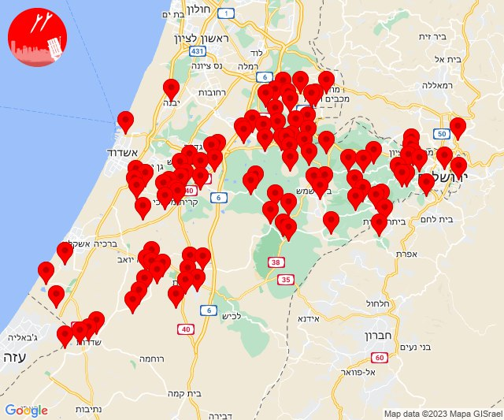

## 07:58

🔴 צבע אדום (07/10/2023):

10:58:
• לכיש: קריית גת, כרמי גת, ניר ח''ן, נהורה, שחר (45 שניות, 30 שניות)

צופר - צבע אדום

## 07:58

## 08:06

🔴 צבע אדום (07/10/2023):

11:05:
• מערב הנגב: נתיבות (30 שניות)

11:06:
• עוטף עזה: כפר מימון ותושיה, שוקדה, תקומה, יבול, רעים, אבשלום, דקל (15 שניות)

צופר - צבע אדום

## 08:06

## 08:13

🔴 צבע אדום (07/10/2023):

11:09:
• עוטף עזה: אבשלום, דקל, חולית, יתד, ניר יצחק, סופה, פרי גן, שדה אברהם, תלמי יוסף (15 שניות)

11:10:
• עוטף עזה: כרם שלום (15 שניות)

11:11:
• לכיש: אשדוד - ג,ו,ז, אשדוד - ח,ט,י,יג,יד,טז, אשדוד - יא,יב,טו,יז,מרינה,סיטי, גן הדרום, כפר אביב, כרם ביבנה, מתחם בני דרום, קבוצת יבנה, אשדוד - אזור תעשייה צפוני ונמל, אשדוד - א,ב,ד,ה (45 שניות, דקה)

11:12:
• לכיש: גן יבנה, שתולים (45 שניות)

11:13:
• עוטף עזה: זמרת, שובה, עלומים (15 שניות)

צופר - צבע אדום

## 08:13

## 08:15

🔴 צבע אדום (07/10/2023):

11:15:
• עוטף עזה: חולית, סופה, ניר יצחק (15 שניות)
• מערב לכיש: אשקלון - דרום, אשקלון - צפון, אזור תעשייה הדרומי אשקלון (30 שניות)

צופר - צבע אדום

## 08:15

## 08:20

🔴 צבע אדום (07/10/2023):

11:20:
• עוטף עזה: מגן, זמרת, שובה, כפר מימון ותושיה, נחל עוז, סעד, עלומים, שוקדה, ניר עוז (15 שניות)

צופר - צבע אדום

## 08:20

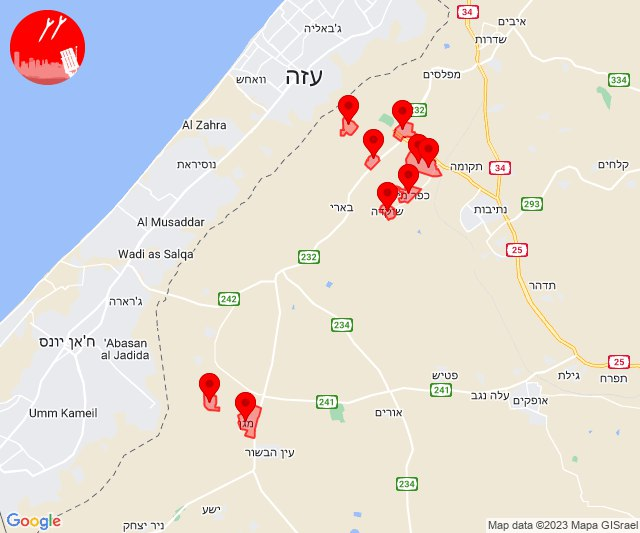

## 08:25

🔴 צבע אדום (07/10/2023):

11:24:
• עוטף עזה: כרמיה, נתיב העשרה, זיקים (15 שניות)
• מערב לכיש: אזור תעשייה הדרומי אשקלון, אשקלון - דרום (30 שניות)

11:25:
• עוטף עזה: מגן, ניר עוז (15 שניות)

צופר - צבע אדום

## 08:25

## 08:36

🔴 צבע אדום (07/10/2023):

11:30:
• מערב לכיש: אזור תעשייה הדרומי אשקלון (30 שניות)
• עוטף עזה: זיקים, כפר עזה, נחל עוז, סעד, עלומים (15 שניות)

11:31:
• עוטף עזה: גברעם (15 שניות)
• לכיש: יד נתן, נוגה, עוצם (30 שניות)
• מערב לכיש: כוכב מיכאל (30 שניות)
• ירושלים: ירושלים - דרום, ירושלים - מזרח, ירושלים - מרכז, ירושלים - צפון (דקה וחצי)
• יהודה: מעלה אדומים (דקה וחצי)

11:32:
• לכיש: אשדוד - אזור תעשייה צפוני ונמל, יבנה, אזור תעשייה עד הלום, בית עזרא, שדה עוזיהו, אמונים, עזר, גן יבנה, אשדוד - ג,ו,ז, אשדוד - ח,ט,י,יג,יד,טז, שתולים, עזריקם, אשדוד - יא,יב,טו,יז,מרינה,סיטי (45 שניות, דקה)
• ירושלים: עמינדב, ירושלים - מערב, בית זית, מבשרת ציון, מוצא עילית, פנימיית עין כרם, אבן ספיר, אורה (דקה וחצי)
• שפלת יהודה: אביעזר, בית שמש, נווה מיכאל - רוגלית, נתיב הל''ה, בית נקופה, מעלה החמישה, צובה, קריית ענבים, אבו-גוש, גבעת יערים, מבוא ביתר, עין נקובא, עין ראפה, קריית יערים, זנוח, מחסיה, בר גיורא, כסלון, מטע, נס הרים, צור הדסה, רמת רזיאל (דקה וחצי)
• מערב לכיש: אשקלון - דרום, אשקלון - צפון, באר גנים, ניצן (30 שניות, 45 שניות)
• יהודה: הר גילה, ביתר עילית, בת עין, גבעות (דקה וחצי)

11:33:
• לכיש: גבעתי (45 שניות)
• עוטף עזה: כרם שלום, נתיב העשרה (15 שניות)

11:34:
• שפלת יהודה: הר אדר, קריית ענבים (דקה וחצי)
• ירושלים: גבעת זאב, נבי סמואל, מבשרת ציון (דקה וחצי)
• עוטף עזה: כרמיה, נתיב העשרה (15 שניות)

11:35:
• עוטף עזה: שדרות, איבים, ניר עם, מפלסים, מטווח ניר עם (15 שניות)

11:36:
• עוטף עזה: נחל עוז, עלומים (15 שניות)

צופר - צבע אדום

## 08:36

## 08:41

🔴 צבע אדום (07/10/2023):

11:39:
• עוטף עזה: ארז, יד מרדכי, כרמיה, נתיב העשרה (15 שניות)

11:40:
• עוטף עזה: מגן, ניר עוז (15 שניות)

11:41:
• מערב לכיש: אזור תעשייה הדרומי אשקלון (30 שניות)

צופר - צבע אדום

## 08:41

## 08:43

🔴 צבע אדום (07/10/2023):

11:43:
• עוטף עזה: זמרת, שובה, סעד, עלומים (15 שניות)
• מערב הנגב: בית הגדי, נתיבות, אזור תעשייה נ.ע.מ (30 שניות)

צופר - צבע אדום

## 08:43

## 08:48

🔴 צבע אדום (07/10/2023):

11:48:
• עוטף עזה: נחל עוז, עלומים (15 שניות)

צופר - צבע אדום

## 08:48

## 08:53

🔴 צבע אדום (07/10/2023):

11:51:
• עוטף עזה: נתיב העשרה (15 שניות)

11:52:
• עוטף עזה: נתיב העשרה (15 שניות)

11:53:
• עוטף עזה: נתיב העשרה, זיקים (15 שניות)

צופר - צבע אדום

## 08:53

## 08:59

🔴 צבע אדום (07/10/2023):

11:57:
• עוטף עזה: נתיב העשרה (15 שניות)

11:58:
• עוטף עזה: נתיב העשרה (15 שניות)

11:59:
• דרום הנגב: ואדי אל נעם דרום (דקה וחצי)

צופר - צבע אדום

## 08:59

## 09:05

🔴 צבע אדום (07/10/2023):

12:03:
• עוטף עזה: ארז, יד מרדכי, נתיב העשרה (15 שניות)

12:04:
• עוטף עזה: נחל עוז (15 שניות)

12:05:
• מערב לכיש: אזור תעשייה הדרומי אשקלון, מבקיעים, אשקלון - דרום, אשקלון - צפון, אזור תעשייה צפוני אשקלון (30 שניות)
• עוטף עזה: זיקים, כרמיה (15 שניות)

צופר - צבע אדום

## 09:05

## 09:09

🔴 צבע אדום (07/10/2023):

12:09:
• עוטף עזה: ארז, יד מרדכי, נתיב העשרה (15 שניות)

צופר - צבע אדום

## 09:09

## 09:12

🔴 צבע אדום (07/10/2023):

12:11:
• מערב הנגב: שרשרת, נתיבות, בית הגדי (30 שניות)

12:12:
• מערב הנגב: יושיביה (15 שניות)

צופר - צבע אדום

## 09:12

## 09:22

🔴 צבע אדום (07/10/2023):

12:17:
• עוטף עזה: נירים (15 שניות)

12:18:
• מערב הנגב: מסלול, דניאל, קריית חינוך מרחבים, פטיש, אופקים (30 שניות, 45 שניות)

12:20:
• מערב הנגב: נתיבות (30 שניות)
• עוטף עזה: בארי, זמרת, שובה, סעד, עלומים, כפר מימון ותושיה, שוקדה (15 שניות)

12:21:
• עוטף עזה: נחל עוז (15 שניות)

12:22:
• מערב לכיש: אזור תעשייה הדרומי אשקלון, אשקלון - דרום (30 שניות)

צופר - צבע אדום

## 09:22

## 09:28

🔴 צבע אדום (07/10/2023):

12:28:
• עוטף עזה: ניר עוז, נירים (15 שניות)

צופר - צבע אדום

## 09:28

## 09:33

🔴 צבע אדום (07/10/2023):

12:32:
• עוטף עזה: כיסופים (15 שניות)

12:33:
• עוטף עזה: מבטחים, עמיעוז, ישע (15 שניות)

צופר - צבע אדום

## 09:33

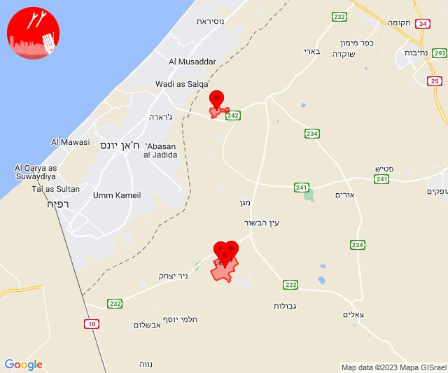

## 09:38

🔴 צבע אדום (07/10/2023):

12:38:
• עוטף עזה: כפר עזה (15 שניות)

צופר - צבע אדום

## 09:38

## 09:44

🔴 צבע אדום (07/10/2023):

12:42:
• עוטף עזה: נתיב העשרה (15 שניות)

12:44:
• עוטף עזה: כפר עזה, נחל עוז, סעד, עלומים, נתיב העשרה, ארז, יד מרדכי, נתיב העשרה (15 שניות)

צופר - צבע אדום

## 09:44

## 09:48

🔴 צבע אדום (07/10/2023):

12:47:
• דרום הנגב: סעייה-מולדה והפזורה (דקה וחצי)
• מרכז הנגב: תל שבע, אום בטין והפזורה (דקה וחצי)

12:48:
• מרכז הנגב: נבטים, באר שבע - דרום, באר שבע - מזרח, באר שבע - מערב, באר שבע - צפון, עומר (דקה וחצי, דקה)
• דרום הנגב: אבו-תלול והפזורה (דקה וחצי)

צופר - צבע אדום

## 09:48

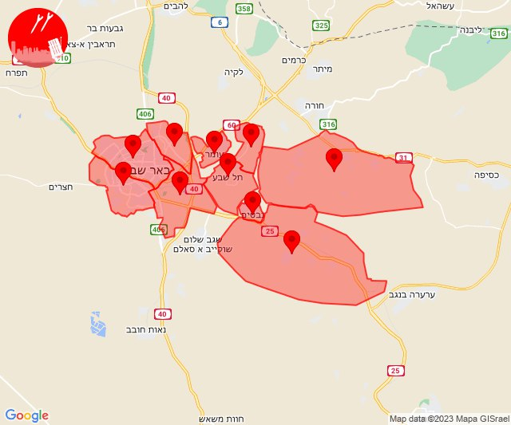

## 09:57

🔴 צבע אדום (07/10/2023):

12:54:
• עוטף עזה: מפלסים (15 שניות)

12:55:
• עוטף עזה: נחל עוז, כרם שלום (15 שניות)

12:57:
• עוטף עזה: שדרות, איבים, ניר עם, אור הנר, ארז, יד מרדכי, נתיב העשרה (15 שניות)

צופר - צבע אדום

## 09:57

## 10:03

🔴 צבע אדום (07/10/2023):

13:03:
• מערב לכיש: אזור תעשייה הדרומי אשקלון (30 שניות)

צופר - צבע אדום

## 10:03

## 10:08

🔴 צבע אדום (07/10/2023):

13:08:
• עוטף עזה: זיקים, כרמיה (15 שניות)
• מערב לכיש: אשקלון - דרום, אזור תעשייה הדרומי אשקלון, מבקיעים (30 שניות)

צופר - צבע אדום

## 10:08

## 10:14

🔴 צבע אדום (07/10/2023):

13:13:
• עוטף עזה: ניר עוז, נירים, עין השלושה (15 שניות)

13:14:
• עוטף עזה: כיסופים (15 שניות)

צופר - צבע אדום

## 10:14

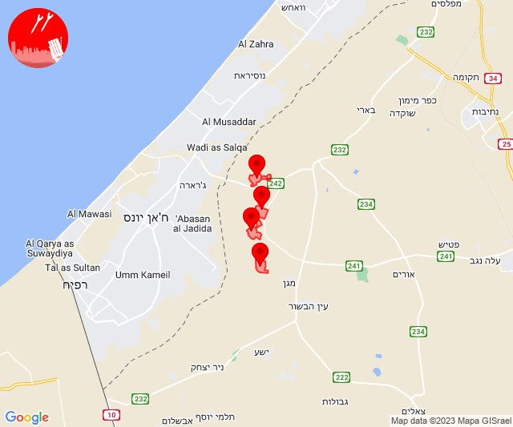

## 10:23

🔴 צבע אדום (07/10/2023):

13:23:
• עוטף עזה: ארז, יד מרדכי, נתיב העשרה, שדרות, איבים, ניר עם, אור הנר (15 שניות)

צופר - צבע אדום

## 10:23

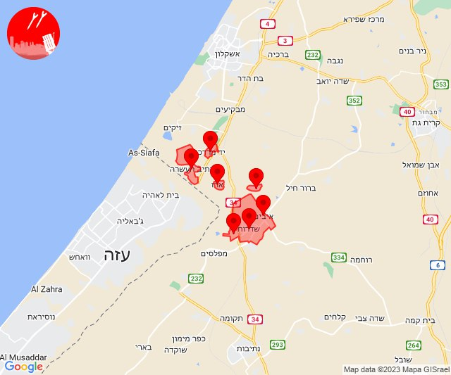

## 10:32

🔴 צבע אדום (07/10/2023):

13:32:
• עוטף עזה: נירים, עין השלושה, שדרות, איבים, ניר עם (15 שניות)

צופר - צבע אדום

## 10:32

## 10:35

🔴 צבע אדום (07/10/2023):

13:34:
• מערב הנגב: נתיבות (30 שניות)
• עוטף עזה: פרי גן, סופה, ניר יצחק (15 שניות)

13:35:
• עוטף עזה: חולית (15 שניות)

צופר - צבע אדום

## 10:35

## 10:38

🔴 צבע אדום (07/10/2023):

13:38:
• עוטף עזה: יד מרדכי, נתיב העשרה (15 שניות)

צופר - צבע אדום

## 10:38

## 10:40

🔴 צבע אדום (07/10/2023):

13:40:
• עוטף עזה: כיסופים, עין השלושה (15 שניות)

צופר - צבע אדום

## 10:40

## 10:47

🔴 צבע אדום (07/10/2023):

13:45:
• עוטף עזה: כרם שלום (15 שניות)

13:46:
• מערב הנגב: נתיבות (30 שניות)
• עוטף עזה: תקומה, חוות יזרעם, שוקדה (15 שניות)

13:47:
• מערב הנגב: בית הגדי (30 שניות)

צופר - צבע אדום

## 10:47

## 10:49

🔴 צבע אדום (07/10/2023):

13:49:
• מערב הנגב: יושיביה (15 שניות)

צופר - צבע אדום

## 10:49

## 10:54

🔴 צבע אדום (07/10/2023):

13:52:
• עוטף עזה: סופה (15 שניות)

13:53:
• עוטף עזה: כרם שלום (15 שניות)
• מערב הנגב: אזור תעשייה נ.ע.מ, בית הגדי, נתיבות (30 שניות)

13:54:
• עוטף עזה: כפר עזה, נחל עוז, סעד, עלומים (15 שניות)

צופר - צבע אדום

## 10:54

## 10:56

🔴 צבע אדום (07/10/2023):

13:55:
• עוטף עזה: עין השלושה (15 שניות)

13:56:
• מערב הנגב: יושיביה (15 שניות)

צופר - צבע אדום

## 10:56

## 11:00

🔴 צבע אדום (07/10/2023):

13:58:
• עוטף עזה: תקומה, חוות יזרעם (15 שניות)

13:59:
• מערב הנגב: בית הגדי (30 שניות)

14:00:
• מערב הנגב: נתיבות (30 שניות)

צופר - צבע אדום

## 11:00

## 11:14

🔴 צבע אדום (07/10/2023):

14:14:
• עוטף עזה: סופה (15 שניות)

צופר - צבע אדום

## 11:14

## 11:17

🔴 צבע אדום (07/10/2023):

14:17:
• עוטף עזה: פרי גן (15 שניות)

צופר - צבע אדום

## 11:17

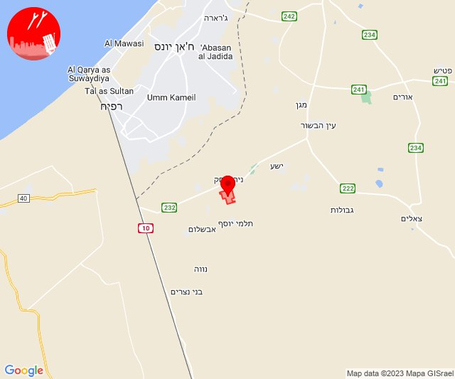

## 11:23

🔴 צבע אדום (07/10/2023):

14:23:
• מערב הנגב: דניאל, מסלול, אופקים, קריית חינוך מרחבים, פטיש (45 שניות, 30 שניות)

צופר - צבע אדום

## 11:23

## 11:30

🔴 צבע אדום (07/10/2023):

14:30:
• עוטף עזה: כפר עזה (15 שניות)

צופר - צבע אדום

## 11:30

## 11:35

🔴 צבע אדום (07/10/2023):

14:35:
• עוטף עזה: כפר עזה (15 שניות)

צופר - צבע אדום

## 11:35

## 11:49

🔴 צבע אדום (07/10/2023):

14:49:
• עוטף עזה: חולית, כרם שלום (15 שניות)

צופר - צבע אדום

## 11:49

## 11:53

🔴 צבע אדום (07/10/2023):

14:52:
• עוטף עזה: ארז, יד מרדכי, נתיב העשרה (15 שניות)

14:53:
• עוטף עזה: נחל עוז, עלומים (15 שניות)

צופר - צבע אדום

## 11:53

## 11:55

🔴 צבע אדום (07/10/2023):

14:55:
• עוטף עזה: כרם שלום (15 שניות)

צופר - צבע אדום

## 11:55

## 11:59

🔴 צבע אדום (07/10/2023):

14:59:
• עוטף עזה: ארז (15 שניות)

צופר - צבע אדום

## 11:59

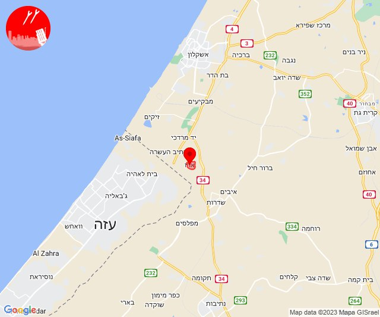

## 12:02

🔴 צבע אדום (07/10/2023):

15:02:
• עוטף עזה: אור הנר (15 שניות)

צופר - צבע אדום

## 12:02

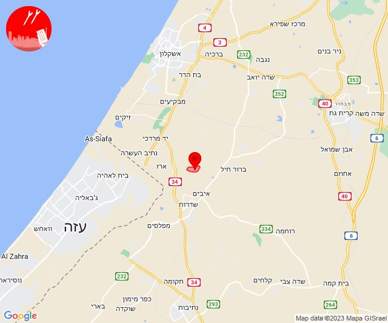

## 12:06

🔴 צבע אדום (07/10/2023):

15:05:
• מערב הנגב: אופקים, אורים, פטיש (45 שניות, 30 שניות)

15:06:
• מערב הנגב: דניאל, קריית חינוך מרחבים, מסלול (45 שניות, 30 שניות)
• עוטף עזה: ארז, יד מרדכי, נתיב העשרה (15 שניות)

צופר - צבע אדום

## 12:06

## 12:08

🔴 צבע אדום (07/10/2023):

15:08:
• עוטף עזה: כפר עזה, סעד (15 שניות)

צופר - צבע אדום

## 12:08

## 12:11

🔴 צבע אדום (07/10/2023):

15:10:
• עוטף עזה: אור הנר, כרמיה (15 שניות)
• מערב לכיש: אזור תעשייה הדרומי אשקלון, אשקלון - דרום, אשקלון - צפון, מבקיעים (30 שניות)

15:11:
• עוטף עזה: תקומה (15 שניות)
• מערב הנגב: אזור תעשייה נ.ע.מ, בית הגדי, נתיבות (30 שניות)

צופר - צבע אדום

## 12:11

## 12:17

🔴 צבע אדום (07/10/2023):

15:13:
• עוטף עזה: ארז (15 שניות)

15:14:
• עוטף עזה: כפר עזה (15 שניות)

15:16:
• עוטף עזה: זמרת, שובה, סעד (15 שניות)

15:17:
• עוטף עזה: אור הנר (15 שניות)

צופר - צבע אדום

## 12:17

## 12:20

🔴 צבע אדום (07/10/2023):

15:18:
• מערב הנגב: אופקים (45 שניות)

15:19:
• מערב הנגב: מסלול, פדויים, דניאל, קריית חינוך מרחבים (30 שניות, 45 שניות)

15:20:
• עוטף עזה: ארז (15 שניות)

צופר - צבע אדום

## 12:20

## 12:26

🔴 צבע אדום (07/10/2023):

15:21:
• עוטף עזה: כפר עזה (15 שניות)

15:23:
• מערב הנגב: בית הגדי, נתיבות, פטיש (30 שניות)

15:24:
• מערב הנגב: אזור תעשייה נ.ע.מ (30 שניות)

15:25:
• מערב הנגב: יושיביה (15 שניות)

15:26:
• עוטף עזה: תקומה (15 שניות)

צופר - צבע אדום

## 12:26

## 12:29

🔴 צבע אדום (07/10/2023):

15:28:
• מערב הנגב: אופקים, בית הגדי (45 שניות, 30 שניות)

15:29:
• מערב הנגב: דניאל, פדויים, קריית חינוך מרחבים (45 שניות)
• עוטף עזה: כפר עזה (15 שניות)

צופר - צבע אדום

## 12:29

## 12:34

🔴 צבע אדום (07/10/2023):

15:34:
• עוטף עזה: כפר עזה (15 שניות)

צופר - צבע אדום

## 12:34

## 12:41

🔴 צבע אדום (07/10/2023):

15:41:
• עוטף עזה: בארי, זמרת, שובה, כפר מימון ותושיה, נחל עוז, סעד, עלומים, שוקדה, רעים (15 שניות)

צופר - צבע אדום

## 12:41

## 12:46

🔴 צבע אדום (07/10/2023):

15:46:
• מערב הנגב: אורים (30 שניות)

צופר - צבע אדום

## 12:46

## 12:50

🔴 צבע אדום (07/10/2023):

15:49:
• מרכז הנגב: אתר דודאים, לקיה והפזורה (45 שניות, דקה)

15:50:
• עוטף עזה: כיסופים (15 שניות)

צופר - צבע אדום

## 12:50

## 12:52

🔴 צבע אדום (07/10/2023):

15:52:
• מערב הנגב: אשל הנשיא, גילת, תפרח (45 שניות)

צופר - צבע אדום

## 12:52

## 12:54

🔴 צבע אדום (07/10/2023):

15:53:
• מרכז הנגב: אזור תעשייה עידן הנגב, רהט והפזורה (45 שניות)

15:54:
• מערב הנגב: מסלול, רנן, פטיש, פדויים, בטחה (30 שניות, 45 שניות)

צופר - צבע אדום

## 12:54

## 13:01

🔴 צבע אדום (07/10/2023):

16:00:
• עוטף עזה: אור הנר, ארז (15 שניות)

16:01:
• עוטף עזה: זמרת, שובה, כפר עזה, מפלסים, סעד (15 שניות)

צופר - צבע אדום

## 13:01

## 13:05

🔴 צבע אדום (07/10/2023):

16:05:
• עוטף עזה: רעים (15 שניות)

צופר - צבע אדום

## 13:05

## 13:10

🔴 צבע אדום (07/10/2023):

16:10:
• עוטף עזה: סופה (15 שניות)

צופר - צבע אדום

## 13:10

## 13:13

🔴 צבע אדום (07/10/2023):

16:13:
• עוטף עזה: כפר עזה (15 שניות)

צופר - צבע אדום

## 13:13

## 13:17

🔴 צבע אדום (07/10/2023):

16:16:
• מערב הנגב: בית הגדי, זרועה (30 שניות)

16:17:
• מערב הנגב: נתיבות, יושיביה (30 שניות, 15 שניות)
• עוטף עזה: תקומה, סעד (15 שניות)

צופר - צבע אדום

## 13:17

## 13:23

🔴 צבע אדום (07/10/2023):

16:23:
• עוטף עזה: נחל עוז (15 שניות)

צופר - צבע אדום

## 13:23

## 13:25

🔴 צבע אדום (07/10/2023):

16:25:
• עוטף עזה: כפר עזה (15 שניות)

צופר - צבע אדום

## 13:25

## 13:32

🔴 צבע אדום (07/10/2023):

16:32:
• מערב הנגב: אזור תעשייה נ.ע.מ, בית הגדי, נתיבות (30 שניות)

צופר - צבע אדום

## 13:32

## 13:35

🔴 צבע אדום (07/10/2023):

16:35:
• עוטף עזה: כפר עזה, סעד (15 שניות)

צופר - צבע אדום

## 13:35

## 13:55

🔴 צבע אדום (07/10/2023):

16:55:
• עוטף עזה: כרם שלום (15 שניות)

צופר - צבע אדום

## 13:55

## 14:02

🔴 צבע אדום (07/10/2023):

17:01:
• מערב הנגב: בית הגדי, נתיבות, יושיביה (30 שניות, 15 שניות)
• עוטף עזה: זמרת, שובה, תקומה, חוות יזרעם (15 שניות)

17:02:
• עוטף עזה: כפר מימון ותושיה (15 שניות)

צופר - צבע אדום

## 14:02

## 14:05

🔴 צבע אדום (07/10/2023):

17:05:
• עוטף עזה: נחל עוז, עלומים, סעד (15 שניות)

צופר - צבע אדום

## 14:05

## 14:08

🔴 צבע אדום (07/10/2023):

17:07:
• עוטף עזה: זמרת, שובה, כפר מימון ותושיה, תקומה, חוות יזרעם (15 שניות)
• מערב הנגב: יושיביה, בית הגדי, נתיבות (15 שניות, 30 שניות)

17:08:
• עוטף עזה: כרם שלום, בארי (15 שניות)

צופר - צבע אדום

## 14:08

## 14:10

🔴 צבע אדום (07/10/2023):

17:10:
• עוטף עזה: כיסופים (15 שניות)

צופר - צבע אדום

## 14:10

## 14:18

🔴 צבע אדום (07/10/2023):

17:13:
• עוטף עזה: כרם שלום (15 שניות)

17:15:
• עוטף עזה: נירים, עין השלושה (15 שניות)

17:16:
• מערב הנגב: נתיבות (30 שניות)
• עוטף עזה: כפר מימון ותושיה, שוקדה (15 שניות)

17:18:
• עוטף עזה: כפר עזה (15 שניות)

צופר - צבע אדום

## 14:18

## 14:27

🔴 צבע אדום (07/10/2023):

17:26:
• מערב הנגב: נתיבות (30 שניות)

17:27:
• עוטף עזה: כפר מימון ותושיה (15 שניות)

צופר - צבע אדום

## 14:27

## 14:31

🔴 צבע אדום (07/10/2023):

17:31:
• מערב הנגב: בית הגדי (30 שניות)
• עוטף עזה: זמרת, שובה, חוות יזרעם, תקומה (15 שניות)

צופר - צבע אדום

## 14:31

## 14:37

🔴 צבע אדום (07/10/2023):

17:36:
• עוטף עזה: בארי, כפר עזה, זמרת, שובה, כפר מימון ותושיה (15 שניות)
• מערב הנגב: נתיבות (30 שניות)

צופר - צבע אדום

## 14:37

## 14:41

🔴 צבע אדום (07/10/2023):

17:41:
• עוטף עזה: בארי, נחל עוז, חוות יזרעם, תקומה (15 שניות)

צופר - צבע אדום

## 14:41

## 14:48

🔴 צבע אדום (07/10/2023):

17:46:
• מערב הנגב: נתיבות (30 שניות)
• עוטף עזה: זמרת, שובה, כפר מימון ותושיה, שוקדה, תקומה (15 שניות)

17:47:
• עוטף עזה: בארי (15 שניות)

17:48:
• עוטף עזה: כפר עזה (15 שניות)

צופר - צבע אדום

## 14:48

## 14:54

🔴 צבע אדום (07/10/2023):

17:53:
• עוטף עזה: ארז, יד מרדכי, נתיב העשרה (15 שניות)

17:54:
• עוטף עזה: זיקים, כרמיה (15 שניות)

צופר - צבע אדום

## 14:54

## 14:56

🔴 צבע אדום (07/10/2023):

17:55:
• עוטף עזה: שדרות, איבים, ניר עם (15 שניות)

17:56:
• מערב הנגב: בית הגדי, נתיבות (30 שניות)

צופר - צבע אדום

## 14:56

## 14:59

🔴 צבע אדום (07/10/2023):

17:59:
• עוטף עזה: בארי, נחל עוז (15 שניות)

צופר - צבע אדום

## 14:59

## 15:01

🔴 צבע אדום (07/10/2023):

18:01:
• עוטף עזה: תקומה (15 שניות)

צופר - צבע אדום

## 15:01

## 15:04

🔴 צבע אדום (07/10/2023):

18:04:
• עוטף עזה: נתיב העשרה (15 שניות)

צופר - צבע אדום

## 15:04

## 15:07

🔴 צבע אדום (07/10/2023):

18:06:
• מערב הנגב: נתיבות (30 שניות)
• עוטף עזה: חוות יזרעם, תקומה (15 שניות)

18:07:
• עוטף עזה: בארי (15 שניות)

צופר - צבע אדום

## 15:07

## 15:12

🔴 צבע אדום (07/10/2023):

18:11:
• מערב הנגב: נתיבות (30 שניות)

18:12:
• עוטף עזה: חוות יזרעם (15 שניות)

צופר - צבע אדום

## 15:12

## 15:16

🔴 צבע אדום (07/10/2023):

18:16:
• עוטף עזה: מטווח ניר עם (15 שניות)

צופר - צבע אדום

## 15:16

## 15:19

🔴 צבע אדום (07/10/2023):

18:19:
• עוטף עזה: נחל עוז, עלומים (15 שניות)

צופר - צבע אדום

## 15:19

## 15:21

🔴 צבע אדום (07/10/2023):

18:21:
• עוטף עזה: תקומה, חוות יזרעם, זמרת, שובה, כפר עזה, סעד (15 שניות)
• מערב הנגב: נתיבות (30 שניות)

צופר - צבע אדום

## 15:21

## 15:26

🔴 צבע אדום (07/10/2023):

18:26:
• עוטף עזה: כיסופים (15 שניות)

צופר - צבע אדום

## 15:26

## 15:32

🔴 צבע אדום (07/10/2023):

18:31:
• עוטף עזה: כיסופים (15 שניות)

18:32:
• עוטף עזה: בארי, סעד (15 שניות)

צופר - צבע אדום

## 15:32

## 15:37

🔴 צבע אדום (07/10/2023):

18:37:
• עוטף עזה: כיסופים (15 שניות)

צופר - צבע אדום

## 15:37

## 15:54

🔴 צבע אדום (07/10/2023):

18:54:
• עוטף עזה: כיסופים (15 שניות)

צופר - צבע אדום

## 15:54

## 16:14

🔴 צבע אדום (07/10/2023):

19:14:
• עוטף עזה: נתיב העשרה (15 שניות)

צופר - צבע אדום

## 16:14

## 16:20

🔴 צבע אדום (07/10/2023):

19:20:
• עוטף עזה: כרמיה, ארז, יד מרדכי, נתיב העשרה (15 שניות)

צופר - צבע אדום

## 16:20

## 17:01

🔴 צבע אדום (07/10/2023):

19:59:
• השפלה: נס ציונה, רחובות, גאליה, פארק תעשיות פלמחים, ראשון לציון - מערב, גן שורק, באר יעקב, ניר צבי, רמלה, תעשיון צריפין, ראשון לציון - מזרח, נטעים (דקה וחצי, דקה)
• דן: רמת גן - מערב, תל אביב - דרום העיר ויפו, תל אביב - מזרח, תל אביב - מרכז העיר, תל אביב - עבר הירקון, בני ברק, גבעת שמואל, גבעתיים, פתח תקווה, קריית אונו, רמת גן - מזרח, רמת השרון, חולון, אזור, מקווה ישראל (דקה וחצי)
• לכיש: יבנה, כפר הנגיד, בית גמליאל, בן זכאי, מעון צופיה, פלמחים (דקה, דקה וחצי)
• מערב לכיש: אזור תעשייה הדרומי אשקלון (30 שניות)
• עוטף עזה: זיקים (15 שניות)

20:00:
• השפלה: בית דגן, כפר חב''ד, נצר סרני, גיבתון, גן שלמה, אירוס, בית חנן, בית עובד, עיינות, אחיעזר, חמד, יגל, משמר השבעה, צפריה, גנות, קריית עקרון, לוד, זיתן (דקה וחצי)
• לכיש: מתחם בני דרום, בניה, גבעת וושינגטון, גן הדרום, כפר אביב, כרם ביבנה, קבוצת יבנה, שדמה, אשדוד - אזור תעשייה צפוני ונמל, אזור תעשייה עד הלום, אשדוד - א,ב,ד,ה, אשדוד - ג,ו,ז, אשדוד - ח,ט,י,יג,יד,טז, אשדוד - יא,יב,טו,יז,מרינה,סיטי, בני דרום, ניר גלים, בית עזרא, שדה עוזיהו, שתולים, בית אלעזרי, ביצרון, גן יבנה, משגב דב, כפר מרדכי, בית חלקיה, יד בנימין, רבדים, אמונים, עזר (דקה, 45 שניות)
• דן: בת-ים, אור יהודה, גבעת השלושה, גת רימון, יהוד-מונוסון, כפר סירקין, מעש, סביון, גני תקווה, מגשימים, סינמה סיטי גלילות, מתחם פי גלילות, הרצליה - מערב, הרצליה - מרכז וגליל ים, כפר שמריהו (דקה וחצי)
• ואדי ערה: באקה אל גרבייה (דקה וחצי)
• מנשה: גבעת חביבה, גן השומרון, מאור, מענית, עין שמר, שער מנשה, תלמי אלעזר (דקה וחצי)
• מערב לכיש: ניצן, ניצנים, אזור תעשייה צפוני אשקלון, אשקלון - דרום, אשקלון - צפון, באר גנים (45 שניות, 30 שניות)
• שרון: אלישמע, גני עם, הוד השרון, חגור, ירקונה, נווה ירק, עדנים, שדי חמד, תחנת רכבת ראש העין, מרכז אזורי דרום השרון, גבעת חן, רעננה, בית ברל, גן חיים, כפר מל''ל, כפר סבא, צופית, רמות השבים, שדה ורבורג (דקה וחצי)
• ירקון: בארות יצחק, נחלים (דקה וחצי)
• שומרון: ברקן, בית אריה, ברוכין, עלי זהב, עופרים (דקה וחצי)

20:01:
• השפלה: בית חשמונאי, בית עוזיאל, גזר, גני יוחנן, חולדה, יסודות, יציץ, כפר שמואל, מזכרת בתיה, נצר חזני, עזריה, פדיה, פתחיה, רמות מאיר (דקה וחצי)

צופר - צבע אדום

## 17:03

🔴 צבע אדום (07/10/2023):

19:59:
• השפלה: נס ציונה, רחובות, גאליה, פארק תעשיות פלמחים, ראשון לציון - מערב, גן שורק, באר יעקב, ניר צבי, רמלה, תעשיון צריפין, ראשון לציון - מזרח, נטעים (דקה וחצי, דקה)
• דן: רמת גן - מערב, תל אביב - דרום העיר ויפו, תל אביב - מזרח, תל אביב - מרכז העיר, תל אביב - עבר הירקון, בני ברק, גבעת שמואל, גבעתיים, פתח תקווה, קריית אונו, רמת גן - מזרח, רמת השרון, חולון, אזור, מקווה ישראל (דקה וחצי)
• לכיש: יבנה, כפר הנגיד, בית גמליאל, בן זכאי, מעון צופיה, פלמחים (דקה, דקה וחצי)
• מערב לכיש: אזור תעשייה הדרומי אשקלון (30 שניות)
• עוטף עזה: זיקים (15 שניות)

20:00:
• השפלה: בית דגן, כפר חב''ד, נצר סרני, גיבתון, גן שלמה, אירוס, בית חנן, בית עובד, עיינות, אחיעזר, חמד, יגל, משמר השבעה, צפריה, גנות, קריית עקרון, לוד, זיתן (דקה וחצי)
• לכיש: מתחם בני דרום, בניה, גבעת וושינגטון, גן הדרום, כפר אביב, כרם ביבנה, קבוצת יבנה, שדמה, אשדוד - אזור תעשייה צפוני ונמל, אזור תעשייה עד הלום, אשדוד - א,ב,ד,ה, אשדוד - ג,ו,ז, אשדוד - ח,ט,י,יג,יד,טז, אשדוד - יא,יב,טו,יז,מרינה,סיטי, בני דרום, ניר גלים, בית עזרא, שדה עוזיהו, שתולים, בית אלעזרי, ביצרון, גן יבנה, משגב דב, כפר מרדכי, בית חלקיה, יד בנימין, רבדים, אמונים, עזר (דקה, 45 שניות)
• דן: בת-ים, אור יהודה, גבעת השלושה, גת רימון, יהוד-מונוסון, כפר סירקין, מעש, סביון, גני תקווה, מגשימים, סינמה סיטי גלילות, מתחם פי גלילות, הרצליה - מערב, הרצליה - מרכז וגליל ים, כפר שמריהו (דקה וחצי)
• ואדי ערה: באקה אל גרבייה (דקה וחצי)
• מנשה: גבעת חביבה, גן השומרון, מאור, מענית, עין שמר, שער מנשה, תלמי אלעזר (דקה וחצי)
• מערב לכיש: ניצן, ניצנים, אזור תעשייה צפוני אשקלון, אשקלון - דרום, אשקלון - צפון, באר גנים (45 שניות, 30 שניות)
• שרון: אלישמע, גני עם, הוד השרון, חגור, ירקונה, נווה ירק, עדנים, שדי חמד, תחנת רכבת ראש העין, מרכז אזורי דרום השרון, גבעת חן, רעננה, בית ברל, גן חיים, כפר מל''ל, כפר סבא, צופית, רמות השבים, שדה ורבורג (דקה וחצי)
• ירקון: בארות יצחק, נחלים (דקה וחצי)
• שומרון: ברקן, בית אריה, ברוכין, עלי זהב, עופרים (דקה וחצי)

20:01:
• השפלה: בית חשמונאי, בית עוזיאל, גזר, גני יוחנן, חולדה, יסודות, יציץ, כפר שמואל, מזכרת בתיה, נצר חזני, עזריה, פדיה, פתחיה, רמות מאיר, רחובות, ישרש, מצליח, גני הדר, כפר ביל''ו, נען, סתריה, ניר צבי, תעשיון צריפין (דקה וחצי)
• לכיש: גדרה, קדרון, מישר, עשרת, נווה מבטח, גבעת ברנר, גני טל, אזור תעשייה כנות, בני עי''ש, חצב, כנות, פארק תעשייה ראם, חפץ חיים (דקה, דקה וחצי)
• מערב הנגב: ברור חיל (30 שניות)

20:02:
• השפלה: אזור תעשייה נשר - רמלה, אחיסמך, באר יעקב, בית דגן, כפר חב''ד, נצר סרני, רמלה, גיבתון, גן שלמה, גני יוחנן, יציץ, מזכרת בתיה, קריית עקרון, רמות מאיר (דקה וחצי)
• לכיש: אורות, אזור תעשייה באר טוביה, אחווה, באר טוביה, בני ראם, ינון, כפר אחים, כפר הרי''ף וצומת ראם, כפר ורבורג, ערוגות, קריית מלאכי, תלמי יחיאל, משואות יצחק, נועם (45 שניות, דקה)

20:03:
• ואדי ערה: באקה אל גרבייה (דקה וחצי)
• מנשה: גבעת חביבה, גן השומרון, מאור, מענית, עין שמר, שער מנשה, תלמי אלעזר (דקה וחצי)
• שפלת יהודה: גפן, תירוש (דקה)
• השפלה: בית דגן, גנות, חמד, משמר השבעה (דקה וחצי)

צופר - צבע אדום

## 17:03

## 17:13

🔴 צבע אדום (07/10/2023):

20:10:
• דן: תל אביב - דרום העיר ויפו, תל אביב - מרכז העיר (דקה וחצי)

20:11:
• לכיש: אשדוד - אזור תעשייה צפוני ונמל, יבנה (45 שניות, דקה)
• דן: אזור, בת-ים, חולון, מקווה ישראל, תל אביב - מזרח, מתחם פי גלילות, תל אביב - עבר הירקון (דקה וחצי)
• השפלה: פארק תעשיות פלמחים, ראשון לציון - מערב (דקה וחצי)

20:12:
• השפלה: ראשון לציון - מזרח, כפר חב''ד, צפריה, נס ציונה, באר יעקב (דקה וחצי)
• לכיש: גן הדרום, כרם ביבנה, קבוצת יבנה, גן יבנה (דקה, 45 שניות)
• דן: גבעתיים, רמת גן - מערב (דקה וחצי)

20:13:
• לכיש: אזור תעשייה עד הלום, אשדוד - ג,ו,ז, אשדוד - ח,ט,י,יג,יד,טז, אמונים, עזריקם, שדה עוזיהו, שתולים (45 שניות)

צופר - צבע אדום

## 17:13

## 17:26

שלום רב לכולם.

אפליקציית צופר - צבע אדום היא אפליקציה התנדבותית, שפותחה למען תושבי מדינת ישראל.

בייחוד בשעות הקשות האלו מפתחי צופר עובדים ומתחזקים את המערכות במטרה להמשיך ולספק לכם שירות התרעות מהיר ומציל חיים.

על כל עלויות השרתים אנו משלמים מכספנו האישי, ולכן נודה לכם אם תוכלו לעזור.

תרומות יסייעו לנו בהמשך הפעלת האפליקציה ותשלום על השרתים

paypal.me/tzevaadom

להעברה דרך "ביט", @itaigu

תודה.

## 18:00

🔴 צבע אדום (07/10/2023):

20:58:
• דן: חולון (דקה וחצי)
• השפלה: ראשון לציון - מזרח, בית דגן, משמר השבעה, גנות (דקה וחצי)

20:59:
• דן: אור יהודה, אזור (דקה וחצי)
• השפלה: חמד, ראשון לציון - מערב (דקה וחצי)
• שפלת יהודה: גפן, תירוש (דקה)
• לכיש: אשדוד - אזור תעשייה צפוני ונמל, יבנה (45 שניות, דקה)

21:00:
• השפלה: אחיעזר, אירוס, באר יעקב, בית חנן, בית עובד, גן שורק, ישרש, כפר חב''ד, נטעים, ניר צבי, נס ציונה, נצר סרני, עיינות, פארק תעשיות פלמחים, צפריה, רחובות, רמלה, תעשיון צריפין, גאליה, גיבתון, גן שלמה (דקה וחצי, דקה)
• לכיש: כפר הנגיד, פלמחים (דקה, דקה וחצי)
• דן: בת-ים (דקה וחצי)

צופר - צבע אדום

## 18:00

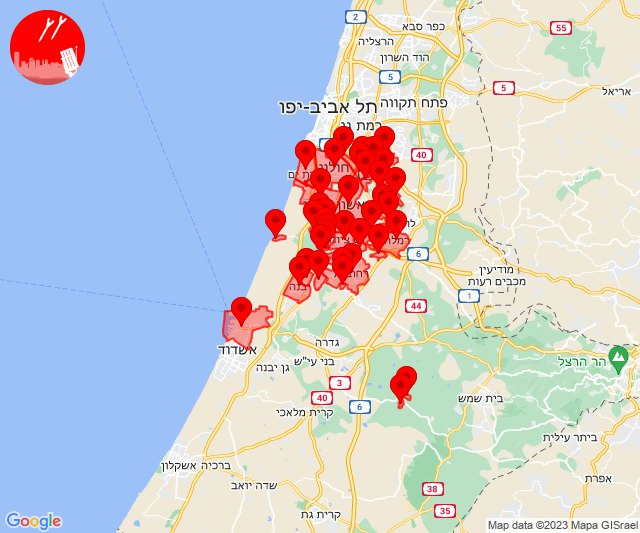

## 18:21

🔴 צבע אדום (07/10/2023):

21:19:
• השפלה: גיבתון, גן שלמה, רחובות, כפר ביל''ו (דקה וחצי)
• לכיש: גבעת ברנר, גדרה, אזור תעשייה כנות, בניה, גבעת וושינגטון, כנות, כפר אביב, כפר מרדכי, כרם ביבנה, מישר, משגב דב, נווה מבטח, עשרת, קבוצת יבנה, שדמה (דקה וחצי, דקה)
• ירקון: אזור תעשייה חבל מודיעין, בית נחמיה, שהם, בית עריף, ברקת, טירת יהודה (דקה וחצי)
• דן: בני ברק, גבעת שמואל, פתח תקווה, קריית אונו, רמת גן - מזרח, רמת גן - מערב, גני תקווה (דקה וחצי)

21:20:
• דן: אור יהודה, גבעתיים, תל אביב - מזרח (דקה וחצי)
• השפלה: באר יעקב, רמלה (דקה וחצי)

21:21:
• דן: גבעת השלושה, אזור, בת-ים, חולון, יהוד-מונוסון, מקווה ישראל, סביון, תל אביב - דרום העיר ויפו, תל אביב - מרכז העיר (דקה וחצי)
• שרון: כפר קאסם (דקה וחצי)
• ירקון: ראש העין, אזור תעשייה אפק ולב הארץ (דקה וחצי)
• לכיש: אשדוד - אזור תעשייה צפוני ונמל, יבנה (45 שניות, דקה)
• השפלה: בית דגן, גנות, חמד, כפר חב''ד, משמר השבעה, צפריה, ראשון לציון - מזרח, ראשון לציון - מערב (דקה וחצי)

צופר - צבע אדום

## 18:21

## 18:46

🔴 צבע אדום (07/10/2023):

21:45:
• השפלה: נצר סרני, באר יעקב, ישרש, ניר צבי, רמלה, תעשיון צריפין, ראשון לציון - מזרח, אירוס, בית חנן, נטעים, נס ציונה, בית עובד, רחובות (דקה וחצי)

21:46:
• ירקון: אזור תעשייה חבל מודיעין, ברקת, שהם (דקה וחצי)
• השפלה: עיינות, גאליה (דקה וחצי, דקה)
• לכיש: בית גמליאל, יבנה, כפר הנגיד (דקה)

צופר - צבע אדום

## 18:46

## 18:48

🔴 צבע אדום (07/10/2023):

21:48:
• מערב לכיש: אזור תעשייה הדרומי אשקלון (30 שניות)

צופר - צבע אדום

## 18:48

## 18:53

🔴 צבע אדום (07/10/2023):

21:52:
• עוטף עזה: שדרות, איבים, ניר עם, מטווח ניר עם (15 שניות)

21:53:
• עוטף עזה: מפלסים (15 שניות)

צופר - צבע אדום

## 18:54

## 19:43

🔴 צבע אדום (07/10/2023):

22:42:
• מערב הנגב: נתיבות, בית הגדי (30 שניות)
• עוטף עזה: כפר מימון ותושיה, זמרת, שובה (15 שניות)

22:43:
• מערב הנגב: מעגלים, גבעולים, מלילות, שיבולים, שרשרת (30 שניות)
• עוטף עזה: תקומה, חוות יזרעם (15 שניות)

צופר - צבע אדום

## 19:43

## 20:13

🔴 צבע אדום (07/10/2023):

23:13:
• עוטף עזה: בארי, שוקדה (15 שניות)

צופר - צבע אדום

## 20:13

## 20:42

🔴 צבע אדום (07/10/2023):

23:42:
• עוטף עזה: שדרות, איבים, ניר עם (15 שניות)

צופר - צבע אדום

## 20:42

## 21:47

🔴 צבע אדום (08/10/2023):

00:47:
• עוטף עזה: שדרות, איבים, ניר עם, אור הנר, ארז, מטווח ניר עם (15 שניות)

צופר - צבע אדום

## 21:47

## 21:58

🔴 צבע אדום (08/10/2023):

00:58:
• עוטף עזה: אור הנר, ארז, מטווח ניר עם, שדרות, איבים, ניר עם (15 שניות)

צופר - צבע אדום

## 21:58

## 22:54

🔴 צבע אדום (08/10/2023):

01:54:
• עוטף עזה: כרם שלום (15 שניות)

צופר - צבע אדום

## 22:54

## 23:13

🔴 צבע אדום (08/10/2023):

02:13:
• עוטף עזה: כרם שלום (15 שניות)

צופר - צבע אדום

## 23:13

## 23:15

🔴 צבע אדום (08/10/2023):

02:15:
• מערב לכיש: אשקלון - דרום, אזור תעשייה הדרומי אשקלון, אזור תעשייה צפוני אשקלון, מבקיעים, אשקלון - צפון, באר גנים, בת הדר (30 שניות)
• עוטף עזה: כרמיה, נתיב העשרה, יד מרדכי, זיקים (15 שניות)

צופר - צבע אדום

## 23:15

## 23:19

🔴 צבע אדום (08/10/2023):

02:19:
• עוטף עזה: שדרות, איבים, ניר עם, גבים, מכללת ספיר (15 שניות)

צופר - צבע אדום

## 23:19

## 23:28

🔴 צבע אדום (08/10/2023):

02:27:
• מערב לכיש: אשקלון - דרום, אזור תעשייה הדרומי אשקלון, מבקיעים, אזור תעשייה צפוני אשקלון, אשקלון - צפון (30 שניות)
• עוטף עזה: כרמיה, יד מרדכי, נתיב העשרה (15 שניות)

02:28:
• מערב לכיש: בת הדר, כפר סילבר, באר גנים, בית שקמה (30 שניות)

צופר - צבע אדום

## 23:28

## 23:33

🔴 צבע אדום (08/10/2023):

02:33:
• עוטף עזה: בארי (15 שניות)

צופר - צבע אדום

## 23:33

## 23:36

🔴 צבע אדום (08/10/2023):

02:35:
• מערב לכיש: אשקלון - דרום, אשקלון - צפון (30 שניות)

02:36:
• עוטף עזה: שדרות, איבים, ניר עם (15 שניות)

צופר - צבע אדום

## 23:36

## 23:40

🔴 צבע אדום (08/10/2023):

02:40:
• עוטף עזה: בארי (15 שניות)

צופר - צבע אדום

## 23:40

## 23:48

🔴 צבע אדום (08/10/2023):

02:48:
• עוטף עזה: בארי (15 שניות)

צופר - צבע אדום

## 23:48

