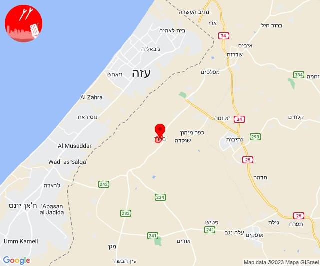
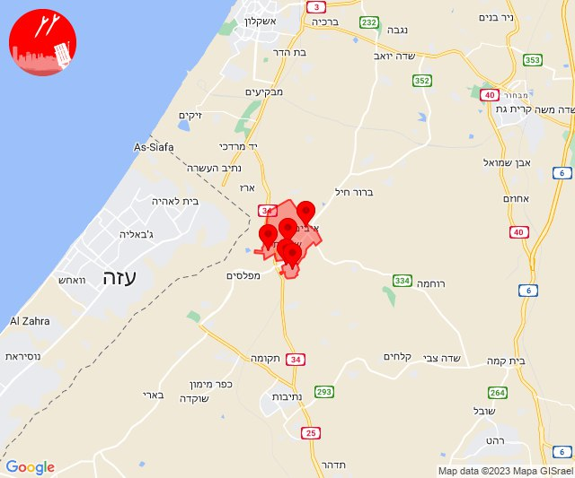
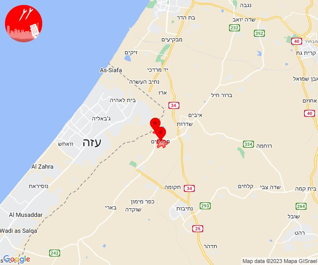
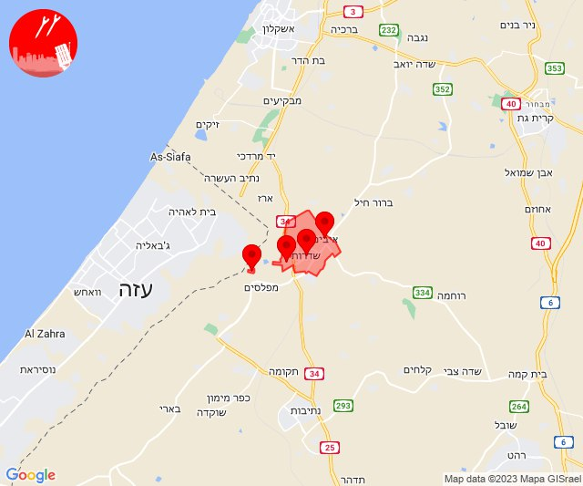
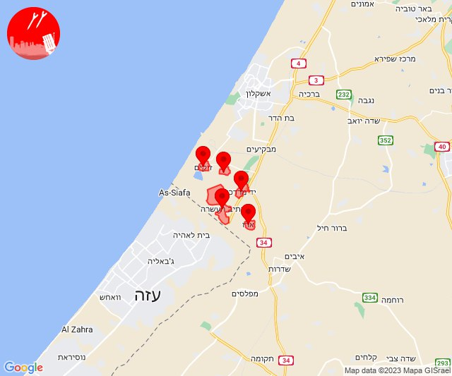

# Alerts for 2023-10-08

## 00:00

🔴 צבע אדום (08/10/2023):

03:00:
• עוטף עזה: בארי (15 שניות)

צופר - צבע אדום

## 00:00

## 00:27

🔴 צבע אדום (08/10/2023):

03:27:
• עוטף עזה: שדרות, איבים, ניר עם, גבים, מכללת ספיר (15 שניות)

צופר - צבע אדום

## 00:27

## 00:33

🔴 צבע אדום (08/10/2023):

03:33:
• עוטף עזה: נתיב העשרה, יד מרדכי (15 שניות)

צופר - צבע אדום

## 00:33

## 00:43

🔴 צבע אדום (08/10/2023):

03:42:
• מערב לכיש: אזור תעשייה צפוני אשקלון, אשקלון - דרום, אשקלון - צפון (30 שניות)

03:43:
• מערב לכיש: אזור תעשייה הדרומי אשקלון (30 שניות)

צופר - צבע אדום

## 00:43

## 02:18

🔴 צבע אדום (08/10/2023):

05:18:
• עוטף עזה: נחל עוז (15 שניות)

צופר - צבע אדום

## 02:18

## 02:30

🔴 צבע אדום (08/10/2023):

05:30:
• עוטף עזה: ארז, יד מרדכי, נתיב העשרה (15 שניות)

צופר - צבע אדום

## 02:30

## 03:14

🔴 צבע אדום (08/10/2023):

06:14:
• עוטף עזה: שדרות, איבים, ניר עם (15 שניות)

צופר - צבע אדום

## 03:14

## 04:52

✈️ חדירת כלי טיס עוין (08/10/2023):

07:52:
• עוטף עזה: תקומה, חוות יזרעם 

צופר - צבע אדום

## 04:52

## 06:26

🔴 צבע אדום (08/10/2023):

09:26:
• עוטף עזה: שדרות, איבים, ניר עם (15 שניות)

צופר - צבע אדום

## 06:26

## 07:25

🔴 צבע אדום (08/10/2023):

10:25:
• עוטף עזה: כיסופים (15 שניות)

צופר - צבע אדום

## 07:25

## 07:49

🔴 צבע אדום (08/10/2023):

10:49:
• עוטף עזה: שדרות, איבים, ניר עם (15 שניות)

צופר - צבע אדום

## 07:49

## 07:52

🔴 צבע אדום (08/10/2023):

10:52:
• עוטף עזה: מטווח ניר עם, מפלסים, גבים, מכללת ספיר (15 שניות)
• מערב הנגב: דורות, חוות שיקמים (30 שניות, 15 שניות)

צופר - צבע אדום

## 07:52

## 07:56

🔴 צבע אדום (08/10/2023):

10:56:
• עוטף עזה: שדרות, איבים, ניר עם (15 שניות)

צופר - צבע אדום

## 07:56

## 09:41

🔴 צבע אדום (08/10/2023):

12:41:
• עוטף עזה: כפר עזה (15 שניות)

צופר - צבע אדום

## 09:41

## 09:53

🔴 צבע אדום (08/10/2023):

12:53:
• עוטף עזה: שדרות, איבים, ניר עם, גבים, מכללת ספיר, מטווח ניר עם, מפלסים (15 שניות)

צופר - צבע אדום

## 09:53

## 10:27

🔴 צבע אדום (08/10/2023):

13:27:
• עוטף עזה: שדרות, איבים, ניר עם (15 שניות)

צופר - צבע אדום

## 10:27

## 10:38

🔴 צבע אדום (08/10/2023):

13:38:
• עוטף עזה: כפר עזה, נחל עוז, סעד, עלומים (15 שניות)

צופר - צבע אדום

## 10:38

## 10:56

🔴 צבע אדום (08/10/2023):

13:56:
• עוטף עזה: כיסופים (15 שניות)

צופר - צבע אדום

## 10:56

## 11:16

🔴 צבע אדום (08/10/2023):

14:16:
• עוטף עזה: מגן (15 שניות)

צופר - צבע אדום

## 11:16

## 11:27

🔴 צבע אדום (08/10/2023):

14:27:
• עוטף עזה: זיקים (15 שניות)

צופר - צבע אדום

## 11:27

## 11:34

🔴 צבע אדום (08/10/2023):

14:34:
• עוטף עזה: כפר עזה, נחל עוז, סעד, עלומים (15 שניות)

צופר - צבע אדום

## 11:34

## 11:39

🔴 צבע אדום (08/10/2023):

14:39:
• עוטף עזה: כיסופים (15 שניות)

צופר - צבע אדום

## 11:39

## 12:26

שלום רב

בעקבות הודעה שהופצה ברשתות החברתיות על מתקפת סייבר כלפי אפליקציית ״צבע אדום״

אנו מדגישים! כי לאפליקצית ״צופר״ אין קשר לדיווחים הללו והיא ממשיכה לספק לכם שירות התרעות אמין, מהיר ומציל חיים.

צוות ״צופר״ פועלים ומתחזקים כל העת על מנת להבטיח ככל האפשר מניעה של אירועים מהסוג הזה,

ואף נוספו במהלך היממה האחרונה שרתים חדשים עם מערכות הגנה מתקדמות כחלק ממאמצים אלו.

בתודה,
מערכת צופר

## 12:32

🔴 צבע אדום (08/10/2023):

15:32:
• עוטף עזה: נחל עוז (15 שניות)

צופר - צבע אדום

## 12:32

## 12:39

🔴 צבע אדום (08/10/2023):

15:39:
• עוטף עזה: כיסופים (15 שניות)

צופר - צבע אדום

## 12:39

## 12:41

🔴 צבע אדום (08/10/2023):

15:41:
• עוטף עזה: נחל עוז (15 שניות)

צופר - צבע אדום

## 12:41

## 12:59

🔴 צבע אדום (08/10/2023):

15:59:
• עוטף עזה: כיסופים (15 שניות)

צופר - צבע אדום

## 12:59

## 13:33

🔴 צבע אדום (08/10/2023):

16:33:
• עוטף עזה: סופה (15 שניות)

צופר - צבע אדום

## 13:33

## 13:53

🔴 צבע אדום (08/10/2023):

16:53:
• עוטף עזה: מטווח ניר עם, מפלסים (15 שניות)

צופר - צבע אדום

## 13:53

## 14:16

🔴 צבע אדום (08/10/2023):

17:16:
• עוטף עזה: סופה (15 שניות)

צופר - צבע אדום

## 14:16

## 14:18

🔴 צבע אדום (08/10/2023):

17:18:
• עוטף עזה: נתיב העשרה, ארז (15 שניות)

צופר - צבע אדום

## 14:18

## 14:25

🔴 צבע אדום (08/10/2023):

17:25:
• עוטף עזה: נתיב העשרה, יד מרדכי (15 שניות)

צופר - צבע אדום

## 14:25

## 14:45

🔴 צבע אדום (08/10/2023):

17:45:
• עוטף עזה: נחל עוז (15 שניות)

צופר - צבע אדום

## 14:45

## 14:56

🔴 צבע אדום (08/10/2023):

17:56:
• עוטף עזה: שדרות, איבים, ניר עם, ארז (15 שניות)

צופר - צבע אדום

## 14:56

## 15:00

🔴 צבע אדום (08/10/2023):

18:00:
• עוטף עזה: מטווח ניר עם, מפלסים, גבים, מכללת ספיר, אור הנר (15 שניות)

צופר - צבע אדום

## 15:00

## 15:08

🔴 צבע אדום (08/10/2023):

18:08:
• עוטף עזה: כיסופים, רעים (15 שניות)

צופר - צבע אדום

## 15:08

## 15:21

🔴 צבע אדום (08/10/2023):

18:21:
• עוטף עזה: מטווח ניר עם, שדרות, איבים, ניר עם, מפלסים (15 שניות)

צופר - צבע אדום

## 15:21

## 15:32

🔴 צבע אדום (08/10/2023):

18:32:
• מערב לכיש: אשקלון - דרום, אזור תעשייה הדרומי אשקלון, בת הדר (30 שניות)
• עוטף עזה: ארז (15 שניות)

צופר - צבע אדום

## 15:32

## 16:00

🔴 צבע אדום (08/10/2023):

19:00:
• מערב הנגב: אורים, פטיש (30 שניות)

צופר - צבע אדום

## 16:00

## 16:02

🔴 צבע אדום (08/10/2023):

19:01:
• עוטף עזה: ניר יצחק (15 שניות)

19:02:
• עוטף עזה: סופה (15 שניות)

צופר - צבע אדום

## 16:02

## 16:09

🔴 צבע אדום (08/10/2023):

19:09:
• עוטף עזה: כפר מימון ותושיה, עלומים, נחל עוז (15 שניות)

צופר - צבע אדום

## 16:09

## 16:29

🔴 צבע אדום (08/10/2023):

19:29:
• עוטף עזה: ארז (15 שניות)

צופר - צבע אדום

## 16:29

## 16:34

🔴 צבע אדום (08/10/2023):

19:34:
• עוטף עזה: זמרת, שובה, כפר מימון ותושיה, סעד, עלומים, שוקדה (15 שניות)

צופר - צבע אדום

## 16:34

## 16:43

🔴 צבע אדום (08/10/2023):

19:43:
• מערב הנגב: יושיביה, בית הגדי, נתיבות, זרועה (15 שניות, 30 שניות)
• עוטף עזה: יכיני, חוות יזרעם, תקומה (15 שניות)

צופר - צבע אדום

## 16:43

## 16:44

🔴 צבע אדום (08/10/2023):

19:44:
• לכיש: אלומה, קוממיות, רווחה (45 שניות)
• עוטף עזה: נתיב העשרה (15 שניות)

צופר - צבע אדום

## 16:44

## 17:01

🔴 צבע אדום (08/10/2023):

20:01:
• מערב הנגב: נתיבות, אזור תעשייה נ.ע.מ, בית הגדי, מעגלים, גבעולים, מלילות, שיבולים, שרשרת, יושיביה (30 שניות, 15 שניות)
• עוטף עזה: כפר מימון ותושיה, זמרת, שובה, תקומה, חוות יזרעם (15 שניות)

צופר - צבע אדום

## 17:01

## 17:58

🔴 צבע אדום (08/10/2023):

20:57:
• עוטף עזה: ארז (15 שניות)

20:58:
• עוטף עזה: ארז (15 שניות)

צופר - צבע אדום

## 17:58

## 19:14

🔴 צבע אדום (08/10/2023):

22:13:
• עוטף עזה: שדרות, איבים, ניר עם (15 שניות)

22:14:
• עוטף עזה: מטווח ניר עם (15 שניות)

צופר - צבע אדום

## 19:14

## 19:56

🔴 צבע אדום (08/10/2023):

22:56:
• מערב לכיש: אזור תעשייה הדרומי אשקלון (30 שניות)
• עוטף עזה: זיקים, נתיב העשרה (15 שניות)

צופר - צבע אדום

## 19:56

## 20:13

🔴 צבע אדום (08/10/2023):

23:13:
• עוטף עזה: ארז, זיקים, יד מרדכי, כרמיה, נתיב העשרה (15 שניות)

צופר - צבע אדום

## 20:13

## 20:34

🔴 צבע אדום (08/10/2023):

23:34:
• עוטף עזה: ארז, זיקים, יד מרדכי, כרמיה, נתיב העשרה (15 שניות)

צופר - צבע אדום

## 20:34

## 20:39

🔴 צבע אדום (08/10/2023):

23:38:
• השפלה: נס ציונה, רחובות, גן שורק, ראשון לציון - מזרח, באר יעקב, פארק תעשיות פלמחים, גאליה (דקה וחצי, דקה)
• לכיש: גדרה, גני טל, קדרון, חצב (דקה)

23:39:
• לכיש: יבנה, בית גמליאל, בן זכאי, בניה, כפר אביב, כפר מרדכי, שדמה, מעון צופיה, כפר הנגיד (דקה)
• השפלה: אירוס, בית חנן, בית עובד, גיבתון, עיינות (דקה וחצי)

צופר - צבע אדום

## 20:39

## 20:44

🔴 צבע אדום (08/10/2023):

23:44:
• מערב לכיש: אזור תעשייה הדרומי אשקלון, אשקלון - דרום, אשקלון - צפון, אזור תעשייה צפוני אשקלון, באר גנים, ניצנים, ניצן (30 שניות, 45 שניות)
• עוטף עזה: זיקים, כרמיה (15 שניות)
• לכיש: בית עזרא (45 שניות)

צופר - צבע אדום

## 20:44

## 21:08

🔴 צבע אדום (09/10/2023):

00:08:
• מערב לכיש: אזור תעשייה הדרומי אשקלון, אזור תעשייה צפוני אשקלון, אשקלון - דרום, אשקלון - צפון, באר גנים, כפר סילבר, בת הדר, מבקיעים (30 שניות)

צופר - צבע אדום

## 21:08

## 21:39

🔴 צבע אדום (09/10/2023):

00:38:
• מערב לכיש: אשקלון - דרום, אשקלון - צפון, ברכיה, משען, אזור תעשייה צפוני אשקלון, כפר סילבר (30 שניות)
• עוטף עזה: יד מרדכי (15 שניות)

00:39:
• מערב לכיש: אזור תעשייה הדרומי אשקלון, בת הדר, ניר ישראל (30 שניות)
• עוטף עזה: כרמיה, נתיב העשרה (15 שניות)

צופר - צבע אדום

## 21:39

## 22:28

🔴 צבע אדום (09/10/2023):

01:28:
• מערב הנגב: אזור תעשייה נ.ע.מ, ברוש, מעגלים, גבעולים, מלילות, שיבולים, שרשרת, תאשור, תדהר (30 שניות)

צופר - צבע אדום

## 22:28

