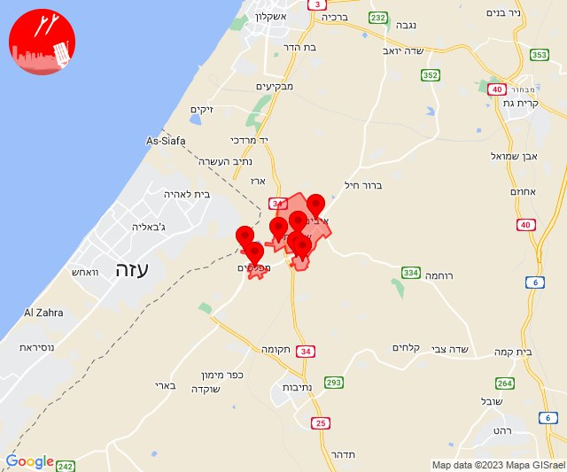

# Alerts for 2023-10-09

## 03:18

🔴 צבע אדום (09/10/2023):

06:18:
• עוטף עזה: נירים (15 שניות)

צופר - צבע אדום

## 03:18

## 03:31

🔴 צבע אדום (09/10/2023):

06:31:
• עוטף עזה: ניר עוז (15 שניות)

צופר - צבע אדום

## 03:31

## 05:43

🔴 צבע אדום (09/10/2023):

08:42:
• עוטף עזה: ניר עוז (15 שניות)

08:43:
• עוטף עזה: מגן (15 שניות)

צופר - צבע אדום

## 05:43

## 06:15

🔴 צבע אדום (09/10/2023):

09:15:
• עוטף עזה: מבטחים, עמיעוז, ישע (15 שניות)

צופר - צבע אדום

## 06:15

## 06:52

🔴 צבע אדום (09/10/2023):

09:52:
• עוטף עזה: סעד (15 שניות)

צופר - צבע אדום

## 06:52

## 06:57

🔴 צבע אדום (09/10/2023):

09:57:
• עוטף עזה: שדרות, איבים, ניר עם, מטווח ניר עם (15 שניות)

צופר - צבע אדום

## 06:57

## 07:14

🔴 צבע אדום (09/10/2023):

10:14:
• עוטף עזה: שדרות, איבים, ניר עם, מטווח ניר עם, מפלסים, גבים, מכללת ספיר (15 שניות)

צופר - צבע אדום

## 07:14

## 07:19

🔴 צבע אדום (09/10/2023):

10:19:
• עוטף עזה: נחל עוז (15 שניות)

צופר - צבע אדום

## 07:19

## 07:51

🔴 צבע אדום (09/10/2023):

10:51:
• עוטף עזה: מטווח ניר עם, שדרות, איבים, ניר עם (15 שניות)

צופר - צבע אדום

## 07:52

## 08:15

🔴 צבע אדום (09/10/2023):

11:15:
• עוטף עזה: שדרות, איבים, ניר עם, מטווח ניר עם (15 שניות)

צופר - צבע אדום

## 08:15

## 08:27

🔴 צבע אדום (09/10/2023):

11:27:
• עוטף עזה: נחל עוז (15 שניות)

צופר - צבע אדום

## 08:27

## 08:27

✈️ חדירת כלי טיס עוין (09/10/2023):

11:27:
• עוטף עזה: גברעם 

צופר - צבע אדום

## 08:27

## 08:28

🔴 צבע אדום (09/10/2023):

11:28:
• מערב לכיש: תלמי יפה (30 שניות)

צופר - צבע אדום

## 08:28

## 08:47

🔴 צבע אדום (09/10/2023):

11:47:
• עוטף עזה: נחל עוז (15 שניות)

צופר - צבע אדום

## 08:47

## 09:02

🔴 צבע אדום (09/10/2023):

11:59:
• עוטף עזה: נתיב העשרה (15 שניות)

12:00:
• דן: אור יהודה, יהוד-מונוסון, סביון, הרצליה - מרכז וגליל ים (דקה וחצי)
• השפלה: פארק תעשיות פלמחים, ראשון לציון - מזרח, אירוס, בית חנן, בית עובד, נטעים, נס ציונה, עיינות, צפריה, גן שורק, כפר חב''ד (דקה וחצי)
• עוטף עזה: כיסופים, שדרות, איבים, ניר עם (15 שניות)
• שפלת יהודה: גבעת יערים, עין נקובא, עין ראפה, צובה, רמת רזיאל, בית נקופה, אבו-גוש, כסלון, קריית יערים, קריית ענבים (דקה וחצי)
• ירושלים: אבן ספיר, ירושלים - מערב, מבשרת ציון, ירושלים - מרכז, ירושלים - צפון, בית זית, מוצא עילית, פנימיית עין כרם, אורה, עמינדב (דקה וחצי)
• שרון: רעננה, בני ציון, בצרה (דקה וחצי)

12:01:
• לכיש: יבנה, בן זכאי, מעון צופיה (דקה)
• ואדי ערה: באקה אל גרבייה (דקה וחצי)
• מנשה: גן השומרון, עין שמר, גבעת חביבה, מאור, מענית, שער מנשה, תלמי אלעזר (דקה וחצי)

12:02:
• דן: תל אביב - עבר הירקון, בני ברק, גבעת שמואל, הרצליה - מערב, כפר שמריהו, פתח תקווה, רמת גן - מערב, רמת השרון, סינמה סיטי גלילות, מתחם פי גלילות (דקה וחצי)
• שרון: גבעת חן, הוד השרון, ירקונה, כפר מל''ל, רמות השבים, רשפון (דקה וחצי)

צופר - צבע אדום

## 09:02

## 09:30

🔴 צבע אדום (09/10/2023):

12:28:
• מערב לכיש: אשקלון - דרום, אשקלון - צפון, אזור תעשייה הדרומי אשקלון, באר גנים (30 שניות)

12:29:
• מערב לכיש: אזור תעשייה צפוני אשקלון, מבקיעים, בת הדר, כפר סילבר, ברכיה, ניר ישראל (30 שניות)
• עוטף עזה: זיקים, כרמיה, יד מרדכי (15 שניות)
• לכיש: גן יבנה, שדה עוזיהו, שתולים (45 שניות)

12:30:
• עוטף עזה: נתיב העשרה (15 שניות)
• מערב לכיש: הודיה, ניצנים (30 שניות)
• לכיש: אזור תעשייה עד הלום, אשדוד - א,ב,ד,ה, אשדוד - אזור תעשייה צפוני ונמל, אשדוד - ג,ו,ז, אשדוד - ח,ט,י,יג,יד,טז, אשדוד - יא,יב,טו,יז,מרינה,סיטי (45 שניות)

צופר - צבע אדום

## 09:31

🔴 צבע אדום (09/10/2023):

12:28:
• מערב לכיש: אשקלון - דרום, אשקלון - צפון, אזור תעשייה הדרומי אשקלון, באר גנים (30 שניות)

12:29:
• מערב לכיש: אזור תעשייה צפוני אשקלון, מבקיעים, בת הדר, כפר סילבר, ברכיה, ניר ישראל (30 שניות)
• עוטף עזה: זיקים, כרמיה, יד מרדכי (15 שניות)
• לכיש: גן יבנה, שדה עוזיהו, שתולים (45 שניות)

12:30:
• עוטף עזה: נתיב העשרה, מטווח ניר עם, שדרות, איבים, ניר עם, גבים, מכללת ספיר (15 שניות)
• מערב לכיש: הודיה, ניצנים, משען, ניצן (30 שניות, 45 שניות)
• לכיש: אזור תעשייה עד הלום, אשדוד - א,ב,ד,ה, אשדוד - אזור תעשייה צפוני ונמל, אשדוד - ג,ו,ז, אשדוד - ח,ט,י,יג,יד,טז, אשדוד - יא,יב,טו,יז,מרינה,סיטי, בני דרום, עזריקם, אמונים, בית עזרא, אל עזי, גבעתי, עזר, גן הדרום, ביצרון, גבעת וושינגטון (45 שניות, דקה)
• דן: חולון, חולון (דקה וחצי)
• השפלה: ראשון לציון - מזרח, ראשון לציון - מערב, פארק תעשיות פלמחים, ראשון לציון - מזרח, ראשון לציון - מערב (דקה וחצי)

12:31:
• שפלת יהודה: גפן, תירוש (דקה)
• לכיש: יבנה, כפר הנגיד, בן זכאי, פלמחים (דקה, דקה וחצי)

צופר - צבע אדום

## 09:31

## 09:38

🔴 צבע אדום (09/10/2023):

12:37:
• מערב לכיש: אזור תעשייה הדרומי אשקלון (30 שניות)

12:38:
• עוטף עזה: זיקים, כרמיה (15 שניות)

צופר - צבע אדום

## 09:38

## 09:41

🔴 צבע אדום (09/10/2023):

12:41:
• עוטף עזה: נתיב העשרה (15 שניות)

צופר - צבע אדום

## 09:41

## 09:48

🔴 צבע אדום (09/10/2023):

12:48:
• עוטף עזה: שדרות, איבים, ניר עם (15 שניות)

צופר - צבע אדום

## 09:48

## 09:58

🔴 צבע אדום (09/10/2023):

12:58:
• עוטף עזה: שדרות, איבים, ניר עם (15 שניות)

צופר - צבע אדום

## 09:58

## 10:32

🔴 צבע אדום (09/10/2023):

13:32:
• לכיש: כפר הרי''ף וצומת ראם, רבדים, ינון, בני ראם (דקה)

צופר - צבע אדום

## 10:32

## 10:39

🔴 צבע אדום (09/10/2023):

13:39:
• עוטף עזה: שדרות, איבים, ניר עם (15 שניות)

צופר - צבע אדום

## 10:39

## 10:49

🔴 צבע אדום (09/10/2023):

13:49:
• דן: חולון (דקה וחצי)
• השפלה: ראשון לציון - מערב (דקה וחצי)

צופר - צבע אדום

## 10:49

## 11:00

🔴 צבע אדום (09/10/2023):

14:00:
• קו העימות: יפתח, מרכז אזורי מבואות חרמון, רמות נפתלי (מיידי)

צופר - צבע אדום

## 11:00

## 11:08

🔴 צבע אדום (09/10/2023):

14:08:
• עוטף עזה: רעים (15 שניות)

צופר - צבע אדום

## 11:08

## 11:18

🔴 צבע אדום (09/10/2023):

14:18:
• עוטף עזה: בארי, נחל עוז (15 שניות)

צופר - צבע אדום

## 11:18

