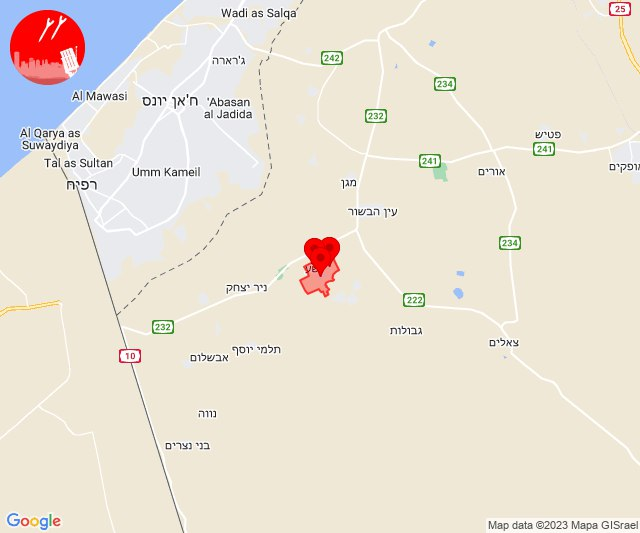
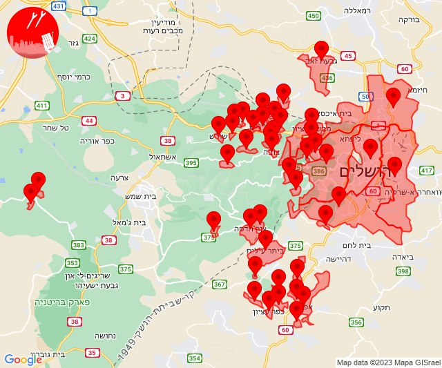

# Alerts for 2023-10-09

## 03:18

🔴 צבע אדום (09/10/2023):

06:18:
• עוטף עזה: נירים (15 שניות)

צופר - צבע אדום

## 03:18

## 03:31

🔴 צבע אדום (09/10/2023):

06:31:
• עוטף עזה: ניר עוז (15 שניות)

צופר - צבע אדום

## 03:31

## 05:43

🔴 צבע אדום (09/10/2023):

08:42:
• עוטף עזה: ניר עוז (15 שניות)

08:43:
• עוטף עזה: מגן (15 שניות)

צופר - צבע אדום

## 05:43

## 06:15

🔴 צבע אדום (09/10/2023):

09:15:
• עוטף עזה: מבטחים, עמיעוז, ישע (15 שניות)

צופר - צבע אדום

## 06:15

## 06:52

🔴 צבע אדום (09/10/2023):

09:52:
• עוטף עזה: סעד (15 שניות)

צופר - צבע אדום

## 06:52

## 06:57

🔴 צבע אדום (09/10/2023):

09:57:
• עוטף עזה: שדרות, איבים, ניר עם, מטווח ניר עם (15 שניות)

צופר - צבע אדום

## 06:57

## 07:14

🔴 צבע אדום (09/10/2023):

10:14:
• עוטף עזה: שדרות, איבים, ניר עם, מטווח ניר עם, מפלסים, גבים, מכללת ספיר (15 שניות)

צופר - צבע אדום

## 07:14

## 07:19

🔴 צבע אדום (09/10/2023):

10:19:
• עוטף עזה: נחל עוז (15 שניות)

צופר - צבע אדום

## 07:19

## 07:51

🔴 צבע אדום (09/10/2023):

10:51:
• עוטף עזה: מטווח ניר עם, שדרות, איבים, ניר עם (15 שניות)

צופר - צבע אדום

## 07:52

## 08:15

🔴 צבע אדום (09/10/2023):

11:15:
• עוטף עזה: שדרות, איבים, ניר עם, מטווח ניר עם (15 שניות)

צופר - צבע אדום

## 08:15

## 08:27

🔴 צבע אדום (09/10/2023):

11:27:
• עוטף עזה: נחל עוז (15 שניות)

צופר - צבע אדום

## 08:27

## 08:27

✈️ חדירת כלי טיס עוין (09/10/2023):

11:27:
• עוטף עזה: גברעם 

צופר - צבע אדום

## 08:27

## 08:28

🔴 צבע אדום (09/10/2023):

11:28:
• מערב לכיש: תלמי יפה (30 שניות)

צופר - צבע אדום

## 08:28

## 08:47

🔴 צבע אדום (09/10/2023):

11:47:
• עוטף עזה: נחל עוז (15 שניות)

צופר - צבע אדום

## 08:47

## 09:02

🔴 צבע אדום (09/10/2023):

11:59:
• עוטף עזה: נתיב העשרה (15 שניות)

12:00:
• דן: אור יהודה, יהוד-מונוסון, סביון, הרצליה - מרכז וגליל ים (דקה וחצי)
• השפלה: פארק תעשיות פלמחים, ראשון לציון - מזרח, אירוס, בית חנן, בית עובד, נטעים, נס ציונה, עיינות, צפריה, גן שורק, כפר חב''ד (דקה וחצי)
• עוטף עזה: כיסופים, שדרות, איבים, ניר עם (15 שניות)
• שפלת יהודה: גבעת יערים, עין נקובא, עין ראפה, צובה, רמת רזיאל, בית נקופה, אבו-גוש, כסלון, קריית יערים, קריית ענבים (דקה וחצי)
• ירושלים: אבן ספיר, ירושלים - מערב, מבשרת ציון, ירושלים - מרכז, ירושלים - צפון, בית זית, מוצא עילית, פנימיית עין כרם, אורה, עמינדב (דקה וחצי)
• שרון: רעננה, בני ציון, בצרה (דקה וחצי)

12:01:
• לכיש: יבנה, בן זכאי, מעון צופיה (דקה)
• ואדי ערה: באקה אל גרבייה (דקה וחצי)
• מנשה: גן השומרון, עין שמר, גבעת חביבה, מאור, מענית, שער מנשה, תלמי אלעזר (דקה וחצי)

12:02:
• דן: תל אביב - עבר הירקון, בני ברק, גבעת שמואל, הרצליה - מערב, כפר שמריהו, פתח תקווה, רמת גן - מערב, רמת השרון, סינמה סיטי גלילות, מתחם פי גלילות (דקה וחצי)
• שרון: גבעת חן, הוד השרון, ירקונה, כפר מל''ל, רמות השבים, רשפון (דקה וחצי)

צופר - צבע אדום

## 09:02

## 09:30

🔴 צבע אדום (09/10/2023):

12:28:
• מערב לכיש: אשקלון - דרום, אשקלון - צפון, אזור תעשייה הדרומי אשקלון, באר גנים (30 שניות)

12:29:
• מערב לכיש: אזור תעשייה צפוני אשקלון, מבקיעים, בת הדר, כפר סילבר, ברכיה, ניר ישראל (30 שניות)
• עוטף עזה: זיקים, כרמיה, יד מרדכי (15 שניות)
• לכיש: גן יבנה, שדה עוזיהו, שתולים (45 שניות)

12:30:
• עוטף עזה: נתיב העשרה (15 שניות)
• מערב לכיש: הודיה, ניצנים (30 שניות)
• לכיש: אזור תעשייה עד הלום, אשדוד - א,ב,ד,ה, אשדוד - אזור תעשייה צפוני ונמל, אשדוד - ג,ו,ז, אשדוד - ח,ט,י,יג,יד,טז, אשדוד - יא,יב,טו,יז,מרינה,סיטי (45 שניות)

צופר - צבע אדום

## 09:31

🔴 צבע אדום (09/10/2023):

12:28:
• מערב לכיש: אשקלון - דרום, אשקלון - צפון, אזור תעשייה הדרומי אשקלון, באר גנים (30 שניות)

12:29:
• מערב לכיש: אזור תעשייה צפוני אשקלון, מבקיעים, בת הדר, כפר סילבר, ברכיה, ניר ישראל (30 שניות)
• עוטף עזה: זיקים, כרמיה, יד מרדכי (15 שניות)
• לכיש: גן יבנה, שדה עוזיהו, שתולים (45 שניות)

12:30:
• עוטף עזה: נתיב העשרה, מטווח ניר עם, שדרות, איבים, ניר עם, גבים, מכללת ספיר (15 שניות)
• מערב לכיש: הודיה, ניצנים, משען, ניצן (30 שניות, 45 שניות)
• לכיש: אזור תעשייה עד הלום, אשדוד - א,ב,ד,ה, אשדוד - אזור תעשייה צפוני ונמל, אשדוד - ג,ו,ז, אשדוד - ח,ט,י,יג,יד,טז, אשדוד - יא,יב,טו,יז,מרינה,סיטי, בני דרום, עזריקם, אמונים, בית עזרא, אל עזי, גבעתי, עזר, גן הדרום, ביצרון, גבעת וושינגטון (45 שניות, דקה)
• דן: חולון, חולון (דקה וחצי)
• השפלה: ראשון לציון - מזרח, ראשון לציון - מערב, פארק תעשיות פלמחים, ראשון לציון - מזרח, ראשון לציון - מערב (דקה וחצי)

12:31:
• שפלת יהודה: גפן, תירוש (דקה)
• לכיש: יבנה, כפר הנגיד, בן זכאי, פלמחים (דקה, דקה וחצי)

צופר - צבע אדום

## 09:31

## 09:38

🔴 צבע אדום (09/10/2023):

12:37:
• מערב לכיש: אזור תעשייה הדרומי אשקלון (30 שניות)

12:38:
• עוטף עזה: זיקים, כרמיה (15 שניות)

צופר - צבע אדום

## 09:38

## 09:41

🔴 צבע אדום (09/10/2023):

12:41:
• עוטף עזה: נתיב העשרה (15 שניות)

צופר - צבע אדום

## 09:41

## 09:48

🔴 צבע אדום (09/10/2023):

12:48:
• עוטף עזה: שדרות, איבים, ניר עם (15 שניות)

צופר - צבע אדום

## 09:48

## 09:58

🔴 צבע אדום (09/10/2023):

12:58:
• עוטף עזה: שדרות, איבים, ניר עם (15 שניות)

צופר - צבע אדום

## 09:58

## 10:32

🔴 צבע אדום (09/10/2023):

13:32:
• לכיש: כפר הרי''ף וצומת ראם, רבדים, ינון, בני ראם (דקה)

צופר - צבע אדום

## 10:32

## 10:39

🔴 צבע אדום (09/10/2023):

13:39:
• עוטף עזה: שדרות, איבים, ניר עם (15 שניות)

צופר - צבע אדום

## 10:39

## 10:49

🔴 צבע אדום (09/10/2023):

13:49:
• דן: חולון (דקה וחצי)
• השפלה: ראשון לציון - מערב (דקה וחצי)

צופר - צבע אדום

## 10:49

## 11:00

🔴 צבע אדום (09/10/2023):

14:00:
• קו העימות: יפתח, מרכז אזורי מבואות חרמון, רמות נפתלי (מיידי)

צופר - צבע אדום

## 11:00

## 11:08

🔴 צבע אדום (09/10/2023):

14:08:
• עוטף עזה: רעים (15 שניות)

צופר - צבע אדום

## 11:08

## 11:18

🔴 צבע אדום (09/10/2023):

14:18:
• עוטף עזה: בארי, נחל עוז (15 שניות)

צופר - צבע אדום

## 11:18

## 11:21

שלום רב.

צופר היא מערכת המופעלת בהתנדבות מלאה, אשר פותחה למען תושבי מדינת ישראל.

בייחוד בשעות הקשות האלו מפתחי צופר עובדים ומתחזקים את המערכות במטרה להמשיך ולספק לכם שירות התרעות אמין, מהיר ומציל חיים.

תרומות יסייעו לנו בהמשך הפעלת האפליקציה ותשלום על השרתים

לתרומה באמצעות PayPal:
https://paypal.me/tzevaadom

לתרומה באמצעות ״פייבוקס״:
https://payboxapp.page.link/D61pA1neQXyGhBui7

💻 להזכירכם, ישנו דף אינטרנט המציג את מיקומי ההתרעות על גבי המפה בזמן אמת. ניתן לבחור אם להשמיע צליל, חיווי קולי, ולבחור יישובים.

יש להשאיר את הדף פתוח ובזמן אמת ההתרעה תקפוץ.

לפתוח מהמחשב: www.tzevaadom.co.il

🌍 דוברי שפות אחרות מוזמנים להצטרף לערוצים המותאמים בטלגרם:

English Telegram Channel: @tzevaadom_en

Русский Телеграмма Канал: @tzevaadom_ru

قناة التيليجرام باللغة العربية:
@tzevaadom_ar

ערוץ נפרד להתרעות חדירת מחבלים: @TzofarTerrorInfiltration

בנוסף, הוקם ערוץ וואטסאפ לקבלת התרעות:
https://whatsapp.com/channel/0029Va6c4jpIHphPAwLl4j0q

להורדת האפליקציה ופלטפורמות נוספות:
tzevaadom.co.il/systems

בתודה,
מערכת צופר

## 11:26

🔴 צבע אדום (09/10/2023):

14:26:
• עוטף עזה: מטווח ניר עם, מפלסים (15 שניות)

צופר - צבע אדום

## 11:26

## 11:35

🔴 צבע אדום (09/10/2023):

14:35:
• עוטף עזה: סעד, כפר עזה (15 שניות)

צופר - צבע אדום

## 11:35

## 11:44

🔴 צבע אדום (09/10/2023):

14:43:
• עוטף עזה: כפר עזה (15 שניות)

14:44:
• עוטף עזה: מפלסים (15 שניות)

צופר - צבע אדום

## 11:44

## 11:48

🔴 צבע אדום (09/10/2023):

14:48:
• עוטף עזה: יכיני (15 שניות)
• מערב הנגב: ניר משה (30 שניות)

צופר - צבע אדום

## 11:49

## 12:06

🔴 צבע אדום (09/10/2023):

15:06:
• מערב הנגב: דורות, חוות שיקמים (30 שניות, 15 שניות)
• עוטף עזה: מטווח ניר עם, שדרות, איבים, ניר עם (15 שניות)

צופר - צבע אדום

## 12:06

## 12:29

🔴 צבע אדום (09/10/2023):

15:29:
• עוטף עזה: כפר מימון ותושיה, זמרת, שובה, שוקדה (15 שניות)

צופר - צבע אדום

## 12:29

## 12:36

🔴 צבע אדום (09/10/2023):

15:35:
• עוטף עזה: עלומים, נחל עוז (15 שניות)

15:36:
• עוטף עזה: כפר עזה (15 שניות)

צופר - צבע אדום

## 12:36

## 13:00

🔴 צבע אדום (09/10/2023):

15:59:
• עוטף עזה: שדרות, איבים, ניר עם, מטווח ניר עם (15 שניות)
• מערב הנגב: דורות, חוות שיקמים (30 שניות, 15 שניות)

16:00:
• עוטף עזה: כיסופים (15 שניות)

צופר - צבע אדום

## 13:00

## 13:04

🔴 צבע אדום (09/10/2023):

16:04:
• עוטף עזה: כרם שלום, חולית, יתד, שדה אברהם, דקל, סופה (15 שניות)

צופר - צבע אדום

## 13:04

## 13:29

🔴 צבע אדום (09/10/2023):

16:29:
• מערב לכיש: אזור תעשייה צפוני אשקלון, בת הדר, מבקיעים, אזור תעשייה הדרומי אשקלון, אשקלון - דרום, אשקלון - צפון, באר גנים, בית שקמה, ברכיה, כפר סילבר, גיאה, משען, תלמי יפה (30 שניות)
• עוטף עזה: זיקים, יד מרדכי, כרמיה, נתיב העשרה (15 שניות)

צופר - צבע אדום

## 13:29

## 13:42

🔴 צבע אדום (09/10/2023):

16:42:
• עוטף עזה: שדרות, איבים, ניר עם (15 שניות)

צופר - צבע אדום

## 13:42

## 14:01

🔴 צבע אדום (09/10/2023):

16:59:
• ירושלים: אבן ספיר, עמינדב, מבשרת ציון, ירושלים - מערב, בית זית, מוצא עילית, פנימיית עין כרם, ירושלים - דרום, גבעת זאב, ירושלים - מזרח, ירושלים - מרכז, ירושלים - צפון (דקה וחצי)
• שפלת יהודה: יד השמונה, נווה אילן, שואבה, שורש, אבו-גוש, בית נקופה, הר אדר, מעלה החמישה, עין נקובא, עין ראפה, קריית יערים, קריית ענבים, צובה, גבעת יערים, רמת רזיאל (דקה וחצי)
• יהודה: ביתר עילית, נווה דניאל, הר גילה (דקה וחצי)

17:00:
• שפלת יהודה: גפן, תירוש (דקה)
• יהודה: גבעות (דקה וחצי)

17:01:
• יהודה: אלון שבות, אלעזר, אפרת, בת עין, כפר עציון, מגדל עוז, ראש צורים (דקה וחצי)
• שפלת יהודה: מבוא ביתר, מטע, צור הדסה (דקה וחצי)

צופר - צבע אדום

## 14:01

## 14:19

🔴 צבע אדום (09/10/2023):

17:19:
• עוטף עזה: ארז, יד מרדכי, כרמיה, נתיב העשרה (15 שניות)

צופר - צבע אדום

## 14:19

## 14:44

🔴 צבע אדום (09/10/2023):

17:44:
• מרכז הנגב: באר שבע - דרום (דקה)

צופר - צבע אדום

## 14:44

## 14:52

🔴 צבע אדום (09/10/2023):

17:51:
• עוטף עזה: אבשלום, דקל, חולית, יבול, יתד, ניר יצחק, סופה, פרי גן, שדה אברהם, תלמי יוסף (15 שניות)

17:52:
• עוטף עזה: כפר עזה (15 שניות)

צופר - צבע אדום

## 14:52

## 15:08

🔴 צבע אדום (09/10/2023):

18:08:
• עוטף עזה: חולית (15 שניות)

צופר - צבע אדום

## 15:08

## 15:17

🔴 צבע אדום (09/10/2023):

18:17:
• עוטף עזה: כיסופים (15 שניות)

צופר - צבע אדום

## 15:17

## 15:23

🔴 צבע אדום (09/10/2023):

18:23:
• עוטף עזה: כפר עזה (15 שניות)

צופר - צבע אדום

## 15:23

## 15:46

🔴 צבע אדום (09/10/2023):

18:45:
• עוטף עזה: רעים (15 שניות)

18:46:
• מערב לכיש: אשקלון - דרום, אשקלון - צפון, בית שקמה, משען, אזור תעשייה הדרומי אשקלון, מבקיעים, אזור תעשייה צפוני אשקלון, בת הדר, גיאה (30 שניות)

צופר - צבע אדום

## 15:46

## 15:56

🔴 צבע אדום (09/10/2023):

18:56:
• מערב הנגב: יושיביה, אזור תעשייה נ.ע.מ, בית הגדי, נתיבות, מעגלים, גבעולים, מלילות, שיבולים, שרשרת (15 שניות, 30 שניות)
• עוטף עזה: חוות יזרעם, תקומה (15 שניות)

צופר - צבע אדום

## 15:56

## 16:01

🔴 צבע אדום (09/10/2023):

19:01:
• עוטף עזה: נחל עוז (15 שניות)

צופר - צבע אדום

## 16:01

## 16:10

🔴 צבע אדום (09/10/2023):

19:09:
• מערב לכיש: אזור תעשייה הדרומי אשקלון (30 שניות)
• עוטף עזה: ארז (15 שניות)

19:10:
• עוטף עזה: שדרות, איבים, ניר עם, זיקים, כפר עזה, רעים (15 שניות)

צופר - צבע אדום

## 16:10

## 17:04

🔴 צבע אדום (09/10/2023):

20:02:
• עוטף עזה: שדרות, איבים, ניר עם (15 שניות)

20:04:
• עוטף עזה: אור הנר, ארז (15 שניות)

צופר - צבע אדום

## 17:04

## 17:05

🔴 צבע אדום (09/10/2023):

20:05:
• עוטף עזה: גבים, מכללת ספיר (15 שניות)

צופר - צבע אדום

## 17:05

## 17:11

🔴 צבע אדום (09/10/2023):

20:11:
• עוטף עזה: רעים (15 שניות)

צופר - צבע אדום

## 17:11

## 17:17

🔴 צבע אדום (09/10/2023):

20:17:
• עוטף עזה: שדרות, איבים, ניר עם, אור הנר, ארז (15 שניות)

צופר - צבע אדום

## 17:17

## 17:31

🔴 צבע אדום (09/10/2023):

20:31:
• עוטף עזה: זיקים, כרמיה, נתיב העשרה (15 שניות)
• מערב לכיש: אזור תעשייה הדרומי אשקלון (30 שניות)

צופר - צבע אדום

## 17:31

## 18:07

🔴 צבע אדום (09/10/2023):

21:07:
• מערב לכיש: אזור תעשייה הדרומי אשקלון (30 שניות)

צופר - צבע אדום

## 18:07

## 23:38

🔴 צבע אדום (10/10/2023):

02:38:
• עוטף עזה: כפר עזה, נחל עוז, סעד, עלומים (15 שניות)

צופר - צבע אדום

## 23:38

## 23:43

🔴 צבע אדום (10/10/2023):

02:43:
• עוטף עזה: כפר עזה, נחל עוז, סעד, עלומים (15 שניות)

צופר - צבע אדום

## 23:43

